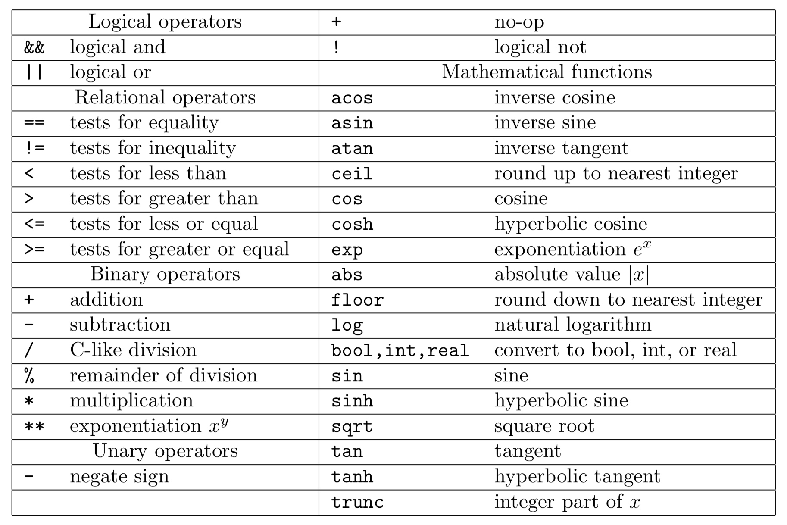

Cactus executables always run from a parameter file, which specifies which thorns to use and sets the values of each thorn’s parameters (the parameters that are not set will take on default values).

There is no restriction on the name of the parameter file, although it is conventional to use the file extension `.par`.

A parameter file is a text file whose lines are either comments or parameter statements. Comments are blank lines or lines that begin with ‘#’. A parameter statement consists of one or more parameter names, followed by an ‘=’, followed by the value(s) for this (these) parameter(s).

The first parameter statement in any parameter file should set ActiveThorns, which is a special parameter that tells the program which thorns are to be activated. Only parameters from active thorns can be set (and only those routines scheduled by active thorns are run). By default all thorns are inactive.

For example,

```
ActiveThorns = "CartGrid3D"
```

Parameter specifications following ActiveThorns usually are carried out by listing the name of the thorn which defined the parameter, two colons, and the name of the parameter

```
wavetoyF77::amplitude
```

Screen output

___

As your Cactus executable runs, standard output and standard error are usually written to the screen. Standard output provides you with information about the run, and standard error reports warnings and errors from the flesh and thorns.

As the program runs, the normal output provides the following information:

- Active thorns: This report shows whether the thorn activation was successful, and if successful gives the thorn’s implementation.
- Failed parameters: If any of the parameters in the parameter file does not belong to any of the active thorns, or if the parameter value is not in the allowed range, an error is registered.

For example, 

```
Activating thorn idscalarwave...Success -> active implementation idscalarwave
# if the parameter is not recognised
Unknown parameter time::ddtfac
# if the parameter value is not in the allowed range
Unable to set keyword CartGrid3D::type - ByMouth not in any active range
```

Checkpointing

___

Checkpointing is defined as saving the current state of a run to a file. At a later time, this run can then be restarted from that state by recovering all the data from the checkpoint file.

Cactus checkpointing and recovery methods are provided by thorns. In general, these thorns decide how often to generate a checkpoint.

## Parameter File Syntax

A parameter file (or par file) is used to control the behaviour of a Cactus executable. 

A parameter statement is an expression of the form `Left-Hand-Side = Right-Hand-Side`. The `Left-Hand-Side` may be a fully qualified parameter name. The `Right-Hand-Side` is a value.

Values can be any of the following

- **Booleans**: Booleans are either true (i.e. 1, true, on, "true", or "on") or false (i.e. 0, false, off, "false", or "off").
- **Integers**: Integers can be positive or negative.
- **Real numbers**: Real numbers can be positive or negative and may be written with exponents (e.g. 1.0e-3, or -2.94d+10).
- **Strings**: Sequences of characters delimited by quotes.
- **Variables**: Parameter values can also contain variables of the form `${VARIABLE}` or `$ENV{VARIABLE}`.
- **Expressions**: Parameters statements of numeric or boolean type can use arithmetic expressions in place of explicit values.
- **Array assignments**: Arrays of parameters can be set by including an integer expression inside the square brackets following the name, e.g. `thorn::parameters[0]`. Optionally, an array of parameters may be set by means of a comma delimited list of values inside square brackets, e.g. `thorn::parameters = [4.8, 3.2]`.



Please see the file `par.peg` in the directory `Cactus/src/piraha/pegs` for the full grammar describing the par file.

The parameter file is read sequentially from top to bottom, this means that if you set the value of a parameter twice in the parameter file, the second value will be used.

!!! note
    You can obtain lists of the parameters associated with each thorn using the command-line options.
    
    `-O`: Prints a full list of all parameters from all thorns which were compiled, along with descriptions and allowed values.
    
    `-o`: Prints the description and allowed values for a given parameter—takes one argument.


