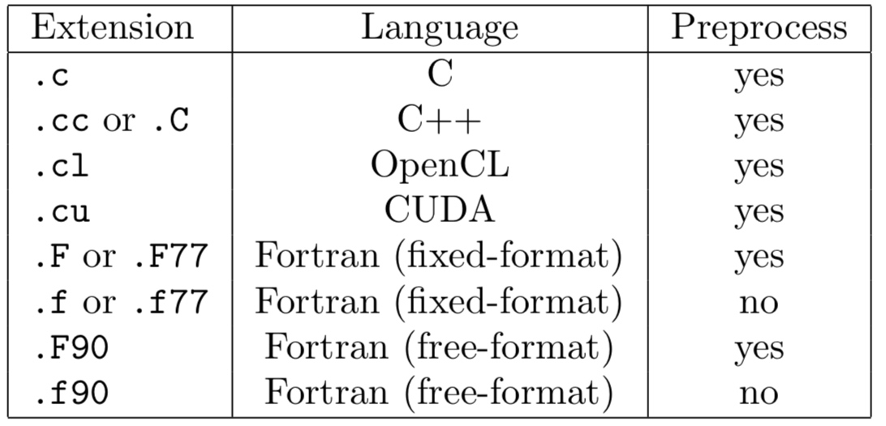

The make system uses file extensions to designate coding language, as well as other properties of the code in the file.



In order to use Cactus `#include` directives in a file, it must be preprocessed.

## Adding Source Files

By default, the CCTK looks in the `src` directory of the thorn for source files.

There are two ways in which to specify the sources. The easiest is to use the `make.code.defn` based method in which the CCTK does all the work, but you may instead put a `Makefile` in the `src` directory and do everything yourself.

The Cactus make system looks for a file called `make.code.defn` in that directory (if there is no file called `Makefile` in the `src` directory). At its simplest, this file contains two lines

```
SRCS = <list of all source files in this directory>
SUBDIRS = <list of all subdirectories, including subdirectories of subdirectories>
```

Each subdirectory listed should then have a `make.code.defn` file containing just a `SRCS =` line, a `SUBDIRS =` line will be ignored.

## Coding Style

**Indentation:**

___

Two spaces, no tabs.

**Brace positioning:**

___

```
do
{
<statement>
} while();
```

**GRDOC:**

___

All files should start with a grdoc header, and all functions should have grdoc headers.

The function grdoc should contain

- a description of the function, saying what it does.
- the functions called by this function.
- all function arguments with descriptions of what they are and what they are used for. 
- the return codes should be described.

The standard grdoc function header is of the form

```
/*@@
  @routine  Template
  @date  Fri Oct 6 10:51:49 2000
  @author  Yu Liu
  @desc  An example of grdoc
  @enddesc
  @calls  templatefunc2
  @calledby
  @history
  @endhistory
  @var     templatestring
  @vdesc   string describing foobar
  @vtype   const char *
  @vio     in
  @vcomment
  @endvar
  @returntype int *
  @returndesc  0 - success
  @endreturndesc
@@*/
```

**Header Files:**

___

```
#ifndef <Name of Header File in Capitals>
#define <Name of Header File in Capitals>
<body of header file>
#endif

#ifdef __cplusplus
extern "C"
{
#endif
```

**Source Files:**

___

Source files should have as their first lines after all the include files:

```
static const char *rcsid = "$Header$";
CCTK_FILEVERSION(MaintGuide_Template_c);
```

`<source file>` should be replaced by

- Flesh: `<directory>_<core filename>_<extension>` (e.g. main_Groups_c)
- Thorn: `<arrangement>_<thorn>_<core filename>_<extension>`
(e.g. CactusBase_CartGrid3D_CartGrid3D_c)

**Naming Conventions:**

___

All functions which may be used by thorns should have names beginning with `CCTK_` and then capitalised words with no underscores.

All functions used internally by the flesh should have names beginning with `CCTKi_` and then capitalised words with no underscores.

Header files to be included by thorns should have names beginning with `cctk_`, and followed by capitalised words with no underscores.

All Cactus sourcefile names (except general utility files) should use capitilised words without underscores.

### Fortran

Any source file using Cactus infrastructure should include the header file `cctk.h` using the line

```
#include "cctk.h"
```

#### Variables

Any routine using Cactus argument lists should include at the top of the file the header

```
#include "cctk_Arguments.h"
```

A Cactus macro CCTK ARGUMENTS is defined for each thorn to contain:
- General information about the grid hierarchy.
- All the grid variables defined in the thorn’s interface.ccl
- All the grid variables required from other thorns as requested by the inherits and friend lines in the interface.ccl

These variables must be declared at the start of the routine using the macro `DECLARE_CCTK_ARGUMENTS`.

#### Parameters

Any routine using Cactus parameters should include at the top of the file the header

```
#include "cctk_Parameters.h"
```

The parameters should be declared at the start of the routine using them with the macro `DECLARE_CCTK_PARAMETERS`.

To compare a string valued parameter and Fortran string, use the macro `CCTK_EQUALS()` or the function `CCTK_Equals()`.

To print the value of a string valued parameter to screen, use the subroutine `CCTK_PrintString()`. 

A further function `CCTK_FortranString` provides a mechanism for converting a string parameter to a Fortran string.


#### Cactus Fortran Functions

Cactus Fortran functions can all be declared by adding the statement

```
#include "cctk_Functions.h"
```

near the top of the file, and adding the declaration

```
DECLARE_CCTK_FUNCTIONS
```

to a module or a subroutine after the implicit none statement, but before any executable code.

#### Fortran Modules

Fortran modules should be placed into source files that have the same name as the module, followed by the corresponding file name suffix. A module metric should thus be placed, e.g. into a file `metric.F90`. This convention allows the Cactus build system to automatically deduce the compile time dependencies.

If you do not follow this convention, then you have to include the modules into the thorn’s `make.code.deps` file.

#### Example
```
#include "cctk.h"
#include "cctk_Arguments.h"
#include "cctk_Parameters.h"
      subroutine MyNewRoutine(CCTK_ARGUMENTS,flag)
      implicit none
      DECLARE_CCTK_ARGUMENTS
      DECLARE_CCTK_PARAMETERS
c     Main code goes here
      return 
      end
```

### C

Any source file using Cactus infrastructure should include the header file `cctk.h` using the line

```
#include "cctk.h"
```

#### Variables

Any routine using Cactus argument lists should include at the top of the file the header

```
#include "cctk_Arguments.h"
```

A Cactus macro CCTK ARGUMENTS is defined for each thorn to contain:
- General information about the grid hierarchy.
- All the grid variables defined in the thorn’s interface.ccl
- All the grid variables required from other thorns as requested by the inherits and friend lines in the interface.ccl

These variables must be declared at the start of the routine using the macro `DECLARE_CCTK_ARGUMENTS`.

#### Parameters

Any routine using Cactus parameters should include at the top of the file the header

```
#include "cctk_Parameters.h"
```

The parameters should be declared at the start of the routine using them with the macro `DECLARE_CCTK_PARAMETERS`.

#### Example

```
#include "cctk.h"
#include "cctk_Arguments.h"
#include "cctk_Parameters.h"
void MyCRoutine(CCTK_ARGUMENTS)
{
  DECLARE_CCTK_ARGUMENTS
  DECLARE_CCTK_PARAMETERS
  /* Here goes your code */
}
```

## Cactus Variables

The Cactus variables which are passed through the macro CCTK ARGUMENTS are

| Name | Describe |
| ------------ | ------------- |
| cctkGH | A C pointer identifying the grid hierarchy. |
| cctk_dim | An integer with the number of dimensions used for this grid hierarchy. |
| cctk_lsh | An array of cctk_dim integers with the local grid size on this processor. |
| cctk_ash | An array of cctk_dim integers with the allocated size of the array. This may be larger than the local size; the additional points may not be used. |
| cctk_gsh | An array of cctk_dim integers with the global grid size. |
| cctk_iteration | The current iteration number. |
| cctk_delta_time | A CCTK_REAL with the timestep. |
| cctk_time | A CCTK_REAL with the current time. |
| cctk_delta_space | An array of cctk_dim CCTK_REALs with the grid spacing in each direction. |
| cctk_nghostzones | An array of cctk_dim integers with the number of ghostzones used in each direction. |
| cctk_origin_space | An array of cctk_dim CCTK_REALs with the spatial coordinates of the global origin of the grid. |

The following variables describe the location of the local grid (e.g. the grid treated on a given processor) within the global grid.

| Name | Describe |
| ------------ | ------------- |
| cctk_lbnd | An array of cctk_dim integers containing the lowest index (in each direction) of the local grid, as seen on the global grid. Note that these indices start from zero, so you need to add one when using them in Fortran thorns. |
| cctk_ubnd | An array of cctk_dim integers containing the largest index (in each direction) of the local grid, as seen on the global grid. Note that these indices start from zero, so you need to add one when using them in Fortran thorns. |
| cctk_bbox | An array of 2*cctk_dim integers, which indicate whether the boundaries are internal boundaries (e.g. between processors), or physical boundaries. A value of 1 indicates a physical (outer) boundary at the edge of the computational grid, and 0 indicates an internal boundary. |

The following variable is needed for grid refinement methods

| Name | Describe |
| ------------ | ------------- |
| cctk_levfac | An array of cctk_dim integer factors by which the local grid is refined in the corresponding direction with respect to the base grid. |
| cctk_levoff | and cctk_levoffdenom Two arrays of cctk_dim integers describing the distance by which the local grid is offset with respect to the base grid, measured in local grid spacings. The distance in direction dir is given by 1.0 * cctk_levoff[dir] / cctk_levoffdenom[dir]. |
| cctk_timefac | The integer factor by which the time step size is reduced with respect to the base grid. |

The following variables are used for identifying convergence levels.

| Name | Describe |
| ------------ | ------------- |
| cctk_convlevel | The convergence level of this grid hierarchy. The base level is 0, and every level above that is coarsened by a factor of cctk_convfac. |
| cctk_convfac | The factor between convergence levels. The relation between the resolutions of different convergence levels is $\Delta x_{L}=\Delta x_{0} \cdot F^{L}$, where L is the convergence level and F is the convergence factor. The convergence factor defaults to 2. |
 
The variables cctk_delta_space, cctk_delta_time, and cctk_origin space denote the grid spacings, time step size, and spatial origin on the base grid.

### Cactus Data Types

To provide portability across platforms, the Cactus grid variables and parameters are defined and declared using Cactus data types (CCTK_INT, CCTK_REAL, CCTK_COMPLEX). 

