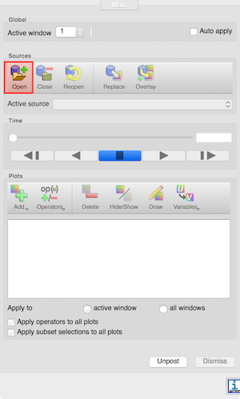

## gnuplot

You should see a number of files with the extension `.asc`. These are 0-D (reductions of 3-D grid functions to scalar values) and 1-D ASCII output files that can be plotted with gnuplot.

### Plot

Start gnuplot with the command:

```
gnuplot
```

and at the gnuplot prompt type:

```
plot '<filename>.asc' using 2:3 with linespoints
```

## Python

The following commands will generate a simple line plot of the data.

```python
import matplotlib
import numpy as np
import matplotlib.pyplot as plt
import os
home = os.environ["HOME"]
lin_data = np.genfromtxt(home+"/simulations/<filepath>.asc")
plt.plot(lin_data[:,1],lin_data[:,2])
```

## VisIt

### Opening the databases

Once the software is running, the button Open can be used to open files from the simulation. Make sure to select Open file as type: CarpetHDF5, otherwise VisIt may try to load the data using another format.



If you are using the Simulation Factory to launch and manage the run, the data will be output under the directory `<basedir>/<simulation name>/output-<nnnn>/<parfile name>`, where `<nnnn>` is the number of the restart. There are essentially two types of files that can be visualised with VisIt:

- Files from the thorn `CarpetIOHDF5`, with `.h5` extension, which will be read by the `CarpetHDF5` plugin in VisIt and represent the 1D, 2D, or 3D configuration of a specific field, on a number of constant-time spaces.
- Files from the thorn `QuasiLocalMeasures`, with `.vtk` extension, which are read natively by VisIt and represent the shape and properties of relevant 2D topological spheres, such as the apparent horizons, also at different times.

### A visualization example

We first need to load the data, using the Open button and selecting the correct path for the database <filename.h5>. We can then generate the plot by clicking `Add > Pseudocolor > <filename>`. If the Auto Apply feature in VisIt is not selected, we need to click on Draw to make the plot appear.