## gnuplot

You should see a number of files with the extension `.asc`. These are 0-D (reductions of 3-D grid functions to scalar values) and 1-D ASCII output files that can be plotted with gnuplot.

http://cactuscode.org/documentation/visualization/gnuPlot/

### Plot

Start gnuplot with the command:

```
gnuplot
```

and at the gnuplot prompt type:

```
plot '<filename>.asc' using 2:3 with linespoints
```

## Python

The following commands will generate a simple line plot of the data.

```python
import matplotlib
import numpy as np
import matplotlib.pyplot as plt
import os
home = os.environ["HOME"]
lin_data = np.genfromtxt(home+"/simulations/<filepath>.asc")
plt.plot(lin_data[:,1],lin_data[:,2])
```

## VisIt

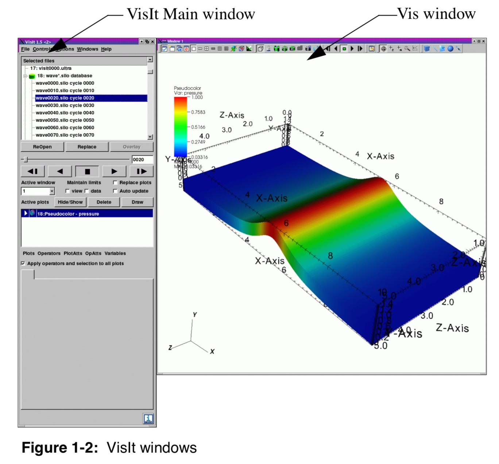

### Getting started

Once the software is running, the button Open can be used to open files from the simulation. Make sure to select Open file as type: CarpetHDF5, otherwise VisIt may try to load the data using another format.


If you are using the Simulation Factory to launch and manage the run, the data will be output under the directory `<basedir>/<simulation name>/output-<nnnn>/<parfile name>`, where `<nnnn>` is the number of the restart. There are essentially two types of files that can be visualised with VisIt:

- Files from the thorn `CarpetIOHDF5`, with `.h5` extension, which will be read by the `CarpetHDF5` plugin in VisIt and represent the 1D, 2D, or 3D configuration of a specific field, on a number of constant-time spaces.
- Files from the thorn `QuasiLocalMeasures`, with `.vtk` extension, which are read natively by VisIt and represent the shape and properties of relevant 2D topological spheres, such as the apparent horizons, also at different times.

### Plot

We first need to load the data, using the Open button and selecting the correct path for the database <filename.h5>. We can then generate the plot by clicking `Add > Pseudocolor > <filename>`. If the Auto Apply feature in VisIt is not selected, we need to click on Draw to make the plot appear.

VisIt comes with sixteen standard plots: Boundary, Contour, Curve, FilledBoundary, Histogram, Label, Mesh, Pseudocolor, Scatter, Streamline, Subset, Surface, Tensor, Truecolor, Vector, and Volume.

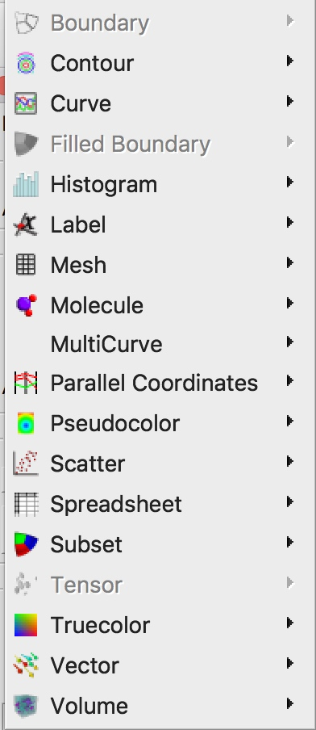

#### Boundary and FilledBoundary Plots

The Boundary plot and FilledBoundary plot are discussed together because of their similarity. Both plots concentrate on the boundaries between materials but each plot shows the boundary in a different way.

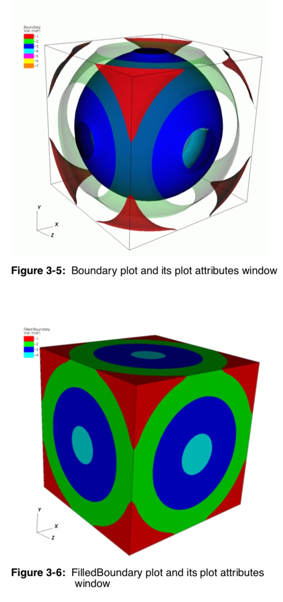

#### Contour Plot

This plot displays the location of values for scalar variables like density or pressure using lines for 2D plots and surfaces for 3D plots.

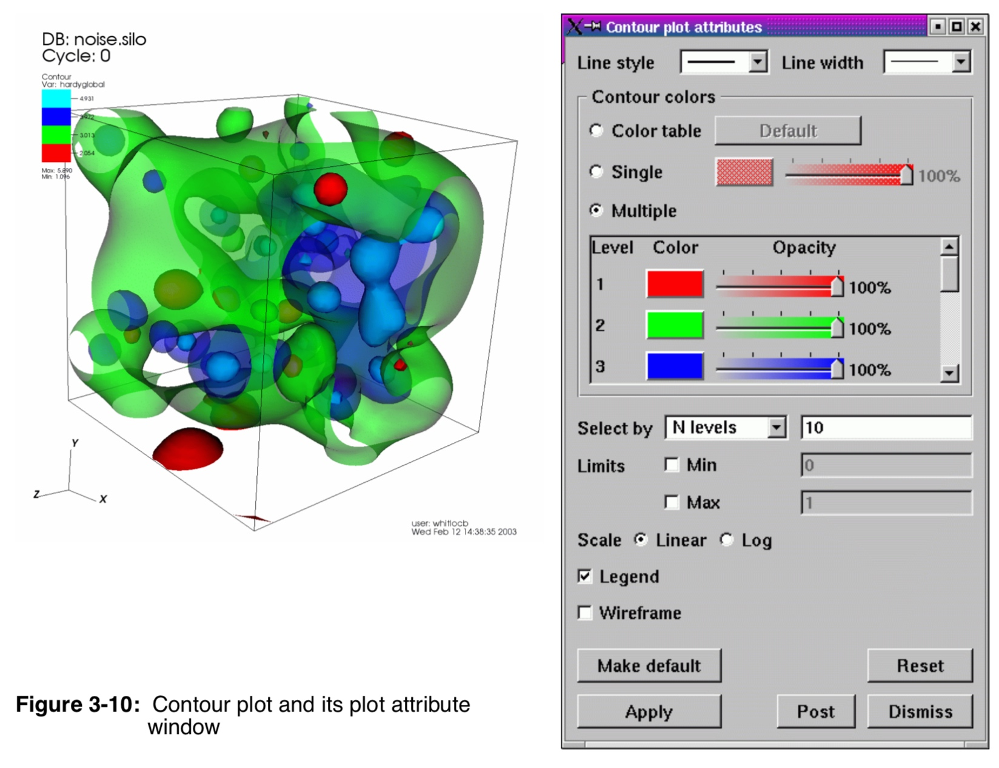

#### Curve Plot

The Curve plot displays a simple group of X-Y pair data such as that output by 1D simulations or data produced by Lineouts of 2D or 3D datasets. Curve plots are useful for visualizations where it is useful to plot 1D quantities that evolve over time.

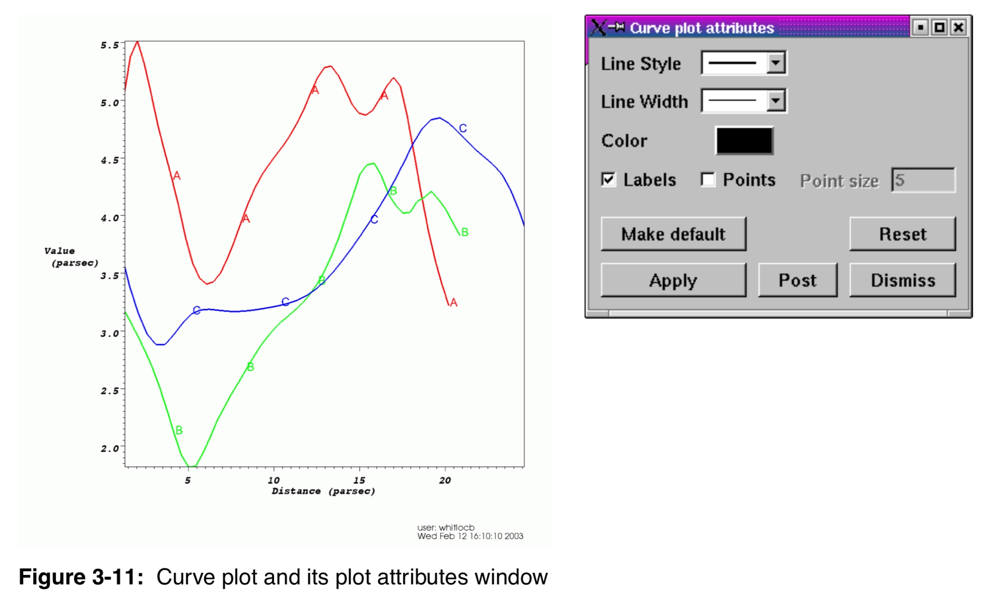

#### Histogram Plot

The Histogram plot divides the data range of a scalar variable into a number of bins and groups the variable’s values, weighted by cell area or revolved volume, into different bins. The values in each bin are then used to create a bar graph or curve that represents the distribution of values throughout the variable’s data range. The Histogram plot can be used to determine where data values cluster in the range of a scalar variable.

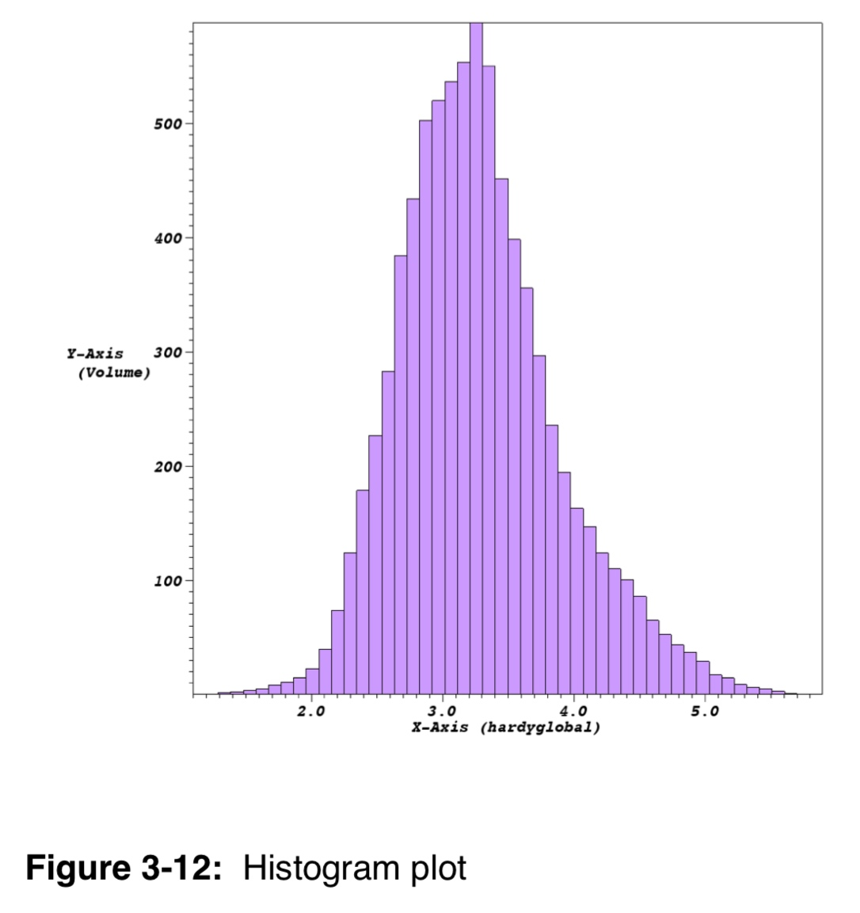

#### Label Plot

The Label plot can display mesh information, scalar fields, vector fields, tensor fields, array variables, subset names, and material names. The Label plot is often used as a debugging device for simulation codes since it allows the user to see labels containing the exact values at the computational mesh’s nodes or cell centers. Since the Label plot’s job is to display labels representing the computational mesh or the fields defined on that mesh, it does not convey much information about the actual mesh geometry. Since having a Label plot by itself does not usually give enough information to understand the plotted dataset, the Label plot is almost always used with other plots.

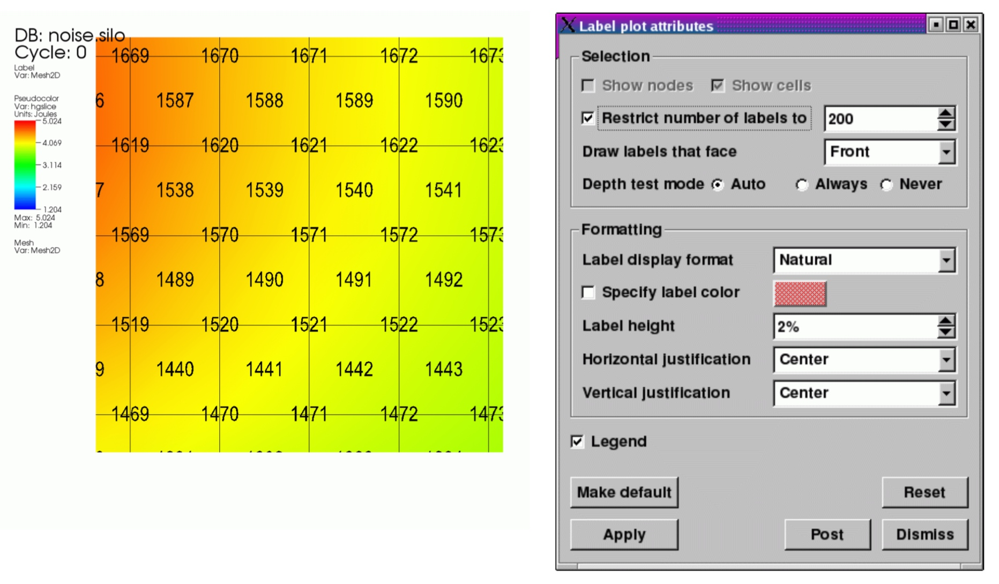

#### Mesh Plot

The Mesh plot displays the computational mesh over which a database’s variables are defined. The mesh plot is often added to the visualization window when other plots are visualized to allow individual cells to be clearly seen.

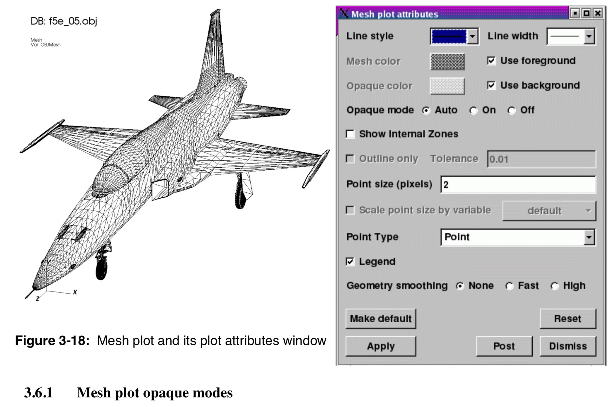

#### Pseudocolor plot

The Pseudocolor plot maps a scalar variable’s data values to colors and uses the colors to “paint” values onto the variable’s computational mesh. The result is a clear picture of the database geometry painted with variable values that have been mapped to colors. You might try this plot first when examining a scientific database for the first time since it reveals so much information about the plotted variable.

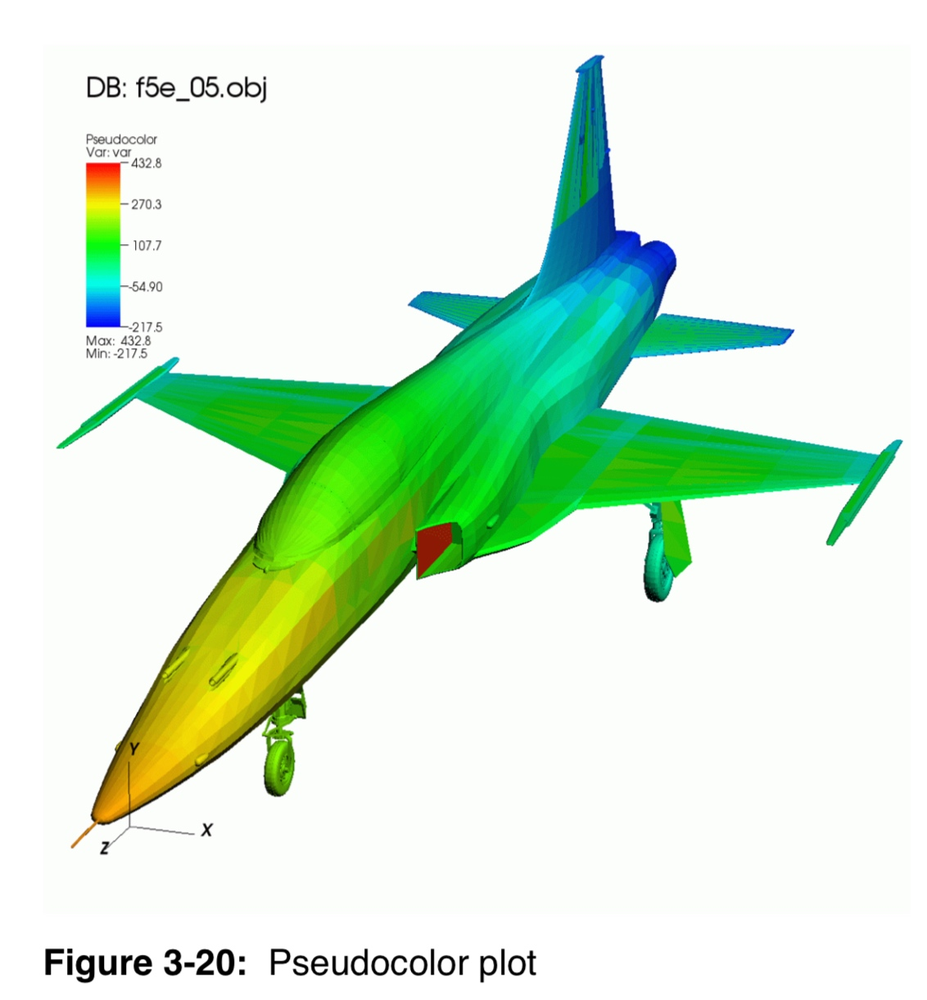

#### Scatter Plot

The Scatter plot allows you to combine multiple scalar fields into a point mesh so you can investigate the relationships between multiple input variables.

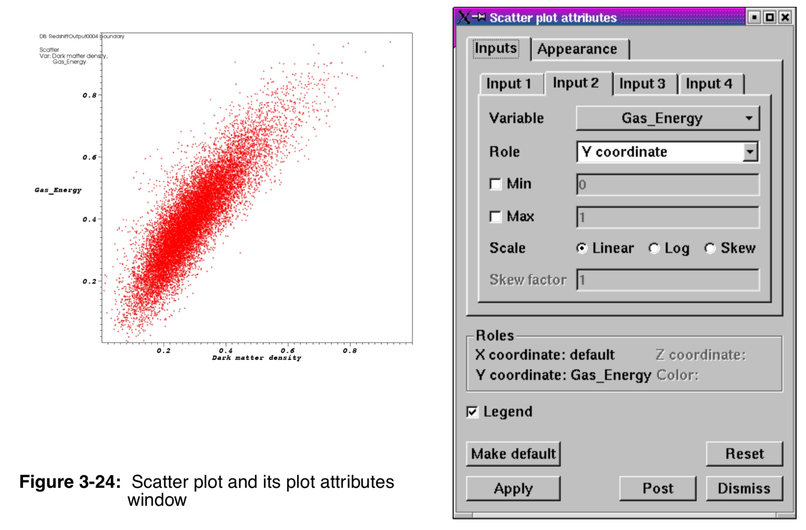

#### Streamline Plot

The Streamline plot shows the behavior of particles in a vector field. The Streamline plot calculates the value of the vector field at seed locations, which are produced by point sources, and integrates through the vector field to create a streamline. Streamlines can be displayed as a line, a tube, or as a ribbon if you also want to show the vorticity of the vector field.

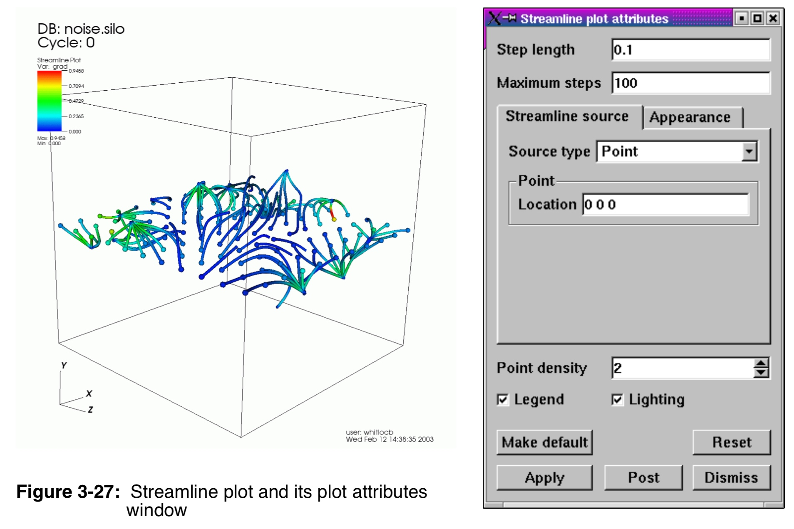

#### Surface Plot


The Surface plot takes 2D scalar databases as input and adds a height component to the variable’s mesh, resulting in a height map that is then pseudocolored by the plotted variable. You might want to use this plot to examine 2D datasets because features of the plotted variable are highlighted by the height of the plot in addition to being highlighted by the plot’s colors.

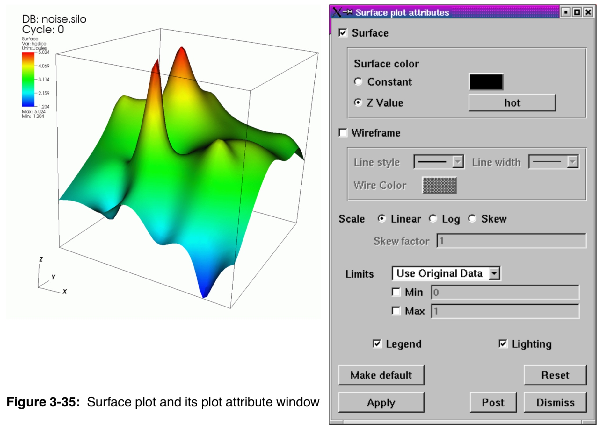

#### Tensor plot

The Tensor plot displays tensor variables using ellipsoid glyphs to convey information about a tensor variable’s eigenvalues. Each glyph’s scaling and rotation is controlled by the eigenvalues/eigenvectors of the tensor as follows: for each tensor, the eigenvalues (and associated eigenvectors) are sorted to determine the major, medium, and minor eigenvalues/eigenvectors.

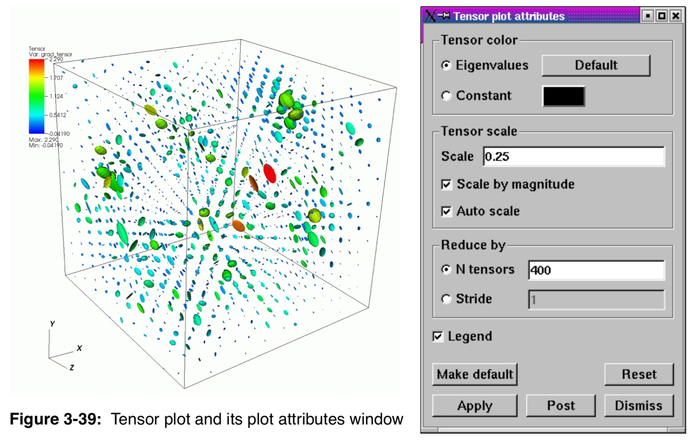
