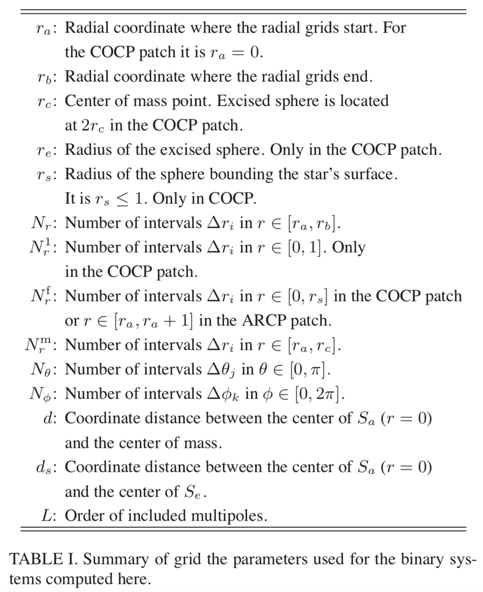

## Flesh parameters

```
# Flesh parameters
Cactus::<Flesh parameters> = <Value>
```

The default value is shown in square brackets, while curly braces show allowed parameter values.

| Value | Describe |
| ------------ | ------------- |
| cctk_run_title | Description of this simulation [""] |
| cctk_full_warnings | Give detailed information for each warning statement [yes] |
| highlight_warning_messages | Highlight CCTK warning messages [yes] |
| cctk_timer_output | Give timing information [off] {off, full} |
| allow_mixeddim_gfs | Allow use of GFs from different dimensions [no] |
| cctk_brief_output | Give only brief output [no] |
| cctk_show_banners | Show any registered banners for the different thorns [yes] |
| cctk_show_schedule | Print the scheduling tree to standard output [yes] |
| cctk_strong_param_check | Die on parameter errors in CCTK_PARAMCHECK [yes] |
| recovery_mode | How to behave when recovering from a checkpoint [strict] {strict, relaxed} |
| info_format | Specifies the content and format of CCTK_INFO()/CCTK_VINFO messages. [basic] {"basic", "numeric time stamp", "human-readable time stamp", "full time stamp"} |

| Value | Describe |
| ------------ | ------------- |
| terminate | Condition on which to terminate evolution loop [iteration] {never, iteration, time, runtime, any, all} |
| cctk_final_time | Final time for evolution, overridden by cctk_itlast unless it is positive [-1.0] |
| cctk_initial_time | Initial time for evolution [0.0] |
| cctk_itlast | Final iteration number [10] |
| max_runtime | Terminate evolution loop after a certain elapsed runtime (in minutes); set to zero to disable this termination condition [0] |
| terminate_next | Terminate on next iteration ? [no] |

## Grid structure

### CoordBase

The `CoordBase` thorn provides a method of registering coordinate systems and their properties.

#### Specifying coordinate systems in the interface.ccl

```
CCTK_REAL SphericalVectorField TYPE=ARRAY DIM=2 TAGS=’COORDSYSTEM="sphere2d" TENSORTYPE="vector"’  
{  
  field_theta, field_phi  
}
```

#### Specifying the extent of the physical domain

CoordBase provides a way for specifying the extent of the simulation domain that is independent of the actual coordinate and symmetry thorns. This is necessary because the size of the physical domain is not necessarily the same as the size of the computational grid, which is usually enlarged by symmetry zones and/or boundary zones. The physical domain is characterised by the location of its lower and upper boundary and by its grid spacing. 

```
CoordBase::domainsize = <Value>
```

| Value | Describe |
| ------------ | ------------- |
| minmax | by the location of its lower and upper boundary. |
| extent | by its extent, i.e. its width. |
| spacing | by grid spacing and the number of grid cells. |

___

The domain specification uses the number of grid cells instead of the number of grid points because the latter can easily lead to one-off errors.

The domain size in each dimension is specificied in equivalent ways. For example, the x-dimension is specified by a set of some of the following parameters:

| Value | Describe |
| ------------ | ------------- |
| zero_origin_x | When the domain size is specified by extent or by spacing, then the origin (lower boundary) can either be located at $x = 0$, which leads to the domain $x \in[0, L]$ with the extent L, or the domain can be symmetric with respect to $x = 0$, which leads to $x \in[-L / 2, L / 2]$. |
| xmin and xmax | When the domain is specified by the location of its lower and upper boundary, then these specify the locations. |
| xextent | When the domain is specified by its extent, then this specifies the extent. |
| dx (real) and ncells_x (int) | When the domain is specified by grid spacing and the number of grid cells, then these specify the grid spacing and the number of grid cells. |

#### Specifying the location of the boundary points

| Value | Describe |
| ------------ | ------------- |
| boundary_size_x_lower|  |
| boundary_internal_x_lower |  |
| boundary_staggered_x_lower | |
| boundary_shiftout_x_lower | | 

### CartGrid3D

`CartGrid3D` allows you to set up coordinates on a 3D Cartesian grid in a flexible manner.

#### Specifying the Grid Size, Range, and Spacing

`CartGrid3D` provides several different methods for setting up the integer grid size, floating-point grid spacing, and floating-point grid range. You specify which method to use, with the `grid::type` parameter.

| Value | Describe |
| ------------ | ------------- |
| byrange | You specify the x, y, and z grid ranges, either with separate `grid::xmin`, `grid::xmax`, `grid::ymin`, `grid::ymax`, `grid::zmin`, and `grid::zmax` parameters, or with the `grid::xyzmin` and `grid::xyzmax` parameters. |
| box | This is a special case of `grid::type = "byrange"` with the grid ranges hard-wired to `grid::xyzmin = -0.5` and `grid::xyzmax = +0.5`. |
| byspacing | You specify the x, y, and z grid spacings, either with separate `grid::dx`, `grid::dy`, and `grid::dz` parameters, or with the `grid::dxyz` parameter. |

`grid::avoid_originx` This is a Boolean parameter; if set to true then the grid will be “half-centered” across $x = 0$, ie there will be grid points at $\ldots, x=-\frac{3}{2} \Delta x, x=-\frac{1}{2} \Delta x, x=+\frac{1}{2} \Delta x, x=+\frac{3}{2} \Delta x, \ldots$, but not at $x = 0$.


#### Specifying the Grid Symmetry

`CartGrid3D` allows you to specify the grid symmetry with the `grid::domain` parameter.

| Value | Describe |
| ------------ | ------------- |
| full | There are no symmetries. |
| bitant | The grid includes only the $z \geq 0$ half-space; there is a reflection symmetry across the $z = 0 $plane. |
| quadrant | The grid includes only the $\{x \geq 0, y \geq 0\}$ quadrant. ; there is a reflection symmetry across both the $x = 0$ plane and the $y = 0$ plane. |
| octant | The grid includes only the $\{x \geq 0, y \geq 0, z \geq 0\}$ octant; there is a reflection symmetry across each of the $x = 0$ plane, the $y = 0$ plane and the $z = 0$ plane. |

## Mesh refinement

## Initial data

## Evolution and boundary

## BH tracking

## Spatial finite differencing

## Time integration

## Interpolation

## Psi4 computation

## Apparent Horizons

## Spherical surfaces

## Isolated Horizons


## Output


## Initial data

The initial data are computed using the Compact Object CALculator (COCAL) [^1]




[^1]: Lorem ipsum dolor sit amet, consectetur adipiscing elit.

## Diagnostics

The BH apparent horizon is located and monitored through the AHFinderDirect thorn. We estimate the BH mass $M_{\mathrm{BH}}$ and the BH dimensionless spin parameter $a / M_{\mathrm{BH}}$ using the isolated horizon formalism.

## Extract Gravitational Wave

To measure the flux of energy and angular momentum carried away by GWs, we use a modified version of the Psikadelia thorn.


https://arxiv.org/pdf/1502.05674.pdf
https://arxiv.org/pdf/1809.08237.pdf
https://arxiv.org/pdf/gr-qc/0306056.pdf
https://arxiv.org/pdf/gr-qc/0206008.pdf