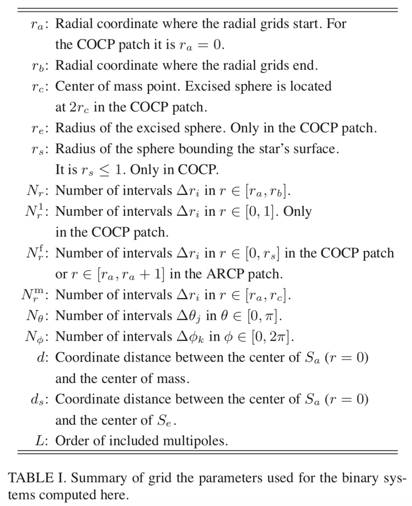

## Flesh

The Cactus flesh knows about everything in `schedule.ccl` files, and handles sorting scheduled routines into an order which is consistent with the BEFORE and AFTER clauses in all the schedule groups. The flesh also handles repeatedly calling scheduled routines which are scheduled with a WHILE clause. In addition, the flesh determines when storage is turned on/off for grid scalars, functions, and arrays and when grid arrays and functions are synchronised, based on the `STORAGE:` and `SYNC:` statements in schedule blocks.

```
# Flesh parameters
Cactus::<Flesh parameters> = <Value>
```

The default value is shown in square brackets, while curly braces show allowed parameter values.

| Value | Describe |
| ------------ | ------------- |
| Cactus::cctk_run_title | Description of this simulation [""] |
| Cactus::cctk_full_warnings | Give detailed information for each warning statement [yes] |
| Cactus::highlight_warning_messages | Highlight CCTK warning messages [yes] |
| Cactus::cctk_timer_output | Give timing information [off] {off, full} |
| Cactus::allow_mixeddim_gfs | Allow use of GFs from different dimensions [no] |
| Cactus::cctk_brief_output | Give only brief output [no] |
| Cactus::cctk_show_banners | Show any registered banners for the different thorns [yes] |
| Cactus::cctk_show_schedule | Print the scheduling tree to standard output [yes] |
| Cactus::cctk_strong_param_check | Die on parameter errors in CCTK_PARAMCHECK [yes] |
| Cactus::recovery_mode | How to behave when recovering from a checkpoint [strict] {strict, relaxed} |
| Cactus::info_format | Specifies the content and format of CCTK_INFO()/CCTK_VINFO messages. [basic] {"basic", "numeric time stamp", "human-readable time stamp", "full time stamp"} |
| Cactus::terminate | Condition on which to terminate evolution loop [iteration] {never, iteration, time, runtime, any, all} |
| Cactus::cctk_final_time | Final time for evolution, overridden by cctk_itlast unless it is positive [-1.0] |
| Cactus::cctk_initial_time | Initial time for evolution [0.0] |
| Cactus::cctk_itlast | Final iteration number [10] |
| Cactus::max_runtime | Terminate evolution loop after a certain elapsed runtime (in minutes); set to zero to disable this termination condition [0] |
| Cactus::terminate_next | Terminate on next iteration ? [no] |

## Coordinate Systems

### CoordBase

The CoordBase thorn provides a method of registering coordinate systems and their properties. The data describing coordinate systems are held on Cactus key-value tables. Thorns which provide coordinates will inherit from CoordBase.

The coordinate values themselves can be specified in a number of ways, depending on the nature of the coordinate system. This way symmetries of the coordinates on the computational grid can be exploited to minimize memory consumption.

Since computations performed with Cactus are done on a discrete lattice, only a discrete set of coordinate values are used for any coordinate system. The symmetries of how the coordinate values vary on the grid points make coordinates fall into three types: uniform, nonuniform, and warped.

For a uniform coordinate system, it is sufficient to specify the origin and spacing for a uniform coordinate. A nonuniform coordinate can be specified with a 1D grid variable. A warped coordinate system will always need a nD grid variable. FMR and AMR will need an nD grid variable to specify the coordinate values.

**CoordBase provides a way for specifying the extent of the simulation domain that is independent of the actual coordinate and symmetry thorns.** This is necessary because the size of the physical domain is not necessarily the same as the size of the computational grid, which is usually enlarged by symmetry zones and/or boundary zones.

CoordBase also provides a way for specifying the discretisation of the boundary that is independent of the actual boundary thorns. This defines the locations of the boundary points and thus the extent of the computational grid.

When it is necessary to increase the number of boundary points, then `boundary_size_x_lower` is the only parameter that needs to be changed.


The boolean parameter `boundary_internal_x_lower` specifies whether the boundary points extend inwards at the lower x face.


The boundary points should either be staggered about the physical boundary, or the last boundary point should be located exactly on the physical boundary. This is specified by the boolean parameter `boundary_staggered_x_lower`.


The integer parameter `boundary_shiftout_x_lower` can be used to shift the boundary points outwards (or inwards with negative values) by multiples of the grid spacing.


#### Parameter

| Key | Defaults | Describe | Option |
| ------------ | ------------- | ------------- | ------------- |
| domainsize | "minmax" | Domain size specification | "minmax":: "lower and upper boundary locations"; "extent":: "coordinate extent"; "spacing" :: "grid spacing and number of grid cells" |
| spacing | "gridspacing" | Grid spacing specification | "gridspacing" :: "grid spacing"; "numcells":: "number of grid cells" |
| zero_origin_x | "no" | Is the lower boundary located at x=0? |  |
| xmin | 0.0 | Location of lower x boundary | (:) :: "" |
| xmax | 1.0 | Location of upper x boundary | (:) :: "" |
| xextent | 1.0 | Domain extent in x direction | (0:) :: "" |
| dx | 1.0 | Grid spacing in x direction | (0:) :: "" |
| ncells_x | 1 | Number of grid cells in x direction | 0: :: "" |
| zero_origin_y | "no" | Is the lower boundary located at y=0? |  |
| ymin | 0.0 | Location of lower y boundary | (:) :: "" |
| ymax | 1.0 | Location of upper y boundary | (:) :: "" |
| yextent | 1.0 | Domain extent in y direction | (0:) :: "" |
| dy | 1.0 | Grid spacing in y direction | (0:) :: "" |
| ncells_y | 1 | Number of grid cells in y direction | 0: :: "" |
| zero_origin_z | "no" | Is the lower boundary located at z=0? |  |
| zmin | 0.0 | Location of lower z boundary | (:) :: "" |
| zmax | 1.0 | Location of upper z boundary | (:) :: "" |
| zextent | 1.0 | Domain extent in z direction | (0:) :: "" |
| dz | 1.0 | Grid spacing in z direction | (0:) :: "" |
| ncells_z | 1 | Number of grid cells in z direction | 0: :: "" |
| boundary_size_x_lower | 1 | Boundary zones at the lower x face | 0: :: "" |
| boundary_internal_x_lower | "no" | Do the boundary points extend inwards at the lower x face? |  |
| boundary_staggered_x_lower | "no" | Is the boundary is staggered about the grid points at the lower x face? |  |
| boundary_shiftout_x_lower | 0 | Offset between the boundary location and the first boundary point at the lower x face | : :: "when not staggered: use 0 for an open, 1 for a closed manifold" |
| boundary_size_x_upper | 1 | Boundary zones at the upper x face | 0: :: "" |
| boundary_internal_x_upper | "no" | Do the boundary points extend inwards at the upper x face? |  |
| boundary_staggered_x_upper | "no" | Is the boundary is staggered about the grid points at the upper x face? |  |
| boundary_shiftout_x_upper | 0 | Offset between the boundary location and the first boundary point at the upper x face | : :: "when not staggered: use 0 for an open, 1 for a closed manifold" |
| boundary_size_y_lower | 1 | Boundary zones at the lower y face | 0: :: "" |
| boundary_internal_y_lower | "no" | Do the boundary points extend inwards at the lower y face? |  |
| boundary_staggered_y_lower | "no" | Is the boundary is staggered about the grid points at the lower y face? |  |
| boundary_shiftout_y_lower | 0 | Offset between the boundary location and the first boundary point at the lower y face | : :: "when not staggered: use 0 for an open, 1 for a closed manifold" |
| boundary_size_y_upper | 1 | Boundary zones at the upper y face | 0: :: "" |
| boundary_internal_y_upper | "no" | Do the boundary points extend inwards at the upper y face? |  |
| boundary_staggered_y_upper | "no" | Is the boundary is staggered about the grid points at the upper y face? |  |
| boundary_shiftout_y_upper | 0 | Offset between the boundary location and the first boundary point at the upper y face | : :: "when not staggered: use 0 for an open, 1 for a closed manifold" |
| boundary_size_z_lower | 1 | Boundary zones at the lower z face | 0: :: "" |
| boundary_internal_z_lower | "no" | Do the boundary points extend inwards at the lower z face? |  |
| boundary_staggered_z_lower | "no" | Is the boundary is staggered about the grid points at the lower z face? |  |
| boundary_shiftout_z_lower | 0 | Offset between the boundary location and the first boundary point at the lower z face | : :: "when not staggered: use 0 for an open, 1 for a closed manifold" |
| boundary_size_z_upper | 1 | Boundary zones at the upper z face | 0: :: "" |
| boundary_internal_z_upper | "no" | Do the boundary points extend inwards at the upper z face? |  |
| boundary_staggered_z_upper | "no" | Is the boundary is staggered about the grid points at the upper z face? |  |
| boundary_shiftout_z_upper | 0 | Offset between the boundary location and the first boundary point at the upper z face | : :: "when not staggered: use 0 for an open, 1 for a closed manifold" |

### CartGrid3D

This thorn sets up a Cartesian grid, for a given domain. It also provides a method for registering symmetries of Grid Functions across the grid axes, and a call for applying symmetry boundary conditions.

#### Specifying the Grid Size, Range, and Spacing

`CartGrid3D` provides several different methods for setting up the integer grid size, floating-point grid spacing, and floating-point grid range. You specify which method to use, with the `grid::type` parameter.

| Value | Describe |
| ------------ | ------------- |
| byrange | You specify the x, y, and z grid ranges, either with separate `grid::xmin`, `grid::xmax`, `grid::ymin`, `grid::ymax`, `grid::zmin`, and `grid::zmax` parameters, or with the `grid::xyzmin` and `grid::xyzmax` parameters. |
| box | This is a special case of `grid::type = "byrange"` with the grid ranges hard-wired to `grid::xyzmin = -0.5` and `grid::xyzmax = +0.5`. |
| byspacing | You specify the x, y, and z grid spacings, either with separate `grid::dx`, `grid::dy`, and `grid::dz` parameters, or with the `grid::dxyz` parameter. |

`grid::avoid_originx` This is a Boolean parameter; if set to true then the grid will be “half-centered” across $x = 0$, ie there will be grid points at $\ldots, x=-\frac{3}{2} \Delta x, x=-\frac{1}{2} \Delta x, x=+\frac{1}{2} \Delta x, x=+\frac{3}{2} \Delta x, \ldots$, but not at $x = 0$.

#### Specifying the Grid Symmetry

`CartGrid3D` allows you to specify the grid symmetry with the `grid::domain` parameter.

| Value | Describe |
| ------------ | ------------- |
| full | There are no symmetries. |
| bitant | The grid includes only the $z \geq 0$ half-space; there is a reflection symmetry across the $z = 0$ plane. |
| quadrant | The grid includes only the $\{x \geq 0, y \geq 0\}$ quadrant. ; there is a reflection symmetry across both the $x = 0$ plane and the $y = 0$ plane. |
| octant | The grid includes only the $\{x \geq 0, y \geq 0, z \geq 0\}$ octant; there is a reflection symmetry across each of the $x = 0$ plane, the $y = 0$ plane and the $z = 0$ plane. |

#### Parameter

| Key | Defaults | Describe | Option |
| ------------ | ------------- | ------------- | ------------- |
| no_origin | "yes" | DEPRECATED: Don't place grid points on the coordinate origin/axes | : :: "" |
| no_originx | "yes" | DEPRECATED: Don't place grid points on the x-coordinate origin/axes | : :: "" |
| no_originy | "yes" | DEPRECATED: Don't place grid points on the y-coordinate origin/axes | : :: "" |
| no_originz | "yes" | DEPRECATED: Don't place grid points on the z-coordinate origin/axes | : :: "" |
| avoid_originx | "yes" | Don't place grid points on the x-coordinate origin/axes | : :: "" |
| avoid_originy | "yes" | Don't place grid points on the y-coordinate origin/axes | : :: "" |
| avoid_originz | "yes" | Don't place grid points on the z-coordinate origin/axes | : :: "" |
| avoid_origin | "yes" | Don't place grid points on the coordinate origin/axes | : :: "" |
| register_default_coordinate_systems | "yes" | register cartnd as the default coordinate systems |  |
| dx | 0.3 | Coarse grid spacing in x-direction | 0: :: "Positive" |
| dy | 0.3 | Coarse grid spacing in y-direction | 0: :: "Positive" |
| dz | 0.3 | Coarse grid spacing in z-direction | 0: :: "Positive" |
| dxyz | 0.0 | Coarse grid spacing in x,y,z-directions | 0: :: "Positive" |
| xmin | -1.0 | Coordinate minimum in x-direction | : :: "Anything" |
| ymin | -1.0 | Coordinate minimum in y-direction | : :: "Anything" |
| zmin | -1.0 | Coordinate minimum in z-direction | : :: "Anything" |
| xyzmin | -424242 | Coordinate minimum in x,y,z-directions | : :: "Anything" |
| xmax | 1.0 | Coordinate maximum in x-direction | : :: "Anything" |
| ymax | 1.0 | Coordinate maximum in y-direction | : :: "Anything" |
| zmax | 1.0 | Coordinate maximum in z-direction | : :: "Anything" |
| xyzmax | -424242 | Coordinate maximum in xyz-directions | : :: "Anything" |
| type | "box" | Grid type | "box":: "Box grid from -0.5 to 0.5"; "byrange":: "Specify min and max values"; "byspacing":: "Specify grid spacings"; "coordbase":: "Get specification from CoordBase"; "multipatch" :: "Get specification from MultiPatch" |
| domain | "full" | Domain type | "octant" :: "Use an octant about the origin"; "quadrant" :: "Use a quadrant in x-y plane"; "quadrant_reflect_rotate" :: "Use a quadrant with rotation symmetry about an axis"; "bitant" :: "Use a bitant about the x-y plane"; "bitant_rotate" :: "Use a bitant with rotation symmetry about an axis"; "full" :: "Use the full domain" |
| bitant_plane | "xy" | Plane defining bitant domain | "xy" :: "xy-plane"; "xz" :: "xz-plane"; "yz" :: "yz-plane" |
| quadrant_direction | "z" | Direction defining quadrant domain | "x":: "x-direction"; "y":: "y-direction"; "z":: "z-direction" |
| rotation_axis | "z" | Axis about which the rotation symmetry is to be applied | "x":: "x-axis"; "y":: "y-axis"; "z":: "z-axis" |
| symmetry_xmin | "no" | Symmetry boundary condition on lower x boundary | : :: "Logical" |
| symmetry_ymin | "no" | Symmetry boundary condition on lower y boundary | : :: "Logical" |
| symmetry_zmin | "no" | Symmetry boundary condition on lower z boundary | : :: "Logical" |
| symmetry_xmax | "no" | Symmetry boundary condition on upper x boundary | : :: "Logical" |
| symmetry_ymax | "no" | Symmetry boundary condition on upper y boundary | : :: "Logical" |
| symmetry_zmax | "no" | Symmetry boundary condition on upper z boundary | : :: "Logical" |
| set_coordinate_ranges_on | "all | On which grids to set the coordinate ranges | "all grids" :: "set ranges in local mode, on the coarsest level"; "all maps":: "set ranges in singlemap mode, on the coarsest level"; "first level" :: "set ranges in level mode, on the first level" |

### SymBase

Provide generic handling of symmetries for grids and grid arrays.

#### Parameter

| Key | Defaults | Describe | Option |
| ------------ | ------------- | ------------- | ------------- |
| verbose | "yes" | Output symmetry boundary face descriptions after registration |  |

### Coordinates

Llama is a multipatch infrastructure for Cactus. This thorn provides definition of patch systems and coordinates.

#### Parameter

| Key | Defaults | Describe | Option |
| ------------ | ------------- | ------------- | ------------- |
| coordinate_system | "Cartesian" | Available patch systems | "Cartesian" :: "Cartesian coordinates (unit Jacobian)"; "TwoPatchCartesian" :: "Two Cartesian patches with one common face"; "TwoPatchDistorted" :: "One Cartesian and one distorted patch, overlapping"; "Thornburg04" :: "Jonathan's AHFinderDirect coordinates"; "Thornburg13" :: "Jonathan's AHFinderDirect coordinates as a 13 patch system (Do not use with radial stretch)"; "Thornburg04nc" :: "Jonathan's system without a central Cartesian patch"; "CylinderInBox" :: "A hollow (spherical) cylinder in a (Cartesian) box"; "Sphere+Column" :: "Excision type overlapping sphere + column grid"; "Cylinder+Column" :: "Cylindrical grid + central column" |
| symmetry | "full" | Select a symmetry | "full":: "full domain"; "+z bitant" :: "bitant mode (positive z)"; "+xyz octant" :: "octant mode (positive xyz)" |
| verbose | "yes" | Output information periodically |  |
| store_jacobian | "yes" | Numerically evaluate and store the transformation da^i/dx^k  (a: local, x: global) |  |
| store_inverse_jacobian | "no" | Numerically evaluate and store the transformation dx^i/da^k  (a: local, x: global) |  |
| store_jacobian_derivative | "yes" | Store the derivative of the Jacobian d^2[global]/d[local]^2 |  |
| store_volume_form | "no" | Store determinant of Jacobian |  |
| patch_boundary_size | 1 | Number of inter-patch boundary points which are filled via interpolation (should be >= nghostzones) | 0: :: "" |
| stagger_patch_boundaries | "no" | Stagger the grid at the inter-patch boundaries? |  |
| additional_overlap_size | 0 | Additional overlap between patches; this overlap is evolved, not interpolated | 0: :: "" |
| register_symmetry | "yes" | Register patch boundaries as symmetries |  |
| outer_boundary_size | 1 | Number of outer boundary points | 0: :: "" |
| internal_outer_boundaries | "no" | Do the outer boundary points extend inwards? |  |
| stagger_outer_boundaries | "no" | Stagger the grid at the outer boundaries |  |
| shiftout_outer_boundaries | 0 | Offset between the boundary location and the first outer boundary point | : :: "" |
| additional_symmetry_size | 0 | Additional shiftout for symmetry boundaries | 0:1 :: "Must be 0 for staggered boundaries (cell-centered AMR); otherwise 1" |
| nMonteCarloParticles | 500000 | Number of Monte-Carlo particles for determining fraction of cells that are on the nominal grid. This is used for the computation of the volume form. | 0::: "the larger the better" |
| MonteCarloSeed | 1 | A seed for random number generator to get Monte Carlo particle distribution. | 0::: "Something positive" |
| ncells_x | 10 | Number of cells in the x direction | 0: :: "" |
| ncells_y | 10 | Number of cells in the x direction | 0: :: "" |
| ncells_z | 10 | Number of cells in the x direction | 0: :: "" |
| patch_xmin | 0.0 | xmin for the patch | : :: "" |
| patch_ymin | -0.5 | ymin for the patch | : :: "" |
| patch_zmin | -0.5 | zmin for the patch | : :: "" |
| patch_xmax | 1.0 | xmin for the patch | : :: "" |
| patch_ymax | 0.5 | ymin for the patch | : :: "" |
| patch_zmax | 0.5 | zmin for the patch | : :: "" |
| patch_one_ncells_x | 10 | Number of cells in the x direction for patch one | 0: :: "" |
| patch_one_ncells_y | 10 | Number of cells in the y direction for patch one | 0: :: "" |
| patch_one_ncells_z | 10 | Number of cells in the z direction for patch one | 0: :: "" |
| patch_one_xmin | 0.0 | xmin for patch one | : :: "" |
| patch_one_ymin | -0.5 | ymin for patch one | : :: "" |
| patch_one_zmin | -0.5 | zmin for patch one | : :: "" |
| patch_one_xmax | 1.0 | xmin for patch one | : :: "" |
| patch_one_ymax | 0.5 | ymin for patch one | : :: "" |
| patch_one_zmax | 0.5 | zmin for patch one | : :: "" |
| patch_two_ncells_x | 10 | Number of cells in the x direction for patch two | 0: :: "" |
| patch_two_ncells_y | 10 | Number of cells in the y direction for patch two | 0: :: "" |
| patch_two_ncells_z | 10 | Number of cells in the z direction for patch two | 0: :: "" |
| patch_two_xmin | -1.0 | xmin for patch two | : :: "" |
| patch_two_ymin | -0.5 | ymin for patch two | : :: "" |
| patch_two_zmin | -0.5 | zmin for patch two | : :: "" |
| patch_two_xmax | 0.0 | xmin for patch two | : :: "" |
| patch_two_ymax | 0.5 | ymin for patch two | : :: "" |
| patch_two_zmax | 0.5 | zmin for patch two | : :: "" |
| h_cartesian | 0.0 | Inner cube resolution | 0: :: "positive" |
| h_radial | 0.0 | Radial resolution | 0: :: "positive" |
| sphere_inner_radius | 0.0 | Inner radius for the spherical grids | 0: :: "positive" |
| sphere_outer_radius | 0.0 | Location of the physical outer boundary. | 0: :: "positive" |
| n_angular | 0 | Number of grid cells in the angular directions on the outer grids | 0::2 :: "even numbers required when bitant symmetry is used with non-staggered boundaries"; 1::2 :: "odd numbers required when bitant symmetry is used with non-staggered boundaries" |
| h_radial_inner | 0.0 | Radial resolution for patches 1-6 of Thornburg13 | 0: :: "positive" |
| h_radial_outer | 0.0 | Radial resolution for patches 7-13 of Thornburg13 | 0: :: "positive" |
| sphere_medium_radius | 0.0 | Medium radius for the 13 patch system spherical grids | 0: :: "positive" |
| n_angular_inner | 0 | Number of gridpoints in angular directions on the patches 1-6 | 0: :: "positive" |
| n_angular_outer | 0 | Number of gridpoints in angular directions on the patches 7-13 | 0: :: "positive" |
| cubical_inner_boundary | "no" | give the inner boundary a cubical shape |  |
| radial_stretch | "no" | Stretch the radial coordinate |  |
| stretch_rmin_1 | 1e10 | Inner radius of first stretching region | 0: :: "positive" |
| stretch_rmax_1 | 2e10 | Outer radius of first stretching region | 0: :: "positive" |
| h_radial_1 | -1 | Intended radial resolution of the first stretched domain |  :: "negative turns off stretching" |
| box_radius | 3.0 | Half-size of Cartesian box | 0: :: "" |
| cylinder_radius | 1.0 | Inner radius of cylinder | 0: :: "" |
| transition_radius | 2.0 | Transition radius between box and cylinder | (0: :: "" |
| theta_min | 10 | Minimal polar angle to cover by the spherical grid patch, in degrees | (0:90) :: "positive please" |
| n_angular_phi | 40 | Number of angular points in the phi direction | 0: :: "positive" |
| n_angular_theta | 10 | Number of angular points in the theta direction | 0: :: "positive" |
| n_xy | 10 | Number of points in xy-direction on the column patches | 0: :: "positive" |
| cylinder_inner_radius | 1.0 | Inner radius of the cylinder | 0: :: "" |
| cylinder_outer_radius | 2.0 | Outer radius of the cylinder | 0: :: "" |
| cylinder_zmin | -2.0 | Minimum z for cylinder and column | : :: "" |
| cylinder_zmax | 2.0 | Maximum z for cylinder and column | : :: "" |
| h_z | 0.1 | Spacing in z direction | 0: :: "" |

## Time Integration

### Time

Calculates the timestep used for an evolution.

#### Description

The method is chosen using the keyword parameter `time::timestep` method.

- given
    The timestep is fixed to the value of the parameter `time::timestep`.
- courant_static
    Calculates the timestep once at the start of the simulation, based
on a simple courant type condition using the spatial gridsizes and the parameter `time::dtfac`.

    $$
    \Delta t=\operatorname{dt} \mathrm{fac} * \min \left(\Delta x^{i}\right)
    $$
    
    Note that it is up to the user to custom `dtfac` to take into account the dimension of the space being used, and the wave speed.
- courant_speed
    The timestep being set before each iteration using the spatial dimension of the grid, the spatial grid sizes, the parameter `courant_fac` and the grid variable `courant_wave_speed`. The algorithm used is
     
    $$
    \Delta t=\operatorname{courant}\_ \mathrm{fac} * \min \left(\Delta x^{i}\right) / \mathrm{courant}\_\mathrm{wave}\_ \text { speed } / \sqrt{\mathrm{dim}}
    $$
    
    For this algorithm to be successful, the variable `courant_wave_speed` must have been set by some thorn to the maximum propagation speed on the grid before this thorn sets the timestep,
- courant_time
    the timestep is chosen using
    
    $$
    \Delta t=\operatorname{courant}\_ \mathrm{fac} * \mathrm{courant}\_\mathrm{min}\_ \text { time } / \sqrt{\mathrm{dim}}
    $$
    
    where the grid variable `courant_min_time` must be set by some thorn to the minimum time for a wave to cross a gridzone before this thorn sets the timestep,

#### Parameter

| Key | Defaults | Describe | Option |
| ------------ | ------------- | ------------- | ------------- |
| timestep_method | "courant_static" | Method for calculating timestep | "given":: "Use given timestep";  "courant_static" :: "Courant condition at BASEGRID (using dtfac)";  "courant_speed":: "Courant condition at POSTSTEP (using wavespeed and courant_fac)";  "courant_time" :: "Courant condition at POSTSTEP (using min time and courant_fac)" |
| timestep_outonly | "no" | Don't set a dynamic timestep, just output what it would be |  |
| timestep | 0.0 | Absolute value for timestep | : :: "Could be anything" |
| dtfac | 0.5 | The standard timestep condition `dt = dtfac*max(delta_space)` | 0: :: "For positive timestep";  :0 :: "For negative timestep" |
| courant_fac | 0.9 | The courant timestep condition dt = courant_fac*max(delta_space)/speed/sqrt(dim) | 0: :: "For positive timestep";  :0 :: "For negative timestep" |
| timestep_outevery | 1 | How often to output courant timestep | 1: :: "Zero means no output" |
| verbose | "no" | Give selective information about timestep setting |  |

#### Examples

```
# Fixed Value Timestep
time::timestep_method = "given"
time::timestep        = 0.1
# Calculate Static Timestep Based on Grid Spacings. The following parameters set the timestep to be 0.25
grid::dx
grid::dy
grid::dz
time::timestep_method = "courant_static"
time::dtfac = 0.5
```

### [MoL](http://cactuscode.org/documentation/thorns/CactusBase-MoL.pdf)

This thorn provides generic time integrators. 

#### Description

The Method of Lines (MoL) converts a (system of) partial differential equation(s) into an ordinary differential equation containing some spatial differential operator.

$$
\partial_{t} \mathbf{q}+\mathbf{A}^{i}(\mathbf{q}) \partial_{i} \mathbf{B}(\mathbf{q})=\mathbf{s}(\mathbf{q})
$$

Given this separation of the time and space discretizations, well known stable ODE integrators such as Runge-Kutta can be used to do the time integration.

The keyword `MoL::ODE_Method` chooses between the different methods. To switch between the different types of generic methods there is also the keyword `MoL::Generic_Type`.

The parameter `MoL::MoL_Intermediate_Steps ` controls the number of intermediate steps for the ODE solver. For the generic Runge-Kutta solvers it controls the order of accuracy of the method. For the ICN methods this parameter controls the number of iterations taken, which does not check for stability.

The parameter `MoL::MoL_Num_Scratch_Levels  ` controls the amount of scratch space used.

Time evolution methods provided by MoL

- The standard "ICN"
    $$
    \begin{aligned} \mathbf{q}^{(0)} &=\mathbf{q}^{n} \\ \mathbf{q}^{(i)} &=\mathbf{q}^{(0)}+\frac{\Delta t}{2} \mathbf{L}\left(\mathbf{q}^{(i-1)}\right), \quad i=1, \ldots, N-1 \\ \mathbf{q}^{(N)} &=\mathbf{q}^{(N-1)}+\Delta t \mathbf{L}\left(\mathbf{q}^{(N-1)}\right) \\ \mathbf{q}^{n+1} &=\mathbf{q}^{(N)} \end{aligned}
    $$
- he “averaging” ICN method "ICN-avg" instead calculates intermediate steps before averaging
    $$
    \begin{aligned} \mathbf{q}^{(0)} &=\mathbf{q}^{n} \\ \tilde{\mathbf{q}}^{(i)} &=\frac{1}{2}\left(\mathbf{q}^{(i)}+\mathbf{q}^{n}\right), \quad i=0, \ldots, N-1 \\ \mathbf{q}^{(i)} &=\mathbf{q}^{(0)}+\Delta t \mathbf{L}\left(\tilde{\mathbf{q}}^{(N-1)}\right) \\ \mathbf{q}^{n+1} &=\mathbf{q}^{(N)} \end{aligned}
    $$
- The Runge-Kutta methods are those typically used in hydrodynamics
    Explicitly the first order method is the Euler method:
    $$
    \begin{aligned} \mathbf{q}^{(0)} &=\mathbf{q}^{n} \\ \mathbf{q}^{(1)} &=\mathbf{q}^{(0)}+\Delta t \mathbf{L}\left(\tilde{\mathbf{q}}^{(0)}\right) \\ \mathbf{q}^{n+1} &=\mathbf{q}^{(1)} \end{aligned}
    $$
    The second order method is:
    $$
    \begin{aligned} \mathbf{q}^{(0)} &=\mathbf{q}^{n} \\ \mathbf{q}^{(1)} &=\mathbf{q}^{(0)}+\Delta t \mathbf{L}\left(\mathbf{q}^{(0)}\right) \\ \mathbf{q}^{(2)} &=\frac{1}{2}\left(\mathbf{q}^{(0)}+\mathbf{q}^{(1)}+\Delta t \mathbf{L}\left(\mathbf{q}^{(1)}\right)\right) \\ \mathbf{q}^{n+1} &=\mathbf{q}^{(2)} \end{aligned}
    $$
    The third order method is:
    $$
    \begin{aligned} \mathbf{q}^{(0)} &=\mathbf{q}^{n} \\ \mathbf{q}^{(1)} &=\mathbf{q}^{(0)}+\Delta t \mathbf{L}\left(\mathbf{q}^{(0)}\right) \\ \mathbf{q}^{(2)} &=\frac{1}{4}\left(3 \mathbf{q}^{(0)}+\mathbf{q}^{(1)}+\Delta t \mathbf{L}\left(\mathbf{q}^{(1)}\right)\right) \\ \mathbf{q}^{(3)} &=\frac{1}{3}\left(\mathbf{q}^{(0)}+2 \mathbf{q}^{(2)}+2 \Delta t \mathbf{L}\left(\mathbf{q}^{(2)}\right)\right) \\ \mathbf{q}^{n+1} &=\mathbf{q}^{(3)} \end{aligned}
    $$
    The fourth order method, which is not strictly TVD, is:
    $$
    \begin{aligned} \mathbf{q}^{(0)} &=\mathbf{q}^{n} \\ \mathbf{q}^{(1)} &=\mathbf{q}^{(0)}+\frac{1}{2} \Delta t \mathbf{L}\left(\mathbf{q}^{(0)}\right) \\ \mathbf{q}^{(2)} &=\mathbf{q}^{(0)}+\frac{1}{2} \Delta t \mathbf{L}\left(\mathbf{q}^{(1)}\right) \\ \mathbf{q}^{(3)} &=\mathbf{q}^{(0)}+\Delta t \mathbf{L}\left(\mathbf{q}^{(2)}\right) \\ \mathbf{q}^{n+1} &=\frac{1}{6}\left(-2 \mathbf{q}^{(0)}+2 \mathbf{q}^{(1)}+4 \mathbf{q}^{(2)}+2 \mathbf{q}^{(3)}+\Delta t \mathbf{L}\left(\mathbf{q}^{(3)}\right)\right) \\ \mathbf{q}^{n+1} &=\mathbf{q}^{(4)} \end{aligned}
    $$

#### Parameter

| Key | Defaults | Describe | Option |
| ------------ | ------------- | ------------- | ------------- |
| MoL_Num_Evolved_Vars | 0 | The maximum number of variables to be evolved by MoL (DPRECATED) | 0: :: "Anything non negative. Added to by other thorns." |
| MoL_Num_Evolved_Vars_Slow | 0 | The maximum number of 'slow' variables to be evolved by MoL (DPRECATED) | 0: :: "Anything non negative. Added to by other thorns." |
| MoL_Num_Constrained_Vars | 0 | The maximum number of constrained variables with timelevels that MoL needs to know about (DPRECATED) | 0:	:: "Anything non negative. Added to by other thorns." |
| MoL_Num_SaveAndRestore_Vars | 0 | The maximum number of variables to be evolved outside of MoL but that MoL needs to know about (DPRECATED) | 0: :: "Anything non negative. Added to by other thorns." |
| MoL_Max_Evolved_Array_Size | 0 | The maximum total size of any grid arrays to be evolved | 0: :: "Anything non negative. Accumulated by other thorns" |
| MoL_Num_ArrayEvolved_Vars | 0 | The maximum number of array variables to be evolved by MoL (DPRECATED) | 0: :: "Anything non negative. Added to by other thorns." |
| MoL_Num_ArrayConstrained_Vars | 0 | The maximum number of array constrained variables with timelevels that MoL needs to know about (DPRECATED) | 0: :: "Anything non negative. Added to by other thorns." |
| MoL_Num_ArraySaveAndRestore_Vars | 0 | The maximum number of array variables to be evolved outside of MoL but that MoL needs to know about (DPRECATED) | 0:	:: "Anything non negative. Added to by other thorns." |
| MoL_Num_Scratch_Levels | 0 | Number of scratch levels required by the ODE method | 0: :: "Anything non negative" |
| ODE_Method | "ICN" | The ODE method use by MoL to do time integration | "Generic"	:: "Generic Shu-Osher Runge-Kutta type"; "ICN" :: "Iterative Crank Nicholson"; "ICN-avg" :: "Iterative Crank Nicholson with averaging"; "Euler"	:: "Euler"; "RK2" :: "Efficient RK2"; "RK2-central"	:: "Central RK2"; "RK3" :: "Efficient RK3"; "RK4" :: "Efficient RK4"; "RK45":: "RK45 (Fehlberg) with error estimation"; "RK45CK":: "RK45CK (Cash-Karp) with error estimation"; "RK65":: "RK65 with error estimation"; "RK87":: "RK87 with error estimation"; "AB":: "Adams-Bashforth"; "RK2-MR-2:1":: "2nd order 2:1 multirate RK scheme based on RK2 due to Schlegel et al 2009. This requires init_RHS_zero='no'."; "RK4-MR-2:1":: "3rd order 2:1 multirate RK scheme based on RK43 due to Schlegel et al 2009. This requires init_RHS_zero='no'."; "RK4-RK2" :: "RK4 as fast method and RK2 as slow method" |
| Generic_Type | "RK" | If using the generic method, which sort | "RK" :: "One of the standard TVD Runge-Kutta methods"; "ICN" :: "Iterative Crank Nicholson as a generic method"; "Table" :: "Given from the generic method descriptor parameter"; "Classic RK3" :: "Efficient RK3 - classical version" |
| ICN_avg_theta | 0.5 | theta of averaged ICN method, usually 0.5 | 0:1 :: "0 <= theta <= 1" |
| ICN_avg_swapped | "no" | Use swapped averages in ICN method? |  |
| AB_Type | "1" | If using the the AB method, which sort | "1" :: "same as forward Euler"; "2" :: "second order"; "3" :: "third order"; "4" :: "fourth order"; "5" :: "fifth order" |
| AB_initially_reduce_order | "yes" | Reduce order of accuracy initially so that no past timelevels of initial data are required |  |
| MoL_Intermediate_Steps | 3 | Number of intermediate steps taken by the ODE method | 1:		:: "Anything greater than 1" |
| MoL_Memory_Always_On | "yes" | Do we keep the scratch arrays allocated all the time? |  |
| MoL_Tiny | 1.e-15 | Effective local machine zero; required by generic solvers | 0: :: "Defaults to 1.e-15" |
| initial_data_is_crap | "no" | If the initial data routine fails to set up the previous time levels, copy the current backwards |  |
| run_MoL_PostStep_in_Post_Recover_Variables | "yes" | Schedule the PostStep parts after recovery so that symmetries are automatically done correctly. |  |
| set_ID_boundaries | "yes" | Should boundaries be overwritten (via synchronization, prolongation, boundary conditions) by MoL? |  |
| Generic_Method_Descriptor | "GenericIntermediateSteps | A string used to create a table containing the description of the generic method | ".":: "Should contain the Alpha and Beta arrays, and the number of intermediate steps" |
| MoL_NaN_Check | "no" | Should the RHS GFs be checked for NaNs? |  |
| disable_prolongation | "yes" | If Mesh refinement is enabled should we use buffer zones in intermediate steps? |  |
| skip_initial_copy | "no" | Skip initial copy from previous to current time level |  |
| init_RHS_zero | "yes" | Initialise the RHS to zero |  |
| adaptive_stepsize | "no" | Choose the time step size adaptively |  |
| maximum_absolute_error | 1.0e-6 | Maximum allowed absolute error for adaptive stepsize control | 0.0:) :: "" |
| maximum_relative_error | 1.0e-6 | Maximum allowed relative error for adaptive stepsize control | 0.0:) :: "" |
| RHS_error_weight | 1.0 | Weight of the RHS in the relative error calculation | 0.0: :: "should be between zero and one" |
| safety_factor | 0.9 | Safety factor for stepsize control | (0.0:) :: "should be less than one" |
| maximum_decrease | 10.0 | Maximum stepsize decrease factor | (1.0:) :: "should be larger than one" |
| maximum_increase | 5.0 | Maximum stepsize increase factor | (1.0:) :: "should be larger than one" |
| verbose | "normal" | How verbose should MoL be? | "none" :: "No output at all (not implemented)"; "normal" :: "Standard verbosity"; "register" :: "List the variables registered as well"; "extreme":: "Everything you never wanted to know" |

## Boundary Condtition

### Boundary

Provides a generic interface to boundary conditions, and provides a set of standard boundary conditions for one, two, and three dimensional grid variables. In addition, it allows all considerations of symmetry to be separated from those of physical boundary conditions.

Boundary conditions can be local, meaning that the boundary point can be updated based on data in its immediate vicinity, or non-local, meaning that the new value on the boundary depends on data from a remote region of the computational domain

Currently thorn Boundary allows a separate boundary condition to be applied to each face of the domain, however this is only implemented at the moment using the older deprecated interface.

Thorn Boundary also provides seven standard boundary conditions, which can be applied to one, two, or three dimensional grid variables. The boundary conditions available are

- Scalar: the value of the given field or fields at the boundary is set to a given scalar value, for example zero.
- Flat: the value of the given field or fields at the boundary is copied from the value one grid point in, in any direction.
- Radiation: Grid functions are given for the current time level as well as grid functions from a past timelevel which are needed for constructing the boundary condition.
- Copy: Copy the boundary values from a different grid function, for example the previous timelevel. The two grid functions (or groups of grid functions) must have the same geometry.
- Robin: The Robin boundary condition is $f(r)=f_{0}+\frac{k}{r^{n}}$
- Static: The static boundary condition ensures that the boundary values do not evolve in time, by copying their values from previous timelevels.
- None: The “None” boundary condition does just that, nothing. Grid variables should have symmetry boundary conditions applied to them, but do not have their physical boundary conditions applied using a properly registered function.

#### Parameter

| Key | Defaults | Describe | Option |
| ------------ | ------------- | ------------- | ------------- |
| radpower | -1 | Power of decay rate in extrapolation used in radiative boundaries | : :: "A negative value switches off this feature" |
| register_scalar | "yes" | Register routine to handle the 'Scalar' boundary condition |  |
| register_flat | "yes" | Register routine to handle the 'Flat' boundary condition |  |
| register_radiation | "yes" | Register routine to handle the 'Radiation' boundary condition |  |
| register_copy | "yes" | Register routine to handle the 'Copy' boundary condition |  |
| register_robin | "yes" | Register routine to handle the 'Robin' boundary condition |  |
| register_static | "yes" | Register routine to handle the 'Static' boundary condition |  |
| register_none | "yes" | Register routine to handle the 'None' boundary condition |  |

### ReflectionSymmetry

Provide reflection symmetries, i.e., bitant, quadrant, and octant mode.

#### Parameter

| Key | Defaults | Describe | Option |
| ------------ | ------------- | ------------- | ------------- |
| verbose | "no" | Produce screen output while applying boundary conditions |  |
| reflection_x | "no" | Reflection symmetry at the lower x boundary |  |
| reflection_y | "no" | Reflection symmetry at the lower y boundary |  |
| reflection_z | "no" | Reflection symmetry at the lower z boundary |  |
| reflection_upper_x | "no" | Reflection symmetry at the upper x boundary |  |
| reflection_upper_y | "no" | Reflection symmetry at the upper y boundary |  |
| reflection_upper_z | "no" | Reflection symmetry at the upper z boundary |  |
| avoid_origin_x | "yes" | Stagger about the origin on the lower x boundary? |  |
| avoid_origin_y | "yes" | Stagger about the origin on the lower y boundary? |  |
| avoid_origin_z | "yes" | Stagger about the origin on the lower z boundary? |  |
| avoid_origin_upper_x | "yes" | Stagger about the origin on the upper x boundary? |  |
| avoid_origin_upper_y | "yes" | Stagger about the origin on the upper y boundary? |  |
| avoid_origin_upper_z | "yes" | Stagger about the origin on the upper z boundary? |  |

## Mesh refinement

### PUGH

This thorn provides a unigrid parallel driver with MPI.

#### Description

Grid Size

```
# To set the global size of a N-D grid to be 40 grid points in each direction use
PUGH::global_nsize = 40

# To set the global size of a 2D grid to be 40×20 use
PUGH::global_nx = 40
PUGH::global_ny = 20

# To set the local size of a 2D grid to be 40 × 20 on each processor, use
PUGH::local_nx = 40
PUGH::local_ny = 20
```

Periodic Boundary Conditions

```
# By default, no periodic boundary conditions are applied. To apply periodic boundary conditions in all directions, set
PUGH::periodic = "yes"

# To apply periodic boundary conditions in just the x- and y- directions in a 3 dimensional domain, use
PUGH::periodic = "yes"
PUGH::periodic_z = "no"
```
  
Processor Decomposition

By default PUGH will distribute the computational grid evenly across all processors


To manually specify the load distribution, set `PUGH::partition = "manual"` and then, depending on the grid dimension, set the remaining parameters to distribute the load in each direction. 

The computational grid can be manually distributed using PUGH’s string parameters `partition_[1d_x|2d_x|2d_y|3d_x|3d_y|3d_z]`

#### Parameter

| Key | Defaults | Describe | Option |
| ------------ | ------------- | ------------- | ------------- |
| periodic | "no" | Periodic boundary conditions |  |
| periodic_x | "yes" | Periodic boundary conditions in x-direction |  |
| periodic_y | "yes" | Periodic boundary conditions in y-direction |  |
| periodic_z | "yes" | Periodic boundary conditions in z-direction |  |
| global_nx | 10 | The size of the grid in the x direction | 0: :: "Grid of this size distributed across all processors" |
| global_ny | 10 | The size of the grid in the y direction | 0: :: "Grid of this size distributed across all processors" |
| global_nz | 10 | The size of the grid in the z direction | 0: :: "Grid of this size distributed across all processors" |
| global_nsize | -1 | The size of the grid in each spatial direction | -1: :: "Grid of this size in each dir distributed across all processors" |
| ghost_size_x | 1 | The width of the ghost zone in the x direction | 0: :: "Must be a positive integer" |
| ghost_size_y | 1 | The width of the ghost zone in the y direction | 0: :: "Must be a positive integer" |
| ghost_size_z | 1 | The width of the ghost zone in the z direction | 0: :: "Must be a positive integer" |
| ghost_size | -1 | The width of the ghost zone in each direction | -1: :: "Any positive number to override the ghost_size_[xyz] parameters" |
| info | "none" | Provide additional information about what PUGH is doing | "none" :: "No extra information"; "load" :: "Load on each processor" |
| local_nx | -1 | The size of the grid in the x direction | -1: :: "Grid of this size on each processor" |
| local_ny | -1 | The size of the grid in the y direction | -1: :: "Grid of this size on each processor" |
| local_nz | -1 | The size of the grid in the z direction | -1: :: "Grid of this size on each processor" |
| local_nsize | -1 | The size of the grid in each spatial direction | -1: :: "Grid of this size in each dir on each processor" |
| local_size_includes_ghosts | "yes" | Does the local grid size include the ghost zones? |  |
| enable_all_storage | "no" | Enable storage for all GFs? |  |
| physical2logical | "direct" | Physical process to logical process mapping method to use | "direct":: "Maps MPI IDs directly to IJKs"; "example" :: "Maps MPI IDs directly to IJKs using a lookup table" |
| processor_topology | "automatic" | How to determine the processor topology | "manual":: "Specified by proc_top_nx etc"; "automatic" :: "Automatically generated"; "automatic_old" :: "Automatically generated (old method)" |
| processor_topology_1d_x | 0 | Number of processors in X direction | 0::: "See proc_topology" |
| processor_topology_2d_x | 0 | Number of processors in X direction | 0::: "See proc_topology" |
| processor_topology_2d_y | 0 | Number of processors in Y direction | 0::: "See proc_topology" |
| processor_topology_3d_x | 0 | Number of processors in X direction | 0::: "See proc_topology" |
| processor_topology_3d_y | 0 | Number of processors in Y direction | 0::: "See proc_topology" |
| processor_topology_3d_z | 0 | Number of processors in Z direction | 0::: "See proc_topology" |
| initialize_memory | "none" | How to initialize memory for grid variables at allocation time | "none" :: "Do not initialize storage for allocated grid variables (default)"; "zero" :: "Zero out all elements of all allocated grid variables"; "NaN":: "Set all elements of allocated floating point grid variables to Not-a-Number values" |
| partition | "automatic" | Is the partition manual | "automatic":: "even";  "manual" :: "specified by partition_XYZ .." |
| partition_1d_x | "" | Tells how to partition on direction X | . :: "A regex which matches anything" |
| partition_2d_x | "" | Tells how to partition on direction X | . :: "A regex which matches anything" |
| partition_2d_y | "" | Tells how to partition on direction y | . :: "A regex which matches anything" |
| partition_3d_x | "" | Tells how to partition on direction X | . :: "A regex which matches anything" |
| partition_3d_y | "" | Tells how to partition on direction y | . :: "A regex which matches anything" |
| partition_3d_z | "" | Tells how to partition on direction z | . :: "A regex which matches anything" |
| storage_verbose | "no" | Report on memory assignment | "yes":: "Standard storage information"; "report" :: "Provide a report of storage every storage_report_every iterations and at termination"; "no" :: "Provide no information" |
| storage_report_every | 0 | How often to provide a report on storage information | 0:0 :: "Never report"; 1: :: "Report at intervals" |
| cacheline_mult | 4001 | Multiplier for cacheline number | 0:::"Any positive number" |
| overloadevolve | "yes" | Overload Evolve driver function |  |
| overloadsyncgroup | "no" | Overload SyncGroup driver function |  |
| overloadsyncgroupsbydiri | "yes" | Overload SyncGroupsByDirI driver function |  |
| overloadenablegroupstorage | "yes" | Overload EnableGroupStorage driver function |  |
| overloaddisablegroupstorage | "yes" | Overload DisableGroupStorage driver function |  |
| overloadenablegroupcomm | "yes" | Overload EnableGroupComm driver function |  |
| overloaddisablegroupcomm | "yes" | Overload DisableGroupComm driver function |  |
| overloadbarrier | "yes" | Overload Barrier driver function |  |
| overloadparallelinit | "yes" | Overload ParallelInit driver function |  |
| overloadexit | "yes" | Overload Exit driver function |  |
| overloadabort | "yes" | Overload Abort driver function |  |
| overloadmyproc | "yes" | Overload MyProc driver function |  |
| overloadnprocs | "yes" | Overload nProcs driver function |  |
| overloadarraygroupsizeb | "yes" | Overload ArrayGroupSizeB driver function |  |
| overloadquerygroupstorageb | "yes" | Overload QueryGroupStorageB driver function |  |
| overloadgroupdynamicdata | "yes" | Overload GroupDynamicData driver function |  |

### [Carpet](https://carpetcode.org)

https://arxiv.org/pdf/gr-qc/0310042.pdf

The Carpet driver, which lives in the Carpet arrangement, is divided into several parts. The thorn Carpet is the main driver piece; it provides all the routines and structures that Cactus expects from it. The thorn CarpetLib is the workhorse that does all the bookkeeping and data shuffling. Those two alone form a valid Cactus driver; the other thorns provide additional functionality. The thorns CarpetInterp, CarpetReduce, and CarpetSlab provide the corresponding interpolation, reduction, and slabbing interfaces. The thorns CarpetIOASCII and CarpetIOFlexIO provide I/O methods. Finally, thorn CarpetRegrid provides a user interface to select where and what to refine. (The actual refinement is handled in CarpetLib.)

Carpet is a mesh refinement driver. It knows about a hierarchy of refinement levels, where each level is decomposed into a set of cuboid grid patches. For historic reasons it also has a notion of multigrid levels, but those are currently unused.

In order to allow multiple processors to run efficiently in parallel, **the grid is broken down into several rectangular components, and each processor is assigned one of these components.** The components will usually **overlap by a few grid points, so as to allow the processors to calculate spatial derivatives** (which require neighbouring grid points) without having to communicate for every grid point. From time to time it is then necessary to synchronise the overlapping region, which is the only time at which communication happens.

Setting up a grid hierarch is in Carpet handled by three different entities:

- Carpet itself decides the extent of the domain, the type of outer boundary conditions, and distributes the domain onto processors.
- a regridding thorn is responsible for deciding the shape of the grid hierarchy.
- CarpetLib handles the details and actually manages the data.

A regridding thorn, such as CarpetRegrid or CarpetRegrid2, sets up the grid hierarchy. The grid hierarchy consists of several refinement levels, and each refinement level consists of several refined regions.

We assume that boundary location and boundary discretisation are set up via CoordBase. This is necessary since other methods do not allow specifying sufficient details to handle e.g. refined regions intersecting mesh refinement boundaries.

The main distinction between an outer boundary point and an interior point from Carpet’s point of view is that an outer boundary point is not evolved in time. Instead, the value of boundary points must be completely determined by the value of interior points.

#### Parameter

| Key | Defaults | Describe | Option |
| ------------ | ------------- | ------------- | ------------- |
| domain_from_coordbase | "no" | Use the domain description from CoordBase |  |
| domain_from_multipatch | "no" | Use the domain description from MultiPatch |  |
| global_nx | 10 | Grid size in x direction | 0: :: "must be nonnegative" |
| global_ny | 10 | Grid size in y direction | 0: :: "must be nonnegative" |
| global_nz | 10 | Grid size in z direction | 0: :: "must be nonnegative" |
| global_nsize | -1 | Grid size in each spatial direction | 0: :: "must be nonnegative"; -1:: "use the per-dimension parameters" |
| ghost_size_x | 1 | Ghost zones in x direction | 0: :: "must be nonnegative" |
| ghost_size_y | 1 | Ghost zones in y direction | 0: :: "must be nonnegative" |
| ghost_size_z | 1 | Ghost zones in z direction | 0: :: "must be nonnegative" |
| ghost_size | -1 | Ghost zones in each spatial direction | 0: :: "must be nonnegative"; -1:: "use the per-dimension parameters" |
| ghost_sizes | "" | Number of ghost zones for each refinement level |  |
| periodic | "no" | do not use this parameter |  |
| periodic_x | "yes" | do not use this parameter |  |
| periodic_y | "yes" | do not use this parameter |  |
| periodic_z | "yes" | do not use this parameter |  |
| refinement_centering | "vertex" | Centering | "vertex" :: "use a vertex centred grid structure"; "cell" :: "use a cell centred grid structure" |
| eno_interpolation_type | "samples" | What is represented by values in cells DEPRECATED | "samples":: "grid values a sample values of the solution" |
| max_refinement_levels | 1 | Maximum number of refinement levels (including the base level) | 1: :: "must be positive" |
| max_timelevels | -1 | Maximum number of time levels (including the current time level) | -1 :: "Set automatically to prolonation_order_time+1"; 1: :: "Set this explicitly" |
| refinement_factor | 2 | Refinement factor | 1: :: "must be positive" |
| space_refinement_factors | "" | Spatial refinement factors over the coarsest level | "`^$`" :: "Use the value of refinement_factor" |
| time_refinement_factors | "" | Temporal refinement factors over the coarsest level | "`^$`" :: "Use the value of refinement_factor" |
| refine_timestep | "no" | Correct Time::dtfac for spacings on finer grids |  |
| convergence_level | 0 | Convergence level | : :: "negative for finer, positive for coarser resolutions" |
| num_convergence_levels | 1 | Number of convergence levels (including the base level) | 1: :: "must be positive" |
| convergence_factor | 2 | Multigrid factor | 1: :: "must be positive" |
| num_maps | 1 | Number of maps | 1: :: "" |
| model | "world" | Model name for multi-model simulations -- the model name is used to distribute the processors onto the models | ".+" :: "" |
| prolongation_order_space | 1 | Order of prolongation operator in space | 0: :: "vertex centred orders must be odd" |
| prolongation_orders_space | "" | Order of prolongation operator in space for each refinement level | "`^$`" :: "Use the value of prolongation_order_space" |
| prolongation_order_time | 1 | Order of prolongation operator in time | 0: :: "" |
| use_buffer_zones | "no" | Use buffer zones |  |
| additional_buffer_zones | 0 | Additional buffer zones | : :: "" |
| use_overlap_zones | "no" | Use overlap zones |  |
| additional_overlap_zones | 0 | Additional overlap zones | : :: "" |
| use_tapered_grids | "no" | Use tapered grids, avoiding time interpolation during evolution |  |
| num_integrator_substeps | -1 | Number of substeps of the time integrator | -1: :: "Call MoLNumIntegratorSubsteps"; 0: :: "" |
| sync_during_time_integration | "yes" | Synchronise during time integration, even when prolongation is switched off |  |
| base_extents | braces | Extents of base grid components, in grid point units of the finest level | "`^$`" :: "leave empty for one grid component covering the whole region (default)" |
| base_outerbounds | "" | Outer boundaries of base grid components | "^$" :: "leave empty for using the default, which depends on cctk_gsh" |
| enable_all_storage | "no" | Enable storage for all grid functions |  |
| enable_no_storage | "no" | Exit before beginning to enable storage for grid functions |  |
| poison_new_timelevels | "yes" | Try to catch uninitialised grid elements by setting new timelevels to values that will catch your attention |  |
| check_for_poison | "no" | Explicitely check for the poison value after every time step |  |
| poison_value | 0 | UNUSED; use CarpetLib::poison_value instead |  :: "" |
| max_poison_locations | 10 | Maximum number of poison locations that are printed to the screen | -1:: "print all locations"; 0: :: "print only that many locations" |
| checksum_timelevels | "no" | Try to catch unintentionally changed timelevels by taking checksums and comparing against these |  |
| suppress_restriction | "no" | Suppress the restriction operations.  This makes the coarser refinement levels independent of the finer ones. |  |
| verbose | "no" | Display more info on the screen |  |
| veryverbose | "no" | Display a lot of info on the screen |  |
| storage_verbose | "no" | Display verbose storage information if veryverbose |  |
| barriers | "no" | Insert barriers at strategic places for debugging purposes (slows down execution) |  |
| schedule_barriers | "no" | Insert barriers between scheduled items, so that timer statistics become more reliable (slows down execution) |  |
| sync_barriers | "no" | Insert barriers before and after syncs, so that the sync timer is more reliable (slows down execution) |  |
| output_internal_data | "no" | Periodically print internal data to the screen for debugging purposes |  |
| timing_average_window_minutes | 10.0 | Time interval (in wall time minutes) for calculating the current physics time per hour | (0.0: :: "" |
| print_timestats_every | 0 | Print interesting timing statistics periodically | -1:: "don't report"; 0 :: "don't report"; 1: :: "report every so many iterations" |
| print_grid_info | yes | Print information about the grids on regridding |  |
| output_timers_every | 0 | Print detailed statistics periodically | -1:: "don't report"; 0 :: "don't report"; 1: :: "report every so many iterations" |
| timer_file | "carpet-timing-statistics" | File name in which detailed timing statistics are collected | "`^$`" :: "empty filename: no file output"; "`^.+$`" :: "file name" |
| output_initialise_timer_tree | "no" | Output timing information in tree form to standard output for Initialise |  |
| output_timer_tree_every | 0 | Output timing information in tree form to standard output for Evolve every so many iterations | 0 :: "don't report"; 1: :: "report every so many iterations" |
| output_xml_timer_tree | "no" | Output timing information in tree form as XML |  |
| recompose_verbose | "no" | Output debug information during recomposing |  |
| processor_topology | "automatic" | How to determine the processor topology | "manual":: "Specified by processor_topology_"; "along-z" :: "Split the region along the z direction only"; "along-dir" :: "Split the region along one direction only"; "automatic" :: "Choose the topology automatically"; "recursive" :: "Choose the topology automatically, using a different algorithm that may lead to better load balancing"; "balanced":: "Choose the topology automatically, ensuring a maximum load balance" |
| processor_topology_3d_x | 1 | Number of processors in x-direction | 1: :: "must be positive" |
| processor_topology_3d_y | 1 | Number of processors in y-direction | 1: :: "must be positive" |
| processor_topology_3d_z | 1 | Number of processors in z-direction | 1: :: "must be positive" |
| split_direction | 2 | Direction in which the domain should be split (for processor_topology=along-dir) | 0: :: "0 for x, 1 for y, 2 for z, etc." |
| no_split_direction | -1 | Direction in which the domain must not be split (for processor_topology=automatic) | -1:: "split in all directions"; 0: :: "0 for x, 1 for y, 2 for z, etc." |
| constant_load_per_processor | "no" | Keep the load per processor constant -- this is meant for benchmarks |  |
| aspect_ratio_x | 1.0 | Desired aspect ratio for each processor's domain | (0: :: "" |
| aspect_ratio_y | 1.0 | Desired aspect ratio for each processor's domain | (0: :: "" |
| aspect_ratio_z | 1.0 | Desired aspect ratio for each processor's domain | (0: :: "" |
| min_points_per_proc | 0 | Minimum number of grid points per processor | 0: :: "that many" |
| split_components | "yes" | Split components onto processes; without this, one needs many components and few processes |  |
| granularity | 1 | When splitting components, create sizes that are multiples of this granularity | 1: :: "TODO: query CoordBase or related thorns for this information" |
| granularity_boundary | 0 | When splitting components, assume this many boundary points that don't count towards the granularity | 0: :: "TODO: use CoordBase's number of boundary points for this" |
| ghost_zone_cost | 0.025 | Relative cost of ghost zones for 'recursive' load balancing | 0: :: "" |
| maximum_imbalance | 0.1 | Maximum load imbalance | (0.0: :: "" |
| same_number_of_components_on_each_process | "yes" | Ensure that each process has the same number of components, adding empty dummy components if necessary |  |
| num_threads | -1 | Number of threads per process | -1:: "use system default, probably influenced by OMP_NUM_THREADS"; 1: :: "use this many threads" |
| set_cpu_affinity | "no" | Set the process CPU affinity, overwriting the respective system setting |  |
| grid_structure_filename | "" | File name to output grid structure to (empty = no output) | "." :: "must be a legal file name" |
| grid_coordinates_filename | "" | File name to output grid coordinates to (empty = no output) | "." :: "must be a legal file name" |
| init_each_timelevel | "no" | Call initial data routines once for each timelevel |  |
| init_fill_timelevels | "no" | Fill past time levels from current time level after calling initial data routines |  |
| prolongate_initial_data | "no" | Prolongate the refined regions during initial data generation |  |
| regrid_during_initialisation | "no" | Regrid while initialising |  |
| regrid_during_recovery | "no" | Regrid while recovering |  |
| regrid_in_level_mode | "yes" | Regrid in level mode (instead of singlemap mode), enabling more efficient processor distributions when there are multiple maps |  |
| time_interpolation_during_regridding | "yes" | Interpolate finer levels in time during regridding |  |
| output_after_regridding | "no" | Call OutputGH after regridding |  |
| init_3_timelevels | "no" | Set up 3 timelevels of initial data |  |
| adaptive_stepsize | "no" | Allow adaptive timestep sizes |  |
| use_unusedpoints_mask | "no" | Turn on storage and usage of 'unusedpoints_mask' |  |

### CarpetLib

This thorn contains the backend library that provides mesh refinement.

#### Parameter

| Key | Defaults | Describe | Option |
| ------------ | ------------- | ------------- | ------------- |
| verbose | "no" | Print info to the screen |  |
| barriers | "no" | Insert barriers at strategic places for debugging purposes (slows down execution) |  |
| commstate_verbose | "no" | Print debug info from the commstate class |  |
| omit_prolongation_points_when_restricting | "no" | Do not restrict to points which are used to prolongate the boundary |  |
| proper_nesting_distance | 4 | Minimum distance (in grid points) between two level interfaces | 0: :: "any non-negative value is fine; the default value is just a guess" |
| use_dgfe | "no" | Use DGFE operators instead of Lagrange operators |  |
| interpolate_from_buffer_zones | "no" | Use buffer points for interpolation |  |
| use_loopcontrol_in_operators | "no" | Use LoopControl to parallelize AMR operators |  |
| use_openmp | "yes" | Use OpenMP to parallelize AMR operators |  |
| use_higher_order_restriction | "no" | Use third order cell centered restriction operators instead of first order |  |
| restriction_order_space | 3 | Order of restriction operator to use with use_higher_order_restriction | 1 :: "linear interpolation, this is Carpet's original implementation"; 3 :: "third order accurate restriction for grid functions where prolongation is not (W)ENO"; 5 :: "fifth order accurate restriction for grid functions where prolongation is not (W)ENO" |
| support_staggered_operators | "no" | Provide one extra ghost point during restriction for staggered operators - EXPERIMENTAL |  |
| output_bboxes | "no" | Output bounding box information to the screen |  |
| check_bboxes | "yes" | Check bounding box information for self-consistency |  |
| poison_new_memory | "no" | Try to catch uninitialised data by setting newly allocated memory to values that will catch your attention |  |
| electric_fence | "no" | Surround each allocated memory block by canaries to check for out-of-bounds accesses |  |
| fence_width | 1 | number of guard cells to use | 1: :: "any number of cells" |
| poison_value | 255 | Integer value (0..255) used to poison new timelevels (with memset) | 0:255 :: "Must fit into a byte.Use 0 for zero, 255 for nan, and e.g. 113 for a large value." |
| deadbeef | 666 | A strange integer value that indicates that something has gone wrong; the integer equivalent of a nan | : :: "should be large and positive" |
| max_core_size_MB | -2 | Maximum size of a core file, set via setrlimit | -2:: "unchanged"; -1:: "unlimited"; 0: :: "limited" |
| max_memory_size_MB | -2 | Maximum amount of memory per MPI process, set via setrlimit | -2:: "unchanged"; -1:: "unlimited"; 0: :: "limited" |
| test_backtrace | "no" | Kill yourself to test the backtrace mechanism |  |
| print_timestats_every | -1 | Print timing statistics periodically | -1:: "don't report"; 0 :: "report after initialisation"; 1: :: "report every so many iterations" |
| timestat_file | "carpetlib-timing-statistics" | File name in which timestat output is collected (because stdout from the root node may not be enough) | "`^$`" :: "empty filename: no file output"; "`^.+$`" :: "file name" |
| use_ipm_timing_regions | no | Call IPM (via MPI_Pcontrol) to define regions |  |
| print_memstats_every | -1 | Report periodically how much memory is used per process | -1:: "don't report"; 0 :: "report after setting up initial data"; 1: :: "report every so many iterations" |
| max_allowed_memory_MB | 0 | Maximum allowed amount of memory per process that can be allocated for grid variables (in Megabytes) | -1:: "no maximum"; 0 :: "no maximum"; 1: :: "abort if more memory is used" |
| memstat_file | "carpetlib-memory-statistics" | File name in which memstat output is collected (because stdout from the root node may not be enough) | "`^$`" :: "empty filename: no file output"; "`^.+$`" :: "file name" |
| combine_recompose | "yes" | Recompose all grid functions of one refinement levels at once |  |
| avoid_arraysize_bytes | 0 | Avoid array sizes that are multiples of this | 0 :: "don't avoid anything"; # 2: :: "" |
| message_size_multiplier | 1 | Enlarge size of transmitted messages by this factor | 1: :: "" |
| message_count_multiplier | 1 | Transmit messages this many times | 1: :: "" |
| interleave_communications | "no" | Try to interleave communications with each other; each processor begins to communicate with its 'right neighbour' in rank, instead of with the root processor |  |
| barrier_between_stages | "no" | Add a barrier between the communication stages (slows down, but may make timing numbers easier to interpret) |  |
| check_communication_schedule | "no" | Check the communication schedule at run time (expensive) |  |
| combine_sends | "no" | Send data together and in order of processor ranks |  |
| use_mpi_send | "no" | Use MPI_Send instead of MPI_Isend |  |
| use_mpi_ssend | "no" | Use MPI_Ssend instead of MPI_Isend |  |
| pad_to_cachelines | "yes" | Pad arrays to the cache line size (only when VECTORISE_ALIGNED_ARRAYS is set) |  |

### CarpetRegrid2

Set up refined regions by specifying a set of centres and radii about them.  The refined regions are then the conjunction of these regions.

The grid hierarchy consists of several refinement levels, and each refinement level consists of several refined regions.

#### Parameter

| Key | Defaults | Describe | Option |
| ------------ | ------------- | ------------- | ------------- |
| verbose | "no" | Display regridding information on the terminal |  |
| veryverbose | "no" | Display much regridding information on the terminal |  |
| min_distance | 4 | Minimum distance (in grid points) between coarse and fine grid boundaries | 0: :: "" |
| ensure_proper_nesting | "yes" | Ensure proper nesting automatically |  |
| freeze_unaligned_levels | "no" | Do not change refinement levels that do not exist at this time |  |
| freeze_unaligned_parent_levels | "no" | Do not change refinement levels where the parent does not exist at this time |  |
| min_fraction | 0.9 | Minimum fraction of required refined points that need to be present in a refined region | 0: :: "" |
| snap_to_coarse | "no" | Ensure that the fine grid extent coincides with coarse grid points |  |
| granularity | 1 | Granularity of size of refined regions | 1: :: "" |
| boundary_shiftout | 0 | Number of grid points added to the refinement boundary radius | : :: "" |
| regrid_every | 0 | Regrid every n time steps | -1 :: "regrid never";  0 :: "regrid during initial data calculation only";  1: :: "regrid every n time steps" |
| symmetry_rotating90 | no | Ensure a 90 degree rotating symmetry about the z axis |  |
| symmetry_rotating180 | no | Ensure a 180 degree rotating symmetry about the z axis |  |
| symmetry_parity | no | parity  |  |
| symmetry_periodic_x | no | Ensure a periodicity symmetry in the x direction |  |
| symmetry_periodic_y | no | Ensure a periodicity symmetry in the y direction |  |
| symmetry_periodic_z | no | Ensure a periodicity symmetry in the z direction |  |
| expect_symmetric_grids | "no" | Expect a grid structure that is symmetric about the origin, and abort if it is not |  |
| adaptive_refinement | "no" | Use level_mask for adaptive refinement |  |
| adaptive_block_size | 8 | Block size for adaptive refinement | 1: :: "" |
| adaptive_block_size_x | -1 | Block size in x direction for adaptive refinement | -1 :: "use adaptive_block_size"; 1: :: "" |
| adaptive_block_size_y | -1 | Block size in y direction for adaptive refinement | -1 :: "use adaptive_block_size"; 1: :: "" |
| adaptive_block_size_z | -1 | Block size in z direction for adaptive refinement | -1 :: "use adaptive_block_size"; 1: :: "" |
| num_centres | 0 | Number of refinement centres | 0:10 :: "" |
| add_levels_automatically | "no" | Automatically add a new refinement level at each regrid |  |
| num_levels_1 | 1 | Number of refinement levels for this centre | 1:30 :: "" |
| active_1 | "yes" | Is this region active? |  |
| position_x_1 | 0.0 | Position of this centre | : :: "" |
| position_y_1 | 0.0 | Position of this centre | : :: "" |
| position_z_1 | 0.0 | Position of this centre | : :: "" |
| movement_threshold_1 | 0.0 | Minimum movement to trigger a regridding | 0: :: "" |
| radius_rel_change_threshold_1 | 0.0 | Minimum RELATIVE change in radius to trigger a regridding | 0.0: :: "" |
| num_levels_2 | 1 | Number of refinement levels for this centre | 1:30 :: "" |
| active_2 | "yes" | Is this region active? |  |
| position_x_2 | 0.0 | Position of this centre | : :: "" |
| position_y_2 | 0.0 | Position of this centre | : :: "" |
| position_z_2 | 0.0 | Position of this centre | : :: "" |
| movement_threshold_2 | 0.0 | Minimum movement to trigger a regridding | 0: :: "" |
| radius_rel_change_threshold_2 | 0.0 | Minimum change in radius to trigger a regridding | 0.0: :: "" |

### CarpetInterp

This thorn provides a parallel interpolator for Carpet.

#### Parameter

| Key | Defaults | Describe | Option |
| ------------ | ------------- | ------------- | ------------- |
| barriers | "no" | Insert barriers at strategic places for debugging purposes (slows down execution) |  |
| poison | -4.20042e+30 | Poison value | : :: "" |
| ipoison | -420042 | Integer poison value | : :: "" |
| tree_search | "yes" | Use a tree search to find the source processor |  |
| check_tree_search | "no" | Cross-check the result of the tree search |  |

### CarpetReduce

This thorn provides parallel reduction operators for Carpet.

This thorn now uses a weight function.  This makes it possible to
perform physically meaningful spatial reduction operations.  The
weight is 1 for all "normal" grid points.

The weight is set to 0 on symmetry and possible the outer boundary,
and it might be set to 1/2 on the edge of the boundary.  Setting this depends on the coordinate thorn, and currently works only when the coordinates are defined via CoordBase.

The weight is also reduced or set to 0 on coarser grids that are
overlaid by finer grid.

The weight should also be reduced or set to 0 near and in excised
regions.  This should happen in conjunction with an excision boundary thorn.

#### Parameter

| Key | Defaults | Describe | Option |
| ------------ | ------------- | ------------- | ------------- |
| verbose | "no" | Produce screen output while running |  |
| debug_iweight | "no" | Allow debugging iweight grid function by keeping it allocated |  |
| min_max_time_interpolation | "yes" | Interpolate in time for min/max reductions |  |

## Partial Differential Equation (PDE)

### CT_MultiLevel

This thorn implements a multigrid solver for systems of elliptic partial differential equations.

This thorn requires Carpet, which it uses to manage the access to the grid structure and to pass information between the different levels (via the restriction and prolongation operators). The thorn also inherits from boundary and grid for boundary APIs and coordinate labels.

Multigrid schemes are designed to solve elliptic equations on a hierarchy of grids.

Each equation in the system to solve is parametrized as follows:

$$
\begin{array}{c}{c_{x x} \partial_{x x} \psi+c_{x y} \partial_{x y} \psi+c_{x z} \partial_{x z} \psi+c_{y y} \partial_{y y} \psi+c_{y z} \partial_{y z} \psi+c_{z z} \partial_{z z} \psi} \\ {c_{x} \partial_{x} \psi+c_{y} \partial_{y} \psi+c_{z} \partial_{z} \psi+c_{0} \psi^{n_{0}}+c_{1} \psi^{n_{1}}+c_{2} \psi^{n_{2}}+c_{3} \psi^{n_{3}}+c_{4} \psi^{n_{4}}=0}\end{array}
$$

All the coefficients $c_∗$ and the powers $n_∗$ can be specified by setting the parameters `*_gfname[*]` to the desired grid function name. These parameters are arrays to allow for the solution of systems of equations.

The only other parameter which must be set to ensure correct operation is `CT_MultiLevel::topMGlevel`, which tells the solver which is the finest refinement level that covers the entire domain in which the equation is to be solved.

CT_MultiLevel needs at least one external thorn to set the PDE coefficients `CT_Analytic`.

#### Parameter

| Key | Defaults | Describe | Option |
| ------------ | ------------- | ------------- | ------------- |
| mode | "generic" | Which equation should we solve? | "generic" :: "Generic elliptic operator, to be defined via the coefficients"; "constraints" :: "The GR constraints" |
| model | "None" | Model used to populate the auxiliary functions | "Bowen-York" :: "Bowen-York extrinsic curvature for multiple punctures"; "Expanding BH lattice" :: "An expanding black-hole lattice"; "Lump" :: "Generic compact source in Tmunu"; "Inhomogeneous Helmholtz":: "Inhomogeneous Helmholtz equation"; "None" :: "No auxiliaries needed" |
| cycle_type | "V | How should be cycle over the refinement levels? | "V cycle" :: "A V cycle"; "FMG cycle" :: "A FMG cycle" |
| verbose | "no" | Output debugging information? | "no" :: "no"; "yes" :: "yes" |
| veryverbose | "no" | Output more debugging information? | "no" :: "no"; "yes" :: "yes" |
| output_norms | "no" | Output the norms of psi and residual, and those of their errors? | "no" :: "no"; "yes" :: "yes" |
| compare_to_exact | "no" | Output a file with the difference between the solution at each iteration and the exact solution, if known | "no" :: "no"; "yes" :: "yes" |
| output_walk | "no" | Output a file with the parameter-space walk followed by the algorithm? | "no" :: "no"; "yes" :: "yes" |
| fill_ADM | "no" | Should the equation solution be used to fill the ADM variables? | "no" :: "no"; "yes" :: "yes" |
| boundary_conditions | "none" | Which boundary conditions to apply to psi | "Robin":: "Robin"; "TwoPunctures" :: "Dirichlet BCs from TwoPunctures"; "none" :: "This thorn will apply no boundary conditions" |
| exact_offset | 0.0 | Offset between exact solution and grid function pointed by exact_solution_gfname | ::: "Any real number" |
| fd_order | 2 | Order of FD | 2:4:2 :: "Order of differencing" |
| number_of_equations | 1 | How many equations are to be solved concurrently? | 1:10:: "A positive integer smaller than or equal to 10" |
| number_of_auxiliaries | 0 | How many auxiliary functions do we need? | 0::: "A non-negative integer" |
| nrelsteps_up | 2 | How many times should we relax each level inside the upward leg of a cycle? | 0::: "Any non-negative integer" |
| nrelsteps_down | 2 | How many times should we relax each level inside the downward leg of a cycle? | 0::: "Any non-negative integer" |
| nrelsteps_bottom | 2 | How many times should we relax each level at the bottom of a cycle? | 0::: "Any non-negative integer" |
| nrelsteps_top | 2 | How many times should we relax each level at the top of a cycle? | 0::: "Any non-negative integer" |
| integral_refinement | 1 | How much to refine the grid via interpolation before calculating integrals | 1: :: "Any integer greater than zero" |
| tol | 1e-06 | Maximum residual tolerated | 0: ::"Any non-negative real" |
| eps | 1e-06 | Regularization factor at the punctures | 0: ::"Any non-negative real" |
| omega | 1 | Overrelaxation factor | 0:2 ::"Real larger than zero and smaller than 2" |
| reset_psi | "no" | Reset psi after each relaxation step? How? | "no":: "Do not reset"; "to value":: "Reset to the value specified by reset_value"; "through integrability" :: "Reset so that the integrability condition is satisfied" |
| reset_every | 1 | How often should we reset psi? | 1: :: "Any positive integer" |
| reset_x | 0 | x-coordinate of point of reference for variable resetting | : ::"Any real number (contained in the domain!)" |
| reset_y | 0 | y-coordinate of point of reference for variable resetting | : ::"Any real number (contained in the domain!)" |
| reset_z | 0 | z-coordinate of point of reference for variable resetting | : ::"Any real number (contained in the domain!)" |
| enforce_int | 0 | Enforce the integral compatibility condition? | 0:1:1 :: "True or false" |
| topMGlevel | 0 | Finest level that covers the entire domain | 0::: "Any non-negative integer (< Carpet::reflevels!)" |
| fill_Aij | "Analytic | Where does the final Aij come from? | "Solver" :: "Aij is solved for as well"; "Analytic Xi":: "Aij comes from differentiating an analytic Xi"; "Analytic Aij" :: "Aij comes from an exact solution" |

### CT_Analytic

#### Parameter

| Key | Defaults | Describe | Option |
| ------------ | ------------- | ------------- | ------------- |
| verbose | 0 | verbose | : :: "" |
| other_timelevels | 1 | Number of active timelevels for non-evolved grid functions | 0:3 :: "" |
| kx | 0 | Wavelength parameter along x | : :: "" |
| ky | 0 | Wavelength parameter along y | : :: "" |
| kz | 0 | Wavelength parameter along z | : :: "" |
| ampG | 0 | Coefficient of the gaussian term in the exact solution | : :: "" |
| ampS | 0 | Coefficient of the sine term in the exact solution | : :: "" |
| ampC | 0 | Constant coefficient in the exact solution | : :: "" |
| ampI | 0 | Multiplication factor between initial guess and exact solution | : :: "" |
| ampC1 | 0 | Initial value for testc1 | : :: "" |
| ampSg | 0 | Coefficient of the 1/r term in the exact solution | : :: "" |
| ampV | 0 | Coefficient of the vector part in the exact solution | : :: "" |
| ampVG | 0 | Coefficient of the vector part in the exact solution (gaussian term) | : :: "" |
| sigma | 1 | Width of transition function in extrinsic curvature | : :: "" |
| l | 0 | Location of transition function in extrinsic curvature | : :: "" |
| phasex | 0 | Phase in the initial data for psi along x | : :: "" |
| phasey | 0 | Phase in the initial data for psi along y | : :: "" |
| phasez | 0 | Phase in the initial data for psi along z | : :: "" |
| Kc | 0 | Coefficient of extrinsic curvature | : :: "" |
| Ke | 0 | Coefficient of extrinsic curvature in exact solution | : :: "" |
| massa | 0 | mass of first black hole | : :: "" |
| massb | 0 | mass of second black hole | : :: "" |
| xa | 0 | x-coordinate of first black hole for BY initial data | : :: "" |
| ya | 0 | y-coordinate of first black hole for BY initial data | : :: "" |
| za | 0 | z-coordinate of first black hole for BY initial data | : :: "" |
| xb | 0 | x-coordinate of second black hole for BY initial data | : :: "" |
| yb | 0 | y-coordinate of second black hole for BY initial data | : :: "" |
| zb | 0 | z-coordinate of second black hole for BY initial data | : :: "" |
| Pax | 0 | x-component of linear momentum of first black hole for BY initial data | : :: "" |
| Pay | 0 | y-component of linear momentum of first black hole for BY initial data | : :: "" |
| Paz | 0 | z-component of linear momentum of first black hole for BY initial data | : :: "" |
| Pbx | 0 | x-component of linear momentum of second black hole for BY initial data | : :: "" |
| Pby | 0 | y-component of linear momentum of second black hole for BY initial data | : :: "" |
| Pbz | 0 | z-component of linear momentum of second black hole for BY initial data | : :: "" |
| eps | 1.e-6 | Smoothing factor | : :: "" |
| edgeL | 10 | Coordinate length of cell edge | : :: "" |
| rBall | 1 | Coordinate radius of ball of density for Poisson's equation | : :: "" |
| vecA | 1 | Coordinate center of gaussian representing the X^i vector in the CTT decomposition of the constraints | : :: "" |
| imaxF | 1 | Max number of Fourier modes to include in x direction | : :: "" |
| jmaxF | 1 | Max number of Fourier modes to include in y direction | : :: "" |
| kmaxF | 1 | Max number of Fourier modes to include in z direction | : :: "" |
| tile_size | -1 | Loop tile size | : :: "" |
| free_data | "exact" | How to set the free data for the extrinsic curvature? | "exact" :: ""; "Expanding BH lattice" :: ""; "Bowen-York" :: ""; "Poisson" :: ""; "Lump" :: "" |
| CT_Analytic_MaxNumEvolvedVars | 0 | Number of evolved variables used by this thorn | 0:0 :: "Number of evolved variables used by this thorn" |
| CT_Analytic_MaxNumArrayEvolvedVars | 0 | Number of Array evolved variables used by this thorn | 0:0 :: "Number of Array evolved variables used by this thorn" |
| timelevels | 3 | Number of active timelevels | 0:3 :: "" |
| rhs_timelevels | 1 | Number of active RHS timelevels | 0:3 :: "" |
| CT_Analytic_Poisson_Calc_calc_every | 1 | CT_Analytic_Poisson_Calc_calc_every | : :: "" |
| CT_Analytic_Exact_Calc_calc_every | 1 | CT_Analytic_Exact_Calc_calc_every | : :: "" |
| CT_Analytic_ExpandingLattice_Calc_calc_every | 1 | CT_Analytic_ExpandingLattice_Calc_calc_every | : :: "" |
| CT_Analytic_BY_Calc_calc_every | 1 | CT_Analytic_BY_Calc_calc_every | : :: "" |
| CT_Analytic_Lump_Calc_calc_every | 1 | CT_Analytic_Lump_Calc_calc_every | : :: "" |
| CT_Analytic_ExactBoundary_calc_every | 1 | CT_Analytic_ExactBoundary_calc_every | : :: "" |
| CT_Analytic_LumpBoundary_calc_every | 1 | CT_Analytic_LumpBoundary_calc_every | : :: "" |
| CT_Analytic_Poisson_Calc_calc_offset | 0 | CT_Analytic_Poisson_Calc_calc_offset | : :: "" |
| CT_Analytic_Exact_Calc_calc_offset | 0 | CT_Analytic_Exact_Calc_calc_offset | : :: "" |
| CT_Analytic_ExpandingLattice_Calc_calc_offset | 0 | CT_Analytic_ExpandingLattice_Calc_calc_offset | : :: "" |
| CT_Analytic_BY_Calc_calc_offset | 0 | CT_Analytic_BY_Calc_calc_offset | : :: "" |
| CT_Analytic_Lump_Calc_calc_offset | 0 | CT_Analytic_Lump_Calc_calc_offset | : :: "" |
| CT_Analytic_ExactBoundary_calc_offset | 0 | CT_Analytic_ExactBoundary_calc_offset | : :: "" |
| CT_Analytic_LumpBoundary_calc_offset | 0 | CT_Analytic_LumpBoundary_calc_offset | : :: "" |


### [IOASCII](http://cactuscode.org/documentation/thorns/CactusBase-IOASCII.pdf)

Thorn `IOASCII` provides I/O methods for 1D, 2D, and 3D output of grid arrays and grid functions into files in ASCII format.

## Einstein

The basic variables are those of the ADM formulation of Einstein’s equations, namely the spatial 3-metric $\gamma_{i j}$, the lapse $\alpha$, the shift $\beta$, and the extrinsic curvature $K_{i j}$. The 4-metric is given by

$$
d s^{2}=-\left(\alpha^{2}-\beta^{i} \beta_{i}\right) d t^{2}+\beta_{i} d t d x^{i}+\gamma_{i j} d x^{i} d x^{j}
$$

If $\gamma_{i j}$ is the 3-metric of a spacelike Cauchy surface with normal n, then

$$
K_{i j}=\frac{1}{2} \mathcal{L}_{n} \gamma_{i j}
$$

The ADM equations then evolve the spatial three metric $\gamma_{i j}$ and the extrinsic curvature $K_{i j}$ using

$$
\begin{aligned} \frac{d}{d t} \gamma_{i j}=&-2 \alpha K_{i j} \\ \frac{d}{d t} K_{i j}=&-D_{i} D_{j} \alpha+\alpha\left(R_{i j}+K K_{i j}\right.\\ &-2 K_{i k} K_{j}^{k} - ^{(4)} R_{i j} ) \end{aligned}
$$

with

$$
\frac{d}{d t}=\partial_{t}-\mathcal{L}_{\beta}
$$

These variables are defined in the thorn ADMBase, and are the ones that are used to communicate the geometry to other thorns. It is not necessary to use all of these thorns to make use of CactusEinstein, however. The only thorn which is necessary is ADMBase, since it defines the variables and parameters on which the rest of the CactusEinstein thorns depend.

- ADMConstraints: computes the 3 + 1 Hamiltonian (energy) and momentum constraints
- ADMCoupling: allows thorns to ‘register’ their matter field contributions to the stress energy tensor
- ADMMacros: macros for computing various quantities which are commonly used in 3 + 1 numerical relativity, such as Christoffel symbols, covariant derivatives, the Ricci tensor, etc etc; some of these support both 2nd and 4th order finite differencing
- AHFinder: searches for apparent horizons
- CoordGauge: manages gauge quantities
- EvolSimple: a demo evolution thorn
- Extract: ‘extracts’ gravitational-wave waveforms
- IDAnalyticBH: analytic black hole initial data
- IDAxiBrillBH: axisymmetric Brill wave with black hole initial data
- IDBrillData: Brill wave initial data
- IDLinearWaves: linearized wave initial data
- IDSimple: a demo initial data thorn, provides Minkowski space with conformal factor
- Maximal: maximal slicing gauge condition
- PsiKadelia: computes various Neumann-Penrose quantities
- SpaceMask: provides a ‘mask’ for the spatial grid
- StaticConformal: provides for a static conformal factor
- TimeGeodesic: computes timelike geodesics
- Exact: analytical solutions where the full 4-metric is known throughout the entire spacetime, eg. Schwarzschild, Kerr, various cosmological solutions.

### ADMBase

This thorn provides the basic variables used to communicate between
thorns doing General Relativity in the 3+1 formalism.

#### Description

It provides the basic variables (3-metric, extrinsic curvature, lapse and shift vector) for the 3 + 1 formalism, in addition to a set of parameters to regulate the methods used for their evolution. These variables are used to communicate between thorns providing initial data, evolution methods and analysis routines for the 3 + 1 formalism.

The variables provided by ADMBase are:
- The 3-metric tensor, $g_{i j}$
    gxx, gxy, gxz, gyy, gyz, gzz
- The extrinsic curvature tensor, $K_{i j}$
    kxx, kxy, kxz, kyy, kyz, kzz
- The lapse function, $\alpha$
    alp
- The (optional) shift vector $\beta^{i}$
    betax, betay, betaz

Initial data for the 3 + 1 variables is specified by the `initial_data` (3-metric and extrinsic curvature), `initial_lapse` (lapse), and `initial_shift` (shift) parameters. By default, ADMBase initialises the 3- metric and extrinsic curvature to Minkowski and the lapse to one.

Analogous to specifying initial data, evolution methods are chosen by the evolution method (3-metric and extrinsic curvature), `lapse_evolution_method` (lapse), and `shift_evolution_method` (shift) parameters. By default, ADMBase does not evolve the 3-metric or extrinsic curvature, and holds the lapse and shift static.

#### Parameter

| Key | Defaults | Describe | Option |
| ------------ | ------------- | ------------- | ------------- |
| initial_data | "Cartesian | Initial metric and extrinsic curvature datasets | "Cartesian Minkowski" :: "Minkowski values in cartesian coordinates" |
| initial_lapse | "one" | Initial lapse value | "one" :: "Uniform lapse" |
| initial_shift | "zero" | Initial shift value | "none" :: "Shift is inactive"; "zero" :: "Shift is zero" |
| initial_dtlapse | "none" | Initial dtlapse value | "none" :: "Dtlapse is inactive"; "zero" :: "Dtlapse is zero" |
| initial_dtshift | "none" | Initial dtshift value | "none" :: "Dtshift is inactive"; "zero" :: "Dtshift is zero" |
| evolution_method | "static" | The metric an extrinsic curvature evolution method | "none" :: "The metric and extrinsic curvature are not evolved"; "static" :: "The metric and extrinsic curvature are not evolved"; "ID-apply-regrid" :: "The metric and extrinsic curvature are not evolved and initial data is used to fill in new grid points after regridding"; "ID-apply-always" :: "The metric and extrinsic curvature are not evolved and initial data is used to fill in new grid points before each step and after grid changes" |
| lapse_evolution_method | "static" | The lapse evolution method | "static" :: "lapse is not evolved"; "ID-apply-regrid" :: "lapse is not evolved and initial data is used to fill in new grid points after regridding"; "ID-apply-always" :: "lapse is not evolved and initial data is used to fill in new grid points before each step and after grid changes" |
| shift_evolution_method | "static" | The shift evolution method | "static" :: "dtlapse is not evolved"; "ID-apply-regrid" :: "dtlapse is not evolved and initial data is used to fill in new grid points after regridding"; "ID-apply-always" :: "dtlapse is not evolved and initial data is used to fill in new grid points before each step and after grid changes" |
| dtshift_evolution_method | "flat" | The dtshift evolution method | "" :: "must be a registered boundary condition" |
| metric_type | "physical" | The semantics of the metric variables (physical, static conformal, etc) | "physical" :: "metric and extrinsic curvature are the physical ones" |
| lapse_prolongation_type | "Lagrange" | The kind of boundary prolongation for the lapse | "Lagrange" :: "standard prolongation (requires several time levels)"; "none" :: "no prolongation (use this if you do not have enough time levels active)" |
| shift_prolongation_type | "Lagrange" | The kind of boundary prolongation for the shift | "Lagrange" :: "standard prolongation (requires several time levels)"; "none" :: "no prolongation (use this if you do not have enough time levels active)" |
| metric_prolongation_type | "Lagrange" | The kind of boundary prolongation for the metric and extrinsic curvature | "Lagrange" :: "standard prolongation (requires several time levels)"; "none" :: "no prolongation (use this if you do not have enough time levels active)" |
| lapse_timelevels | 1 | Number of time levels for the lapse | 0:3 :: "" |
| shift_timelevels | 1 | Number of time levels for the shift | 0:3 :: "" |
| metric_timelevels | 1 | Number of time levels for the metric and extrinsic curvature | 0:3 :: "" |

### ADMAnalysis

This thorn does basic analysis of the metric and extrinsic curvature 
tensors.

It calculates if output is requested for them.

- the trace of the extrinsic curvature $(t r K)$
- the determinant of the metric $(\operatorname{detg})$
- the components of the metric in spherical coordinates $\left(g_{r r}, g_{r \theta}, g_{r \phi}, g_{\theta \theta}, g_{\phi \theta}, g_{\phi \phi}\right)$
- the components of the extrinsic curvature in spherical coordinates $\left(K_{r r}, K_{r \theta}, K_{r \phi}, K_{\theta \theta}, K_{\theta \phi}, K_{\phi \phi}\right)$
- components of the Ricci tensor $\left(\mathcal{R}_{i j}\right)$ for $i, j \in\{1,2,3\}$
- the Ricci scalar $(\mathcal{R})$

The trace of the extrinsic curvature at each point on the grid is placed in the grid function `trK`. The algorithm for calculating the trace uses the physical metric, that is it includes any conformal factor.

$$
\operatorname{trK} \equiv \operatorname{tr} K=\frac{1}{\psi^{4}} g^{i j} K_{i j}
$$

The determinant of the 3-metric at each point on the grid is placed in the grid function `detg`. This is always the determinant of the conformal metric, that is it does not include any conformal factor.

$$
\operatorname{detg} \equiv \operatorname{detg}=-g_{13}^{2} * g_{22}+2 * g_{12} * g_{13} * g_{23}-g_{11} * g_{23}^{2}-g_{12}^{2} * g_{33}+g_{11} * g_{22} * g_{33}
$$

If the parameter 'normalize_dtheta_dphi' is true, the thorn 
projects the spherical components onto (`r*dtheta`, `r*sin(theta)*dphi`) instead of the default vector (`dtheta`, `dphi`).

#### Parameter

| Key | Defaults | Describe | Option |
| ------------ | ------------- | ------------- | ------------- |
| normalize_dtheta_dphi | "no" | Project angular components onto `r*dtheta` and `r*sin(theta)*dphi` |  |
| ricci_persist | "no" | Keep storage of  the  Ricci tensor and scalar around? |  |
| ricci_timelevels | 1 | Number of time levels for the Ricci tensor and scalar | 1:3 :: "" |
| ricci_prolongation_type | "none" | The kind of boundary prolongation for the Ricci tensor and scalar | "Lagrange" :: "standard prolongation (requires several time levels)"; "copy" :: "use data from the current time level (requires only one time level)"; "none" :: "no prolongation (use this if you do not have enough time levels active)" |

### ADMMacros

This thorn provides various macros which can be used to calculate quantities, such as the Christoffel Symbol or Riemann Tensor components, using the basic variables of thorn ADMBase. The macros work pointwise to calculate quantities at the grid point (i, j, k); it’s up to you to loop over all the grid points where you want computations done.

#### Description

By default, the macros use centered 2nd order finite differencing, with 3-point finite difference molecules. That is, when finite differencing the the grid-point indices i ± 1, j ± 1, and k ± 1 must also be valid, and `driver::ghost_size` must be set to at least 1.

Some of the macros also support centered 4th order finite differencing; This is selected with the parameter `spatial_order`. This may be set to either 2 or 4; it defaults to 2. If it’s set to 4, then 5-point finite difference molecules are used, so the grid-point indices i ± 2, j ± 2, and k ± 2 must also be valid, and driver::ghost size must be set to at least 2.

#### Parameter

| Key | Defaults | Describe | Option |
| ------------ | ------------- | ------------- | ------------- |
| spatial_order | 2 | Order of spatial differencing | 2 :: "2nd order finite differencing"; 4 :: "4th order finite differencing" |

## Initial data

The initial data are computed using the Compact Object CALculator (COCAL)



### InitBase

Thorn InitBase specifies how initial data are to be set up.  It does
not set up any initial data by itself, nor does it contain any
routines which are to be called.  It is merely a convenient repository
remembering how initial data are to be set up, so that other thorns
can check their actions against this thorn.

There are several possibilities:

1. The initial data thorn sets up data on one time level, while other
   time levels are scratch space.  The time evolution method must
   start up from a single time level.  (This is the default.)

2. The initial data thorn sets up data on exactly one time level, and
   is called once for each active time level.  (This means that the
   initial data thorn can only access the current time level.)

3. The initial data thorn sets up data on exactly two time levels, and
   is called once for each active time level.  (This means that the
   initial data thorn can only access the current and the first past
   time level.)

4. The initial data thorn sets up data on all active time levels.
   (This makes it necessary that the initial data thorn checks the
   number of active time levels.)

#### Parameter

| Key | Defaults | Describe | Option |
| ------------ | ------------- | ------------- | ------------- |
| initial_data_setup_method | "init_some_levels" | Procedure for setting up initial data | "init_some_levels":: "Set up at least one time level; other time levels are scratch space"; "init_single_level" :: "Set up exactly one time level; other time levels are not accessed"; "init_two_levels" :: "Set up exactly two time levels; other time levels are not accessed"; "init_all_levels" :: "Set up all active time levels" |

### TOVSolver

The Tolman-Oppenheimer-Volkoff solution is a static perfect fluid “star”. Here it is intended for use without evolving the matter terms. This provides a compact strong field solution which is static but does not contain singularities.

The equations for a TOV star are usually derived in Schwarzschild coordinates. In these coordinates, the metric can be brought into the form

$$
d s^{2}=-e^{2 \phi} d t^{2}+\left(1-\frac{2 m}{r}\right)^{-1} d r^{2}+r^{2} d \Omega^{2}
$$

Here we are assuming that the stress energy tensor is given by

$$
T^{\mu \nu}=(\mu+P) u^{\mu} u^{\nu}+P g^{\mu \nu}
$$

#### Description


#### Parameter

| Key | Defaults | Describe | Option |
| ------------ | ------------- | ------------- | ------------- |
| TOV_Num_TOVs | 1 | The number of TOVs | 1: :: "Greater than 0" |
| TOV_Solve_for_TOVs | 3 | Solve for TOVs even if no TOV initial data was requested? | 0:3 :: "depreciated in favour of TOVSolver::TOV_Enforce_Interpolation" |
| TOV_Enforce_Interpolation | "no" | Enforce the interpolation of the data onto the Hydro GFs even without tov as specified initial data |  |
| TOV_Num_Radial | 100000 | The number of radial points for the ODE integration | 1: :: "Greater than 0" |
| TOV_Gamma | 2.0 | The polytropic constant in P = K rho^Gamma | 1.0: :: "The physical range at high Lorentz factors is [1,2], but otherwise higher values of gamma can also be used" |
| TOV_K | 100.0 | The polytropic constant in P = K rho^Gamma | (0.0: :: "Greater than 0" |
| TOV_ProperPosition | "no" | For use only with two NSs, atm only handles equal mass |  |
| TOV_Fast_Interpolation | "yes" | Use faster interpolation algorithm? Default is yes. |  |
| TOV_Clear_Initial_Data | "yes" | Clear initial data (spacetime)? Default is yes. |  |
| TOV_Use_Old_Initial_Data | "no" | Take old initial data into account (spacetime)? Default is no. |  |
| TOV_Use_Old_Matter_Initial_Data | "no" | Use also old matter initial data? Default is no. |  |
| TOV_Conformal_Flat_Three_Metric | "no" | Use conformal factor to get the 3-metric flat. default is no |  |
| TOV_Combine_Method | "average" | Which combine method should be used. | "maximum" :: "Take the maximum of rho and gxx as clue for the rest as clue."; "average" :: "Take the average of all available parts." |
| TOV_Populate_Timelevels | 1 | Populate that amount of timelevels | 1:3 :: "1 (default) to 3" |
| TOV_Momentum_Psi_Power | 0 | Power of Psi to be multiplied with J^i for Mom | : :: "anything, 0 as default" |
| TOV_fake_evolution | 0 | Fake evolution by setting ID at every step | : :: "anything, 0 as off (default), everything else as on" |
| TOV_save_to_datafile | "" | Only save data to file and exit | "." :: "Any filename, not used if empty" |

## Evolution

### ADMCoupling

This thorn allows seamless coupling of evolution and analysis thorns to any thorns which contribute matter terms to the stress energy tensor $T_{a b}$.

#### Description

The point is to allow clean coupling of matter thorns and spacetime evolution thorns. This avoids explicit dependencies between the spacetime and matter evolution thorns.

Spacetime evolution thorns and various analysis thorns may need to know the value of the stress-energy tensor.

### ML_BSSN

#### Parameter

| Key | Defaults | Describe | Option |
| ------------ | ------------- | ------------- | ------------- |
| evolution_method |  | evolution_method | "ML_BSSN" :: "" |
| lapse_evolution_method |  | lapse_evolution_method | "ML_BSSN" :: "" |
| shift_evolution_method |  | shift_evolution_method | "ML_BSSN" :: "" |
| dtlapse_evolution_method |  | dtlapse_evolution_method | "ML_BSSN" :: "" |
| dtshift_evolution_method |  | dtshift_evolution_method | "ML_BSSN" :: "" |
| verbose | 0 | verbose | : :: "" |
| other_timelevels | 1 | Number of active timelevels for non-evolved grid functions | 0:4 :: "" |
| harmonicF | 1 | d/dt alpha = - f alpha^n K   (harmonic: f=1, 1+log: f=2) | : :: "" |
| alphaDriver | 0 | d/dt alpha = ... - alphaDriver (alpha - 1)   (use 1/M (?)) | : :: "" |
| shiftGammaCoeff | 0 | d/dt beta^i = C Xt^i   (use C=0.75/M) | : :: "" |
| betaDriver | 0 | d/dt beta^i = ... - betaDriver alpha^shiftAlphaPower beta^i   (use 1/M (?)) | : :: "" |
| shiftAlphaPower | 0 | d/dt beta^i = ... - betaDriver alpha^shiftAlphaPower beta^i   (use 0 (?)) | : :: "" |
| spatialBetaDriverRadius | 1000000000000 | Radius at which the betaDriver starts to be reduced | (0: :: "positive" |
| spatialShiftGammaCoeffRadius | 1000000000000 | Radius at which shiftGammaCoeff starts to be reduced | (0: :: "positive" |
| minimumLapse | 0 | Enforced minimum of the lapse function | 0: :: "non-negative" |
| epsDiss | 0 | Dissipation strength | 0: :: "non-negative" |
| LapseACoeff | -1. | (OUTDATED) Evolve time derivative of lapse A? (now evolveA) | 0. :: "off"; 1. :: "on"; -1. :: "default" |
| ShiftBCoeff | -1. | (OUTDATED) Evolve time derivative of shift B^i? (now evolveB) | 0. :: "off"; 1. :: "on"; -1. :: "default" |
| LapseAdvectionCoeff | -1. | (OUTDATED) Advect lapse? (now advectLapse) | 0. :: "off"; 1. :: "on"; -1. :: "default" |
| ShiftAdvectionCoeff | -1. | (OUTDATED) Advect shift? (now advectShift) | 0. :: "off"; 1. :: "on"; -1. :: "default" |
| fdOrder | 4 | Finite differencing order | 2 :: ""; 4 :: ""; 6 :: ""; 8 :: "" |
| conformalMethod | 0 | Treatment of conformal factor | 0 :: "phi method"; 1 :: "W method" |
| evolveA | 0 | Evolve time derivative of lapse A? (former LapseACoeff) | 0 :: "off"; 1 :: "on" |
| evolveB | 1 | Evolve time derivative of shift B^i? (former ShiftBCoeff) | 0 :: "off"; 1 :: "on" |
| harmonicN | 2 | d/dt alpha = - f alpha^n K  (harmonic: n=2, 1+log: n=1) | : :: "" |
| shiftFormulation | 0 | shift formulation | 0 :: "Gamma driver"; 1 :: "harmonic" |
| useSpatialBetaDriver | 0 | Enable spatially varying betaDriver | 0 :: "off"; 1 :: "on" |
| useSpatialShiftGammaCoeff | 0 | Enable spatially varying shiftGammaCoeff | 0 :: "off"; 1 :: "on" |
| advectLapse | 1 | Advect lapse? (former LapseAdvectionCoeff) | 0 :: "off"; 1 :: "on" |
| advectShift | 1 | Advect shift? (former ShiftAdvectionCoeff) | 0 :: "off"; 1 :: "on" |
| fixAdvectionTerms | 0 | Modify driver and advection terms to work better? | 0 :: "off"; 1 :: "on" |
| tile_size | -1 | Loop tile size | : :: "" |
| initial_boundary_condition | "scalar" | Boundary condition for initial condition for some of the BSSN variables | "scalar" :: "not recommended; use ML_BSSN_Helper's value 'extrapolate-gammas' instead" |
| rhs_boundary_condition | "scalar" | Boundary condition for BSSN RHS and some of the ADMBase variables | "scalar" :: "not recommended; use ML_BSSN_Helper's option 'NewRad' instead" |
| rhs_evaluation | "splitBy" | Whether and how the RHS routine should be split to improve performance | "combined" :: "use a single routine (probably slow)"; "splitBy" :: "split into 3 routines via Kranc" |
| my_initial_data | "default" | (OUTDATED) | "ADMBase" :: "from ADMBase"; "default" :: "do nothing" |
| my_initial_boundary_condition | "default" | (OUTDATED) | "none" :: "none"; "default" :: "do nothing" |
| my_rhs_boundary_condition | "default" | (OUTDATED) | "none" :: "none"; "static" :: "static"; "default" :: "do nothing" |
| my_boundary_condition | "default" | (OUTDATED) | "none" :: "none"; "Minkowski" :: "Minkowski"; "default" :: "do nothing" |
| dt_lapse_shift_method | "default" | (OUTDATED) Treatment of ADMBase dtlapse and dtshift | "correct" :: "(unused)"; "noLapseShiftAdvection" :: "(unused)"; "default" :: "do nothing" |
| apply_dissipation | "default" | (OUTDATED) Whether to apply dissipation to the RHSs | "always" :: "yes"; "never" :: "no"; "default" :: "do nothing" |
| ML_BSSN_MaxNumEvolvedVars | 25 | Number of evolved variables used by this thorn | 25:25 :: "Number of evolved variables used by this thorn" |
| ML_BSSN_MaxNumArrayEvolvedVars | 0 | Number of Array evolved variables used by this thorn | 0:0 :: "Number of Array evolved variables used by this thorn" |
| timelevels | 3 | Number of active timelevels | 0:4 :: "" |
| rhs_timelevels | 1 | Number of active RHS timelevels | 0:4 :: "" |
| ML_BSSN_InitialADMBase1Everywhere_calc_every | 1 | ML_BSSN_InitialADMBase1Everywhere_calc_every | : :: "" |
| ML_BSSN_InitialADMBase2Interior_calc_every | 1 | ML_BSSN_InitialADMBase2Interior_calc_every | : :: "" |
| ML_BSSN_InitialADMBase2BoundaryScalar_calc_every | 1 | ML_BSSN_InitialADMBase2BoundaryScalar_calc_every | : :: "" |
| ML_BSSN_EnforceEverywhere_calc_every | 1 | ML_BSSN_EnforceEverywhere_calc_every | : :: "" |
| ML_BSSN_ADMBaseEverywhere_calc_every | 1 | ML_BSSN_ADMBaseEverywhere_calc_every | : :: "" |
| ML_BSSN_ADMBaseInterior_calc_every | 1 | ML_BSSN_ADMBaseInterior_calc_every | : :: "" |
| ML_BSSN_ADMBaseBoundaryScalar_calc_every | 1 | ML_BSSN_ADMBaseBoundaryScalar_calc_every | : :: "" |
| ML_BSSN_EvolutionInterior_calc_every | 1 | ML_BSSN_EvolutionInterior_calc_every | : :: "" |
| ML_BSSN_EvolutionInteriorSplitBy1_calc_every | 1 | ML_BSSN_EvolutionInteriorSplitBy1_calc_every | : :: "" |
| ML_BSSN_EvolutionInteriorSplitBy2_calc_every | 1 | ML_BSSN_EvolutionInteriorSplitBy2_calc_every | : :: "" |
| ML_BSSN_EvolutionInteriorSplitBy3_calc_every | 1 | ML_BSSN_EvolutionInteriorSplitBy3_calc_every | : :: "" |
| ML_BSSN_EvolutionBoundaryScalar_calc_every | 1 | ML_BSSN_EvolutionBoundaryScalar_calc_every | : :: "" |
| ML_BSSN_EvolutionAnalysisInit_calc_every | 1 | ML_BSSN_EvolutionAnalysisInit_calc_every | : :: "" |
| ML_BSSN_EvolutionAnalysisInterior_calc_every | 1 | ML_BSSN_EvolutionAnalysisInterior_calc_every | : :: "" |
| ML_BSSN_ConstraintsEverywhere_calc_every | 1 | ML_BSSN_ConstraintsEverywhere_calc_every | : :: "" |
| ML_BSSN_ConstraintsInterior_calc_every | 1 | ML_BSSN_ConstraintsInterior_calc_every | : :: "" |
| ML_BSSN_InitialADMBase1Everywhere_calc_offset | 0 | ML_BSSN_InitialADMBase1Everywhere_calc_offset | : :: "" |
| ML_BSSN_InitialADMBase2Interior_calc_offset | 0 | ML_BSSN_InitialADMBase2Interior_calc_offset | : :: "" |
| ML_BSSN_InitialADMBase2BoundaryScalar_calc_offset | 0 | ML_BSSN_InitialADMBase2BoundaryScalar_calc_offset | : :: "" |
| ML_BSSN_EnforceEverywhere_calc_offset | 0 | ML_BSSN_EnforceEverywhere_calc_offset | : :: "" |
| ML_BSSN_ADMBaseEverywhere_calc_offset | 0 | ML_BSSN_ADMBaseEverywhere_calc_offset | : :: "" |
| ML_BSSN_ADMBaseInterior_calc_offset | 0 | ML_BSSN_ADMBaseInterior_calc_offset | : :: "" |
| ML_BSSN_ADMBaseBoundaryScalar_calc_offset | 0 | ML_BSSN_ADMBaseBoundaryScalar_calc_offset | : :: "" |
| ML_BSSN_EvolutionInterior_calc_offset | 0 | ML_BSSN_EvolutionInterior_calc_offset | : :: "" |
| ML_BSSN_EvolutionInteriorSplitBy1_calc_offset | 0 | ML_BSSN_EvolutionInteriorSplitBy1_calc_offset | : :: "" |
| ML_BSSN_EvolutionInteriorSplitBy2_calc_offset | 0 | ML_BSSN_EvolutionInteriorSplitBy2_calc_offset | : :: "" |
| ML_BSSN_EvolutionInteriorSplitBy3_calc_offset | 0 | ML_BSSN_EvolutionInteriorSplitBy3_calc_offset | : :: "" |
| ML_BSSN_EvolutionBoundaryScalar_calc_offset | 0 | ML_BSSN_EvolutionBoundaryScalar_calc_offset | : :: "" |
| ML_BSSN_EvolutionAnalysisInit_calc_offset | 0 | ML_BSSN_EvolutionAnalysisInit_calc_offset | : :: "" |
| ML_BSSN_EvolutionAnalysisInterior_calc_offset | 0 | ML_BSSN_EvolutionAnalysisInterior_calc_offset | : :: "" |
| ML_BSSN_ConstraintsEverywhere_calc_offset | 0 | ML_BSSN_ConstraintsEverywhere_calc_offset | : :: "" |
| ML_BSSN_ConstraintsInterior_calc_offset | 0 | ML_BSSN_ConstraintsInterior_calc_offset | : :: "" |
| phi_bound | "skip" | Boundary condition to implement | "flat" :: "Flat boundary condition"; "none" :: "No boundary condition"; "static" :: "Boundaries held fixed"; "radiative" :: "Radiation boundary condition"; "scalar" :: "Dirichlet boundary condition"; "newrad" :: "Improved radiative boundary condition"; "skip" :: "skip boundary condition code" |
| gt11_bound | "skip" | Boundary condition to implement | "flat" :: "Flat boundary condition"; "none" :: "No boundary condition"; "static" :: "Boundaries held fixed"; "radiative" :: "Radiation boundary condition"; "scalar" :: "Dirichlet boundary condition"; "newrad" :: "Improved radiative boundary condition"; "skip" :: "skip boundary condition code" |
| gt12_bound | "skip" | Boundary condition to implement | "flat" :: "Flat boundary condition"; "none" :: "No boundary condition"; "static" :: "Boundaries held fixed"; "radiative" :: "Radiation boundary condition"; "scalar" :: "Dirichlet boundary condition"; "newrad" :: "Improved radiative boundary condition"; "skip" :: "skip boundary condition code" |
| gt13_bound | "skip" | Boundary condition to implement | "flat" :: "Flat boundary condition"; "none" :: "No boundary condition"; "static" :: "Boundaries held fixed"; "radiative" :: "Radiation boundary condition"; "scalar" :: "Dirichlet boundary condition"; "newrad" :: "Improved radiative boundary condition"; "skip" :: "skip boundary condition code" |
| gt22_bound | "skip" | Boundary condition to implement | "flat" :: "Flat boundary condition"; "none" :: "No boundary condition"; "static" :: "Boundaries held fixed"; "radiative" :: "Radiation boundary condition"; "scalar" :: "Dirichlet boundary condition"; "newrad" :: "Improved radiative boundary condition"; "skip" :: "skip boundary condition code" |
| gt23_bound | "skip" | Boundary condition to implement | "flat" :: "Flat boundary condition"; "none" :: "No boundary condition"; "static" :: "Boundaries held fixed"; "radiative" :: "Radiation boundary condition"; "scalar" :: "Dirichlet boundary condition"; "newrad" :: "Improved radiative boundary condition"; "skip" :: "skip boundary condition code" |
| gt33_bound | "skip" | Boundary condition to implement | "flat" :: "Flat boundary condition"; "none" :: "No boundary condition"; "static" :: "Boundaries held fixed"; "radiative" :: "Radiation boundary condition"; "scalar" :: "Dirichlet boundary condition"; "newrad" :: "Improved radiative boundary condition"; "skip" :: "skip boundary condition code" |
| Xt1_bound | "skip" | Boundary condition to implement | "flat" :: "Flat boundary condition"; "none" :: "No boundary condition"; "static" :: "Boundaries held fixed"; "radiative" :: "Radiation boundary condition"; "scalar" :: "Dirichlet boundary condition"; "newrad" :: "Improved radiative boundary condition"; "skip" :: "skip boundary condition code" |
| Xt2_bound | "skip" | Boundary condition to implement | "flat" :: "Flat boundary condition"; "none" :: "No boundary condition"; "static" :: "Boundaries held fixed"; "radiative" :: "Radiation boundary condition"; "scalar" :: "Dirichlet boundary condition"; "newrad" :: "Improved radiative boundary condition"; "skip" :: "skip boundary condition code" |
| Xt3_bound | "skip" | Boundary condition to implement | "flat" :: "Flat boundary condition"; "none" :: "No boundary condition"; "static" :: "Boundaries held fixed"; "radiative" :: "Radiation boundary condition"; "scalar" :: "Dirichlet boundary condition"; "newrad" :: "Improved radiative boundary condition"; "skip" :: "skip boundary condition code" |
| trK_bound | "skip" | Boundary condition to implement | "flat" :: "Flat boundary condition"; "none" :: "No boundary condition"; "static" :: "Boundaries held fixed"; "radiative" :: "Radiation boundary condition"; "scalar" :: "Dirichlet boundary condition"; "newrad" :: "Improved radiative boundary condition"; "skip" :: "skip boundary condition code" |
| At11_bound | "skip" | Boundary condition to implement | "flat" :: "Flat boundary condition"; "none" :: "No boundary condition"; "static" :: "Boundaries held fixed"; "radiative" :: "Radiation boundary condition"; "scalar" :: "Dirichlet boundary condition"; "newrad" :: "Improved radiative boundary condition"; "skip" :: "skip boundary condition code" |
| At12_bound | "skip" | Boundary condition to implement | "flat" :: "Flat boundary condition"; "none" :: "No boundary condition"; "static" :: "Boundaries held fixed"; "radiative" :: "Radiation boundary condition"; "scalar" :: "Dirichlet boundary condition"; "newrad" :: "Improved radiative boundary condition"; "skip" :: "skip boundary condition code" |
| At13_bound | "skip" | Boundary condition to implement | "flat" :: "Flat boundary condition"; "none" :: "No boundary condition"; "static" :: "Boundaries held fixed"; "radiative" :: "Radiation boundary condition"; "scalar" :: "Dirichlet boundary condition"; "newrad" :: "Improved radiative boundary condition"; "skip" :: "skip boundary condition code" |
| At22_bound | "skip" | Boundary condition to implement | "flat" :: "Flat boundary condition"; "none" :: "No boundary condition"; "static" :: "Boundaries held fixed"; "radiative" :: "Radiation boundary condition"; "scalar" :: "Dirichlet boundary condition"; "newrad" :: "Improved radiative boundary condition"; "skip" :: "skip boundary condition code" |
| At23_bound | "skip" | Boundary condition to implement | "flat" :: "Flat boundary condition"; "none" :: "No boundary condition"; "static" :: "Boundaries held fixed"; "radiative" :: "Radiation boundary condition"; "scalar" :: "Dirichlet boundary condition"; "newrad" :: "Improved radiative boundary condition"; "skip" :: "skip boundary condition code" |
| At33_bound | "skip" | Boundary condition to implement | "flat" :: "Flat boundary condition"; "none" :: "No boundary condition"; "static" :: "Boundaries held fixed"; "radiative" :: "Radiation boundary condition"; "scalar" :: "Dirichlet boundary condition"; "newrad" :: "Improved radiative boundary condition"; "skip" :: "skip boundary condition code" |
| alpha_bound | "skip" | Boundary condition to implement | "flat" :: "Flat boundary condition"; "none" :: "No boundary condition"; "static" :: "Boundaries held fixed"; "radiative" :: "Radiation boundary condition"; "scalar" :: "Dirichlet boundary condition"; "newrad" :: "Improved radiative boundary condition"; "skip" :: "skip boundary condition code" |
| A_bound | "skip" | Boundary condition to implement | "flat" :: "Flat boundary condition"; "none" :: "No boundary condition"; "static" :: "Boundaries held fixed"; "radiative" :: "Radiation boundary condition"; "scalar" :: "Dirichlet boundary condition"; "newrad" :: "Improved radiative boundary condition"; "skip" :: "skip boundary condition code" |
| beta1_bound | "skip" | Boundary condition to implement | "flat" :: "Flat boundary condition"; "none" :: "No boundary condition"; "static" :: "Boundaries held fixed"; "radiative" :: "Radiation boundary condition"; "scalar" :: "Dirichlet boundary condition"; "newrad" :: "Improved radiative boundary condition"; "skip" :: "skip boundary condition code" |
| beta2_bound | "skip" | Boundary condition to implement | "flat" :: "Flat boundary condition"; "none" :: "No boundary condition"; "static" :: "Boundaries held fixed"; "radiative" :: "Radiation boundary condition"; "scalar" :: "Dirichlet boundary condition"; "newrad" :: "Improved radiative boundary condition"; "skip" :: "skip boundary condition code" |
| beta3_bound | "skip" | Boundary condition to implement | "flat" :: "Flat boundary condition"; "none" :: "No boundary condition"; "static" :: "Boundaries held fixed"; "radiative" :: "Radiation boundary condition"; "scalar" :: "Dirichlet boundary condition"; "newrad" :: "Improved radiative boundary condition"; "skip" :: "skip boundary condition code" |
| B1_bound | "skip" | Boundary condition to implement | "flat" :: "Flat boundary condition"; "none" :: "No boundary condition"; "static" :: "Boundaries held fixed"; "radiative" :: "Radiation boundary condition"; "scalar" :: "Dirichlet boundary condition"; "newrad" :: "Improved radiative boundary condition"; "skip" :: "skip boundary condition code" |
| B2_bound | "skip" | Boundary condition to implement | "flat" :: "Flat boundary condition"; "none" :: "No boundary condition"; "static" :: "Boundaries held fixed"; "radiative" :: "Radiation boundary condition"; "scalar" :: "Dirichlet boundary condition"; "newrad" :: "Improved radiative boundary condition"; "skip" :: "skip boundary condition code" |
| B3_bound | "skip" | Boundary condition to implement | "flat" :: "Flat boundary condition"; "none" :: "No boundary condition"; "static" :: "Boundaries held fixed"; "radiative" :: "Radiation boundary condition"; "scalar" :: "Dirichlet boundary condition"; "newrad" :: "Improved radiative boundary condition"; "skip" :: "skip boundary condition code" |
| ML_log_confac_bound | "none" | Boundary condition to implement | "flat" :: "Flat boundary condition"; "none" :: "No boundary condition"; "static" :: "Boundaries held fixed"; "radiative" :: "Radiation boundary condition"; "scalar" :: "Dirichlet boundary condition"; "newrad" :: "Improved radiative boundary condition"; "skip" :: "skip boundary condition code" |
| ML_metric_bound | "none" | Boundary condition to implement | "flat" :: "Flat boundary condition"; "none" :: "No boundary condition"; "static" :: "Boundaries held fixed"; "radiative" :: "Radiation boundary condition"; "scalar" :: "Dirichlet boundary condition"; "newrad" :: "Improved radiative boundary condition"; "skip" :: "skip boundary condition code" |
| ML_Gamma_bound | "none" | Boundary condition to implement | "flat" :: "Flat boundary condition"; "none" :: "No boundary condition"; "static" :: "Boundaries held fixed"; "radiative" :: "Radiation boundary condition"; "scalar" :: "Dirichlet boundary condition"; "newrad" :: "Improved radiative boundary condition"; "skip" :: "skip boundary condition code" |
| ML_trace_curv_bound | "none" | Boundary condition to implement | "flat" :: "Flat boundary condition"; "none" :: "No boundary condition"; "static" :: "Boundaries held fixed"; "radiative" :: "Radiation boundary condition"; "scalar" :: "Dirichlet boundary condition"; "newrad" :: "Improved radiative boundary condition"; "skip" :: "skip boundary condition code" |
| ML_curv_bound | "none" | Boundary condition to implement | "flat" :: "Flat boundary condition"; "none" :: "No boundary condition"; "static" :: "Boundaries held fixed"; "radiative" :: "Radiation boundary condition"; "scalar" :: "Dirichlet boundary condition"; "newrad" :: "Improved radiative boundary condition"; "skip" :: "skip boundary condition code" |
| ML_lapse_bound | "none" | Boundary condition to implement | "flat" :: "Flat boundary condition"; "none" :: "No boundary condition"; "static" :: "Boundaries held fixed"; "radiative" :: "Radiation boundary condition"; "scalar" :: "Dirichlet boundary condition"; "newrad" :: "Improved radiative boundary condition"; "skip" :: "skip boundary condition code" |
| ML_dtlapse_bound | "none" | Boundary condition to implement | "flat" :: "Flat boundary condition"; "none" :: "No boundary condition"; "static" :: "Boundaries held fixed"; "radiative" :: "Radiation boundary condition"; "scalar" :: "Dirichlet boundary condition"; "newrad" :: "Improved radiative boundary condition"; "skip" :: "skip boundary condition code" |
| ML_shift_bound | "none" | Boundary condition to implement | "flat" :: "Flat boundary condition"; "none" :: "No boundary condition"; "static" :: "Boundaries held fixed"; "radiative" :: "Radiation boundary condition"; "scalar" :: "Dirichlet boundary condition"; "newrad" :: "Improved radiative boundary condition"; "skip" :: "skip boundary condition code" |
| ML_dtshift_bound | "none" | Boundary condition to implement | "flat" :: "Flat boundary condition"; "none" :: "No boundary condition"; "static" :: "Boundaries held fixed"; "radiative" :: "Radiation boundary condition"; "scalar" :: "Dirichlet boundary condition"; "newrad" :: "Improved radiative boundary condition"; "skip" :: "skip boundary condition code" |
| phi_bound_speed | 1. | characteristic speed at boundary | 0: :: "outgoing characteristic speed > 0" |
| gt11_bound_speed | 1. | characteristic speed at boundary | 0: :: "outgoing characteristic speed > 0" |
| gt12_bound_speed | 1. | characteristic speed at boundary | 0: :: "outgoing characteristic speed > 0" |
| gt13_bound_speed | 1. | characteristic speed at boundary | 0: :: "outgoing characteristic speed > 0" |
| gt22_bound_speed | 1. | characteristic speed at boundary | 0: :: "outgoing characteristic speed > 0" |
| gt23_bound_speed | 1. | characteristic speed at boundary | 0: :: "outgoing characteristic speed > 0" |
| gt33_bound_speed | 1. | characteristic speed at boundary | 0: :: "outgoing characteristic speed > 0" |
| Xt1_bound_speed | 1. | characteristic speed at boundary | 0: :: "outgoing characteristic speed > 0" |
| Xt2_bound_speed | 1. | characteristic speed at boundary | 0: :: "outgoing characteristic speed > 0" |
| Xt3_bound_speed | 1. | characteristic speed at boundary | 0: :: "outgoing characteristic speed > 0" |
| trK_bound_speed | 1. | characteristic speed at boundary | 0: :: "outgoing characteristic speed > 0" |
| At11_bound_speed | 1. | characteristic speed at boundary | 0: :: "outgoing characteristic speed > 0" |
| At12_bound_speed | 1. | characteristic speed at boundary | 0: :: "outgoing characteristic speed > 0" |
| At13_bound_speed | 1. | characteristic speed at boundary | 0: :: "outgoing characteristic speed > 0" |
| At22_bound_speed | 1. | characteristic speed at boundary | 0: :: "outgoing characteristic speed > 0" |
| At23_bound_speed | 1. | characteristic speed at boundary | 0: :: "outgoing characteristic speed > 0" |
| At33_bound_speed | 1. | characteristic speed at boundary | 0: :: "outgoing characteristic speed > 0" |
| alpha_bound_speed | 1. | characteristic speed at boundary | 0: :: "outgoing characteristic speed > 0" |
| A_bound_speed | 1. | characteristic speed at boundary | 0: :: "outgoing characteristic speed > 0" |
| beta1_bound_speed | 1. | characteristic speed at boundary | 0: :: "outgoing characteristic speed > 0" |
| beta2_bound_speed | 1. | characteristic speed at boundary | 0: :: "outgoing characteristic speed > 0" |
| beta3_bound_speed | 1. | characteristic speed at boundary | 0: :: "outgoing characteristic speed > 0" |
| B1_bound_speed | 1. | characteristic speed at boundary | 0: :: "outgoing characteristic speed > 0" |
| B2_bound_speed | 1. | characteristic speed at boundary | 0: :: "outgoing characteristic speed > 0" |
| B3_bound_speed | 1. | characteristic speed at boundary | 0: :: "outgoing characteristic speed > 0" |
| ML_log_confac_bound_speed | 1. | characteristic speed at boundary | 0: :: "outgoing characteristic speed > 0" |
| ML_metric_bound_speed | 1. | characteristic speed at boundary | 0: :: "outgoing characteristic speed > 0" |
| ML_Gamma_bound_speed | 1. | characteristic speed at boundary | 0: :: "outgoing characteristic speed > 0" |
| ML_trace_curv_bound_speed | 1. | characteristic speed at boundary | 0: :: "outgoing characteristic speed > 0" |
| ML_curv_bound_speed | 1. | characteristic speed at boundary | 0: :: "outgoing characteristic speed > 0" |
| ML_lapse_bound_speed | 1. | characteristic speed at boundary | 0: :: "outgoing characteristic speed > 0" |
| ML_dtlapse_bound_speed | 1. | characteristic speed at boundary | 0: :: "outgoing characteristic speed > 0" |
| ML_shift_bound_speed | 1. | characteristic speed at boundary | 0: :: "outgoing characteristic speed > 0" |
| ML_dtshift_bound_speed | 1. | characteristic speed at boundary | 0: :: "outgoing characteristic speed > 0" |
| phi_bound_limit | 0. | limit value for r -> infinity | : :: "value of limit value is unrestricted" |
| gt11_bound_limit | 0. | limit value for r -> infinity | : :: "value of limit value is unrestricted" |
| gt12_bound_limit | 0. | limit value for r -> infinity | : :: "value of limit value is unrestricted" |
| gt13_bound_limit | 0. | limit value for r -> infinity | : :: "value of limit value is unrestricted" |
| gt22_bound_limit | 0. | limit value for r -> infinity | : :: "value of limit value is unrestricted" |
| gt23_bound_limit | 0. | limit value for r -> infinity | : :: "value of limit value is unrestricted" |
| gt33_bound_limit | 0. | limit value for r -> infinity | : :: "value of limit value is unrestricted" |
| Xt1_bound_limit | 0. | limit value for r -> infinity | : :: "value of limit value is unrestricted" |
| Xt2_bound_limit | 0. | limit value for r -> infinity | : :: "value of limit value is unrestricted" |
| Xt3_bound_limit | 0. | limit value for r -> infinity | : :: "value of limit value is unrestricted" |
| trK_bound_limit | 0. | limit value for r -> infinity | : :: "value of limit value is unrestricted" |
| At11_bound_limit | 0. | limit value for r -> infinity | : :: "value of limit value is unrestricted" |
| At12_bound_limit | 0. | limit value for r -> infinity | : :: "value of limit value is unrestricted" |
| At13_bound_limit | 0. | limit value for r -> infinity | : :: "value of limit value is unrestricted" |
| At22_bound_limit | 0. | limit value for r -> infinity | : :: "value of limit value is unrestricted" |
| At23_bound_limit | 0. | limit value for r -> infinity | : :: "value of limit value is unrestricted" |
| At33_bound_limit | 0. | limit value for r -> infinity | : :: "value of limit value is unrestricted" |
| alpha_bound_limit | 0. | limit value for r -> infinity | : :: "value of limit value is unrestricted" |
| A_bound_limit | 0. | limit value for r -> infinity | : :: "value of limit value is unrestricted" |
| beta1_bound_limit | 0. | limit value for r -> infinity | : :: "value of limit value is unrestricted" |
| beta2_bound_limit | 0. | limit value for r -> infinity | : :: "value of limit value is unrestricted" |
| beta3_bound_limit | 0. | limit value for r -> infinity | : :: "value of limit value is unrestricted" |
| B1_bound_limit | 0. | limit value for r -> infinity | : :: "value of limit value is unrestricted" |
| B2_bound_limit | 0. | limit value for r -> infinity | : :: "value of limit value is unrestricted" |
| B3_bound_limit | 0. | limit value for r -> infinity | : :: "value of limit value is unrestricted" |
| ML_log_confac_bound_limit | 0. | limit value for r -> infinity | : :: "value of limit value is unrestricted" |
| ML_metric_bound_limit | 0. | limit value for r -> infinity | : :: "value of limit value is unrestricted" |
| ML_Gamma_bound_limit | 0. | limit value for r -> infinity | : :: "value of limit value is unrestricted" |
| ML_trace_curv_bound_limit | 0. | limit value for r -> infinity | : :: "value of limit value is unrestricted" |
| ML_curv_bound_limit | 0. | limit value for r -> infinity | : :: "value of limit value is unrestricted" |
| ML_lapse_bound_limit | 0. | limit value for r -> infinity | : :: "value of limit value is unrestricted" |
| ML_dtlapse_bound_limit | 0. | limit value for r -> infinity | : :: "value of limit value is unrestricted" |
| ML_shift_bound_limit | 0. | limit value for r -> infinity | : :: "value of limit value is unrestricted" |
| ML_dtshift_bound_limit | 0. | limit value for r -> infinity | : :: "value of limit value is unrestricted" |
| phi_bound_scalar | 0. | Dirichlet boundary value | : :: "unrestricted" |
| gt11_bound_scalar | 0. | Dirichlet boundary value | : :: "unrestricted" |
| gt12_bound_scalar | 0. | Dirichlet boundary value | : :: "unrestricted" |
| gt13_bound_scalar | 0. | Dirichlet boundary value | : :: "unrestricted" |
| gt22_bound_scalar | 0. | Dirichlet boundary value | : :: "unrestricted" |
| gt23_bound_scalar | 0. | Dirichlet boundary value | : :: "unrestricted" |
| gt33_bound_scalar | 0. | Dirichlet boundary value | : :: "unrestricted" |
| Xt1_bound_scalar | 0. | Dirichlet boundary value | : :: "unrestricted" |
| Xt2_bound_scalar | 0. | Dirichlet boundary value | : :: "unrestricted" |
| Xt3_bound_scalar | 0. | Dirichlet boundary value | : :: "unrestricted" |
| trK_bound_scalar | 0. | Dirichlet boundary value | : :: "unrestricted" |
| At11_bound_scalar | 0. | Dirichlet boundary value | : :: "unrestricted" |
| At12_bound_scalar | 0. | Dirichlet boundary value | : :: "unrestricted" |
| At13_bound_scalar | 0. | Dirichlet boundary value | : :: "unrestricted" |
| At22_bound_scalar | 0. | Dirichlet boundary value | : :: "unrestricted" |
| At23_bound_scalar | 0. | Dirichlet boundary value | : :: "unrestricted" |
| At33_bound_scalar | 0. | Dirichlet boundary value | : :: "unrestricted" |
| alpha_bound_scalar | 0. | Dirichlet boundary value | : :: "unrestricted" |
| A_bound_scalar | 0. | Dirichlet boundary value | : :: "unrestricted" |
| beta1_bound_scalar | 0. | Dirichlet boundary value | : :: "unrestricted" |
| beta2_bound_scalar | 0. | Dirichlet boundary value | : :: "unrestricted" |
| beta3_bound_scalar | 0. | Dirichlet boundary value | : :: "unrestricted" |
| B1_bound_scalar | 0. | Dirichlet boundary value | : :: "unrestricted" |
| B2_bound_scalar | 0. | Dirichlet boundary value | : :: "unrestricted" |
| B3_bound_scalar | 0. | Dirichlet boundary value | : :: "unrestricted" |
| ML_log_confac_bound_scalar | 0. | Dirichlet boundary value | : :: "unrestricted" |
| ML_metric_bound_scalar | 0. | Dirichlet boundary value | : :: "unrestricted" |
| ML_Gamma_bound_scalar | 0. | Dirichlet boundary value | : :: "unrestricted" |
| ML_trace_curv_bound_scalar | 0. | Dirichlet boundary value | : :: "unrestricted" |
| ML_curv_bound_scalar | 0. | Dirichlet boundary value | : :: "unrestricted" |
| ML_lapse_bound_scalar | 0. | Dirichlet boundary value | : :: "unrestricted" |
| ML_dtlapse_bound_scalar | 0. | Dirichlet boundary value | : :: "unrestricted" |
| ML_shift_bound_scalar | 0. | Dirichlet boundary value | : :: "unrestricted" |
| ML_dtshift_bound_scalar | 0. | Dirichlet boundary value | : :: "unrestricted" |

## Hydro

Thorn locate in /Users/yuliu/Cactus/arrangements/EinsteinBase/TmunuBase
### TmunuBase

Provide grid functions for the stress-energy tensor $T_{\mu \nu}$. Thorn TmunuBase is for the stress-energy tensor what thorn ADMBase is for the metric tensor.

#### Description

The variables provided by TmunuBase are:

- The “scalar” part of $T_{\mu \nu}$, its time-time component: eTtt
- The “vector” part of $T_{\mu \nu}$, its time-space components: eTtx, eTty, eTtz
- The “tensor” part of $T_{\mu \nu}$, its space-space components: eTxx, eTxy, eTxz, eTyy, eTyz, eTzz

These components have the prefix e to avoid naming conflicts with existing variables. Many thorns dealing with matter already use variable names such as Ttt.

Several parameters choose how TmunuBase behaves at run time:

- The parameter `stress_energy_storage` activates storage for $T_{\mu \nu}$.
- The parameter stress_energy_at_RHS moves calculating the $T_{\mu \nu}$ from the evol bin into the `MoL_PostStep` group. This increases the order of accuracy of the spacetime–matter coupling, but is only possible when thorn MoL is used.
- The parameter timelevels chooses the number of time levels for $T_{\mu \nu}$. The default is a single time level, which is sufficient for unigrid simulation. Mesh refinement simulation may require several time levels if mesh refinement boundaries require correct values.
- The parameter `prolongation_type` defines the prolongation operator for mesh refinement boundaries.

Since the values of $T_{\mu \nu}$ change at each time step. $T_{\mu \nu}$ needs to be recalculated frequently. This happens either in the schedule bin evol or in the schedule group MoL_PostStep.

#### Parameter

| Key | Defaults | Describe | Option |
| ------------ | ------------- | ------------- | ------------- |
| stress_energy_storage | no | Should the stress-energy tensor have storage? |  |
| stress_energy_at_RHS | no | Should the stress-energy tensor be calculated for the RHS evaluation? |  |
| support_old_CalcTmunu_mechanism | no | Should the old CalcTmunu.inc mechanism be supported? This is deprecated. |  |
| timelevels | 1 | Number of time levels | 0:3 :: "" |
| prolongation_type | "Lagrange" | The kind of boundary prolongation for the stress-energy tensor | "`^Lagrange$`" :: "standard prolongation (requires several time levels)"; "`^none$`" :: "no prolongation (use this if you do not have enough time levels active)"; "" :: "any other supported prolongation type" |

### [HydroBase](https://www.einsteintoolkit.org/thornguide/EinsteinBase/HydroBase/documentation.html)

The idea behind this thorn is to create a slim, common set of variables, parameters and scheduling groups which can then be used by different hydrodynamics codes.

Currently the defined primitive variables are

- rho: rest mass density $\rho$
- press: pressure P
- eps: specific internal energy $\epsilon$
- vel[3]: contravariant fluid three velocity $v^{i}$ with respect to the Eulerian observer
- Y_e: electron fraction $Y_{e}$
- temperature: temperature T
- entropy: specific entropy per particle s
- Bvec[3]: contravariant magnetic field vector

Currently the scheduling blocks are:

- Initializing the primitive variables
- Converting primitive variables to conservative variables
- Calculating the right hand side (RHS) in the method of lines (MoL)
- Setting and updating an excision mask
- Applying boundary conditions

HydroBase does not require a specific set of units itself. These units are derived from the conventions

$$
M_{\mathrm{sun}}=1 ; c=G=1
$$

which are commonly used in astrophysics and in relativity. The former sets the mass scale to the solar one and the latter adopts the same units for time, length and mass.

#### Parameter

| Key | Defaults | Describe | Option |
| ------------ | ------------- | ------------- | ------------- |
| initial_hydro | "zero" | The hydro initial data | "zero" :: "hydro variables are set to vacuum (without atmosphere)"; "read from file" :: "Read the initial data using the IOUtil file reader.Note that this only allows you to read the data from a file, it does not actually do it.You still have to programme the IOUtil file reader accordingly." |
| evolution_method | "none" | The hydro evolution method | "none" :: "hydro variables are not evolved" |
| timelevels | 1 | Number of time levels in evolution scheme | 1:3 :: "" |
| prolongation_type | "ENO" | The prolongation operator used by Carpet for HydroBase variables | "ENO":: "Third order ENO operators; only third order is implemented"; "WENO" :: "Fifth order WENO operators; only fifth order is implemented"; "." :: "Anything else" |
| initial_Y_e | "none" | Initial value for Y_e | "none" :: "inactive"; "one":: "initially set to one"; "read from file" :: "Read the initial data using the IOUtil file reader.Note that this only allows you to read the data from a file, it does not actually do it.You still have to programme the IOUtil file reader accordingly." |
| initial_Abar | "none" | Initial value for Abar | "none" :: "inactive"; "zero" :: "initially set to zero"; "read from file" :: "Read the initial data using the IOUtil file reader.Note that this only allows you to read the data from a file, it does not actually do it.You still have to programme the IOUtil file reader accordingly." |
| Y_e_evolution_method | "none" | Evolution method for Y_e | "none" :: "Evolution for Y_e is disabled" |
| Abar_evolution_method | "none" | Evolution method for Abar | "none" :: "Evolution for Abar is disabled" |
| temperature_evolution_method | "none" | Evolution method for temperature | "none" :: "Evolution for temperature is disabled" |
| entropy_evolution_method | "none" | Evolution method for entropy | "none" :: "Evolution for entropy is disabled" |
| initial_Bvec | "none" | Initial value for Bvec | "none" :: "inactive"; "zero" :: "initially set to zero"; "read from file" :: "Read the initial data using the IOUtil file reader.Note that this only allows you to read the data from a file, it does not actually do it.You still have to programme the IOUtil file reader accordingly." |
| initial_Avec | "none" | Initial value for Avec | "none" :: "inactive"; "zero" :: "initially set to zero"; "read from file" :: "Read the initial data using the IOUtil file reader.Note that this only allows you to read the data from a file, it does not actually do it.You still have to programme the IOUtil file reader accordingly." |
| initial_Aphi | "none" | Initial value for Aphi | "none" :: "inactive"; "zero" :: "initially set to zero"; "read from file" :: "Read the initial data using the IOUtil file reader.Note that this only allows you to read the data from a file, it does not actually do it.You still have to programme the IOUtil file reader accordingly." |
| Bvec_evolution_method | "none" | Evolution method for Bvec | "none" :: "Evolution for Bvec is disabled" |
| hydro_excision | 0 | Turn on of off (default) storage for hydro excision | 0: :: "Anything else than 0 turns hydro_excision on, added to by other thorns" |
| initial_temperature | "none" | Initial value for temperature | "none":: "inactive"; "zero":: "initially set to zero"; "read from file" :: "Read the initial data using the IOUtil file reader.Note that this only allows you to read the data from a file, it does not actually do it.You still have to programme the IOUtil file reader accordingly." |
| initial_entropy | "none" | Initial value for entropy | "none":: "inactive"; "zero":: "initially set to zero"; "read from file" :: "Read the initial data using the IOUtil file reader.Note that this only allows you to read the data from a file, it does not actually do it.You still have to programme the IOUtil file reader accordingly." |

### GRHydro

GRHydro is a fully general-relativistic three-dimensional hydrodynamics code. It evolves the hydrodynamics using High Resolution Shock Capturing methods and can work with realistic equations of state. 

GRHydro uses the hydro variables defined in HydroBase and provides own “conserved” hydro variables and methods to evolve them. It does not provide any information about initial data or equations of state. For these, other thorns are required. Initial data for shocks can be set using GRHydro_Init_Data and will include the essential thorns GRHydro EOS_Omni ADMBase ADMCoupling MoL.

The actual evolution in time is controlled by the Method of Lines thorn MoL.

The equations of general relativistic hydrodynamics can be written in the flux conservative form

$$
\partial_{t} q+\partial_{x^{i}} f^{(i)}(q)=s(q)
$$

where q is a set of conserved variables, $f^{(i)}(q)$ the fluxes and $s(q)$ the source terms. The 8 conserved variables are labeled D  the generalized particle number density, $S_{i}$ the generalized momenta in each direction, $\tau$ internal energy term and $\mathscr{B}^{k}$ the densitized magnetic field. 

#### Description

- recon_method: The type of reconstruction method to use. tvd is the standard. ppm is more accurate but it requires more resources. eno gives in theory arbitrary order of accuracy but it is practically unworthy to go beyond fifth order.
- tvd_limiter: When using tvd reconstruction the choice of limiter can have a large effect. vanleerffC2 is probably the best to use, but the extremes of minmod and Superbee are also interesting.
- ppm_detect: When using ppm reconstruction with shocks, the shock detection algorithm can notably sharpen the profile.

Riemann solvers: Marquina is the standard solver used. HLLE is significantly faster, but sometimes provides cruder approximation.
Equations of state: These are controlled by the GRHydro_eos_type and GRHydro_eos_table parameters. Changing these parameters will depend on which equation of state thorns you have compiled in.
Initial data parameters: GRHydro_rho_central is inherited by many initial data thorns to set the central density of compact fluid objects such as single stars.


#### Parameter

| Key | Defaults | Describe | Option |
| ------------ | ------------- | ------------- | ------------- |
| initial_shift | "never" |  | "Comoving" :: "Set the shift so the matter is approximately comoving"; "GRHydro" :: "Use GRHydro to evolve the hydro variables"; "GRHydro_Avec" :: "Use GRHydro to evolve the MHD variables, evolving the Vector Potential"; "Bvec_from_Avec" :: "Calculate B^i for an initially specified A_i"; "always" :: "use the mask"; "auto" :: "check if CarpetEvolutionMask is active, then use the mask"; "never":: "do not use the mask" |
| GRHydro_enable_internal_excision | "true" | Set this to 'false' to disable the thorn-internal excision. |  |
| GRHydro_hydro_excision | 1 | Turns excision automatically on in HydroBase | 1:1 :: "Only '1' allowed" |
| sources_spatial_order | 2 | Order of spatial differencing of the source terms | 2 :: "2nd order finite differencing"; 4 :: "4th order finite differencing" |
| GRHydro_MaxNumEvolvedVars | 5 | The maximum number of evolved variables used by GRHydro | 0 :: "when using multirate"; 5:12		:: "dens scon[3] tau (B/A)vec[3] psidc ye entropy Aphi" |
| GRHydro_MaxNumEvolvedVarsSlow | 0 | The maximum number of evolved variables used by GRHydro | 0 :: "do not use multirate"; 5:12		:: "dens scon[3] tau (B/A)vec[3] psidc ye entropy Aphi" |
| GRHydro_MaxNumConstrainedVars | 37 | The maximum number of constrained variables used by GRHydro | 7:48		:: "A small range, depending on testing or not" |
| GRHydro_MaxNumSandRVars | 16 | The maximum number of save and restore variables used by GRHydro | 0:16		:: "A small range, depending on testing or not" |
| recon_method | "tvd" | Which reconstruction method to use | "tvd"	 :: "Slope limited TVD"; "ppm":: "PPM reconstruction"; "eno":: "ENO reconstruction"; "weno" :: "WENO reconstruction"; "weno-z" :: "WENO-Z reconstruction"; "mp5":: "MP5 reconstruction" |
| method_type | "RSA | Which type of method to use | "RSA FV":: "Reconstruct-Solve-Average finite volume method"; "Flux Split FD" :: "Finite difference using Lax-Friedrichs flux splitting" |
| check_for_trivial_rp | "yes" | Do check for trivial Riemann Problem |  |
| recon_vars | "primitive" | Which type of variables to reconstruct | "primitive" 		:: "Reconstruct the primitive variables"; "conservative" 	:: "Reconstruct the conserved variables" |
| tvd_limiter | "minmod" | Which slope limiter to use | "minmod" 	:: "Minmod"; "vanleerMC2"	:: "Van Leer MC - Luca"; "Superbee"	:: "Superbee" |
| myfloor | 1.e-10 | A minimum number for the TVD reconstruction routine | 0.0:		:: "Must be positive" |
| use_optimized_ppm | "no" | use C++ templated version of PPM. Experimental |  |
| ppm_detect | "no" | Should the PPM solver use shock detection? |  |
| ppm_flatten | "stencil_3" | Which flattening procedure should the PPM solver use? | "stencil_3" :: "our flattening procedure, which requires only stencil 3 and which may work"; "stencil_4" :: "original C&W flattening procedure, which requires stencil 4" |
| ppm_epsilon | 0.33 | Epsilon for PPM zone flattening | 0.0: 		:: "Must be positive. Default is from Colella & Woodward" |
| ppm_omega1 | 0.75 | Omega1 for PPM zone flattening | : 		:: "Anything goes. Default is from Colella & Woodward" |
| ppm_omega2 | 10.0 | Omega2 for PPM zone flattening | :		:: "Anything goes. Default is from Colella & Woodward" |
| ppm_omega_tracer | 0.50 | Omega for tracer PPM zone flattening | :		:: "Anything goes. Default is from Plewa & Mueller" |
| ppm_epsilon_shock | 0.01 | Epsilon for PPM shock detection | :		:: "Anything goes. Default is from Colella & Woodward" |
| ppm_eta1 | 20.0 | Eta1 for PPM shock detection | :		:: "Anything goes. Default is from Colella & Woodward" |
| ppm_eta2 | 0.05 | Eta2 for PPM shock detection | :		:: "Anything goes. Default is from Colella & Woodward" |
| ppm_k0 | 0.2 | K0 for PPM shock detection | :		:: "Anything goes. Default suggested by Colella & Woodward is: (polytropic constant)/10.0" |
| ppm_small | 1.e-7 | A floor used by PPM shock detection | 0.0:1.0	:: "In [0,1]" |
| ppm_mppm | 0 | Use modified (enhanced) ppm scheme | 0:1 :: "0 (off, default) or 1 (on)" |
| ppm_mppm_debug_eigenvalues | 0 | write eigenvalues into debug grid variables | 0:1 :: "0 (off, default) or 1 (on)" |
| mp5_alpha | 4.0 | alpha parameter for MP5 reconstruction | 0: :: "positive" |
| mp5_eps | 0.0 | epsilon parameter for MP5 reconstruction | 0: :: "0.0 or very small and positive. 1e-10 is suggested by Suresh&Huynh. TOV star requires 0.0" |
| mp5_adaptive_eps | no | Same as WENO adaptive epsilon: adaptively reduce mp5_eps according to norm of stencil. Original algorithm does not use this. |  |
| use_enhanced_ppm | no | Use the enhanced ppm reconstruction method proposed by Colella & Sekora 2008 and McCorquodale & Colella 2011 |  |
| GRHydro_oppm_reflevel | -1 | Ref level where oPPM is used instead of ePPM (used with use_enhaced_ppm=yes). | -1:10 :: "0-10 (the reflevel number) or -1 (off)" |
| enhanced_ppm_C2 | 1.25 | Parameter for enhancecd ppm limiter. Default from McCorquodale & Colella 2011 | : :: "must be greater than 1. According to Colella&Sekora 2008, enhanced ppm is insensitive to C in [1.25,5]" |
| enhanced_ppm_C3 | 0.1 | Parameter for enhancecd ppm limiter. Default from McCorquodale & Colella 2011 | 0: :: "must be greater than 0." |
| reconstruct_Wv | no | Reconstruct the primitive velocity W_Lorentz*vel, rather than just vel. |  |
| eno_order | 2 | The order of accuracy of the ENO reconstruction | 1:		:: "Anything above 1, but above 5 is pointless" |
| WENO_order | 5 | The order of accuracy of the WENO reconstruction | 5:: "Fifth-order" |
| weno_eps | 1e-26 | WENO epsilon parameter. For WENO-z, 1e-40 is recommended | 0::: "small and positive" |
| weno_adaptive_epsilon | yes | use modified smoothness indicators that take into account scale of solution (adaptive epsilon) |  |
| riemann_solver | "HLLE" | Which Riemann solver to use | "Roe"		:: "Standard Roe solver"; "Marquina"	:: "Marquina flux"; "HLLE"	:: "HLLE"; "HLLC"	:: "HLLC"; "LLF"	:: "Local Lax-Friedrichs (MHD only at the moment)" |
| HLLE_type | "Standard" | Which HLLE type to use | "Standard"	:: "Standard HLLE solver"; "Tadmor"	:: "Tadmor's simplification of HLLE" |
| left_eigenvectors | "analytical" | How to compute the left eigenvectors | "analytical"	:: "Analytical left eigenvectors"; "numerical"	:: "Numerical left eigenvectors" |
| numerical_viscosity | "fast" | How to compute the numerical viscosity | "fast"	:: "Fast numerical viscosity"; "normal"	:: "Normal numerical viscosity" |
| apply_H_viscosity | no | H viscosity is useful to fix the carbuncle instability seen at strong shocks |  |
| bound | "none" | Which boundary condition to use - FIXME | "flat"	:: "Zero order extrapolation"; "none"	:: "None"; "static"	:: "Static, no longer supported"; "scalar"	:: "Constant" |
| GRHydro_stencil | 2 | Width of the stencil | 0:		:: "Must be positive" |
| GRHydro_eos_type | "General" | Type of Equation of State | "Polytype"	:: "P = P(rho) or P = P(eps)"; "General"	:: "P = P(rho, eps)" |
| GRHydro_eos_table | "Ideal_Fluid" | Name for the Equation of State | .		:: "Can be anything" |
| GRHydro_eos_rf_prec | 1.0e-8 | Precision to which root finding should be carried out | (0.0: :: "anything larger than 0 goes" |
| GRHydro_eos_hot_eps_fix | "no" | Activate quasi-failsafe mode for hot EOSs |  |
| GRHydro_eos_hot_prim2con_warn | "yes" | Warn about temperature workaround in prim2con |  |
| GRHydro_c2p_reset_eps_tau_hot_eos | "no" | As a last resort, reset tau |  |
| reconstruct_temper | "no" | if set to true, temperature will be reconstructed |  |
| GRHydro_hot_atmo_temp | 0.1e0 | Temperature of the hot atmosphere in MeV | (0.0: :: "Larger than 0 MeV" |
| GRHydro_max_temp | 90.0e0 | maximum temperature we allow | (0.0: :: "Larger than 0 MeV" |
| GRHydro_hot_atmo_Y_e | 0.5e0 | Y_e of the hot atmosphere | 0.0: :: "Larger than 0" |
| GRHydro_Y_e_min | 0.0 | minimum allowed Y_e | 0.0: :: "Larger than or equal to zero" |
| GRHydro_Y_e_max | 1.0 | maximum allowed Y_e | 0.0: :: "Larger than or equal to zero; 1 is default" |
| GRHydro_c2p_warnlevel | 0 | Warnlevel for Con2Prim warnings | 0:1 :: "Either 0 or 1" |
| GRHydro_c2p_failed_action | "abort" | what to do when we detect a c2p failure | "abort" :: "abort with error"; "terminate" :: "request termination" |
| sqrtdet_thr | -1.0 | Threshold to apply cons rescalings deep inside the horizon | 1.0::: "Larger values guarantees this sort of rescaling only deep inside the horizon";  -1.0:: "Do not apply limit" |
| max_magnetic_to_gas_pressure_ratio | -1.0 | consider pressure to be magnetically dominated if magnetic pressure to gas pressure ratio is higher than this | (0::: "any positive value, eg. 100."; -1.0:: "disable" |
| c2p_reset_pressure | "no" | If the pressure guess is unphysical should we recompute it? |  |
| c2p_reset_pressure_to_value | 1.e-20 | The value to which the pressure is reset to when a failure occurrs in C2P | 0: :: "greater than zero" |
| c2p_resort_to_bisection | no | If the pressure guess is unphysical, should we try with bisection (slower, but more robust) |  |
| GRHydro_eps_min | 1.e-10 | Minimum value of specific internal energy - this is now only used in GRHydro_InitData's GRHydro_Only_Atmo routine | 0: :: "Positive" |
| GRHydro_perc_ptol | 1.e-8 | Tolerance for primitive variable solve (percent) | 0: :: "Do we really want both tolerances?" |
| GRHydro_del_ptol | 1.e-18 | Tolerance for primitive variable solve (absolute) | 0: :: "Do we really want both tolerances?" |
| GRHydro_countmax | 100 | Maximum number of iterations for Con2Prim solve | 1:		:: "Must be positive" |
| GRHydro_countmin | 1 | Minimum number of iterations for Con2Prim solve | 0:		:: "Must be non negative" |
| GRHydro_polish | 0 | Number of extra iterations after root found | 0:		:: "Must be non negative" |
| GRHydro_rho_central | 1.e-5 | Central Density for Star | : :: "" |
| tau_rel_min | 1.e-10 | A minimum relative tau `(taumin = maxtau(t=0) * tau_rel_min)` below which tau is reschaled | 0: :: "" |
| rho_abs_min | -1.0 | A minimum rho below which evolution is turned off (atmosphere). If negative, the relative minimum will be used instead. | -1.0: :: "" |
| rho_rel_min | 1.e-9 | A minimum relative rho (rhomin = centden * rho_rel_min) below which evolution is turned off (atmosphere). Only used if rho_abs_min < 0.0 | 0: :: "" |
| initial_rho_abs_min | -1.0 | An absolute value for rho in the atmosphere. To be used by initial data routines only. Unused if negative. | -1.0: :: "" |
| initial_rho_rel_min | -1.0 | A relative (to the central density) value for rho in the atmosphere. To be used by initial data routines only. Unused if negative. | -1.0: :: "" |
| initial_atmosphere_factor | -1.0 | A relative (to the initial atmosphere) value for rho in the atmosphere. This is used at initial time only. Unused if negative. | -1.0: :: "" |
| rho_abs_min_after_recovery | -1.0 | A new absolute value for rho in the atmosphere. To be used after recovering. Unused if negative. | -1.0: :: "" |
| GRHydro_atmo_tolerance |  | A point is set to atmosphere in the Con2Prim's if its `rho < GRHydro_rho_min *(1+GRHydro_atmo_tolerance)`. This avoids occasional spurious oscillations in carpet buffer zones lying in the atmosphere (because prolongation happens on conserved variables) | 0.0: :: "Zero or larger. A useful value could be 0.0001" |
| atmo_falloff_radius | 50.0 | The radius for which the atmosphere starts to falloff as `(atmo_falloff_radius/r)**atmo_falloff_power` | 0: :: "Anything positive" |
| atmo_falloff_power | 0.0 | The power at which the atmosphere level falls off as `(atmo_falloof_radius/r)**atmo_falloff_power` | 0: :: "Anything positive" |
| atmo_tolerance_radius | 50.0 | The radius for which the atmosphere tolerance starts to increase as `(r/atmo_tolerance_radius)**atmo_tolerance_power` | 0: :: "Anything positive" |
| atmo_tolerance_power | 0.0 | The power at which the atmosphere tolerance increases as `(r/atmo_tolerance_radius)**atmo_tolerance_power` | 0: :: "Anything positive" |
| wk_atmosphere | "no" | Use some of Wolfgang Kastauns atmosphere tricks |  |
| Check_Rho_Minimum | "no" | Should a check on rho < GRHydro_rho_min be performed and written as WARNING level 2? |  |
| EoS_Change | "no" | Recalculate fluid quantities if changing the EoS |  |
| EoS_Change_type | "Gamma" | Change polytropic K or Gamma? | "K" :: "Change the K"; "Gamma" :: "Change the Gamma"; "GammaKS":: "Change K and Gamma, Shibata et al. 2004 3-D GR Core Collapse style" |
| initial_Gamma | 1.3333 | If changing Gamma, what was the value used in the initial data routine? | (0.0: :: "Positive" |
| initial_k | 100.0 | If changing K, what was the value used in the initial data routine? | (0.0: :: "Positive" |
| use_weighted_fluxes | "no" | Weight the flux terms by the cell surface areas |  |
| comoving_factor | 0.0 | Factor multiplying the velocity for the comoving shift | 0.0:2.0 :: "[0,2] is allowed, but [0,1] is probably reasonable" |
| comoving_attenuate | "tanh" | Which attenuation method for the comoving shift | "sqrt" :: "Multiply by sqrt(rho/rho_max)"; "tanh" :: "Multiply by 1/2(1+tanh(factor(rho/rho_max - offset)))" |
| comoving_v_method | "projected" | Which method for getting the radial velocity | "projected" :: "vr = x_i . v^i / r"; "components" :: "vr = sqrt(v_i v^i)" |
| comoving_tanh_factor | 10.0 | The factor in the above tanh attenuation | (0.0: :: "Any positive number" |
| comoving_tanh_offset | 0.05 | The offset in the above tanh attenuation | 0.0:1.0 :: "Only makes sense in [0,1]" |
| set_trivial_rp_grid_function | 0 | set gf for triv. rp (only for debugging) | 0:1 :: "0 for no (default), 1 for yes" |
| evolve_tracer | "no" | Should we advect tracers? |  |
| number_of_tracers | 0 | Number of tracer variables to be advected | 0: :: "positive or zero" |
| use_min_tracer | "no" | Should there be a floor on the tracer? |  |
| min_tracer | 0.0 | The floor placed on the tracer | : :: "Anything" |
| number_of_particles | 0 | Number of particles to track | 0: :: "0 switches off particle tracking" |
| number_of_arrays | 0 | Number of arrays to evolve | 0:3 :: "Either zero or three, depending on the particles" |
| particle_interpolator | "Lagrange | What interpolator should be used for the particles | ".+":: "A valid interpolator name" |
| particle_interpolation_order | 2 | What order should be used for the particle interpolation | 1: :: "A valid positive interpolation order" |
| gradient_method | "First | Which method is used to set GRHydro::DiffRho? | "First diff":: "Standard first differences"; "Curvature" :: "Curvature based method of Paramesh / FLASH"; "Rho weighted":: "Based on the size of rho" |
| GRHydro_NaN_verbose | 2 | The warning level for NaNs occuring within GRHydro | 0: :: "The warning level" |
| GRHydro_lorentz_overshoot_cutoff | 1.e100 | Set the Lorentz factor to this value in case it overshoots (1/0) | 0: :: "Some big value" |
| clean_divergence | "no" | Use hyperbolic divergence cleaning |  |
| kap_dc | 10.0 | The kap parameter for divergence cleaning | 0: :: "Any non-negative value, but 1.0 to 10.0 seems preferred" |
| psidcspeed | "light | Which speed to set for psidc | "char speed":: "Based on the characteristic speeds"; "light speed" :: "Set the characteristic speeds to speed of light"; "set speed" :: "Manually set the characteristic speeds: [setcharmin,setcharmax]" |
| setcharmax | 1.0 | Maximum characteristic speed for psidc if psidcspeed is set | 0:1 :: "Any value smaller than speed of light" |
| setcharmin | -1.0 | Minimum characteristic speed for psidc if psidcspeed is set | -1:0 :: "Any value smaller than speed of light - sign should be negative" |
| decouple_normal_Bfield | yes | when using divergence cleaning properly decouple Bx,psidc subsystem |  |
| track_divB | "no" | Track the magnetic field constraint violations |  |
| transport_constraints | "no" | Use constraint transport for magnetic field |  |
| Avec_gauge | "lorenz" | Which gauge condition to use when evolving the vector potential | "algebraic":: "Algebraic gauge"; "lorenz" :: "Lorenz gauge" |
| Tmunu_damping_radius_min | -1 | damping radius at which we start to damp with a tanh function | -1:: "damping switched off";  0: :: "damping radius at which we start to damp" |
| Tmunu_damping_radius_max | -1 | damping radius at which Tmunu becomes 0 | -1:: "damping switched off";  0: :: "greater than minimum radius above" |
| con2prim_oct_hack | "no" | Disregard c2p failures in oct/rotsym90 boundary cells with xyz < 0 |  |
| GRHydro_c2p_warn_from_reflevel | 0 | Start warning on given refinement level and on higher levels | 0: :: "Greater or equal to 0" |
| sync_conserved_only | no | Only sync evolved conserved quantities during evolution. |  |
| use_MoL_slow_multirate_sector | no | Whether to make use of MoL's slow multirate sector |  |
| verbose | no | Some debug output |  |
| constrain_to_1D | no | Set fluid velocities to zero for non-radial motion |  |
| use_cxx_code | yes | Use experimental C++ code? |  |

### GRHydro_InitData

This thorn generates some initial data for the GRHydro code.

#### Parameter

| Key | Defaults | Describe | Option |
| ------------ | ------------- | ------------- | ------------- |
| initial_hydro | "xshock" |  | "shocktube" :: "Shocktube type"; "shocktube_hot" :: "Shocktube with hot nuclear EOS"; "only_atmo":: "Set only a low atmosphere"; "read_conformal":: "After reading in initial alp, rho and gxx from h5 files, sets the other quantities"; "simple_wave" :: "Set initial data from Anile Miller Motta, Phys.Fluids. 26, 1450 (1983)"; "monopole":: "Monopole at the center"; "cylexp":: "Cylindrical Explosion"; "rotor" :: "Magnetic Rotor test from DelZanna,Bucciantini, and Londrillo A&A 400, 397-413 (2003)"; "advectedloop":: "Magnetic advected loop test"; "alfvenwave":: "Circularly polarized Alfven wave"; "hydro_bondi_solution" :: "Spherical single black hole Bondi solution"; "hydro_bondi_solution_iso" :: "Spherical single black hole Bondi solution - TEST ISO CASE!!!!!!"; "magnetized_bondi_solution" :: "Magnetized Spherical single black hole Bondi solution"; "magnetized_bondi_solution_iso" :: "Magnetized Spherical single black hole Bondi solution - TEST ISO CASE!!!!!!"; }; ; EXTENDS KEYWORD initial_Bvec; {; "shocktube":: "Shocktube type"; "cylexp" :: "Poloidal Magnetic Field"; "poloidalmagfield" :: "Poloidal Magnetic Field"; "magnetized Bondi" :: "radial magnetic field appropriate for Bondi test"; }; ; EXTENDS KEYWORD initial_Avec; {; "poloidalmagfield" :: "Poloidal Magnetic Field"; }; ; EXTENDS KEYWORD initial_entropy; {; "magnetized Bondi" :: "Initial entropy for a radial magnetic field appropriate for Bondi test"; }; ; ; shares:ADMBase; ; EXTENDS KEYWORD initial_data ""; {; #"shocktube":: "Shock tube initial data for GRHydro"; "con2primtest":: "Testing the con -> prim conversion"; "con2prim2con_test" :: "Testing the con -> prim -> con conversion"; "prim2con2prim_test":: "Testing the prim -> con -> prim conversion"; "prim2con2prim_polytype_test":: "Testing the prim -> con -> prim conversion - polytype version"; "reconstruction_test" :: "Testing reconstruction"; }; ; private:; ; KEYWORD shocktube_type "Diagonal or parallel shock?"; {; "diagshock":: "Diagonal across all axes"; "diagshock2d" :: "Diagonal across x-y axes"; "xshock":: "Parallel to x axis"; "yshock":: "Parallel to y axis"; "zshock":: "Parallel to z axis"; "sphere":: "spherically symmetric shock" |
| shock_case | "Sod" | Simple, Sod's problem or other? | "Simple":: "GRAstro_Hydro test case"; "Sod" :: "Sod's problem"; "Blast" :: "Strong blast wave"; "Balsaralike1" :: "Hydro version of Balsara Test #1"; "Balsara0":: "Balsara Test #1, but unmagnetized"; "Balsara1":: "Balsara Test #1"; "Balsara2":: "Balsara Test #2"; "Balsara3":: "Balsara Test #3"; "Balsara4":: "Balsara Test #4"; "Balsara5":: "Balsara Test #5"; "Alfven":: "Generical Alfven Test"; "Komissarov1" :: "Komissarov Test #1"; "Komissarov2" :: "Komissarov Test #2"; "Komissarov3" :: "Komissarov Test #3"; "Komissarov4" :: "Komissarov Test #4"; "Komissarov5" :: "Komissarov Test #5"; "Komissarov6" :: "Komissarov Test #6"; "Komissarov7" :: "Komissarov Test #7"; "Komissarov8" :: "Komissarov Test #8"; "Komissarov9" :: "Komissarov Test #9" |
| shock_xpos | 0.0 | Position of shock plane: x | ::: "Anything" |
| shock_ypos | 0.0 | Position of shock plane: y | ::: "Anything" |
| shock_zpos | 0.0 | Position of shock plane: z | ::: "Anything" |
| shock_radius | 1.0 | Radius of sperical shock | 0.0: :: "Anything positive" |
| change_shock_direction | 0.3 | Change the shock direction | 0:1 :: "It is the sound speed where the fluid velocity is zero" |
| simple_wave_v_max | 0.7 | The v_max constant in Anile Miller Motta, Phys.Fluids. 26, 1450 (1983) | 0:1 :: "It is the maximum velocity in the initial configuration (see p. 1457, bottom of first column)" |
| the | 0.0 | atmosphere | : :: "Anything" |
| attenuate_atmosphere | "no" | Attenuate the velocity in the atmosphere |  |
| Bx_init | 0.0 | Initial B-field in the x-dir | : :: "Anything" |
| By_init | 0.0 | Initial B-field in the y-dir | : :: "Anything" |
| Bz_init | 0.0 | Initial B-field in the z-dir | : :: "Anything" |
| rho_init | 1.0d-6 | Initial rest mass density | (0::: "Anything positive." |
| velx_init | 1.0d-1 | Initial x velocity | ::: "Anything." |
| vely_init | 1.0d-1 | Initial y velocity | ::: "Anything." |
| velz_init | 1.0d-1 | Initial z velocity | ::: "Anything." |
| eps_init | 1.0d-6 | Initial specific internal energy | (0::: "Anything positive." |
| press_init | 6.666666666666667d-7 | Initial pressure | (0::: "Anything positive." |
| use_c2p_with_entropy_eqn | no | Use the con2prim routine that uses the entropy equation instead of the energy equation |  |
| dens_init | 1.29047362 | Initial conserved mass density | (0::: "Anything positive." |
| sx_init | 0.166666658 | Initial x component of conserved momentum density | ::: "Anything." |
| sy_init | 0.166666658 | Initial y component of conserved momentum density | ::: "Anything." |
| sz_init | 0.166666658 | Initial z component of conserved momentum density | ::: "Anything." |
| tau_init | 0.484123939 | Initial conserved total energy density | (0::: "Anything positive." |
| gxx_init | 1.0 | Initial xx metric componenent | ::: "Anything, but be carefull to set a positive definite 3-metric!" |
| gxy_init | 0.0 | Initial xy metric componenent | ::: "Anything, but be carefull to set a positive definite 3-metric!" |
| gxz_init | 0.0 | Initial xz metric componenent | ::: "Anything, but be carefull to set a positive definite 3-metric!" |
| gyy_init | 1.0 | Initial yy metric componenent | ::: "Anything, but be carefull to set a positive definite 3-metric!" |
| gyz_init | 0.0 | Initial yz metric componenent | ::: "Anything, but be carefull to set a positive definite 3-metric!" |
| gzz_init | 1.0 | Initial zz metric componenent | ::: "Anything, but be carefull to set a positive definite 3-metric!" |
| monopole_type | "Point" | Which kind of monopole? | "Point" :: "Single point with Bx /= 0"; "Gauss" :: "Gaussian w/radius R_Gauss"; "1dalt" :: "1-d alternating"; "2dalt" :: "2-d alternating"; "3dalt" :: "3-d alternating" |
| R_Gauss | 1.0 | Radius for a Gaussian monopole | 0: :: "Any positive number" |
| Monopole_point_Bx | 1.0 | Pointlike Monopole Bx value | : :: "Any number" |
| cyl_r_inner | 0.8 | Inner Radius | (0: :: "Any positive number" |
| cyl_r_outer | 1.0 | Outer Radius | (0: :: "Any positive number" |
| cyl_rho_inner | 1.d-2 | density in inner core | (0: :: "any positive number" |
| cyl_press_inner | 1.d0 | pressure in inner core | (0: :: "any positive number" |
| cyl_rho_outer | 1.d-4 | density in outer region | (0: :: "any positive number" |
| cyl_press_outer | 3.d-5 | pressure in outer region | (0: :: "any positive number" |
| advectedloop_type | "2D" | 2-dimensional or 3-dimensional? | "2D":: "2-dimensional (B^z=0)"; "3D":: "3-dimensional (B^3=0, where B^3 || oblique cylinder axis." |
| advectedloop_case | "V^z=0" | V^z=0 or not? | "V^z=0":: "Useful to evaluate divB deviations"; "V^z/=0" :: "Useful to evaluate con2prim robustness in keeping V^z const." |
| advectedloop_delA | "Exact" | How to calculate B^i field from the potential A^b | "Exact" :: "Analytic, exact closed formula applied"; "Numeric" :: "Finite difference approximation of the derivatives applied" |
| alfvenwave_type | "1D" | 1-dimensional or 2-dimensional? | "1D":: "1-dimensional"; "2D":: "2-dimensional (in x-y plane)" |
| alfvenwave_pressure | 1.0 | P_gas for the Alfven wave | (0: :: "positive" |
| mdot_sonicpt_bondi | 12.566370614359172954 | Accretion rate at sonic point in hydro units | (0: :: "positive" |
| solution | 1.e-15 | 
{
  (-1.:1.) ::  | (0::: "dimensionless inner radius for Bondi solution" |
| bondi_bmag | 0.01 | B_0 parameter for magnetized Bondi | 0: :: "Anything positive" |
| bondi_radial_offset | 0.0 | redefine r_grid=r_KS-r0 to avoid singularity on grid | 0: :: "Any positive number" |
| set_bondi_beta_sonicpt | no | Set plasma beta parameter instead of bondi_bmag |  |
| bondi_Bvec_method | "direct" | how to compute the magnetic field vector | "direct":: "directly from Cartesian metric"; "transform" :: "transform Schwarzschild solution to Kerr Schild" |
| bondi_evolve_only_annulus | "no" | reset to initial data outside of bondi_freeze_inner_radius and bondi_freeze_outer_radius |  |
| bondi_freeze_inner_radius | -1. | reset to initial at radii below this | : :: "any value" |
| bondi_freeze_outer_radius | 1e300 | reset to initial at radii above this | : :: "any value" |
| bondi_overwrite_boundary | "no" | reset data to initial data in outer boundary in boundary condition |  |
| poloidal_P_p | 1 | Index of pressure factor | (0: :: "Any non-negative integer" |
| rotor_xc | 0.5 | center of rotation | : :: "Any location" |
| rotor_yc | 0.5 | center of rotation | : :: "Any location" |
| rotor_bvcxl | 1.0 | intial component of Bvec[0] | : :: "any real number" |
| rotor_bvcyl | 0.0 | intial component of Bvec[1] | : :: "any real number" |
| rotor_bvczl | 0.0 | intial component of Bvec[2] | : :: "any real number" |
| rotor_r_rot | 0.1 | radius of rotor | (0: :: "any positive number" |
| rotor_v_max | 0.995 | Maximum velocity | (-1:1) :: "any subluminal speed (negative is clockwise)" |
| rotor_rhoin | 10.d0 | initial density inside rotor | (0: :: "any positive number" |
| rotor_pressin | 1.d0 | initial pressure inside rotor | (0: :: "any positive number" |
| rotor_rhoout | 1.d0 | initial density outside rotor | (0: :: "any positive number" |
| rotor_pressout | 1.d0 | initial pressure outside rotor | (0: :: "any positive number" |
| rotor_use_smoothing | yes | Smooth the edge? |  |
| rotor_rsmooth_rel | 0.05 | Define the radius in relative terms if so | (0: :: "any positive number" |

## Black Hole

### AHFinder

This thorn looks for apparent horizons (AH) in 3D.  An AH is defined
as a surface where the expansion of outgoing null geodesics is zero. It calulates various quantities like horizon area and its corresponding mass.

#### Description

- ahfinder::ahf_active
    To activate the thorn set `ahf_active = ”yes”`. This parameter is set by default to ”no”.
- ahfinder::ahf_flow 
    By default the minimization algorithm is used. To switch to the flow algorithm one has to set `ahf_flow = ”yes”`.
- ahfinder::ahf_findevery
    Specifies how often the finder is called. The default is to find horizons at every iteration.
- ahfinder::ahf_findafter
    The number of iterations after which the thorn is called the first time can be specified by this parameter.
- ahfinder::ahf_findaftertime
    Instead of specifying the number of iterations, one can specify after how much coordinate time the thorn is called the first time.
- ahfinder::ahf_lmax
    The maximal number of terms in the expansion in θ. The default value is 8. The maximal value is 19.
- ahfinder::ahf_phi
    If axisymmetry is expected the surface does not need to be expanded in phi. This is the default. To look for non-axisymmetric surface use `ahf_phi = ”yes”`.
- ahfinder::ahf_[xyz]c
    Sets the x-, y-, and z-coordinates of the center of the expansion. The default is the origin (ahf_xc = 0, ahf_yc = 0, ahf_zc = 0). The center of the expansion should be set inside the expected apparent horizon, otherwise the algorithm will fail.
- ahfinder::ahf_wander
    The center of the expansion can also be allowed to move. To do this use `ahf_wander = ”yes”`. However, this only works with the minimization algorithm.
- ahfinder::ahf_r0
    Sets the radius of the initial sphere. The default is 0.0, forcing the largest sphere possible in the grid.
- ahfinder::ahf_find3
    Set `ahf_find3 = ”yes”` to search for three horizons. The default is to look for only one horizon.
- `ahfinder::ahf_[xyz]_[012]`
    Sets the x-, y-, and z-coordinates of the center of the expansion for horizon 0, 1 and 2. The default in each case is the origin.
- ahfinder::ahf_r0_[0-2]
    Sets the radius of the initial spheres for horizon 0, 1 and 2. The default in all cases is 0.0, forcing the largest sphere possible in the grid.
- ahfinder::ahf_guessold
    To use on old horizon as initial guess set `ahf_guessold = ”yes”`. However, if during the evolution the apparent horizon jumps discontinuously it might be lost by using this option.
- ahfinder::ahf_nn0, ahfinder::ahf_nn2
    If no old horizon is used the inital guess can be specified further for the minimization algorithm. This algorithm is sensitive to the initial guess, so this is important.
- ahfinder::ahf_sloppyguess
    It is also possible to use only a sphere as initial guess. This is much faster and is done by using `ahf_sloppyguess = ”yes”`.
- ahfinder::ahf_inner
    If one wants to look for an inner horizon instead of an outer one, use `ahfinder::ahf_inner = ”yes”`. This only works with the minimization algorithm.
- ahfinder::ahf_ntheta
    The number of subdivisions in θ.
- ahfinder::ahf_nphi
    The number of subdivisions in $\phi$.

#### Parameter

| Key | Defaults | Describe | Option |
| ------------ | ------------- | ------------- | ------------- |
| ahf_active | "no" | Activate AHFinder? |  |
| ahf_persists | "no" | Do the finder grid functions stay around? |  |
| ahf_ReportAlways | "no" | Report for all surfaces found (yes) or just for apparent horizons (no) |  |
| ahf_find3 | "no" | Searching for 3 surfaces? |  |
| ahf_trapped_surface | "no" | Minimize (expansion + delta) to find trapped surface? |  |
| ahf_findevery | 1 | How often to look for horizons | 1: :: "Set to 1 for searching each iteration" |
| ahf_findafter | 0 | After how many iterations look for horizons | 0: :: "Any positive integer" |
| ahf_findaftertime | 0.0 | After how much time look for horizons | 0.0: :: "Any positive real number. If non-zero overides ahf_findafter" |
| trapped_surface_delta | 0.0 | find (expansion = delta) surface | : :: "Just a real number" |
| ahf_phi | "no" | Expand also in phi? (seach for non-axisymmetric surface) |  |
| ahf_offset | "no" | Center offset from origin? |  |
| ahf_wander | "no" | Allow the center to wander? |  |
| ahf_lmax | 8 | Maximum number of terms in theta expansion | 0:19 :: "Range from 0 to 19" |
| ahf_xc | 0.0 | x-coordinate of center of expansion | : :: "Anything" |
| ahf_yc | 0.0 | y-coordinate of center of expansion | : :: "Anything" |
| ahf_zc | 0.0 | z-coordinate of center of expansion | : :: "Anything" |
| ahf_xc_0 | 0.0 | x-coordinate of center of expansion for first surface with find3 | : :: "Anything" |
| ahf_yc_0 | 0.0 | y-coordinate of center of expansion for first surface with find3 | : :: "Anything" |
| ahf_zc_0 | 0.0 | z-coordinate of center of expansion for first surface with find3 | : :: "Anything" |
| ahf_xc_1 | 0.0 | x-coordinate of center of expansion for second surface with find3 | : :: "Anything" |
| ahf_yc_1 | 0.0 | y-coordinate of center of expansion for second surface with find3 | : :: "Anything" |
| ahf_zc_1 | 0.0 | z-coordinate of center of expansion for second surface with find3 | : :: "Anything" |
| ahf_xc_2 | 0.0 | x-coordinate of center of expansion for third surface with find3 | : :: "Anything" |
| ahf_yc_2 | 0.0 | y-coordinate of center of expansion for third surface with find3 | : :: "Anything" |
| ahf_zc_2 | 0.0 | z-coordinate of center of expansion for third surface with find3 | : :: "Anything" |
| ahf_ntheta | 100 | Number of subdivisions in theta | 1: :: "Any sensible integer" |
| ahf_nphi | 100 | Number of subdivisions in phi | 1: :: "Any sensible integer" |
| ahf_refx | "no" | Reflection symmetry x->-x? |  |
| ahf_refy | "no" | Reflection symmetry y->-y? |  |
| ahf_refz | "no" | Reflection symmetry z->-z? |  |
| ahf_cartoon | "no" | Cartoon mode? |  |
| ahf_octant | "no" | Octant symmetry? | "no" :: "No octant symmetry"; "yes":: "Octant symmetry: reflection symmetry on all three coordinate planes"; "high" :: "Octant symmetry + symmetry of rotation of pi/2 around z axis" |
| ahf_minarea | "no" | Minimize area instead of expansion? |  |
| ahf_maxiter | 10 | Maximum number of iterations of POWELL | : :: "Any sensible integer value" |
| ahf_tol | 0.1 | Tolerance for minimization routines | 0: :: "A sensible positive number" |
| ahf_sloppyguess | "no" | Use sphere as initial guess? |  |
| ahf_guess_absmin | "no" | Use absolute min to start minimization? |  |
| ahf_guessold | "no" | Use old horizon as initial guess? |  |
| ahf_inner | "no" | Look for inner horizon? |  |
| ahf_manual_guess | "no" | Use specified coefficients for guess? |  |
| ahf_nn0 | 10 | Number of subdivisions of c0(0) for initial guess | : :: "Some positive integer" |
| ahf_nn2 | 10 | Number of subdivisions of c0(2) for initial guess | : :: "Some positive integer" |
| ahf_r0 | 0.0 | Radius of initial sphere (0 forces largest sphere) | : :: "Anything" |
| ahf_r0_0 | 0.0 | Radius of first initial sphere for find3 (0 forces largest sphere) | : :: "Anything" |
| ahf_r0_1 | 0.0 | Radius of second initial sphere for find3 (0 forces largest sphere) | : :: "Anything" |
| ahf_r0_2 | 0.0 | Radius of third initial sphere for find3 (0 forces largest sphere) | : :: "Anything" |
| ahf_flow | "no" | Use flow instead of minimization? |  |
| ahf_flowiter | 200 | Maximum number of iterations for flow | 0: :: "Anything" |
| ahf_flowa | 0.01 | alpha parameter for flow | : ::"Anything" |
| ahf_flowb | 0.5 | beta parameter for flow | : :: "Anything" |
| ahf_flowh | 0.0 | Weight of H flow | : :: "Anything" |
| ahf_flowc | 1.0 | Weight of C flow | : :: "Anything" |
| ahf_flown | 0.0 | Weight of N flow | : :: "Anything" |
| ahf_flowtol | 0.0001 | Tolerance for flow | : :: "Anything" |
| ahf_maxchange | 0.1 | Maximum relative difference between 1 big and 2 small steps | : :: "Anything" |
| ahf_minchange | 0.01 | Minimum relative difference between 1 big and 2 small steps | : :: "Anything" |
| ahf_logfile | "no" | Write log file? |  |
| ahf_verbose | "yes" | Print messages to screen? |  |
| ahf_veryverbose | "no" | Print messages at each iteration step to screen? |  |
| ahf_guessverbose | "no" | Print info on initial guess? |  |
| ahf_1Doutput | "no" | 1D output of grid functions? |  |
| ahf_2Doutput | "no" | 2D output of grid functions? |  |
| ahf_3Doutput | "no" | 3D output of grid functions? |  |
| ahf_HDF5output | "no" | HDF5 output of AHFinder data? |  |
| ahf_areamap | "no" | Find area map? |  |
| ahf_gaussout | "yes" | Output gaussian curvature of horizon? |  |
| ahf_mask | "off" | Use mask? | "off":: "Mask is off"; "strong" :: "Mask set only for definite horizons"; "weak" :: "Mask set for both definite and probable horizons" |
| ahf_masktype | "cube" | Type of mask | "lego" :: "Mask is a lego sphere"; "cube" :: "Mask is a cube"; "poly" :: "Mask is a polyhedra" |
| ahf_mask_time | -1.0 | Time after which to start setting the mask | : :: "Anything goes. Negative number means setting the mask as soon as possible" |
| ahf_mask_0 | "yes" | Mask for first horizon with find3? |  |
| ahf_mask_1 | "yes" | Mask for second horizon with find3? |  |
| ahf_mask_2 | "yes" | Mask for third horizon with find3? |  |
| ahf_maskbuffer | 5 | Number of grid points in mask buffer zone | 0 :: "Positive please" |
| ahf_maskshrink | 0.8 | Shrink factor for mask | 0.0:1.0 :: "Must be positive and not larger than 1" |
| ahf_shiftcoeff | 0.0 | Coefficient for shift | : :: "Anything goes" |
| interpolation_order | 2 | Order for interpolation | 1:4 :: "Choose between first and fourth order interpolation" |
| interpolation_operator | "uniform | Name of interpolation operator to use | ".+" :: "A valid name for a registered interpolation operator" |

#### Example

Minimal parameter settings

```
# The simplest parameter settings for using the flow algorithm for a full 3D horizon with a large sphere as initial guess
interpolation_order = 2   # Second order interpolation
ahf_active = "yes"
ahf_flow = "yes"
ahf_phi = "yes"
```

### [AHFinderDirect](https://www.einsteintoolkit.org/thornguide/EinsteinAnalysis/AHFinderDirect/documentation.html)

The BH apparent horizon is located and monitored through the AHFinderDirect thorn. We estimate the BH mass $M_{\mathrm{BH}}$ and the BH dimensionless spin parameter $a / M_{\mathrm{BH}}$ using the isolated horizon formalism.

Thorn AHFinderDirect finds an apparent horizon by numerically solving equation

$$
\Theta \equiv \nabla_{i} n^{i}+K_{i j} n^{i} n^{j}-K=0
$$

It requires as input the usual Cactus 3-metric $g_{i j}$ and extrinsic curvature $K_{i j}$, (and optionally the conformal factor $\psi$ if the StaticConformal metric semantics are used), and produces as output the Cactus(x, y, z) coordinates of a large number of points on the apparent horizon, together with some auxiliary information like the apparent horizon area and centroid position, and the irreducable mass associated with the area.

There are some restrictions on the spacetime, or more precisely on each slice where you want to find apparent horizons, which are necessary in order for AHFinderDirect to work:

- AHFinderDirect requires that the Cactus geometry ($g_{i j}$, $K_{i j}$ and $\psi$) be nonsingular in a neighborhood of the apparent horizon. In particular, this means that it quite certainly will not work for spacetimes/slicings which have a singular geometry on the horizon, such as Schwarzschild/Schwarzschild and Kerr/Boyer-Lindquist.
- Less obviously, this also means that if there is a singularity in the geometry somewhere near the apparent horizon, then you need to have a high enough Cactus 3-D grid resolution that the geometry interpolation doesn’t “see” the singularity.
- At the moment AHFinderDirect and the Cactus interpolators don’t know how to avoid an excised region, so if the apparent horizon gets too close to an excised region, you’ll get garbage results as the interpolator tries to interpolate data from the excised region.

#### Description

This thorn has lots of parameters, but most of them have reasonable default values which you probably won’t need to change. Here I describe the parameters which you are likely to want to at least look at, and possibly set explicitly.

- find_every
    This is an integer parameter specifying how often AHFinderDirect should try to find apparent horizons.
- N_horizons
    How many apparent horizons do you want to find in each slice? Note that N_horizons sets the number of apparent horizons you want to find in the Cactus 3-D numerical grid, not in the whole spacetime.
- verbose_level
    This controls how verbose this thorn is in printing informational (non-error) messages describing what it’s doing. In order from tersest to most verbose, the allowable values are
    "no output": Don’t print anything.
    "physics highlights": Print only a single line each time AHFinderDirect runs, giving which horizons were found.    
    "physics details": Print two lines for each horizon found, giving the horizon area, centroid position, and irreducible mass.
    "algorithm highlights": Also print a single line for each Newton iteration giving the 2-norm and ∞-norm of the $\Theta(h)$
    "algorithm details": Print lots of detailed messages tracing what the code is doing.
    "algorithm debug": Print even more detailed messages tracing what the code is doing, mainly useful for debugging purposes.
    
For each apparent horizon you want to find, you need to specify the Cactus (x, y, z) coordinates of a local coordinate system origin. You specify the local coordinate system origin for each horizon with the (Cactus array) parameters origin_x[n], origin_y[n] and origin_z[n]

AHFinderDirect requires an initial guess for the apparent horizon’s coordinate position and shape, for each apparent horizon you want to find. For AHFinderDirect there’s no restriction on whether the initial guess is inside, outside, or crossing the actual apparent horizon: the only important thing is that it should be “close”. If we succeed in finding a given apparent horizon, than that apparent horizon position is automatically reused as the initial guess the next time we try to find the same apparent horizon.

There are a number of parameters for specifying the initial guess:

- initial_guess_method[n]
    This sets what type of the initial guess is used for each apparent horizon position. There are several possibilities, most with their own sets of subparameters
    "read from file": This reads the initial-guess h(angle) function from a data file. The file format is currently hard-wired to be that written with file_format = "ASCII (gnuplot)". The subparameter `initial_guess__read_from_named_file__file_name` specifies the file name.
    "Kerr/Kerr": This sets the initial guess to the analytically-known apparent horizon position in a Kerr spacetime in Kerr coordinates.
    "Kerr/Kerr-Schild": This sets the initial guess to the analytically-known apparent horizon position in a Kerr spacetime in Kerr-Schild coordinates.
    "coordinate sphere": This sets the initial guess to a coordinate sphere.
    "coordinate ellipsoid": This sets the initial guess to a coordinate ellipsoid

The main output of this thorn is the computed horizon shape function h(angle), and correspondingly the (x, y, z) coordinate positions of the apparent-horizon-surface (angular) grid points. There are several parameters controlling if, how often, and how these should be written to data files:

- output_h_every
    You can control how often (if at all) the apparent horizon shape(s) are written to data files.
- file_format
    This specifies the file format for horizon-shape (and other angular-grid-function) data files. Unfortunately, at the moment only a single format is implemented, "ASCII (gnuplot)"
- h_directory
    This specifies the directory in which the h data files are to be written. If it doesn’t already exist, this directory is created before writing the data files.
- h_base_file_name
    This specifies the base file name for h data files, as described above.

This thorn can optionally set a mask grid function (or functions) at each point of the Cactus grid, to indicate where that point is with respect to the apparent horizon(s). This is usually used for excision. set_mask_for_all_horizons and set_mask_for_individual_horizon[n].

#### Parameter

| Key | Defaults | Describe | Option |
| ------------ | ------------- | ------------- | ------------- |
| find_every | 1 | how often should we try to find apparent horizons? | 0 :: "don't find AHs at all (this thorn is a no-op)"; 1: :: "any integer >= 1" |
| run_at_CCTK_ANALYSIS | false | should we run at CCTK_ANALYSIS? |  |
| run_at_CCTK_POSTSTEP | true | should we run at CCTK_POSTSTEP? |  |
| run_at_CCTK_POSTINITIAL | false | should we run at CCTK_POSTINITIAL? |  |
| run_at_CCTK_POSTPOSTINITIAL | false | should we run at CCTK_POSTPOSTINITIAL? |  |
| method | "find | what should this thorn do for each apparent horizon? | # these options are mostly for testing/debugging; # ... in a multiprocessor Cactus run, the horizons are done sequentually; # on processor #0; the other processors do dummy computations; "evaluate expansions"	:: "evaluate the LHS function Theta(h)"; ; # ... in a multiprocessor Cactus run, the Jacobian is computed on; # processor #0; the other processors do dummy computations; "test expansion Jacobians" :: \; "compute/print horizon 1's J[Theta(h)] Jacobian matrix (possibly in \;  multiple ways, depending on thetest_all_Jacobian_methodsparameter)"; ; # this is for normal apparent horizon finding; # ... in a multiprocessor Cactus run, the horizons are done in parallel; # across processors; see src/driver/README.parallel for details; "find horizons"		:: "find the apparent horizon" |
| N_horizons | 1 | number of apparent horizons to search for | 0 :: "turn this thorn into a fancy no-op :)"; 1:100 :: "search for this many apparent horizons" |
| want_expansion_gradients | "false" | should we print the gradients of the expansions? |  |
| just | "" | base | ".+" :: "any nonempty string"; "^$" :: "an empty string to default to IO::out_dir" |
| output_ASCII_files | "yes" | output h and Theta(h) as ASCII files |  |
| output_HDF5_files | "no" | output h and Theta(h) as HDF5 files |  |
| this | "gp" | gnuplot | ".+" :: "any nonempty string" |
| HDF5_file_name_extension | "h5" | extension for HDF5 data files | ".+" :: "any nonempty string" |
| just | "" | base | ".+" :: "any nonempty string"; "^$" :: "an empty string to default to IO::out_dir" |
| Theta_base_file_name | "Theta" | base file name for Theta(h) output file(s) | ".+" :: "any nonempty string" |
| mean_curvature_base_file_name | "mean_curvature" | base file name for mean_curvature(h) output file(s) | ".+" :: "any nonempty string" |
| a | "true" | control file |  |
| with | "false" | .it%d |  |
| Jacobian_base_file_name | "Jacobian.dat" | base file name for Jacobian output file(s) | ".+" :: "any valid file name" |
| an | 0.8 | outside | (0:) :: \; "any positive real number; typically this will be slightly less than 1.0" |
| be | -1.0e10 | not too small | : :: "any real number" |
| old_style_mask_gridfn_name | "SpaceMask::emask" | name of the old-style mask grid function | ".+" :: "any valid Cactus grid function name" |
| new_style_mask_gridfn_name | "SpaceMask::space_mask" | name of the new-style mask grid function | ".+" :: "any valid Cactus grid function name" |
| currently | 1 | handle | -1: :: "any valid Cactus warning level" |
| probably | 2 | just | -1: :: "any valid Cactus warning level" |
| the | 3 | check that the geometry is finite | -1: :: "any valid Cactus warning level" |
| be | 1.0e10 | not found | (0.0: :: "any positive real number" |
| be | 1.0e10 | not found | (0.0: :: "any positive real number" |
| move_origins | "no" | move the origins with the horizons |  |
| reshape_while_moving | "no" | reshape the horizons when moving them |  |
| predict_origin_movement | "no" | predict origin movement when moving the origins |  |
| than | 18 | full sphere | 1: :: "any integer >= 1; must be even for patch systems other than full-sphere" |
| max_N_zones_per_right_angle | 18 | the maximum of all N_zones_per_right_angle -- calculated automatically; do not set this parameter directly | 1: :: "must be at least the maximum of all N_zones_per_right_angle" |
| terminology | 2 | ghost zone | 0: :: "any integer >= 0" |
| Jacobian_compute_method | "symbolic | how do we compute the Jacobian matrix? | # for debugging only"; "numerical perturbation":: "n.b. this is very slow"; ; # use this for normal apparent horizon finding; "symbolic differentiation with finite diff d/dr" :: \; "fast, tricky programming, uses only gij, dx gij, Kij"; ; # alas, this isn't implemented yet :(; "symbolic differentiation":: \; "fast, tricky programming, uses gij, dx gij, dxx gij, Kij, dx Kij" |
| ILUCG__error_tolerance | 1.0e-10 | error tolerance for conjugate gradient iteration | (:0.0)	:: \; "negative ==> scale the absolute value by the floating point roundoff \; threshold, e.g. -256.0 means to allow the last 8 bits of \; the solution to be in error"; (0.0:)	:: \; "positive ==> error tolerance" |
| have | "cart3d" | spikes | ".+" :: "any nonempty string" |
| geometry__Schwarzschild_EF__mass | 1.0 | mass of Schwarzschild BH | (0.0:		:: "BH mass = any real number > 0" |
| geometry__Schwarzschild_EF__x_posn | 0.0 | x coordinate of Schwarzschild BH | : :: "any real number" |
| geometry__Schwarzschild_EF__y_posn | 0.0 | y coordinate of Schwarzschild BH | : :: "any real number" |
| geometry__Schwarzschild_EF__z_posn | 0.0 | z coordinate of Schwarzschild BH | : :: "any real number" |
| the | 1.0e-6 | grid spacing | (0.0: :: "any real number > 0" |
| integral_method | "automatic | how do we compute integrals over the horizon? | "trapezoid"		:: "alternate name for trapezoid rule"; "trapezoid rule"	:: "trapezoid rule (2nd order for smooth functions)"; "Simpson"		:: "alternate name for Simpson's rule"; "Simpson's rule"	:: \; "Simpson's rule (4th order for smooth fns, requires N to be even)"; "Simpson (variant)"	:: "alternate name for Simpson's rule variant"; "Simpson's rule (variant)":: \; "Simpson's rule variant (4th order for smooth fns, requires N >= 7)"; ; # choose this for normal use (assuming FINITE_DIFF_ORDER is set to 4; # in "src/include/config.hh"); "automatic choice"	:: \; "choose Simpson's rule or variant if applicable, otherwise trapezoid rule" |
| driver | "gridfn" | src/patch/test_patch_system.cc | ##"gridfn"	:: "set up test fn(x,y,z), print it"; ##"read gridfn"	:: "read in ghosted test fn(x,y,z), print it"; ##"synchronize"	:: "set up test fn(x,y,z), synchronize it, print errors"; ##"ghost zone Jacobian":: \; ##"set up test fn(x,y,z), compute Jacobian of gz.synchronize(), compare with NP"; ##"derivatives"	:: "set up test fn(rho,sigma), take derivs, print errors"; ## |
| which_derivs | 63 | bit flags to specify which derivatives to test | ##0:63 :: "any set of bit flags"; ## |

#### Examples

```
cactus::cctk_itlast = 0  
 
ActiveThorns = "PUGH"  
driver::ghost_size = 2  
driver::global_nx = 31  
driver::global_ny = 31  
driver::global_nz = 19  
 
ActiveThorns = "CoordBase CartGrid3D"  
grid::domain = "bitant"  
grid::avoid_origin = false  
grid::type = "byspacing"  
grid::dxyz = 0.2  
 
ActiveThorns = "ADMBase ADMCoupling StaticConformal Spacemask CoordGauge Exact"  
ADMBase::initial_lapse = "exact"  
ADMBase::initial_shift = "exact"  
ADMBase::initial_data = "exact"  
ADMBase::lapse_evolution_method = "static"  
ADMBase::shift_evolution_method = "static"  
ADMBase::metric_type = "physical"  
Exact::exact_model = "Kerr/Kerr-Schild"  
Exact::Kerr_KerrSchild__mass = 1.0  
Exact::Kerr_KerrSchild__spin = 0.6  
 
########################################  
 
ActiveThorns = "IOUtil"  
IOUtil::parfile_write = "no"  
 
########################################  
 
ActiveThorns = "SphericalSurface"  
ActiveThorns = "AEILocalInterp PUGHInterp PUGHReduce AHFinderDirect"  
AHFinderDirect::h_base_file_name     = "Kerr-tiny.h"  
 
AHFinderDirect::N_horizons = 1  
AHFinderDirect::origin_x[1] = 0.5  
AHFinderDirect::origin_y[1] = 0.7  
AHFinderDirect::origin_z[1] = 0.0  
 
AHFinderDirect::initial_guess_method[1] = "coordinate sphere"  
AHFinderDirect::initial_guess__coord_sphere__x_center[1] = -0.2  
AHFinderDirect::initial_guess__coord_sphere__y_center[1] =  0.3  
AHFinderDirect::initial_guess__coord_sphere__z_center[1] =  0.0  
AHFinderDirect::initial_guess__coord_sphere__radius[1] = 2.0
```

## Extract Gravitational Wave

To measure the flux of energy and angular momentum carried away by GWs, we use a modified version of the Psikadelia thorn.


https://arxiv.org/pdf/1502.05674.pdf
https://arxiv.org/pdf/1809.08237.pdf
https://arxiv.org/pdf/gr-qc/0306056.pdf
https://arxiv.org/pdf/gr-qc/0206008.pdf

## Output

| IO method | Description | Providing thorn | Viz Tools |
| ------------ | ------------- | ------------- | ------------- |
| Scalar | output of scalars or grid array reductions in xgraph or gnuplot format | CactusBase/IOBasic | gnuplot |
| Info | screen output of scalars or grid array reductions | CactusBase/IOBasic | gnuplot |
| IOASCII_nD | nD line output of grid arrays in xgraph or gnuplot format | CactusBase/IOASCII | gnuplot |
| IOHDF5_nD | nD slice output of grid arrays in HDF5 format | CactusPUGHIO/IOHDF5 | VisIt |

### IOUtil

Input and output of data (I/O) in Cactus is provided by infrastructure thorns, which interact with the flesh via a fixed interface. Thorn IOUtil by itself provides no I/O methods.

#### Description

- IO::out_dir
    The name of the directory to be used for output. All the I/O methods described here will write by default to this directory (which itself defaults to the current working directory). Individual methods have parameters which can direct their output to a different directory.
- IO::out_criterion
    The criterion that decides when to output. The default is to output every so many iterations.
- IO::out_every
    How often, in terms of iterations, each of the Cactus I/O methods will write output. Again, individual methods can set their own parameters to override this. The default is to never write output.
- IO::out_dt
    How often, in terms of simulation time, each of the Cactus I/O methods will write output. Again, individual methods can set their own parameters to override this. The default is to never write output.

Saving/Generating Parameter Files

- IO::parfile_write="copy"
    This is the default option, and makes an exact replica of the input parameter file in the standard output directory (this is particularly useful when the output directory is going to be archived).
- IO::parfile_write="generate"
    Generate a new parameter file from runtime information, containing the Cactus version, the name of the original parameter file, the run time/date, the host to run on, and the number of processors - all on comment lines. Following this the parameter file contains the ActiveThorns list plus a sorted list of all active thorns’ parameters which have been set in the original parameter file.
- IO::parfile_write="no"
    Switch off writing of a new parameter file.

I/O Modes

- IO::out_mode = "onefile"
    As for the 1D and 2D I/O methods, writing to file is performed only by processor zero. This processor gathers all the output data from the other processors and then writes to a single file.
- IO::out_mode = "np"
    Output is written in parallel for groups of processors. Each group consists of `IO::out_proc_every` processors which have assigned one I/O processor which gathers data from the group and writes it to file. 
- IO::out mode = "proc"
    Every processor writes its own chunk of data into a separate output file.

While the "np" and "proc" I/O modes are fast for outputting large amounts of data from all or a group of processors in parallel, they have the disadvantage of writing chunked files. These files then have to be recombined during a postprocessing phase so that the final unchunked data can be visualized by standard tools.

Checkpointing and Recovery in Cactus

Each checkpoint is saved into a checkpoint file which can be used to restart a new simulation at a later time, recreating the exact state at which it was checkpointed.

- IO::checkpoint_every
    specifies how often to write a evolution checkpoint in terms of iteration number.
- IO::checkpoint_every_walltime_hours 
    specifies how often to write a evolution checkpoint in terms of wall time. Checkpointing will be triggered if either of these conditions is met.
- IO::checkpoint_next
    triggers a checkpoint at the end of the current iteration. This flag will be reset afterwards.
- IO::checkpoint_ID
    triggers a checkpoint of initial data.
- IO::checkpoint_on_terminate    
    triggers a checkpoint at the end of the last iteration of a simulation run.
- IO::checkpoint_file
    holds the basename for evolution checkpoint file(s) to create Iteration number and file extension are appended by the individual I/O method used to write the checkpoint.
- IO::checkpoint_ID_file
    holds the basename for initial data checkpoint file(s) to create Iteration number and file extension are appended by the individual I/O method used to write the checkpoint.
- IO::checkpoint_dir
    names the directory where checkpoint files are stored
- IO::checkpoint_keep
    specifies how many evolution checkpoints should be kept. The default value of 1 means that only the latest evolution checkpoint is kept and older checkpoints are removed in order to save disk space. Setting IO::checkpoint keep to a positive value will keep so many evolution checkpoints around. A value of −1 will keep all (future) checkpoints.
- IO::recover_and_remove
    determines whether the checkpoint file that the current simulation has been successfully recovered from, should also be subject of removal, according to the setting of `IO::checkpoint_keep`
- IO::recover
    keyword parameter telling if/how to recover. Choices are "no", "manual", "auto", and "autoprobe".
- IO::recover_file
    basename of the recovery file. Iteration number and file extension are appended by the individual I/O method used to recover from the recovery file.
- IO::recover_dir
    directory where the recovery file is located
- IO::truncate_files_after_recovering
    whether or not to truncate already existing output files after recovering.

#### Parameter

| Key | Defaults | Describe | Option |
| ------------ | ------------- | ------------- | ------------- |
| out_dir | "." | Default output directory | ".+" :: "A valid directory name" |
| max_entries_per_subdir | 0 | Number of processes that can access the same directory | 0 :: "unlimited"; 2: :: "at most that many processes" |
| out_criterion | "iteration" | Criterion to select output intervals | "never" :: "Never output"; "iteration" :: "Output every so many iterations"; "time":: "Output every that much coordinate time" |
| out_every | -1 | How often to do output by default | 1: :: "Every so many iterations"; -1:0 :: "Disable output" |
| out_dt | -2 | How often to do output by default | (0: :: "In intervals of that much coordinate time";  0 :: "As often as possible"; -1 :: "Disable output"; -2 :: "Disable output" |
| verbose | "standard" | Level of screen output for I/O | "none" :: "No output"; "standard" :: "Initial description for each I/O method"; "full" :: "Maximal output" |
| print_timing_info | "no" | Print timing information on I/O operations. |  |
| new_filename_scheme | "yes" | Use the new filename scheme for output files ? |  |
| require_empty_output_directory | "no" | Require that IO::out_dir is empty at startup ? |  |
| strict_io_parameter_check | "yes" | Stop on errors while parsing I/O parameters from parameter file ? |  |
| abort_on_io_errors | "no" | Abort on I/O errors (rather than just print a warning) ? |  |
| out_fileinfo | "all" | Add some useful file information to output files ? | "none" :: "no file information"; "creation date":: "add creation date"; "parameter filename" :: "add parameter filename"; "axis labels":: "add axis labels information to output files"; "all":: "add all available file information" |
| out_group_separator | "-" | String to separate group name from variable name in file name | "" :: "Note: The old default was'::'" |
| out_mode | "proc" | Which mode to use for output | "proc":: "Every processor writes its share of data into a separate file"; "np":: "Data is collected and written by every N'th processor into a separate file, where N is specified by the parameter IO::out_proc_every"; "onefile" :: "All output is written into a single file by processor 0" |
| out_proc_every | 8 | Do output on every N processors | 1: :: "A number between [1, nprocs)" |
| out_timesteps_per_file | -1 | How many timesteps to write to a single file | # 1: :: "Number of timesteps per file";  1:1 :: "Number of timesteps per file (can only be 1 so far)"; -1::: "All timesteps in a single file" |
| out3D_septimefiles | "no" | Write one file per time slice, as opposed to all data in one file |  |
| out_unchunked | "no" | Don't write data in chunks. This parameter is ignored for single-processor runs where output is always done in unchunked mode. |  |
| out_save_parameters | "only | Save current parameter settings in output files ? | "all":: "Save all parameter settings"; "only set" :: "Only save parameters which have been set before"; "no" :: "Don't save parameter settings" |
| out_downsample_x | 1 | Factor by which to downsample output in x direction. Point (0,0,0) is always included. | 1: :: "A positive integer" |
| out_downsample_y | 1 | Factor by which to downsample output in y direction. Point (0,0,0) is always included. | 1: :: "A positive integer" |
| out_downsample_z | 1 | Factor by which to downsample output in z direction. Point (0,0,0) is always included. | 1: :: "A positive integer" |
| out_single_precision | "no" | Output data in single precision ? |  |
| checkpoint_ID | "no" | Checkpoint initial data ? |  |
| recover | "no" | Recover from a checkpoint file ? | "no":: "Don't recover"; "manual":: "Recover from the checkpoint file as given in IO::recover_dir and IO::recover_file"; "auto":: "Automatically recover from the latest checkpoint file found in <recover_dir>"; "autoprobe" :: "Probe for checkpoint files and automatically recover, continue as usual if nothing was found" |
| checkpoint_every | -1 | How often to checkpoint | 1: :: "Every so many iterations"; -1:0 :: "Disable periodic checkpointing" |
| checkpoint_every_walltime_hours | -1 | How often to checkpoint | (0: :: "After so much walltime has passed"; -1 :: "Disable periodic walltime checkpointing" |
| checkpoint_on_terminate | "no" | Checkpoint after last iteration |  |
| checkpoint_keep | 1 | How many checkpoint files to keep | 1: :: "1 overwrites the latest checkpoint file"; -1::: "Keep all checkpoint files" |
| checkpoint_file | "checkpoint.chkpt" | File name for regular checkpoint | ".+" :: "A valid filename" |
| checkpoint_ID_file | "checkpoint.chkpt" | File name for initial data checkpoint | ".+" :: "A valid filename" |
| recover_file | "checkpoint.chkpt" | Basename of recovery file | ".+" :: "A valid filename" |
| checkpoint_dir | "." | Output directory for checkpoint files | ".+" :: "A valid directory name" |
| recover_dir | "." | Directory to look for recovery files | ".+" :: "A valid directory name" |
| filereader_ID_dir | "." | Directory to look for input files | ".+" :: "A valid directory name" |
| filereader_ID_files | "" | List of basenames of files to read in as initial data (e.g. omit the filename extention here) | ".+" :: "Space-separated list of initial data filenames (basenames, e.g. excluding the file name extention)"; "^$" :: "An empty string for not recovering initial data" |
| filereader_ID_vars | "all" | List of variables to read in from the given initial data files | "all" :: "Read all variables contained in the initial data files"; ".+":: "Space-separated list of fully qualified variable/group names"; "^$":: "An empty string for not recovering initial data" |
| recover_and_remove | "no" | Remove checkpoint file after successful recovery ? |  |
| parfile_write | "copy" | Write a parameter file to 'IO::out_dir' | "no" :: "Do not write a parameter file"; "copy" :: "Copy the original parameter file"; "generate" :: "Generate a parameter file from the current settings"; #"verbose generate" :: "Like \"generate\" but describe all parameters in detail" |
| parfile_name | "" | Filename for the parameter file to be written | ".+" :: "A valid filename"; "^$" :: "An empty string to choose the original parameter filename" |
| parfile_update_every | 0 | How often to update the parameter file for steered parameters | 1: :: "Every so many iterations"; 0::: "Disable updating" |
| out_xline_y | 0.0 | y-coord for 1D lines in x-direction | : :: "A value between [ymin, ymax]" |
| out_xline_z | 0.0 | z-coord for 1D lines in x-direction | : :: "A value between [zmin, zmax]" |
| out_yline_x | 0.0 | x-coord for 1D lines in y-direction | : :: "A value between [xmin, xmax]" |
| out_yline_z | 0.0 | z-coord for 1D lines in y-direction | : :: "A value between [zmin, zmax]" |
| out_zline_x | 0.0 | x-coord for 1D lines in z-direction | : :: "A value between [xmin, xmax]" |
| out_zline_y | 0.0 | y-coord for 1D lines in z-direction | : :: "A value between [ymin, ymax]" |
| out_xline_yi | -2 | y-index (from 0) for 1D lines in x-direction, overrides IO::out_xline_y | 0: :: "An index between [0, ny)"; -1::: "Default to physical coordinate IO::out_xline_y if it is within grid bounds, otherwise revert to using 0"; -2::: "Default to physical coordinate IO::out_xline_y if it is within grid bounds, otherwise revert to using the y-center of the box" |
| out_xline_zi | -2 | z-index (from 0) for 1D lines in x-direction, overrides IO::out_xline_z | 0: :: "An index between [0, nz)"; -1::: "Default to physical coordinate IO::out_xline_z if it is within grid bounds, otherwise revert to using 0"; -2::: "Default to physical coordinate IO::out_xline_z if it is within grid bounds, otherwise revert to using the z-center of the box" |
| out_yline_xi | -2 | x-index (from 0) for 1D lines in y-direction, overrides IO::out_yline_x | 0: :: "An index between [0, nx)"; -1::: "Default to physical coordinate IO::out_yline_x if it is within grid bounds, otherwise revert to using 0"; -2::: "Default to physical coordinate IO::out_yline_x if it is within grid bounds, otherwise revert to using the x-center of the box" |
| out_yline_zi | -2 | z-index (from 0) for 1D lines in y-direction, overrides IO::out_yline_z | 0: :: "An index between [0, nz)"; -1::: "Default to physical coordinate IO::out_yline_z if it is within grid bounds, otherwise revert to using 0"; -2::: "Default to physical coordinate IO::out_yline_z if it is within grid bounds, otherwise revert to using the z-center of the box" |
| out_zline_xi | -2 | x-index (from 0) for 1D lines in z-direction, overrides IO::out_zline_x | 0: :: "An index between [0, nx)"; -1::: "Default to physical coordinate IO::out_zline_x if it is within grid bounds, otherwise revert to using 0"; -2::: "Default to physical coordinate IO::out_zline_x if it is within grid bounds, otherwise revert to using the x-center of the box" |
| out_zline_yi | -2 | y-index (from 0) for 1D lines in z-direction, overrides IO::out_zline_y | 0: :: "An index between [0, ny)"; -1::: "Default to physical coordinate IO::out_zline_y if it is within grid bounds, otherwise revert to using 0"; -2::: "Default to physical coordinate IO::out_zline_y if it is within grid bounds, otherwise revert to using the y-center of the box" |
| out_yzplane_x | 0.0 | x-coord for 2D planes in yz | : :: "A value between [xmin, xmax]" |
| out_xzplane_y | 0.0 | y-coord for 2D planes in xz | : :: "A value between [ymin, ymax]" |
| out_xyplane_z | 0.0 | z-coord for 2D planes in xy | : :: "A value between [zmin, zmax]" |
| out_yzplane_xi | -2 | x-index (from 0) for 2D planes in yz, overrrides IO::out_yzplane_x | 0: :: "An index between [0, nx)"; -1::: "Default to physical coordinate IO::out_yzplane_x if it is within grid bounds, otherwise revert to using 0"; -2::: "Default to physical coordinate IO::out_yzplane_x if it is within grid bounds, otherwise revert to using the x-center of the box" |
| out_xzplane_yi | -2 | y-index (from 0) for 2D planes in xz, overrrides IO::out_xzplane_y | 0: :: "An index between [0, ny)"; -1::: "Default to physical coordinate IO::out_xzplane_y if it is within grid bounds, otherwise revert to using 0"; -2::: "Default to physical coordinate IO::out_xzplane_y if it is within grid bounds, otherwise revert to using the y-center of the box" |
| out_xyplane_zi | -2 | z-index (from 0) for 2D planes in xy, overrrides IO::out_xyplane_z | 0: :: "An index between [0, nz)"; -1::: "Default to physical coordinate IO::out_xyplane_z if it is within grid bounds, otherwise revert to using 0"; -2::: "Default to physical coordinate IO::out_xyplane_z if it is within grid bounds, otherwise revert to using the z-center of the box" |
| truncate_files | "yes" | Truncate existing output files from previous runs (except when recovering) ? |  |
| truncate_files_after_recovering | "no" | Truncate existing output files after recovering ? |  |

#### Example

- Output information to screen using IOBasic’s "Info" I/O method

```
ActiveThorns = "IOBasic IOUtil PUGHReduce ..."

# Output using all methods on iteration 0, 10, 20, ...
IO::out_every = 10
# Group of variables to output to screen
IOBasic::outInfo_vars = "evolve::vars"
```

- Scalar Output from IOBasic’s "Scalar" I/O method

```
ActiveThorns = "IOBasic IOUtil PUGHReduce ..."

# Output vars using scalar method on iteration 0, 10, 20, ...
IOBasic::outScalar_every = 10
# Group of variables to output to file
IOBasic::outScalar_vars = "evolve::vars"
```

- ASCII 1D and 2D Output with IOASCII’s "IOASCII_1D" and "IOASCII_2D" I/O methods

```
ActiveThorns = "IOASCII IOUtil PUGHSlab ..."

# Output vars in 1D on iteration 0, 10, 20, ...
IOASCII::out1D_every = 10
# Output vars in 2D on iteration 0, 50, 100, ...
IOASCII::out2D_every = 50
```

- HDF5 Output with IOHDF5’s "IOHDF5" I/O method

```
ActiveThorns = "IOHDF5 IOUtil PUGHSlab ..."

# Output vars in HDF5 format on iteration 0, 5, 10, ...
IOHDF5::out_every = 5
# Group of variables to output
IOHDF5::out_vars = "evolve::vars"
# Special I/O directory for HDF5 output
IOHDF5::out_dir = "/scratch/tmp"
# Full output unchunked to one file (Only using a small number of processors)
IO::out_mode      = "onefile"
IO::out_unchunked = "yes"
# Downsample full data by a factor of 3 in each direction
IO::out_downsample_x = 3
IO::out_downsample_y = 3
IO::out_downsample_z = 3
```

- Recovering from a checkpoint file

```
ActiveThorns = "IOFlexIO FlexIO IOUtil PUGHSlab ..."
# automatically choose the latest checkpoint file
IO::recover = "auto"
# Name and directory of checkpoint file to recover from
IO::recover_file = "run5"
IO::recover_dir  = "/scratch/tmp"
```

### [IOBasic](http://cactuscode.org/documentation/thorns/CactusBase-IOBasic.pdf)

This thorn provides two I/O methods "Info" and "Scalar" which output grid variables as scalars as a function on time.
 
- Scalar
    This method outputs the information into ASCII files named "<scalar_name>.{asc|xg}" (for `CCTK_SCALAR` variables) and "<var_name>_<reduction>.{asc|xg}" (for `CCTK_GF` and `CCTK_ARRAY` variables where reduction would stand for the type of reduction value that is output). The output data can be plotted by using either xgraph (for `*.xg` files) or gnuplot (for `*.asc` files). The output style can be selected via parameter settings.
- Info
    This method prints the data as runtime information to stdout. The output occurs as a table with columns containing the current iteration number, the physical time at this iteration, and more columns for scalar/reduction values of each variable to be output.

#### Description

Parameters to control the Scalar I/O method are:

- IOBasic::outScalar_criterion
    The criterion that decides when to Scalar output. If this parameter is set in the parameter file, it will override the setting of the shared `IO::out_criterion` parameter.
- IOBasic::outScalar_every
    How often, in terms of iterations, to do Scalar output. If this parameter is set in the parameter file, it will override the setting of the shared `IO::out_every` parameter.
- IOBasic::outScalar_dt
    How often, in terms of simulation time, to do Scalar output. If this parameter is set in the parameter file, it will override the setting of the shared `IO::out_dt` parameter.
- IOBasic::out_dir
    The directory in which to place the Scalar ASCII output files. If the directory doesn’t exist at startup it will be created. If this parameter is set to an empty string Scalar output will go to the standard output directory as specified in `IO::out_dir`.
- IOBasic::outScalar_style
    How to start comments in the Scalar ASCII output files.
Possible choices for this keywork parameter are xgraph and gnuplot.
- IOBasic::out_format
    The output format for floating-point numbers in Scalar output.
- IOBasic::outScalar_vars
    The list of variables to output into individual ASCII files.
- IOBasic::outScalar_reductions
    The list of global reduction operations to perform on CCTK_GF and CCTK_ARRAY variables for Scalar output. This setting can be overridden for individual variables using an option string. Multiple reduction names must be separated by spaces.
- IOBasic::outInfo_criterion
    The criterion that decides when to Info output. If this parameter is set in the parameter file, it will override the setting of the shared `IO::out_criterion` parameter.
- IOBasic::outInfo_every
    How often, in terms of iterations, to do Info output. If this parameter is set in the parameter file, it will override the setting of the shared `IO::out` every parameter.
- IOBasic::outInfo_dt
    How often, in terms of simulation time, to do Info output. If this parameter is set in the parameter file, it will override the setting of the shared `IO::out_dt` parameter.
- IOBasic::outInfo_vars
    The list of variables to output to screen.
- IOBasic::outInfo_reductions
    The default list of global reduction operations to perform on CCTK_GF and CCTK_ARRAY variables.
 
#### Parameter

| Key | Defaults | Describe | Option |
| ------------ | ------------- | ------------- | ------------- |
| out_dir | "" | Output directory for IOBasic's scalar files, overrides IO::out_dir | ".+" :: "A valid directory name"; "^$" :: "An empty string to choose the default from IO::out_dir" |
| outInfo_vars | "" | Variables to output as Info to screen | ".+" :: "Space-separated list of fully qualified variable/group names"; "^$" :: "An empty string to output nothing" |
| outScalar_vars | "" | Variables to output into files | ".+" :: "Space-separated list of fully qualified variable/group names"; "^$" :: "An empty string to output nothing" |
| outInfo_reductions | "minimum | List of reductions to output as Info to screen | ".+" :: "Space-separated list of reduction operators" |
| outScalar_reductions | "minimum | List of reductions to output into files | ".+" :: "Space-separated list of reduction operators" |
| outInfo_criterion | "iteration" | Criterion to select Info output intervals | "never" :: "Never output"; "iteration" :: "Output every so many iterations"; "time":: "Output every that much coordinate time" |
| outInfo_every | -1 | How often to do Info output | 1: :: "Every so many iterations";  0::: "Disable Info output"; -1::: "Default to IO::out_every" |
| outInfo_dt | -2 | How often to do Info output | (0: :: "In intervals of that much coordinate time";  0 :: "As often as possible"; -1 :: "Disable output"; -2 :: "Default to IO::out_dt" |
| outScalar_criterion | "iteration" | Criterion to select Scalar output intervals | "never" :: "Never output"; "iteration" :: "Output every so many iterations"; "time":: "Output every that much coordinate time" |
| outScalar_every | -1 | How often to do Scalar output | 1: :: "Every so many iterations";  0::: "Disable Scalar output"; -1::: "Default to IO::out_every" |
| outScalar_dt | -2 | How often to do Scalar output | (0: :: "In intervals of that much coordinate time";  0 :: "As often as possible"; -1 :: "Disable output"; -2 :: "Default to IO::out_dt" |
| outScalar_style | "xgraph" | Which style for Scalar output | "gnuplot" :: "1D output readable by gnuplot"; "xgraph":: "1D output readable by xgraph" |
| out_format | ".13f" | Which format for Scalar floating-point number output | "^(\.[1]?[0-9])?[EGefg]$" :: "output with given precision in exponential / floating point notation" |

#### Examples

The minimum and maximum of `grid::r` is printed according to the list of default reductions for info output (parameter `IOBasic::outInfo_reductions`). This list is overridden for `wavetoy::phi` where only the L2 norm is output as specified in the option string for this variable. You can also add other reduction operators within the {} braces.
For the scalar variable `mythorn::complex` both the real and imaginary part are printed.

```
IOBasic::outInfo_every      = 2
IOBasic::outInfo_vars       = "grid::r
                               wavetoy::phi{reductions = ’norm2’}
                               mythorn::complex"
IOBasic::outInfo_reductions = "minimum maximum"
```

The resulting screen output would look like this:


The following parameter settings request scalar output

Output occurs every 10th iteration. gnuplot output style is selected for the ASCII files which are placed into a subdirectory `scalar_output`.

```
IOBasic::outScalar_every =10
IOBasic::outScalar_vars = "grid::coordinates 
                           grid::coarse_dx
                           wavetoy::phi{’norm1’}" 
IOBasic::outScalar_reductions = "minimum maximum"
IOBasic::outScalar_style = "gnuplot"
IOBasic::out_dir = "scalar_output"
```

This would create the following ASCII files:


### CarpetIOBasic

This thorn provides info output for Carpet.

#### Parameter

| Key | Defaults | Describe | Option |
| ------------ | ------------- | ------------- | ------------- |
| outInfo_vars | "" | Variables to output in scalar form | "" :: "A regex which matches everything" |
| outInfo_reductions | "minimum | List of reductions to output in scalar form | "" :: "A regex which matches everything" |
| outInfo_criterion | "iteration" | Criterion to select scalar output intervals, overrides out_every | "never" :: "Never output"; "iteration" :: "Output every so many iterations"; "divisor" :: "Output if iteration mod divisor == 0."; "time":: "Output every that much coordinate time" |
| outInfo_every | -2 | How often to do scalar output, overrides IO::out_every | 1: :: "Output every so many time steps"; -1:0 :: "No output"; -2 :: "Default to IO::out_every" |
| outInfo_dt | -2 | How often to do scalar output, overrides out_dt | (0: :: "In intervals of that much coordinate time";  0 :: "As often as possible"; -1 :: "Disable output"; -2 :: "Default to IO::out_dt" |
| outHeader_every | 20 | How often to print the header | 1: :: "Output every so many time steps" ;  -1 :: "No header output" |
| iter_width | 9 | Field width for the current iteration | 1: :: "" |
| time_width | 9 | Field width for the simulation time | 1: :: "" |
| time_prec | 3 | Precision for the simulation time | 0: :: "" |
| int_width | 9 | Field width for integer values | 1: :: "" |
| real_width | 12 | Field width for real values | 1: :: "" |
| real_prec | 7 | Precision for real values | 0: :: "" |
| real_prec_sci | 6 | Precision for real values in scientific notation | 0: :: "" |
| real_min | 1.0e-8 | Lower bound for numbers that are displayed in fixed notation | (0.0: :: "" |
| real_max | 1.0e+3 | Upper bound for numbers that are displayed in fixed notation | (0.0: :: "" |

### CarpetIOScalar

This thorn provides scalar output for Carpet.

#### Parameter

| Key | Defaults | Describe | Option |
| ------------ | ------------- | ------------- | ------------- |
| one_file_per_group | "no" | Write one file per group instead of per variable |  |
| all_reductions_in_one_file | "no" | Write all requested reductions in one file instead of per reduction |  |
| out_precision | 15 | How many digits to output floating-point numbers with | 0: :: "Number of precision digits" |
| outScalar_dir | "" | Name of scalar output directory, overrides out_dir | "^$" :: "Empty: use IO::out_dir"; ".+" :: "Not empty: directory name" |
| outScalar_vars | "" | Variables to output in scalar form | "" :: "A regex which matches everything" |
| outScalar_reductions | "count | List of reductions to output in scalar form | "" :: "A regex which matches everything" |
| outScalar_criterion | "iteration" | Criterion to select scalar output intervals, overrides out_every | "never" :: "Never output"; "iteration" :: "Output every so many iterations"; "divisor" :: "Output if iteration mod divisor == 0."; "time":: "Output every that much coordinate time" |
| outScalar_every | -2 | How often to do scalar output, overrides IO::out_every | 1: :: "Output every so many time steps"; -1:0 :: "No output"; -2 :: "Default to IO::out_every" |
| outScalar_dt | -2 | How often to do scalar output, overrides out_dt | (0: :: "In intervals of that much coordinate time";  0 :: "As often as possible"; -1 :: "Disable output"; -2 :: "Default to IO::out_dt" |

### IOHDF5

This thorn does output of arbitrary Cactus variables in HDF5 file format. It also provides checkpointing/recovery functionality.

#### Parameter

| Key | Defaults | Describe | Option |
| ------------ | ------------- | ------------- | ------------- |
| out_every | -1 | How often to do IOHDF5 output, overrides IO::out_every | 1: :: "Every so many iterations";  0::: "Disable IOHDF5 output"; -1::: "Default to IO::out_every" |
| out_dir | "" | Output directory for IOHDF5 files, overrides IO::out_dir | ".+" :: "A valid directory name"; "^$" :: "An empty string to choose the default from IO::out_dir" |
| out_vars | "" | Variables to output in HDF5 file format | ".+" :: "Space-separated list of fully qualified variable/group names"; "^$" :: "An empty string to output nothing" |
| checkpoint | "no" | Do checkpointing with HDF5 |  |
| checkpoint_next | "no" | Checkpoint at next iteration |  |

### [CarpetIOHDF5](https://www.einsteintoolkit.org/thornguide/Carpet/CarpetIOHDF5/documentation.html)

The CarpetIOHDF5 I/O method can output any type of CCTK grid variables (grid scalars, grid functions, and grid arrays of arbitrary dimension); data is written into separate files named "<varname>.h5". Such datafiles can be used for further postprocessing or fed back into Cactus via the filereader capabilities of thorn IOUtil. Checkpointing for thorn CarpetIOHDF5 is enabled by setting the parameter `IOHDF5::checkpoint = "yes"`.

#### Description

- IOHDF5::out_every
    How often to do periodic CarpetIOHDF5 output. If this parameter is set in the parameter file, it will override the setting of the shared `IO::out_every` parameter.
- IOHDF5::out_dt
    output in intervals of that much coordinate time.
- IOHDF5::out_criterion
    criterion to select output intervals
- IOHDF5::out_vars
    The list of variables to output using the CarpetIOHDF5 I/O method. The variables must be given by their fully qualified variable or group name. Multiple names must be separated by whitespaces.
    Each group/variable name can have an option string attached in which you can specify a different output frequency for that individual variable, a set of individual refinement levels to be output, the compression level, or an individual output mode.
    ```
    IOHDF5::out_vars = "wavetoy::phi{ out_every = 4 refinement_levels = { 1 2 } }"
    ```
- IOHDF5::out_dir
    The directory in which to place the CarpetIOHDF5 output files. If the directory doesn’t exist at startup it will be created. If this parameter is set to an empty string CarpetIOHDF5 output will go to the standard output directory as specified in `IO::out_dir`.
- IOHDF5::compression_level
    Compression level to use for writing HDF5 datasets. Automatic gzip dataset compression can be enabled by setting this integer parameter to values between 1 and 9 (inclusive), with increasing values requesting higher compression rates (at the cost of additional runtime for outputting HDF5 data); a value of zero (which is the default setting for this parameter) disables compression. The output compression level can also be set for individual variables using the compression_level option in an option string appended to the `IOHDF5::out_vars` parameter.
- IO::out_single_precision
    whether to output double-precision data in single precision.
    
According to the ouptput mode parameter settings of (`IO::out_mode`, `IO::out_unchunked`, `IO::out_proc_every`) of thorn IOUtil, thorn CarpetIOHDF5 will output distributed grid variables either

- in serial from processor 0 into a single unchunked file
    ```
    IO::out_mode      = "onefile"  
    IO::out_unchunked = "yes"
    ```
- in serial from processor 0 into a single chunked file
    ```
    IO::out_mode      = "onefile"  
    IO::out_unchunked = "no"
    ```
- in parallel, that is, into separate chunked files (one per processor) containing the individual processors’ patches of the distributed grid variable
    ```
    IO::out_mode      = "proc"
    ```

The default is to output distributed grid variables in parallel, each processor writing a file `<varname>.file_<processor ID>.h5`. The chunked/unchunked mode can also be set individually in a key/value option string (with the key `out_unchunked` and possible string values "true|false|yes|no") appended to a group/variable name in the `out_vars` parameter,  

```
IOHDF5::out_vars = "wavetoy::phi{out_unchunked = ’true’}  grid::coordinates"
```  

will cause the variable phi to be output into a single unchunked file whereas other variables will still be output into separate chunked files.

When visualising chunked datasets, they probably need to be recombined for a global view on the data. This needs to be done within the visualisation tool, Cactus itself does not provide its own recombiner utility program for CarpetIOHDF5’s output files.

#### Parameter

| Key | Defaults | Describe | Option |
| ------------ | ------------- | ------------- | ------------- |
| out_dir | "" | Name of CarpetIOHDF5 output directory, overrides 'IO::out_dir' | "^$" :: "Empty: use IO::out_dir"; ".+" :: "Not empty: directory name" |
| out0D_dir | "" | Name of 0D HDF5 slice output directory, overrides IO::out_dir | "^$" :: "Empty: use IO::out_dir"; ".+" :: "Not empty: directory name" |
| out1D_dir | "" | Name of 1D HDF5 slice output directory, overrides IO::out_dir | "^$" :: "Empty: use IO::out_dir"; ".+" :: "Not empty: directory name" |
| out2D_dir | "" | Name of 2D HDF5 slice output directory, overrides IO::out_dir | "^$" :: "Empty: use IO::out_dir"; ".+" :: "Not empty: directory name" |
| out3D_dir | "" | Name of 3D HDF5 slice output directory, overrides IO::out_dir | "^$" :: "Empty: use IO::out_dir"; ".+" :: "Not empty: directory name" |
| out_vars | "" | Variables to output in CarpetIOHDF5 file format | "" :: "List of group or variable names" |
| out0D_vars | "" | Variables to output in 0D HDF5 file format | "" :: "List of group or variable names" |
| out1D_vars | "" | Variables to output in 1D HDF5 file format | "" :: "List of group or variable names" |
| out2D_vars | "" | Variables to output in 2D HDF5 file format | "" :: "List of group or variable names" |
| out3D_vars | "" | Variables to output in 3D HDF5 file format | "" :: "List of group or variable names" |
| out_extension | ".h5" | File extension to use for CarpetIOHDF5 output | "" :: "File extension (including a leading dot, if desired)" |
| out_criterion | "default" | Criterion to select CarpetIOHDF5 output intervals, overrides out_every | "default" :: "Use 'IO::out_criterion'"; "never" :: "Never output"; "iteration" :: "Output every so many iterations"; "divisor" :: "Output if (iteration % out_every) == 0."; "time":: "Output every that much coordinate time" |
| out0D_criterion | "default" | Criterion to select 0D HDF5 slice output intervals, overrides out_every | "default" :: "Use IO::out_criterion"; "never" :: "Never output"; "iteration" :: "Output every so many iterations"; "divisor" :: "Output if iteration mod divisor == 0."; "time":: "Output every that much coordinate time" |
| out1D_criterion | "default" | Criterion to select 1D HDF5 slice output intervals, overrides out_every | "default" :: "Use IO::out_criterion"; "never" :: "Never output"; "iteration" :: "Output every so many iterations"; "divisor" :: "Output if (iteration % out_every) == 0."; "time":: "Output every that much coordinate time" |
| out2D_criterion | "default" | Criterion to select 2D HDF5 slice output intervals, overrides out_every | "default" :: "Use IO::out_criterion"; "never" :: "Never output"; "iteration" :: "Output every so many iterations"; "divisor" :: "Output if (iteration % out_every) == 0."; "time":: "Output every that much coordinate time" |
| out3D_criterion | "default" | Criterion to select 3D HDF5 slice output intervals, overrides out_every | "default" :: "Use IO::out_criterion"; "never" :: "Never output"; "iteration" :: "Output every so many iterations"; "divisor" :: "Output if (iteration % out_every) == 0."; "time":: "Output every that much coordinate time" |
| out_every | -2 | How often to do CarpetIOHDF5 output, overrides out_every | 1::: "Output every so many time steps"; -1:0 :: "No output"; -2 :: "Use 'IO::out_every'" |
| out0D_every | -2 | How often to do 0D HDF5 slice output, overrides out_every | 1::: "Output every so many time steps"; -1:0 :: "No output"; -2 :: "Use IO::out_every" |
| out1D_every | -2 | How often to do 1D HDF5 slice output, overrides out_every | 1::: "Output every so many time steps"; -1:0 :: "No output"; -2 :: "Use IO::out_every" |
| out2D_every | -2 | How often to do 2D HDF5 slice output, overrides out_every | 1::: "Output every so many time steps"; -1:0 :: "No output"; -2 :: "Use IO::out_every" |
| out3D_every | -2 | How often to do 3D HDF5 slice output, overrides out_every | 1::: "Output every so many time steps"; -1:0 :: "No output"; -2 :: "Use IO::out_every" |
| out_dt | -2 | How often to do CarpetIOHDF5 output, overrides 'IO::out_dt' | (0: :: "In intervals of that much coordinate time";  0 :: "As often as possible"; -1 :: "Disable output"; -2 :: "Default to 'IO::out_dt'" |
| out0D_dt | -2 | How often to do 0D HDF5 slice output, overrides IO::out_dt | (0: :: "In intervals of that much coordinate time";  0 :: "As often as possible"; -1 :: "Disable output"; -2 :: "Default to IO::out_dt" |
| out1D_dt | -2 | How often to do 1D HDF5 slice output, overrides IO::out_dt | (0: :: "In intervals of that much coordinate time";  0 :: "As often as possible"; -1 :: "Disable output"; -2 :: "Default to IO::out_dt" |
| out2D_dt | -2 | How often to do 2D HDF5 slice output, overrides IO::out_dt | (0: :: "In intervals of that much coordinate time";  0 :: "As often as possible"; -1 :: "Disable output"; -2 :: "Default to IO::out_dt" |
| out3D_dt | -2 | How often to do 3D HDF5 slice output, overrides IO::out_dt | (0: :: "In intervals of that much coordinate time";  0 :: "As often as possible"; -1 :: "Disable output"; -2 :: "Default to IO::out_dt" |
| out0D_point_xi | 0 | x-index (counting from 0) for 0D points | 0: :: "" |
| out0D_point_yi | 0 | y-index (counting from 0) for 0D points | 0: :: "" |
| out0D_point_zi | 0 | z-index (counting from 0) for 0D points | 0: :: "" |
| out0D_point_x | 0 | x coordinate for 0D points | : :: "" |
| out0D_point_y | 0 | y coordinate for 0D points | : :: "" |
| out0D_point_z | 0 | z coordinate for 0D points | : :: "" |
| out1D_x | "yes" | Do 1D HDF5 slice output in the x-direction |  |
| out1D_y | "yes" | Do 1D HDF5 slice output in the y-direction |  |
| out1D_z | "yes" | Do 1D HDF5 slice output in the z-direction |  |
| out1D_xline_yi | 0 | y-index (counting from 0) for 1D lines in x-direction | 0: :: "" |
| out1D_xline_zi | 0 | z-index (counting from 0) for 1D lines in x-direction | 0: :: "" |
| out1D_yline_xi | 0 | x-index (counting from 0) for 1D lines in y-direction | 0: :: "" |
| out1D_yline_zi | 0 | z-index (counting from 0) for 1D lines in y-direction | 0: :: "" |
| out1D_zline_xi | 0 | x-index (counting from 0) for 1D lines in z-direction | 0: :: "" |
| out1D_zline_yi | 0 | y-index (counting from 0) for 1D lines in z-direction | 0: :: "" |
| out1D_xline_y | 0 | y coordinate for 1D lines in x-direction | : :: "" |
| out1D_xline_z | 0 | z coordinate for 1D lines in x-direction | : :: "" |
| out1D_yline_x | 0 | x coordinate for 1D lines in y-direction | : :: "" |
| out1D_yline_z | 0 | z coordinate for 1D lines in y-direction | : :: "" |
| out1D_zline_x | 0 | x coordinate for 1D lines in z-direction | : :: "" |
| out1D_zline_y | 0 | y coordinate for 1D lines in z-direction | : :: "" |
| out2D_xy | "yes" | Do 2D HDF5 slice output in the xy-direction |  |
| out2D_xz | "yes" | Do 2D HDF5 slice output in the xz-direction |  |
| out2D_yz | "yes" | Do 2D HDF5 slice output in the yz-direction |  |
| out2D_xyplane_zi | 0 | z-index (counting from 0) for 2D planes in xy-direction | 0: :: "" |
| out2D_xzplane_yi | 0 | y-index (counting from 0) for 2D planes in xz-direction | 0: :: "" |
| out2D_yzplane_xi | 0 | x-index (counting from 0) for 2D planes in yz-direction | 0: :: "" |
| out2D_xyplane_z | 0 | z coordinate for 2D planes in xy-direction | : :: "" |
| out2D_xzplane_y | 0 | y coordinate for 2D planes in xz-direction | : :: "" |
| out2D_yzplane_x | 0 | x coordinate for 2D planes in yz-direction | : :: "" |
| output_all_timelevels | "no" | Output all timelevels instead of only the current |  |
| output_symmetry_points | "yes" | Output symmetry points (assuming that there are nghostzones symmetry points) |  |
| output_ghost_points | "yes" | Output ghost points |  |
| output_boundary_points | "yes" | Output outer boundary points (assuming that there are nghostzones boundary points) |  |
| output_buffer_points | "yes" | Output refinement buffer points |  |
| out3D_ghosts | "yes" | Output ghost zones (DEPRECATED) |  |
| out3D_outer_ghosts | "yes" | Output outer boundary zones (assuming that there are nghostzones boundary points) (DEPRECATED) |  |
| out1D_d | "yes" | Do output along the diagonal |  |
| checkpoint | "no" | Do checkpointing with CarpetIOHDF5 ? |  |
| checkpoint_next | "no" | Checkpoint at next iteration ? |  |
| checkpoint_every_divisor | -1 | Checkpoint if (iteration % out_every) == 0 | 1: :: "Every so many iterations"; -1:0 :: "Disable periodic checkpointing" |
| use_reflevels_from_checkpoint | "no" | Use 'CarpetRegrid::refinement_levels' from the checkpoint file rather than from the parameter file ? |  |
| use_grid_structure_from_checkpoint | "yes" | Use the grid structure stored in the checkpoint file |  |
| one_file_per_proc | "no" | Write one file per process instead of per variable |  |
| one_file_per_group | "no" | Write one file per group instead of per variable |  |
| open_one_input_file_at_a_time | "no" | Open only one HDF5 file at a time when reading data from multiple chunked checkpoint/data files | "no":: "Open all input files first, then import data (most efficient)"; "yes" :: "Process input files one after another (reduces memory requirements)" |
| skip_recover_variables | "" | Skip these variables while recovering | "" :: "" |
| compression_level | 0 | Compression level to use for writing HDF5 data | 0:9 :: "Higher numbers compress better, a value of zero disables compression" |
| minimum_size_for_compression | 32768 | Only compress datasets larger than this many bytes | 0: :: "This should to be large enough so that compression gains outweigh the overhead" |
| use_checksums | "no" | Use checksums for the HDF5 data |  |
| output_index | "no" | Output an index file for each output file |  |

#### Example

- Serial (unchunked) Output of Grid Variables

```
# how often to output and where output files should go  
IO::out_every = 2  
IO::out_dir   = "wavetoy-data"  
 
# request output for wavetoy::psi at every other iteration for timelevel 0, for wavetoy::phi every 4th iteration with timelevels 1 and 2  
IOHDF5::out_vars = "wavetoy::phi{ out_every = 4 refinement_levels = { 1 2 } } wavetoy::psi"  
 
# we want unchunked output (because the visualisation tool cannot deal with chunked data files)  
IO::out_mode      = "onefile"  
IO::out_unchunked = 1
```

-  Checkpointing & Recovery

```
# say how often we want to checkpoint, how many checkpoints should be kept, how the checkpoints should be named, and they should be written to  
IO::checkpoint_every = 100  
IO::checkpoint_keep  = 2  
IO::checkpoint_file  = "wavetoy"  
IO::checkpoint_dir   = "wavetoy-checkpoints"  
 
# enable checkpointing for CarpetIOHDF5  
IOHDF5::checkpoint = "yes"  
 
#######################################################  
 
# recover from the latest checkpoint found  
IO::recover_file = "wavetoy"  
IO::recover_dir  = "wavetoy-checkpoints"  
IO::recover      = "auto"
```

### TimerReport

This thorn provides mechanisms for obtaining different information from timers during a Cactus run.

#### Parameter

| Key | Defaults | Describe | Option |
| ------------ | ------------- | ------------- | ------------- |
| out_every | 0 | How often to output timer report to screen | 0 :: "No periodic output (default)"; 1: :: "Every so many iterations" |
| out_at | -1 | Output timer information at a given iteration | -1 :: "Do not output at specific iteration (default)"; 0::: "At this iteration" |
| out_filename | "" | File name for timer reports | "`^$`" :: "empty filename: print to stdout"; "`^.+$`" :: "otherwise: print to that file" |
| before_checkpoint | "no" | Before a checkpoint |  |
| next | "no" | On next iteration |  |
| output_schedule_timers | "yes" | Output the schedule timers in a formatted tabular format |  |
| output_all_timers | "no" | Output one file per processor containing all the Cactus timers |  |
| output_all_timers_together | "no" | Output three files (formats .txt, .csv, and .tsv), containing information about all the Cactus timers (average, minimum, and maximum over all processors) |  |
| output_all_timers_readable | "no" | Output one file containing information about all the Cactus timers (average, minimum, and maximum over all processors), in a format that is readable by humans |  |
| all_timers_clock | "gettimeofday" | Which clock to use for the all timers output | "." :: "any clock name allowed" |
| n_top_timers | 0 | How many timers to include in the top timer report | 0 :: "Do not print the report"; 1: :: "Any number of timers" |

## Extension

### [NaNChecker](https://www.einsteintoolkit.org/thornguide/CactusUtils/NaNChecker/documentation.html)

The NaNChecker thorn can be used to analyze Cactus grid variables (that is grid functions, arrays or scalars) of real or complex data type for NaN (Not-a-Number) and infinite values.

#### Parameter

| Key | Defaults | Describe | Option |
| ------------ | ------------- | ------------- | ------------- |
| check_every | 0 | How often to check for NaNs | 0 :: "Never (default)"; 1: :: "Every so many iterations" |
| check_after | 0 | Start checking for NaNs after so many iterations | 0: :: "Any valid iteration number" |
| report_max | -1 | How many NaNs to report for a single variable | -1 :: "Report all (default)";  0: :: "Do not report more than report_max number of NaNs" |
| check_vars | "" | Groups and/or variables to check for NaNs | . :: "List of full group and/or variable names, or 'all' for everything" |
| check_for | "both" | Check for NaNs and/or infinite numbers (only evaluated if finite(3) is available) | "NaN":: "Check only for NaNs"; "Inf":: "Check only for infinite numbers"; "both" :: "Check for both NaNs and infinite numbers" |
| out_NaNmask | "yes" | Dump the NaN grid function mask into an HDF5 file |  |
| action_if_found | "just | What to do if a NaN was found | "just warn" :: "Just print a level 1 warning"; "terminate" :: "Warn and terminate Cactus gracefully as soon as possible"; "abort" :: "Warn and abort Cactus immediately" |
| verbose | "standard" | How much information to give | "all":: "All information"; "standard" :: "Standard information" |
| ignore_restricted_points | "no" | do not check grid points whose values will be restricted away |  |
| setup_test | "no" | set up grid function with NaNs |  |

### TerminationTrigger

This thorn watches the elapsed walltime. If only n minutes are left before the some limit set by the user, it triggers termination of the simulation. 

#### Parameter

| Key | Defaults | Describe | Option |
| ------------ | ------------- | ------------- | ------------- |
| on_remaining_walltime | 0.0 | When to trigger termination in MINUTES | 0.0:: "Don't trigger termination"; (0.0: :: "So many minutes before your job walltime is over" |
| max_walltime | 0.0 | Walltime in HOURS allocated for this job | 0.0:: "Don't trigger termination"; (0.0: :: "Should be positive, right" |
| termination_from_file | "no" | Use termination file; specified by termination_filename |  |
| create_termination_file | "no" | Create an empty termination file at startup |  |
| termination_file | "/tmp/cactus_terminate" | Termination file name (either full path or relative to IO::out_dir) | "" ::"Termination file" |
| check_file_every | 1 | Check termination file every n timesteps | 1: :: "" |
| output_remtime_every_minutes | 60.0 | Output remaining wall time every n minutes | 0.0:: "No output"; (0.0: :: "Output" |
| testsuite | "no" | manually trigger termination |  |

