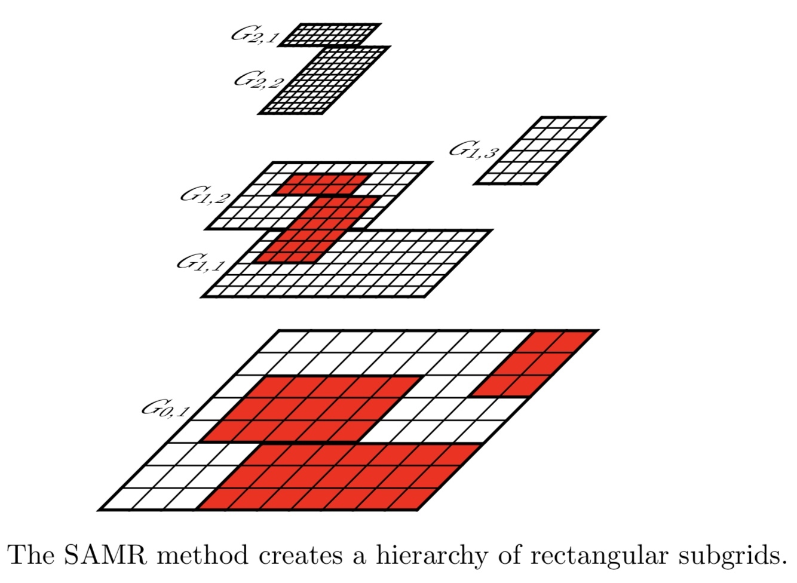

Here we solve the Poisson equation

$$
\Delta \Phi(x)=\rho(x)
$$

where the right hand side $\rho$ is given by

$$
\rho(r)=\left\{\begin{array}{ll}{Q / V } & {r \leq R} \\ {0} & {r>R}\end{array}\right.
$$

## Parameter File

https://www.einsteintoolkit.org/gallery/poisson/poisson.par

### Flesh parameters

```
# Description of this simulation
Cactus::cctk_run_title = "Solving Poisson's equation with CT_MultiLevel (multigrid setup, FMG)"

# Give detailed information for each warning statement
Cactus::cctk_full_warnings         = yes
Cactus::highlight_warning_messages = no

# Give timing information
Cactus::cctk_timer_output          = "off"

# Condition on which to terminate evolution loop
Cactus::terminate       = "any"
Cactus::cctk_initial_time = 0
Cactus::cctk_final_time = 0
# Final iteration number ?
Cactus::cctk_itlast     = 0
```

### Grid Structure

To do so, we first have to construct a numerical grid that covers an interval between $x_{min}$ and $x_{max}$. We then divide the interval $\left[x_{\min }, x_{\max }\right]$ into N gridcells, leading to a gridspacing of

$$
\Delta x=\frac{x_{\max }-x_{\min }}{N}
$$

We can choose our grid points to be located either at the center of these cells, which would be referred to as a cell-centered grid, or on the vertices, which would be referred to as a vertex-centered grid. For a cell-centered grid we have N grid points located at

$$
x_{i}=x_{\min }+(i-1 / 2) \Delta x, \quad i=1, \ldots, N
$$


whereas for a vertex centered grid we have N + 1 gridpoints located a

$$
x_{i}=x_{\min }+(i-1) \Delta x, \quad i=1, \ldots, N+1
$$

For now, the difference between cell-centered and vertex-centered grids only affects the implementation of boundary conditions, but not the finite difference representation of the differential equation itself.


```
ActiveThorns = "Boundary CartGrid3D CoordBase Slab SymBase"

CoordBase::domainsize = "minmax"

CoordBase::xmin =  -1.00
CoordBase::ymin =  -1.00
CoordBase::zmin =  -1.00
CoordBase::xmax =  +1.00
CoordBase::ymax =  +1.00
CoordBase::zmax =  +1.00
CoordBase::dx   =  0.25
CoordBase::dy   =  0.25
CoordBase::dz   =  0.25

CoordBase::boundary_size_x_lower     = 3
CoordBase::boundary_size_y_lower     = 3
CoordBase::boundary_size_z_lower     = 3
CoordBase::boundary_size_x_upper     = 3
CoordBase::boundary_size_y_upper     = 3
CoordBase::boundary_size_z_upper     = 3

CoordBase::boundary_shiftout_x_lower = 1
CoordBase::boundary_shiftout_y_lower = 1
CoordBase::boundary_shiftout_z_lower = 1
CoordBase::boundary_shiftout_x_upper = 1
CoordBase::boundary_shiftout_y_upper = 1
CoordBase::boundary_shiftout_z_upper = 1

CartGrid3D::type = "coordbase"
```

The size of the computational domain is specified through the (xmin, xmax) parameters.

https://arxiv.org/abs/0710.4397


When it is necessary to increase the number of boundary points, then `boundary_size_x_lower` is the only parameter that needs to be changed.


The integer parameter `boundary_shiftout_x_lower` can be used to shift the boundary points outwards (or inwards with negative values) by multiples of the grid spacing.


### Mesh refinement

```
ActiveThorns = "Carpet CarpetLib CarpetInterp LoopControl CarpetReduce CarpetSlab CarpetRegrid2"

# Choose the time step size adaptively
Carpet::adaptive_stepsize = "no"

# Insert barriers between scheduled items
Carpet::schedule_barriers = no

# Output bounding box information to the screen
CarpetLib::output_bboxes  = no


Carpet::init_fill_timelevels = "yes"

# Use the domain description from CoordBase
Carpet::domain_from_coordbase = yes
# Maximum number of refinement levels (including the base level)
Carpet::max_refinement_levels = 6

driver::ghost_size       = 3
Carpet::use_buffer_zones = yes

Carpet::prolongation_order_space = 5
Carpet::prolongation_order_time  = 2

Carpet::convergence_level = 0

Carpet::poison_new_timelevels = yes
CarpetLib::poison_new_memory  = yes
CarpetLib::poison_value       = 250

Carpet::output_timers_every      = 0
```



```
CarpetRegrid2::num_centres  = 5

CarpetRegrid2::num_levels_1 = 6
CarpetRegrid2::position_x_1 = -0.5
CarpetRegrid2::position_y_1 = -0.5
CarpetRegrid2::radius_1[1]  = 5
CarpetRegrid2::radius_1[2]  = 5
CarpetRegrid2::radius_1[3]  = 5
CarpetRegrid2::radius_1[4]  = 5
CarpetRegrid2::radius_1[5]  = 0.4
CarpetRegrid2::radius_1[6]  = 0.4
CarpetRegrid2::radius_1[7]  = 0.4

CarpetRegrid2::num_levels_2 = 6
CarpetRegrid2::position_x_2 = -0.1
CarpetRegrid2::position_y_2 = -0.1
CarpetRegrid2::radius_2[1]  = 5
CarpetRegrid2::radius_2[2]  = 5
CarpetRegrid2::radius_2[3]  = 5
CarpetRegrid2::radius_2[4]  = 5
CarpetRegrid2::radius_2[5]  = 0.2
CarpetRegrid2::radius_2[6]  = 0.2
CarpetRegrid2::radius_2[7]  = 0.2

CarpetRegrid2::num_levels_3 = 6
CarpetRegrid2::position_x_3 = 0.5
CarpetRegrid2::position_y_3 = 0.5
CarpetRegrid2::radius_3[1]  = 5
CarpetRegrid2::radius_3[2]  = 5
CarpetRegrid2::radius_3[3]  = 5
CarpetRegrid2::radius_3[4]  = 5
CarpetRegrid2::radius_3[5]  = 0.2
CarpetRegrid2::radius_3[6]  = 0.2
CarpetRegrid2::radius_3[7]  = 0.2

CarpetRegrid2::num_levels_4 = 6
CarpetRegrid2::position_x_4 = -0.6
CarpetRegrid2::position_y_4 = 0
CarpetRegrid2::radius_4[1]  = 5
CarpetRegrid2::radius_4[2]  = 5
CarpetRegrid2::radius_4[3]  = 5
CarpetRegrid2::radius_4[4]  = 5
CarpetRegrid2::radius_4[5]  = 0.8
CarpetRegrid2::radius_4[6]  = 0.8
CarpetRegrid2::radius_4[7]  = 0.8

CarpetRegrid2::num_levels_5 = 6
CarpetRegrid2::position_x_5 = 0.6
CarpetRegrid2::position_y_5 = -0.3
CarpetRegrid2::radius_5[1]  = 5
CarpetRegrid2::radius_5[2]  = 5
CarpetRegrid2::radius_5[3]  = 5
CarpetRegrid2::radius_5[4]  = 5
CarpetRegrid2::radius_5[5]  = 0.8
CarpetRegrid2::radius_5[6]  = 0.8
CarpetRegrid2::radius_5[7]  = 0.8
```

### CT_MultiLevel

```
ActiveThorns = "CT_MultiLevel CT_Analytic"

CT_MultiLevel::cycle_type          = "FMG cycle"
CT_MultiLevel::tol                 = 1e-12
CT_MultiLevel::omega               = 1
CT_MultiLevel::fd_order            = 4
CT_MultiLevel::output_norms        = "yes"
CT_MultiLevel::nrelsteps_down      = 200
CT_MultiLevel::nrelsteps_up        = 200
CT_MultiLevel::nrelsteps_bottom    = 200
CT_MultiLevel::nrelsteps_top       = 200
CT_MultiLevel::topMGlevel          = 5
CT_MultiLevel::compare_to_exact    = "yes"
CT_MultiLevel::exact_solution_gfname[0] = "CT_Analytic::epsi"
CT_MultiLevel::exact_laplacian_gfname[0] = "CT_Analytic::elaplacian"

CT_MultiLevel::n0[0]               = 0
CT_MultiLevel::inipsi_gfname[0]    = "CT_Analytic::testinipsi"
CT_MultiLevel::cxx_gfname[0]       = "CT_Analytic::testcxx"
CT_MultiLevel::cyy_gfname[0]       = "CT_Analytic::testcyy"
CT_MultiLevel::czz_gfname[0]       = "CT_Analytic::testczz"
CT_MultiLevel::c0_gfname[0]        = "CT_Analytic::testc0"

CT_Analytic::free_data             = "exact"
CT_Analytic::ampG                  = 1
CT_Analytic::amp[0]                = 1
CT_Analytic::x0[0]                 = -0.5
CT_Analytic::y0[0]                 = -0.5
CT_Analytic::sigmax[0]             = 0.2
CT_Analytic::sigmay[0]             = 0.2
CT_Analytic::sigmaz[0]             = 0.2
CT_Analytic::amp[1]                = 1
CT_Analytic::x0[1]                 = -0.1
CT_Analytic::y0[1]                 = -0.1
CT_Analytic::sigmax[1]             = 0.1
CT_Analytic::sigmay[1]             = 0.1
CT_Analytic::sigmaz[1]             = 0.1
CT_Analytic::amp[2]                = 1
CT_Analytic::x0[2]                 = 0.5
CT_Analytic::y0[2]                 = 0.5
CT_Analytic::sigmax[2]             = 0.1
CT_Analytic::sigmay[2]             = 0.1
CT_Analytic::sigmaz[2]             = 0.1
CT_Analytic::amp[3]                = 1
CT_Analytic::x0[3]                 = -0.6
CT_Analytic::y0[3]                 = 0
CT_Analytic::sigmax[3]             = 0.4
CT_Analytic::sigmay[3]             = 0.4
CT_Analytic::sigmaz[3]             = 0.4
CT_Analytic::amp[4]                = 1
CT_Analytic::x0[4]                 = 0.6
CT_Analytic::y0[4]                 = -0.3
CT_Analytic::sigmax[4]             = 0.4
CT_Analytic::sigmay[4]             = 0.4
CT_Analytic::sigmaz[4]             = 0.4

CT_Analytic::other_timelevels      = 3
```

### IO

```
ActiveThorns = "IOUtil


```