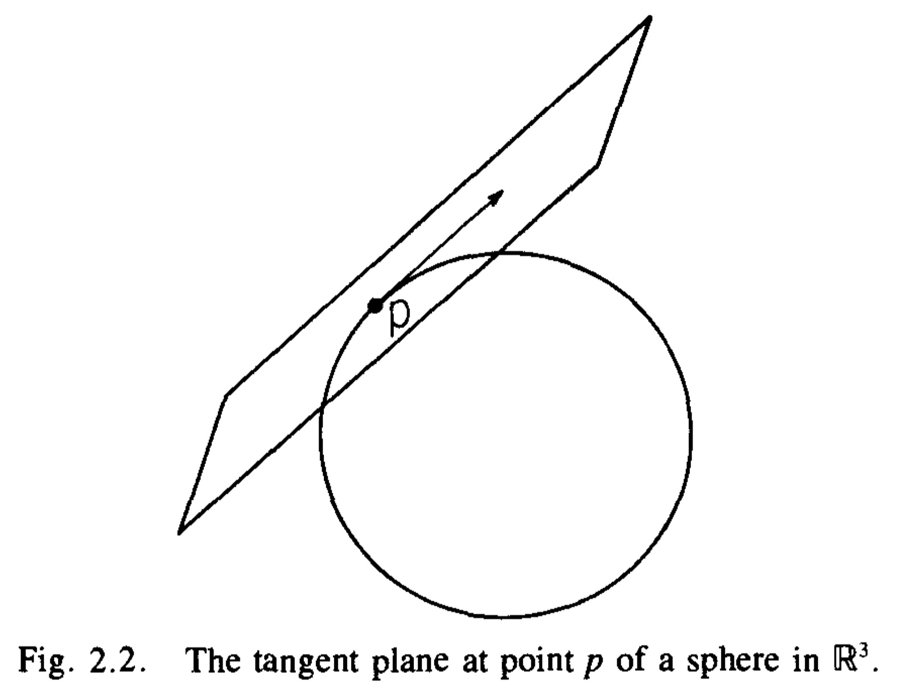
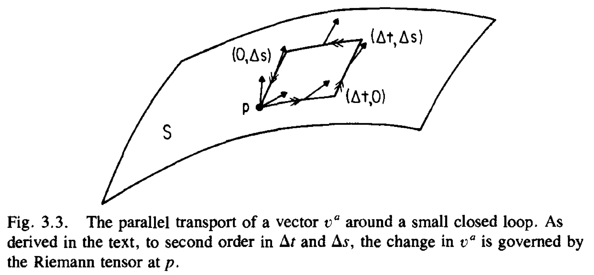
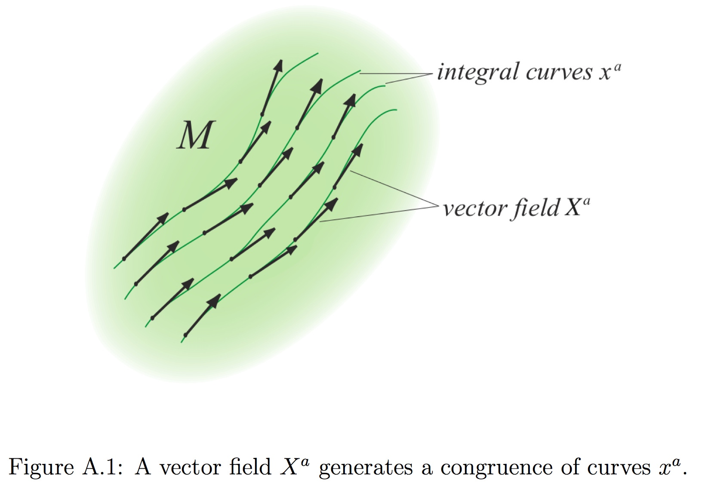
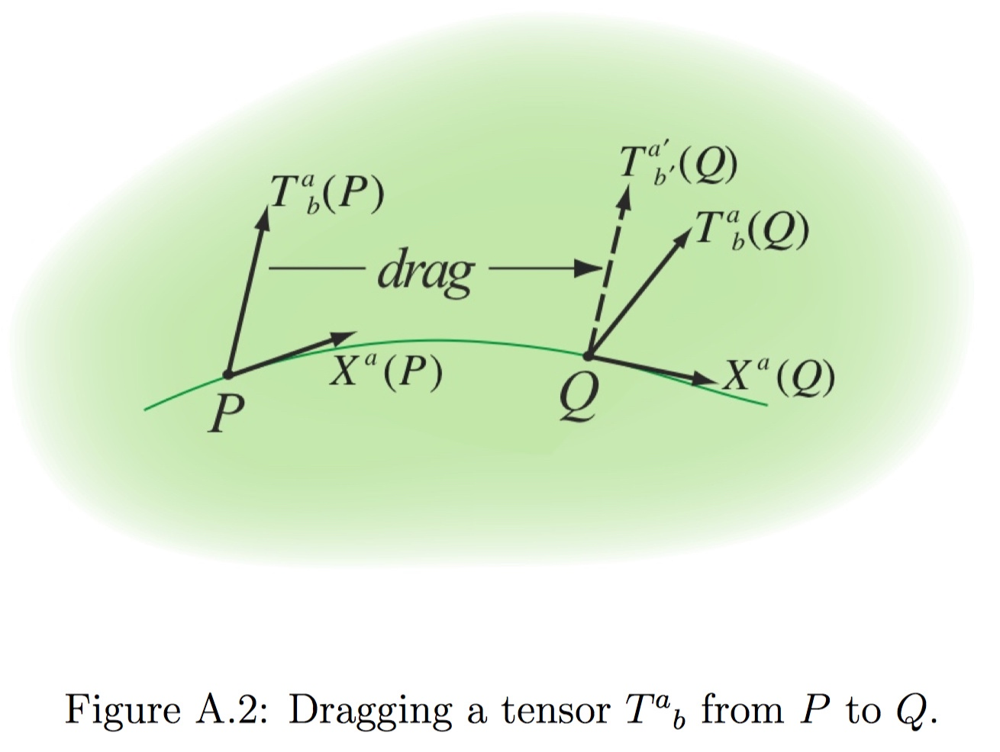

A well-known feature of General Relativity is that space and time are relative but events are absolute. “matter tells spacetime how to curve, and curved spacetime tells matter how to move”.

## Manifolds

### Vectors

We define a tangent vector $\upsilon$ at point $p \in M$ to be a map $\upsilon : \mathcal{F}_M \rightarrow R$

- Linear

$$
\upsilon (a f + b g) = a \upsilon (f) + b \upsilon (g)
$$
	
- Obeys the Leibnitz rule
	
$$
\upsilon (f g) = f(p) \upsilon (g) + g(p) \upsilon (f)
$$

Let M be an n-dimensional manifold. Let $p \in M$ and let $V_p$ denote the tangent space at $p$. Then $dim \space V_p = n$.

If $f \in \mathcal{F}$, For $\mu = 1, ..., n$ define $X_{\mu} : \mathcal{F} \rightarrow R$ by 

$$
X_{\mu}(f):= \frac{\partial f(x)}{\partial x^{\mu}}, \forall f \in \mathcal{F}_M
$$

where $(x^1,  ... , x^n)$ are the Cartesian coordinates of $R^n$. Then $X_1, \cdots, X_n$ are tangent vectors.

An arbitrary tangent vector $\upsilon$ as a sum of the $X_{\mu}$,

$$
\upsilon = \sum^n_{\mu = 1} \upsilon^{\mu} X_{\mu}
$$

### Dual Vector

Let $V$ be any finite-dimensional vector space, linear maps $\omega : V \rightarrow R$ are called dual vectors. 

$$
df|_p(\upsilon) := \upsilon (f),  \space \forall \upsilon \in V_p
$$

If $\frac{\partial}{\partial x^{\nu}}$ is a basis of $V$, we can define elements $dx^{\mu}$

$$
dx^{\mu}(\frac{\partial}{\partial x^{\nu}}) = \frac{\partial}{\partial x^{\nu}}(x^{\mu}) = \delta^{\mu}_{\nu}
$$

${dx^{\mu}}$ is a basis of $V^{*}$. 

### Derivative Operators

A derivative operator, $\nabla$, (sometimes called a covariant derivative) on a manifold $M$ is a map which takes each smooth tensor field of type $(k, l)$ to a smooth tensor field of type $(k, l + 1)$.
Any tow derivative operators $\nabla_a$ and $\tilde{\nabla}_a$ must agree in their action on scalar fields. 

$$
\nabla_a f = \tilde{\nabla}_a f = (df)_a, \forall f \in \cal{F}_M
$$

$\tilde{\nabla}_a - \nabla_a$ defines a map of dual vectors at $p$ to tensors of type $(0, 2)$ at $p$. Consequently $(\tilde{\nabla}_a - \nabla_a)$ defines a tensor of type $(1, 2)$ at $p$, which we will denote as $C^c_{\space ab}$.

$$
\nabla_a \omega_b = \tilde{\nabla}_a \omega_b - C^{c}_{ab} \omega_c
$$

$C^c_{\space ab}$ must also have this property 

$$
C^c_{\space ab} = C^c_{\space ba}     \\
\nabla_a \upsilon^b = C^b_{\space ac} \upsilon^c + \tilde{\nabla}_a \upsilon^b       \\
\nabla_a T^b_{c} = \tilde{\nabla}_a T^b_c + C^b_{\space ad} T^d_c - C^{d}_{\space ac} T^b_d
$$

This displays the possible disagreements of the actions of $\nabla_a$ and $\tilde{\nabla}_a$ on Tensor.

### Parallel Transport

Given a derivative operator $\nabla_a$ we can define the notion of the parallel transport of a vector along a curve $C$ with a tangent $T^a$. A vector $\upsilon^a$ given at each point on the curve is said to be parallel transported as one moves along the curve if the equation 

$$
T^b \nabla_b \upsilon^a = 0
$$

is satisfied along the curve.

Given two vectors $u^a$ and $\upsilon^a$, we demand that their inner product $g_{ab} u^a \upsilon^a$ remain unchanged if we parallel-transport them along any curve. Thus we require 

$$
0 = T^c \nabla_c (g_{ab} u^a \upsilon^b) = g_{ab} u^a T^c \nabla_c (\upsilon^b) + g_{ab} \upsilon^b T^c \nabla_c (u^a) + u^a \upsilon^b T^c \nabla_c (g_{ab})
$$

Equation will hold for all curves and parallel transported vectors if and only if

$$
\nabla_c (g_{ab}) = 0
$$

which is the additional condition we wish to impose on $\nabla_a$.
We attempt to solve for $C^c_{\space ab}$ so that the derivative operator determined by $\tilde{\nabla}_a$ and $C^c_{\space ab}$ will satisfy the required property. 

$$
C^c_{\space ab} = \frac{1}{2} g^{cd} (\partial_a g_{bd} + \partial_b g_{ad} - \partial_d g_{ab})
$$

### Curvature

Given a derivative operator, there exists a notion of how to parallel transport a vector from p to q along a curve C. However, the vector in $V_q$ which we get by this parallel transport procedure starting from a vector in $V_p$ will, in general, depend on the choice of curve connecting them. We can use the path dependence of parallel transport to define an intrinsic notion of curvature. The failure of a vector to return to its original value when parallel transported around a small closed loop is governed by the Riemann tensor.

$(\nabla_a \nabla_b  - \nabla_b \nabla_a)$ defines a linear map dual vectors at $p$ to type $(0, 3)$ tensors at $p$, its action is that of a tensor of $(1, 3)$. Thus, we have shown that there exists a tensor field $R_{abc}^{\space \space \space d}$ such that for all dual vector fields $\omega_c$, we have

$$
\nabla_a \nabla_b \omega_c - \nabla_b \nabla_a \omega_c = R_{abc}^{\space \space \space d} \omega_c
$$

Properties of the Riemann tensor:

1. $R_{abc}^{\space \space \space d} = - R_{bac}^{\space \space \space d}$
2. $R_{[abc]}^{\space \space \space \space \space d} = 0$
3. $R_{abcd} = - R_{abdc}$
4. $\nabla_{[a}R_{bc]d}^{\space \space \space e} = 0​$
5. $R_{abcd} = R_{cdab}$

Its trace over the second and fourth (or equivalently, the first and third) indices defines the Ricci tensor, $R_{ac}$,

$$
R_{ac} = R_{abc}^{\space \space \space b}
$$

The scalar curvature, R, is defined as the trace of the Ricci tensor:

$$
R = R_a^{\space a}
$$

We denote the symmetric and antisymmetric parts of a tensor with brackets () and [] around indices in the usual way. For example

$$
T_{(ab)} = \frac{1}{2} (T_{ab} + T_{ba})  \\
T_{[ab]} = \frac{1}{2} (T_{ab} - T_{ba})
$$

To calculate the curvature by the coordinate component method, we begin by choosing a coordinate system. We express the derivative operator $\nabla_a$ in terms of the ordinary derivative $\partial_a$ of this coordinate system and the Christoffel symbol $\Gamma^c_{\space ab}$.

$$
R_{\mu \nu \rho}^{\space \space \space \sigma} = \frac{\partial}{\partial x^{\nu}} \Gamma^{\sigma}_{\space \mu \rho} - \frac{\partial}{\partial x^{\mu}} \Gamma^{\sigma}_{\space \nu \rho} + \sum_a (\Gamma^{a}_{\space \mu \rho} \Gamma^{\sigma}_{\space a \nu} - \Gamma^{a}_{\space \nu \rho} \Gamma^{\sigma}_{\space a \mu})
$$

Thus, to calculate $R_{\mu \nu \rho}^{\space \space \space \sigma}​$starting from $g_{ab}​$, we first obtain the components, $g_{\mu \nu}​$, of the metric in our coordinate basis. We then calculate $\Gamma^{\sigma}_{\space \mu \nu}​$. Finally we calculate the components $R_{\mu \nu \rho}^{\space \space \space \sigma}​$.

### The Lie Derivative

Consider a (non-zero) vector field $X^{a}$ in a manifold $M$. We can find the integral curves $x^a(\lambda)$ (or orbits, or trajectories) of $X$ a by integrating the ordinary differential equations

$$
\frac{dx^{a}}{d \lambda} = X^a (x^a(\lambda))
$$

Here $\lambda​$ is some affine parameter.

We would now like to define a derivative of a tensor field. This involves comparing the tensor field at two different points along $X^a$, say $P$ and $Q$, and taking the limit as $Q$ tends to $P$. This is where we encounter a conceptual problem: what do we mean by comparing two tensors at two different locations in the manifold M?

In order to differentiate a tensor in a tensorial manner, we therefore have to evaluate the two tensors at the same point. To do so, we have to drag one tensor to the other point before we can compare the two tensors.

However, this recipe still leaves open how we drag $T^a_{\space b}$ along $X^a$. One approach would be to parallel-transport the tensor $T^a_{\space b}$ from $P$ to $Q$. This idea leads to the definition of the covariant derivative.

Parallel-transporting is not the only way of dragging $T^a_{\space b}$ along $X^a$. In other words, **the Lie derivative along a vector field $X^a$ measures by how much the changes in a tensor field along $X^a$ differ from a mere infinitesimal coordinate transformation generated by $X^a$.** Unlike the covariant derivative, the Lie derivative does not require an affine connection, and hence requires less structure.
For a scalar $f$, the Lie derivative naturally reduces to the partial derivative

$$
L_X f = X^b \nabla_b f = X^b \partial_b f
$$

Note that the Lie derivative satisfies the Leibnitz rule for outer products.

$$
L_X \upsilon^a = X^b \nabla_b \upsilon^a - \upsilon^b \nabla_b X^a = [X, \upsilon]^a       \\
L_X \omega_a = X^b \nabla_b \omega_a + \omega_b \nabla_a X^b
$$

### Killing Vectors

As an important application, consider the Lie derivative along $X^a$ of a metric $g_{ab}$.

$$
L_X g_{ab} = X^c \nabla_c g_{ab} + g_{cb} \nabla_a X^c + g_{ca} \nabla_b X^c
$$

If $\nabla_a$ is compatible with the metric, the first term vanishes, and we 

$$
L_X g_{ab} = \nabla_a X_b + \nabla_b X_a
$$

A Killing vector field $\xi^a$ can now be defined by

$$
L_{\xi} g_{ab} = 0
$$

In other words, a Killing field $\xi_a$ generates an isometry of the spacetime, and a displacement along $\xi^a$ leaves the metric invariant. 

Killing's equation

$$
\nabla^a X^b + \nabla^b X^a = 0
$$

In some cases it is very easy to identify a Killing vector. If the metric components are independent of a coordinate $x^i$, then it follows from the property that the coordinate basis vector $e^a$ is a Killing vector.
