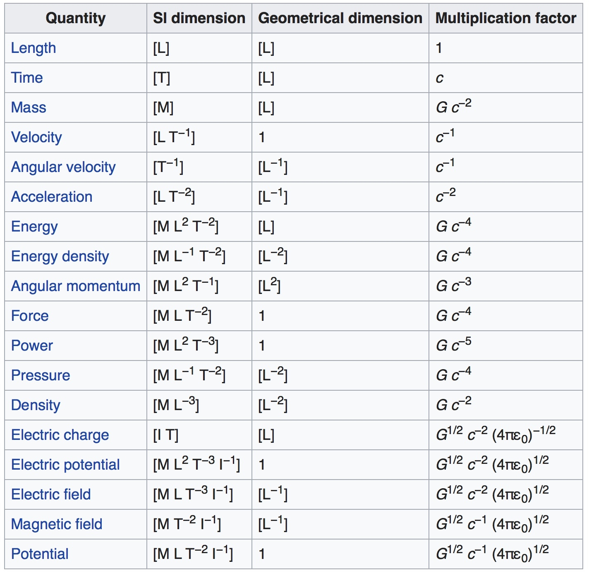
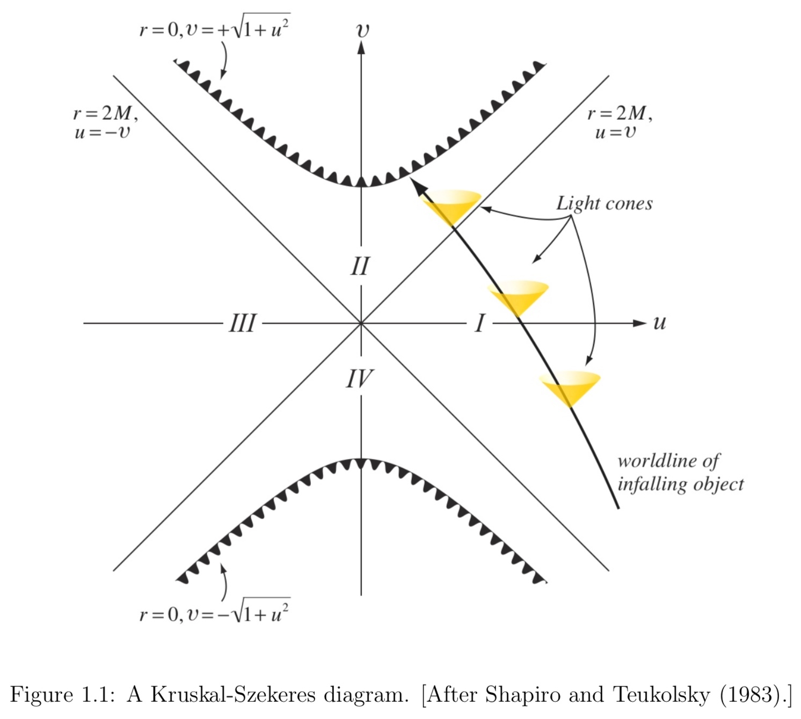

We will use geometric units. In these units, the speed of light, c, and Newton’s constant G, are taken to be 1. A consequence of this is that distances, time intervals, masses, and energy all have the same units. By convention, the unit of each of these is denoted by an arbitrary mass M.

The geometry of a spacetime can be entirely described by a line element $\mathrm{d} s^{2}$. In Minkowski spacetime, in Cartesian coordinates, the line element takes the form

$$
\mathrm{d} s^{2}=-\mathrm{d} t^{2}+\mathrm{d} x^{2}+\mathrm{d} y^{2}+\mathrm{d} z^{2}
$$

Note that $\mathrm{d} s^{2}$ is not necessarily positive. **For timelike paths, the proper time along the path is given by the integral of** $\mathrm{d} \tau=\sqrt{-\mathrm{d} s^{2}}$.

Equation can be written as

$$
\mathrm{d} s^{2}=\eta_{\mu \nu} \mathrm{d} x^{\mu} \mathrm{d} x^{\nu}
$$

where $x^{\mu}=(t, x, y, z)$ and the components of the symmetric tensor $\eta_{\mu \nu}$ are given by $\operatorname{diag}(-1,1,1,1)$. Here we used two standard conventions, the timelike coordinate is listed first and repeated Greek indices are summed over. By convention, the index of the timelike coordinate is 0, while the spatial coordinates have indices 1, 2, 3.

A geodesic is the generalization of a straight line in Euclidean space. In Cartesian coordinates, the tangent vector to a straight line is a constant. This can be expressed as

$$
\begin{array}{l}{t^{\mu}=\frac{\mathrm{d}}{\mathrm{d} \lambda} x^{\mu}(\lambda)} \\ {\frac{\mathrm{d}}{\mathrm{d} \lambda} t^{\mu}(\lambda)=0}\end{array}
$$

where $t^{\nu}$ is the tangent vector to the line and $x^{\mu}(\lambda)$ are the Cartesian coordinates of each point of the line.

The equation for a geodesic in arbitrary coordinates, as well as flat and non-flat metrics, is

$$
\begin{array}{c}{\frac{\mathrm{d}}{\mathrm{d} \lambda} x^{\mu}(\lambda)=t^{\mu}(\lambda)} \\ {t^{\mu} \nabla_{\mu} t^{\nu}=0}\end{array}
$$

General relativity extends the notion of spacetime to include non-flat metrics, where

$$
G_{\mu \nu}=8 \pi T_{\mu \nu}
$$

and $T_{\mu \nu}$ is the stress energy tensor, a measure of the total energy and momentum flux from matter and non-gravitational interactions and radiation.

### Evolution of matter sources

In general relativity, the curvature of spacetime possess its own dynamics, and indeed one of the most important phenomena treated by numerical relativity, the merger of two black holes, is a vacuum problem. That is, $T_{\mu \nu}=0$. Numerical relativity is also used to study phenomena involving matter flows in strongly-curved dynamical spacetimes. Two problems where such relativistic effects should be particularly important are compact object mergers involving neutron stars and the formation of black holes by stellar collapse.

Matter and energy constitute the stress-energy tensor $T_{\mu \nu}$ that is the source term in Einstein equations. The energy and momentum conservation equations

$$
\nabla_{\mu} T^{\mu \nu}=0
$$

provide evolution equations for the matter.

Perfect fluid mean the mean free path is very small compared to the system’s scale, making the collection a fluid, and viscosity and heat transport are small enough to be ignored. This fluid will have a stress tensor

$$
T_{\mu \nu}^{\mathrm{gas}}=\left(\rho_{0}+u+P\right) u_{\mu} u_{\nu}+P g_{\mu \nu}
$$

where $\rho_{0}$, $u$, $P$ and $u_{\mu}$ are the rest mass density, internal energy, pressure, and 4-velocity. (Note $\rho_{0}$ must be distinguished from the total energy density $\rho=\rho_{0}+u$)

## Black Hole

A black hole is defined as a region of spacetime from which no null geodesic can escape to infinity. The surface of a black hole, the event horizon, acts as a one-way membrane through which light and matter can enter the black hole, but once inside, can never escape. It is the boundary in spacetime separating those events that can emit light rays that can propagate to infinity and those which cannot. More precisely, the event horizon is defined as the boundary of the causal past of future null infinity. It is a 2 + 1 dimensional hypersurface in spacetime formed by those outward-going, future-directed null geodesics that neither escape to infinity nor fall toward the center of the black hole. The event horizon is a gauge-invariant entity, and contains important geometric information about a black hole spacetime.

The most general stationary black hole solution to Einstein’s equations is the analytically known Kerr-Newman metric. It is uniquely specified by just three parameters: **the mass M, angular momentum J and the charge Q of the black hole**. Special cases are the Kerr metric (Q = 0), the Reissner-Nordstrom metric (J = 0) and the Schwarzschild metric (J = 0, Q = 0).

Perhaps one of the most interesting predictions of general relativity is the existence of black holes. A black hole can be completely described by two parameters: its mass and spin. In geometric units the magnitude of the spin angular momentum S is bounded by the mass m, where $S<m^{2}$. Typically one defines a specific spin a, where $a=S / m$ and a dimensionless spin $\chi$, where $\chi=S / m^{2}$.

If the black hole is non-spinning, it is known as a Schwarzschild black hole, and if S is non-zero, it is known as a Kerr black hole.

A black hole has no material surface, of course, but there is a boundary separating the region from which it is impossible ever to escape (the black hole interior) to the outside universe. This boundary is called the event horizon. In practice, numerical relativists find event horizons by evolving a cluster of null geodesics. We will see that some methods of numerically handling black hole interiors (excision methods) require some knowledge of the horizon location during the simulation. For these purposes, numerical relativists use the apparent horizon. Apparent horizons are two-dimensional surfaces that may exist at each time in a numerical simulation. They are defined to be surfaces from which outward-pointing null rays do not expand. This very unusual situation can only occur in the vicinity of a black hole, but finding such surfaces only requires information about the metric and extrinsic curvature at a given time. For a stationary black hole, the apparent horizon will coincide with the event horizon; in a dynamical spacetime, it will be inside the event horizon.

### Schwarzschild Black Holes

The Schwarzschild solution for a vacuum spherical spacetime may be written as

$$
d s ^ { 2 } = - \left( 1 - \frac { 2 M } { r } \right) d t ^ { 2 } + \left( 1 - \frac { 2 M } { r } \right) ^ { - 1 } d r ^ { 2 } + r ^ { 2 } d \theta ^ { 2 } + r ^ { 2 } \sin ^ { 2 } \theta d \phi ^ { 2 }
$$

The black hole event horizon is located at $r = 2M$ and is sometimes called the Schwarzschild radius. It is also referred to as the “static limit”, because static observers cannot exist inside $r = 2M$, and the “surface of infinite redshift”, because photons emitted by a static source just outside $r = 2M$ will have infinite wavelength when measured by a static observer at infinity. Circular orbits of test particles exist down to $r = 3M$.

**The singularity in the metric at $r = 2M$ is a coordinate singularity, removable by coordinate transformation**, while the singularity at $r = 0$ is a physical spacetime singularity. In fact, the curvature invariant

$$
I \equiv {}^ { ( 4 ) } R _ { a b c d } {}^ { ( 4 ) } R ^ { a b c d } = 48 M ^ { 2 } / r ^ { 6 }
$$

clearly blows up at the origin, showing that the tidal gravitational field becomes infinite at the center of the black hole.

!!! note
    One alternative coordinate choice that removes the coordinate singularity at $r = 2M$ is the Kruskal-Szekeres coordinate system.
    
    $$
    d s ^ { 2 } = \frac { 32 M ^ { 3 } } { r } e ^ { - r / 2 M } \left( - d v ^ { 2 } + d u ^ { 2 } \right) + r ^ { 2 } d \theta ^ { 2 } + r ^ { 2 } \sin ^ { 2 } \theta d \phi ^ { 2 }
    $$
    
    The original Schwarzschild coordinate system covers only half of the spacetime manifold, while Kruskal-Szekeres coordinates cover the entire manifold.
    
    

### Kerr Black Holes

The solution to Einstein’s equations describing a stationary, rotating, uncharged black hole of mass M and angular momentum J in vacuum may be expressed in Boyer-Lindquist coordinates in the form

$$
d s ^ { 2 } = - \left( 1 - \frac { 2 M r } { \Sigma } \right) d t ^ { 2 } - \frac { 4 a M r \sin ^ { 2 } \theta } { \Sigma } d t d \phi + \frac { \Sigma } { \Delta } d r ^ { 2 } + \Sigma d \theta ^ { 2 } + \left( r ^ { 2 } + a ^ { 2 } + \frac { 2 a ^ { 2 } M r \sin ^ { 2 } \theta } { \Sigma } \right) \sin ^ { 2 } \theta d \phi ^ { 2 }
$$

where

$$
a \equiv J / M , \quad \Delta \equiv r ^ { 2 } - 2 M r + a ^ { 2 } , \quad \Sigma \equiv r ^ { 2 } + a ^ { 2 } \cos ^ { 2 } \theta
$$

The horizon of the black hole is located at $r_+$, the largest root of the equation $∆ = 0$,

$$
r _ { + } = M + \left( M ^ { 2 } - a ^ { 2 } \right) ^ { 1 / 2 }
$$

The static limit is the surface within which no static observers exist; it resides at $r_0$, the largest root of $g_{tt} = 0$:

$$
r _ { 0 } = M + \left( M ^ { 2 } - a ^ { 2 } \cos ^ { 2 } \theta \right) ^ { 1 / 2 }
$$

The region between the horizon and static limit is called the ergosphere; in this region all time-like observers are dragged around the hole with angular velocity $Ω > 0$.

### Innermost stable circular orbit

The **Innermost stable circular orbit** (often called the **ISCO**) is the smallest circular orbit in which a test particle can stably orbit a massive object in general relativity. The location of the ISCO, the ISCO-radius ($r_{isco}$), depends on the angular momentum (spin) of the central object.

The ISCO plays an important role in black hole accretion disks since it marks **the inner edge of the disk**.

- For a non-spinning massive object, the ISCO is located at,

$$
r_{isco} = \frac{6 G M}{c^2} = 3 R_S
$$
	
- For a rotating black holes

### Global Theorems

In an isolated system, the sum of the surface areas of all black holes can never decrease.

#### Schwarzschild black hole

The fact that the event horizon area cannot decrease motivates the definition of the irreducible mass

$$
M_{irr} = (\frac{\mathcal{A}}{16 \pi})^{\frac{1}{2}}
$$

The definition then implies that the irreducible mass of the black hole cannot decrease, which motivates its name.

The area theorem can be used to place a strict upper limit on the amount of energy that is emitted in gravitational radiation in black hole collisions.

!!! example
    Consider two widely separated, non-rotating black holes of masses $M_1$ and $M_2$, initially at rest with respect to some distant observer. Use the area theorem to find an upper limit on the energy emitted in gravitational radiation that arises from the head-on collision of the two black holes. Verify that for equal mass black holes at most 29% of the total initial energy can be emitted in gravitational radiation.
    
#### Kerr black holes

Given the irreducible mass $M_{irr}$ and the angular momentum J of an isolated, stationary black hole, we can compute the Kerr mass M ($= M_{ADM}$) from

$$
M^2 = M^2_{irr} + \frac{1}{4} \frac{J^2}{M^2_{irr}}
$$

According to the area theorem, only the rotational energy contribution can be tapped as a source of energy by an external system interacting with the hole, since the irreducible mass can never decrease.

## Alternative Theories of Gravity
The simplest scenario that one could consider in this context is the addition of an extra scalar field, but one might also choose to consider extra vectors, tensors, or even higher rank fields. Of course, the effect of such additional field needs to be suppressed at scales where General Relativity has been well tested, such as **in the lab or solar system**.

### Scalar-Tensor Theories

A general form of the scalar-tensor theory can be derived from the **Lagrangian density**

$$
\mathcal{L}=\frac{1}{16 \pi } \sqrt{-g} \left[ f\left( \phi \right) R-g\left( \phi \right) \nabla _{\mu }\phi \nabla ^{\mu }\phi -2\Lambda \left( \phi \right) \right] +\mathcal{L}_{m}\left( \psi ,h\left( \phi \right) g_{\mu \nu}\right) 
$$

$\mathcal{L}_m$ is the Lagrangian density of the matter fields $\psi$.
