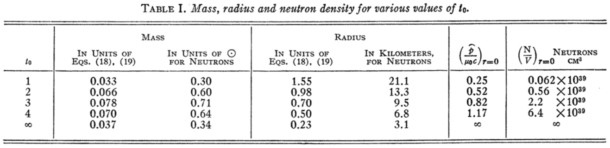
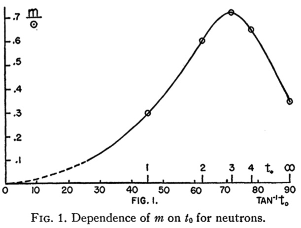
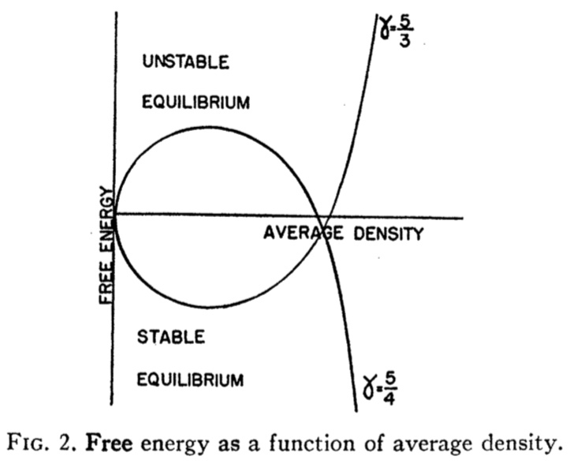
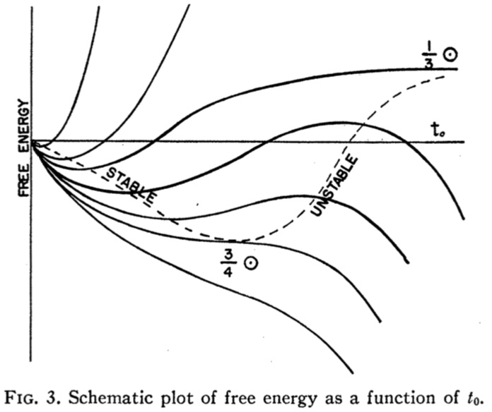

## The gravitational equilibrium of masses of neutrons[^1]

We study the gravitational equilibrium of masses of neutrons, **using the equation of state for a cold Fermi gas, and general relativity**. 

??? note "Whether there is an upper limit to the possible size of such a neutron core?"
    Landau showed that for a model consisting of a cold degenerate Fermi gas there exist no stable equilibrium configurations for masses greater than a certain critical mass, all larger masses tending to collapse.

### Relativistic Treatment Of Equilibrium

The most general static line element exhibiting spherical symmetry may be expressed in the form

$$
ds^2 = - e^{\lambda} dr^2 - r^2 d \theta^2 - r^2 sin^2 \theta d \phi^2 + e^{\nu} dt^2 \\
\lambda = \lambda (r), \nu = \nu (r).
$$

If the matter supports no transverse stresses and has no mass motion, then its energy momentum tensor is given by

$$
T^{\space 1}_{1} = T^{\space 2}_{2} = T^{\space 3}_{3} = - P, \space T^{\space 4}_{4} = \rho
$$

where p and $\rho$ are respectively the pressure and the macroscopic energy density measured in proper coordinates. 

The cosmological constant $\Lambda$ taken equal to zero, Einstein's field equations reduce to:

$$
8 \pi P = e^{-\lambda} (\frac{\nu'}{r} + \frac{1}{r^2}) - \frac{1}{r^2} \\
8 \pi \rho = e^{-\lambda} (\frac{\lambda'}{r} - \frac{1}{r^2}) + \frac{1}{r^2} \\
\frac{dP}{dr} = - \frac{(P + \rho)}{2} \nu'
$$

where primes denote differentiation with respect to r.

These three equations together with the equation of state of the material $\rho = \rho (P)$ determine the mechanical equilibrium of the matter distribution.

The boundary of the matter distribution is the value of $r = r_b$ for which $P = 0$, and such that for value $r < r_b$ where $P > O$.

In empty space surrounding the spherically symmetric distribution of matter $P = \rho = 0$, and Schwarzschild's exterior solution is obtained:

$$
e^{-\lambda} = 1 + \frac{A}{r} \\
e^{\nu} = B (1 + \frac{A}{r})
$$

The constants A and 8 are fixed by the requirement that at great distances away from the matter distribution the $g_{\mu \nu}$ must go over into their weak-field form, i.e., $B = 1$, $A = - 2m$ where
m is the total Newtonian mass of the matter as calculated by a distant observer. 

Further introduce a new variable

$$
u(r) = \frac{1}{2} r (1 - e^{-\lambda})
$$

Then above equations becomes:

$$
e^{\nu(r)} = (1 - \frac{2m}{r_b}) e^{- \int_0^{P(r)} \frac{2dP}{P + \rho(P)}} \\
\frac{du}{dr} = 4 \pi \rho(P) r^2 \\   
\frac{dP}{dr} = - \frac{P + \rho(P)}{r(r - 2 u)}(4 \pi P r^3 + u)
$$

From this equation we can see that u is very similar to m.

Starting with some initial values $u = u_0$, $P = P_0$ at $r = 0$, the two equations are integrated simultaneously to the value $r = r_b$ where $P = O$, until the boundary of the matter distribution is reached. The value of $u = u_b$ at $r = r_b$ determines the value of $e^{\lambda(r_b)}$ at the boundary, and this is joined continuously across the boundary to the exterior solution, making

$$
u_b = m
$$

Thus the mass of this spherical distribution of matter as measured by a distant observer is given by the value $u_b$ of u at $r = r_b$.

The following restrictions must be made on the choice of $P_0$ and $u_0$, the initial values of P and u at $r = 0$.

### Particular Equations Of State

The above arguments show that $\frac{du}{dr}$ and $\frac{dP}{dr}$ together with a given equation of state completely determine the distribution of matter.

If the matter is taken to consist of particles of rest mass $\mu_0$ obeying Fermi statistics, and their thermal energy and all forces between them are neglected, then it may be shown that a parametric form for the equation of state is:

$$
\rho = K (sinht - t) \\
P = \frac{1}{3} K (sinht - 8 sinh(\frac{1}{2}t) + 3 t)
$$

where 

$$
K = \frac{\pi \mu_0^4 c^5}{4 h^3} \\
t = 4 log(\frac{\widehat{P}}{\mu_0 c} + [1 + (\frac{\widehat{P}}{\mu_0 c})^2]^{\frac{1}{2}})
$$

where $\widehat{P}$ is the maximum momentum in the Fermi distribution and is related to the proper particle density $\frac{N}{V}$ by

$$
\frac{N}{V} = \frac{8 \pi}{3 h^3} \widehat{P}^3
$$

the uncertainty of a particle in space is $\frac{V}{N}$, and the uncertainty in momentum space is $2\frac{4 \pi}{3} \widehat{P}^3$. so $\frac{V}{N} \times 2\frac{4 \pi}{3} \widehat{P}^3 = h^3$.

The above equations become:

$$
\frac{du}{dr} = 4 \pi r^2 K (sinht - t) \\
\frac{dt}{dr} = - \frac{4}{r(r - 2u)} \frac{sinht - 2 sinh(\frac{1}{2}t)}{cosht - 4 cosh(\frac{1}{2}t) + 3}[\frac{4}{3} \pi K r^3 (sinht - 8 sinh(\frac{1}{2}t) + 3t) + u]
$$

These equations are to be integrated from the values $u = 0$, $t = t_0$ at $r = 0$ to $r = r_b$ where $t_b = 0$ (which makes $P = 0$), and $u = u_0$.

No way was found to carry out the integration analytically, so equations were integrated numerically for several finite values of $t_0$. For all these cases $u_0$ was taken to be equal to zero, since the equation of state near the origin for finite $t_0$ behaves like $\rho(P) = K P^s$, $s < 1$.

- For very small values of t the equation of state reduces to $P = K \rho^{\frac{5}{3}}$ and $\widehat{P} \propto t$. Using this equation of state and Newtonian gravitational theory (which is expected to give a good result for small masses and densities), one finds that $m \propto t^{\frac{3}{2}}$.
- Foe $t_0 \to \infty$, Equation may be replaced by their expressions:

    $$
    \frac{du}{dr} = \frac{1}{2} r^2 e^t \\
    \frac{dt}{dr} = - \frac{4}{r(r - 2u)} (\frac{r^3}{6}e^t + u)
    $$

    An exact solution of these equations is:
    
    $$
    e^t = \frac{3}{7r^2} \\
    u = \frac{3r}{14}
    $$
    
    Then the mass carried out to $r = r_b$ where $t = 0$.
    
**The striking feature of the curve is that the mass increases with increasing $t_0$ until a maximum is reached at about $t_0 =3$, after which the curve drops until a value roughly $\frac{1}{3} \odot$ is reached for $t_0 = \infty$. In other words no static solutions at all exist for $m > \frac{3}{4} \odot$, two solutions exist for all m in $\frac{3}{4} \odot > m > \frac{1}{3} \odot$, and one solution exists for all $m < \frac{1}{3} \odot$.**

## Free Energy

In the non-relativistic polytrope solutions of Emden the equation of state was assumed to be $P = K \rho^{\gamma}$. But Landau pointed out that although these solutions in $\gamma > \frac{6}{5}$ give an equilibrium configuration, they do not in every case give stable equilibrium. Thus, unless $\gamma >frac{4}{3}$ the equilibrium configuration is unstable.

The part of the free energy caused by compression is 

$$
F = - a \rho^{\frac{1}{3}} + b \rho^{\gamma - 1}
$$

Polytrope solutions exist for $\gamma = \frac{5}{3} (> \frac{4}{3})$ corresponds to stable equilibrium, for $\gamma = \frac{5}{4} (< \frac{4}{3})$ to unstable equilibrium.

Since the free energy must be a continuous function of $t_0$, and since we know from non-relativistic calculations that for small masses (and low densities) we have a position of stable equilibrium (a minimum in the free energy curve) we can conclude that the second equilibrium position corresponds either to a maximum or to an inflection point in the free energy curve (and certainly not to a minimum). 

 
Fig. 3 gives a schematic plot of free energy against $t_0$ for different values of $M_0$ which would explain the existence of one equilibrium position for small masses, two for intermediate masses, and none for large masses. The masses marked on the curves are the actual gravitational masses corresponding to the equilibrium points of the critical free energy curves.

## Application To Stellar Matter

Since neutron cores can **hardly be stable (with respect to formation of electrons and nuclei) for masses less than $\sim 0.1 M_{\odot}$**. Since, even after thermonuclear sources of energy are exhausted, they will** not tend to form by collapse of ordinary matter for masses under $1.5 M_{\odot}$ (Landau's limit)**. It seems **unlikely that static neutron cores can play any great part in stellar evolution**, and the question of what happens, after energy sources are exhausted, to **stars of mass greater than $1.5 M_{\odot}$ still remains unanswered**. 

There would then seem to be only two answers possible to the question of the "final" behavior of very massive stars: 

- The equation of state we have used so far fails to describe the behavior of highly condensed matter that the conclusions reached above are qualitatively misleading
- The star will continue to contract indefinitely, never reaching equilibrium. 

## Non-static Solutions

From this discussion it appears probable that for an understanding of the long time behavior of actual heavy stars a consideration of non-static solutions must be essential. Among all (spherical) non-static solutions one would hope to find some for which the rate of contraction, and in general the time variation, become slower and slower, so that these solutions might be regarded, not as equilibrium solutions, but as quasi-static. Some reason for this we may see in the following argument: for large enough mass the core will collapse; near the center the density and pressure will grow, and $g_{tt} = e^{\nu}$ will be small; and as $e^{\nu}$ grows smaller, all processes will, as seen by an outside observer, slow down in the central region.

[^1]: [Oppenheimer(1939) On Massive Neutron Cores](https://doi.org/10.1103/PhysRev.55.374)