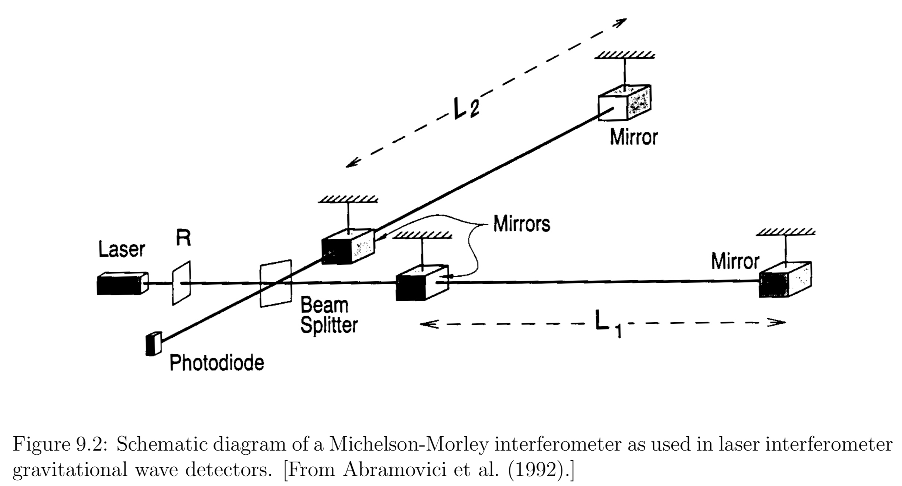
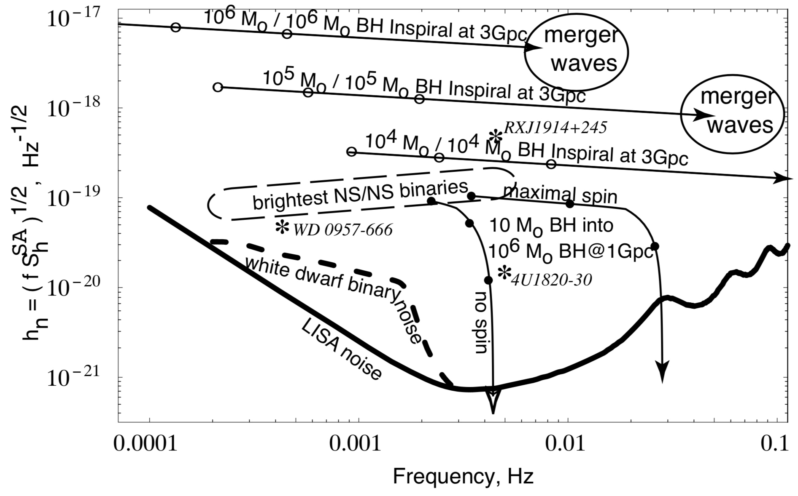

One of the major motivations for performing numerical relativity simulations is the accurate calculation of gravitational waveforms from promising sources in order that these theoretically computed signals can be compared with observational data from gravitational wave detectors.

## Gravitational wave detection

In many ways, ==gravitational wave detection is more like hearing than seeing.== In most other astronomical observations we detect photons, which behave very differently from their gravitational analogs. Photons typically have wavelengths that are much shorter than the emitting object, so that we can create images. Gravitational waves, on the other hand, have wavelengths that are larger than or at least comparable to the size of the emitting object. **That means that we cannot use gravitational waves to create an image of the emitting object.** In analogy to hearing we cannot even locate a gravitational wave source in the sky with just one detector. This makes it **so important to operate a number of different gravitational wave detectors, spread far apart over the Earth or in space.**

Gravitational wave detectors measure gravitational amplitudes directly, as a function of time, and this measurement can be compared with theoretical models. In addition, “matched-filtering” techniques – in which **the noisy** output of the detector **is compared with a catalog of theoretical gravitational waveform templates** – dramatically increase the likelihood of identifying a particular signal. Using this technique, the distance out to which an object can be observed ==increases approximately with the square root of the number of wave cycles==.

**Ground-based gravitational wave interferometers**
___

The high frequency band includes frequencies in the approximate range $1 \mathrm { Hz } \lesssim f \lesssim 10 ^ { 4 } \mathrm { Hz }$. This frequency band is observable with the new generation of ground-based gravitational wave interferometers.

A passing gravitational wave will distort the relative length of the two arms, and will therefore modify the interference pattern of the two returning light beams.

!!! note "gravitational wave strain"
    The effect of a passing gravitational wave on two nearby, freely-falling test particles at a spatial separation $\xi ^ { i }$ is to change their separation according to
    
    $$
    \ddot { \xi } _ { i } = \frac { 1 } { 2 } \ddot { h } _ { i j } ^ { T T } \xi ^ { j }
    $$
    
    The relative strain $\frac{\delta \xi}{\xi}$ between these two particles is therefore proportional to the gravitational wave amplitude, which explains why $h _ { i j } ^ { T T }$ is sometimes called the gravitational wave strain. 

**Space-based detectors**
___

The low frequency band between $10 ^ { - 5 } \mathrm { Hz } \lesssim f \lesssim 1 \mathrm { Hz }$ cannot be observed with ground-based detectors. This leaves space-based observatories as the best means of detecting such radiation.

