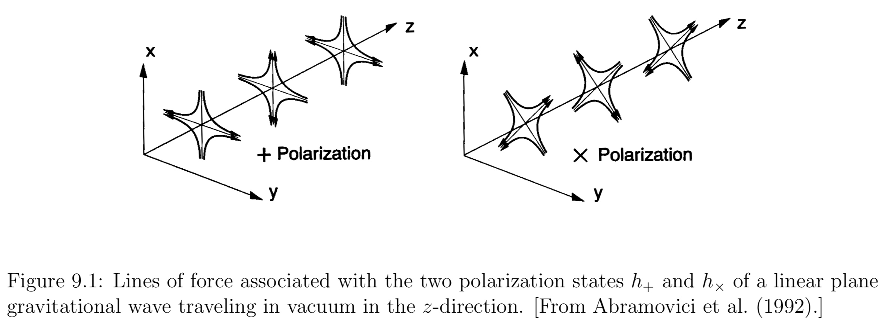

==In the near-field region about sources, the gravitational fields consist of a combination of longitudinal and transverse components that cannot be disentangled unambigiously.== As the transverse fields propagate away from their sources, however, they will reach an asymptotic region in which they can be modeled as a linear perturbation of a nearly Minkowski spacetime. **These linearized gravitational waves carry information about the nature of the nonlinear sources that generated them. It is these linearized waves that are measured by gravitational wave detectors.**

## Perturbation Theory

Consider a small perturbation $h _ { a b }$ of a known “background” solution to Einstein’s equations. In principle the background could be any solution, but here we are interested in waves propagating in a nearly Minkowski spacetime, for which the metric becomes

$$
g _ { a b } = \eta _ { a b } + h _ { a b } , \quad \left| h _ { a b } \right| \ll 1
$$

It is convenient to introduce the “trace-reversed” perturbation

$$
\bar { h } _ { a b } \equiv h _ { a b } - \frac { 1 } { 2 } \eta _ { a b } h _ { c } ^ { c }
$$

We can now exploit our coordinate-freedom to impose the “Lorentz gauge” condition,

$$
\nabla _ { a } \bar { h } ^ { a b } = 0
$$

**Vacuum Solutions**
___

Einstein’s equations in vacuum reduce to the wave equation

$$
\square \bar { h } _ { a b } = \nabla ^ { c } \nabla _ { c } \bar { h } _ { a b } = 0
$$

the Lorentz-gauge condition does not determine $\bar { h } _ { a b }$ uniquely, since we can introduce further infinitesimal gauge transformations that leave this condition unchanged.

Particularly useful is the transverse-traceless or “TT” gauge, in which

$$
\bar { h } _ { a 0 } ^ { T T } = 0 , \quad \bar { h } ^ { T T a } _ { a } = 0
$$

The first condition implies that the only nonzero components of $\bar { h } _ { a b } ^ { T T }$ are purely spatial. The second condition implies that $h _ { c } ^ { c } = 0$, so that, the trace-reversed metric perturbations $\bar { h } _ { a b }$ are identical to the original perturbations $h _ { a b }$, and we are entitled to drop the bars whenever we write down results in the TT gauge.

Together, the “Lorentz gauge” condition and “TT” gauge provide eight constraints on the originally ten independent components of $h _ { a b }$. **The remaining two degrees of freedom correspond to the two possible polarization states of gravitational radiation.**

A general gravitational wave is then specified by two dimensionless amplitudes $h _ { + }$ and $h _ { \times }$ as

$$
h _ { j k } ^ { T T } = h _ { + } e _ { i j } ^ { + } + h _ { \times } e _ { i j } ^ { \times }
$$

!!! example "a linear plane wave" 
    For a linear plane wave propagating in vacuum in the z-direction, we have $e _ { x x } ^ { + } = - e _ { y y } ^ { + } = 1 , e _ { x y } ^ { \times } = e _ { y x } ^ { \times } = 1$, all other components zero. 

Just as in electrodynamics, this type of equation admits simple plane wave solutions of the form

$$
\bar { h } _ { a b } = \Re \left( A _ { a b } e ^ { i k _ { c } x ^ { c } } \right)
$$

Einstein’s equations then demand that $k ^ { a }$ be a null vector,

$$
k _ { a } k ^ { a } = 0
$$

The Lorentz condition requires

$$
k ^ { a } A _ { a b } = 0
$$

implying that gravitational waves are transverse.

From a numerical point of view the plane wave solutions found above are not the most useful. Most numerical simulations treat spacetimes with finite, bounded sources, for which the waves propagate radially outward at large distance. Moreover such spacetimes approach asymptotic flatness at least as fast as $r ^ { - 1 }$. Clearly spacetimes containing with plane waves do not share these properties. More useful for simulation purposes are in terms of tensor spherical harmonics.

**Gravitational radiation carries energy, momentum, and angular momentum.**

We can express the radiated energy in terms of the wave amplitudes $h _ { + }$ and $h _ { \times }$

$$
L _ { \mathrm { GW } } = - \frac { d E } { d t } = \lim _ { r \rightarrow \infty } \frac { r ^ { 2 } } { 16 \pi } \int \left\langle \dot { h } _ { + } ^ { 2 } + \dot { h } _ { \times } ^ { 2 } \right\rangle d \Omega
$$

Similarly, we can find the loss of angular momentum due to radiation,

$$
\frac { d J _ { z } } { d t } = \lim _ { r \rightarrow \infty } \frac { r ^ { 2 } } { 16 \pi } \int \left\langle \partial _ { t } h _ { + } \partial _ { \phi } h _ { + } + \partial _ { t } h _ { \times } \partial _ { \phi } h _ { \times } \right\rangle d \Omega
$$

Finally, the loss of linear momentum due to radiation is

$$
\frac { d P ^ { i } } { d t } = \lim _ { r \rightarrow \infty } - \frac { r ^ { 2 } } { 16 \pi } \int \frac { x ^ { i } } { r } \left\langle \dot { h } _ { + } ^ { 2 } + \dot { h } _ { \times } ^ { 2 } \right\rangle d \Omega
$$

In all the above expressions the quantities E, J and $P^i$ refer to the source, and their changes are equal and opposite to the corresponding quantities carried off by the waves.

**Sources**
___

Consider now the generation of gravitational radiation from a weak-field, slow-velocity source. For such a source, Einstein’s equations reduce to

$$
\square \bar { h } _ { a b } = \nabla ^ { c } \nabla _ { c } \bar { h } _ { a b } = - 16 \pi T _ { a b }
$$

Imposing an outgoing-wave boundary condition, we can solve equation with the help of a Green’s function to obtain the integral equation,

$$
\bar { h } _ { a b } \left( t , x ^ { i } \right) = 4 \int d ^ { 3 } x ^ { \prime } \frac { T _ { a b } \left( t - \left| x ^ { i } - x ^ { i } \right| , x ^ { i } \right) } { \left| x ^ { i } - x ^ { \prime } \right| }
$$

For a binary, we can estimate the typical gravitational wave strain h. For equal-mass binaries we have $\mu = M / 4$, so

$$
h \simeq \frac { 4 } { r } \frac { \mu M } { R } \simeq 5 \times 10 ^ { - 20 } \left( \frac { 1 \mathrm { Mpc } } { r } \right) \left( \frac { M } { M _ { \odot } } \right) \left( \frac { M } { R } \right)
$$

The characteristic gravitational wave frequency from a stellar object of mass M, radius R and compaction $M/R$ by

$$
f \simeq \frac { 1 } { M } \left( \frac { M } { R } \right) ^ { 3 / 2 } \simeq 2 \times 10 ^ { 5 } \mathrm { Hz } \left( \frac { M _ { \odot } } { M } \right) \left( \frac { M } { R } \right) ^ { 3 / 2 }
$$

The highest frequency sources are compact objects with large compactions (black holes or neutron stars) and small masses; stellar-mass compact objects fall into this category. These sources fall into the high frequency band.