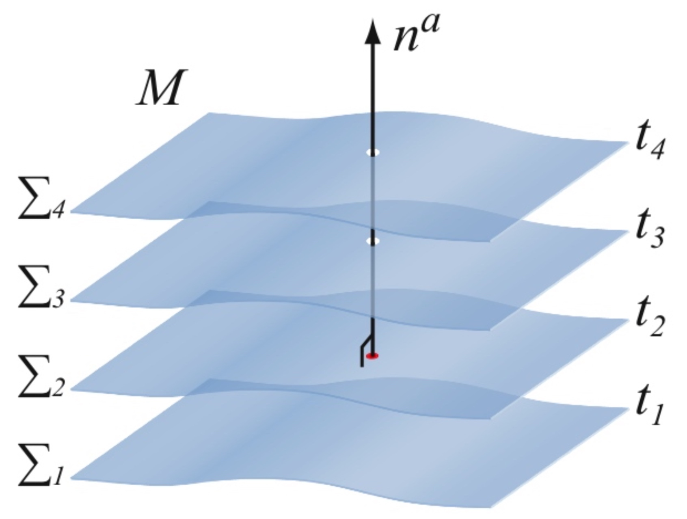
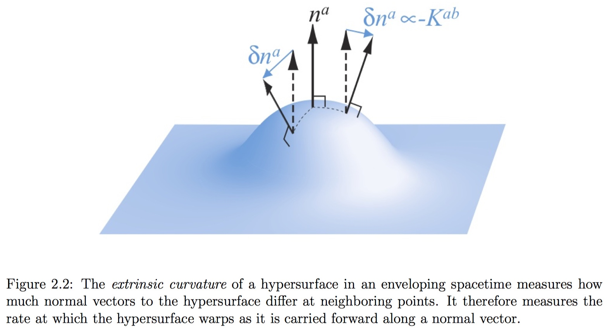

The 3+1 equations are entirely equivalent to the usual field equations but they focus on the evolution of 12 purely spatial quantities closely related to $g_{ij}$ and $\partial_t g_{ij}$ and the constraints that they must satisfy on spatial hypersurfaces. Once these spatial field quantities are specified on some initial “time slice” (i.e. spatial hypersurface) consistent with the 3 + 1 constraint equations, the 3 + 1 evolution equations can then be integrated, together with evolution equations for the matter sources, to determine these field quantities at all later times.

## Foliations of Spacetime

We assume that the spacetime $(M, g_{ab})$ can be foliated into a family of non-intersecting spacelike three-surfaces Σ, which arise, at least locally, as the level surfaces of a scalar function t that can be interpreted as a global time function. From t we can define the 1-form

$$
\Omega _ { a } = \nabla _ { a } t
$$

which is closed by construction,

$$
\nabla _ { [ a } \Omega _ { b ] } = \nabla _ { [ a } \nabla _ { b ] } t = 0
$$

The 4-metric $g_{ab}$ allows us to compute the norm of $\tilde{Ω}$􏰞, which we call $- \alpha ^ { - 2 }$

$$
\| \Omega \| ^ { 2 } = g ^ { a b } \nabla _ { a } t \nabla _ { b } t \equiv - \frac { 1 } { \alpha ^ { 2 } }
$$

$α$ measures how much proper time elapses between neighboring time slices along the normal vector $Ω^a$ to the slice, and is therefore called the lapse function. We assume that $α > 0$, so that $Ω^a$ is timelike and the hypersurface Σ is spacelike everywhere.

We can now define the unit normal to the slices as

$$
n ^ { a } \equiv - g ^ { a b } \alpha \Omega _ { b }
$$

Here the negative sign has been chosen so that $n^a$ points in the direction of increasing t, and may therefore be thought of as the four-velocity of a “normal” observer whose worldline is always normal to the spatial slices Σ.

### The spatial metric $\gamma_{ab}$

With the normal vector we can construct the spatial metric $\gamma_{ab}$ that is induced by $g_{ab}$ on the three-dimensional hypersurfaces Σ

$$
\gamma_{ab} = g_{ab} + n_a n_b
$$

Thus $\gamma_{ab}$ is a projection tensor that projects out all geometric objects lying along $n^a$. This metric allows us to compute distances within a slice Σ. To see that $γ_{ab}$ is purely spatial, i.e., resides entirely in Σ with no piece along $n^a$, we contract it with the normal $n^a$,

$$
n ^ { a } \gamma _ { a b } = n ^ { a } g _ { a b } + n ^ { a } n _ { a } n _ { b } = n _ { b } - n _ { b } = 0
$$

!!! note
    We break up 4-dimensional tensors by decomposing them into a purely spatial part, which lies in the hypersurfaces $\Sigma$, and a timelike part, which is normal to the spatial surface. To do so, we need two projection operators.

    The first one, which projects a 4-dimensional tensor into a spatial slice

    $$
    \gamma^a_{\space b} = g^a_{\space b} + n^a n_b
    $$

    Similarly, we may define the normal projection operator as

    $$
    N^a_{\space b} = - n^a n_b
    $$

    We can now use these two projection operators to decompose any tensor into its spatial and timelike parts.

    The three-dimensional metric only contains **information about the curvature intrinsic to a slice Σ**, but it gives no information about what shape this slice takes in the spacetime M in which it is embedded. This information is contained in a tensor called **extrinsic curvature**.

The three-dimensional covariant derivative can be expressed in terms of three-dimensional connection coefficients, which, in a coordinate basis, are given by

$$
\Gamma _ { b c } ^ { a } = \frac { 1 } { 2 } \gamma ^ { a d } \left( \partial _ { c } \gamma _ { d b } + \partial _ { b } \gamma _ { d c } - \partial _ { d } \gamma _ { b c } \right)
$$

The three-dimensional Riemann tensor can be computed from

$$
R _ { a b c } ^ { d } = \partial _ { b } \Gamma _ { a c } ^ { d } - \partial _ { a } \Gamma _ { b c } ^ { d } + \Gamma _ { a c } ^ { e } \Gamma _ { e b } ^ { d } - \Gamma _ { b c } ^ { e } \Gamma _ { e a } ^ { d }
$$

The three-dimensional curvature $R _ { b c d } ^ { a }$ only contains information about the curvature intrinsic to a slice Σ, but it gives no information about what shape this slice takes in the spacetime M in which it is embedded.

### The Extrinsic Curvature $K_{ab}$

**The extrinsic curvature** $K_{ab}$ can be found by **projecting gradients of the normal vector into the slice Σ**. The metric and the extrinsic curvature $(\gamma_{ab}, K_{ab})$ can therefore be considered as the equivalent of positions and velocities in classical mechanics – they measure the “instantaneous” state of the gravitational field, and form the fundamental variables in our initial value formulation.
We now define the extrinsic curvature, $K_{ab}$, as the negative expansion

$$
K_{ab} = - \gamma_a^{\space c} \gamma_b^{\space d} \nabla_{(c} n_{d)} = - \gamma_a^{\space c} \gamma_b^{\space d} \nabla_c n_d
$$

By definition, the extrinsic curvature is symmetric and purely spatial. they can only differ in the direction in which they are pointing, and the extrinsic curvature therefore provides information on **how much this direction changes from point to point across a spatial hypersurface.** As a consequence, the extrinsic curvature measures the rate at which the hypersurface deforms as it is carried forward along a normal.

Finally, we can write the extrinsic curvature as

$$
K_{ab} = - \frac{1}{2} \mathcal{L}_n \gamma_{ab}
$$

where $L_n$ denotes the Lie derivative along $n^a$.

Since $n^a$ is a timelike vector, equation illustrates the intuitive interpretation of the extrinsic curvature as a geometric generalization of the “time derivative” of the spatial metric $\gamma_{ab}$.

!!! note "Proof: $\gamma_{ab}$ changes proportionally to $K_{ab}$"
    $$
    \begin{align}
    K_{ab} &= - \gamma_a^{\space c} \gamma_b^{\space d} \nabla_c n_d = - (\delta_a^{\space c} + n_a n^c) (\delta_b^{\space d} + n_b n^d) \nabla_c n_d  \\
           &= -(\delta_a^{\space c} + n_a n^c) \delta_b^{\space d} \nabla_c n_d = - \nabla_a n_b - n_a a_b \\
    \mathcal{L}_n \gamma_{ab} &= \mathcal{L}_n (g_{ab} + n_a n_b) = 2 \nabla_{(a} n_{b)} + n_a \mathcal{L}_n n_b + n_b \mathcal{L}_n n_a \\
                              &= 2 (\nabla_{(a} n_{b)} - n_{(a} a_{b)})  \\
    \mathcal{L}_n \gamma_{ab} &= - 2 K_{ab}
    \end{align}
    $$