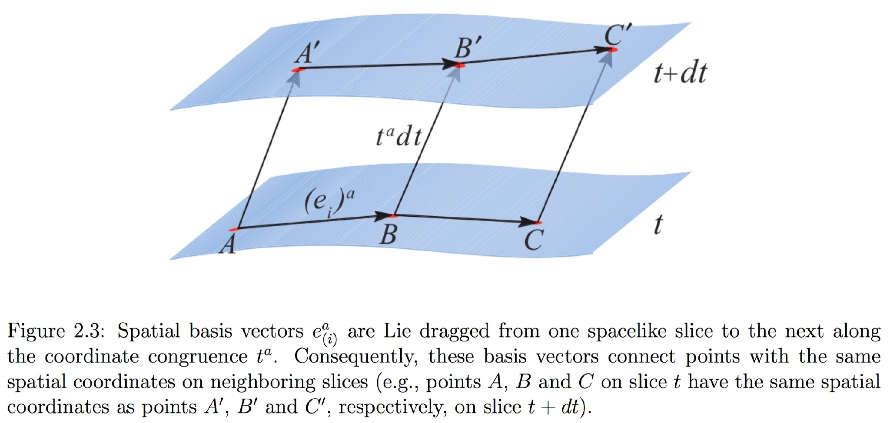
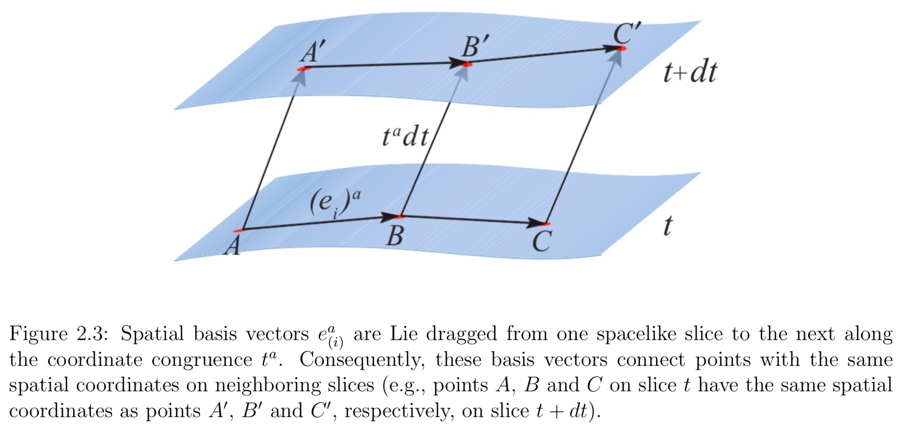
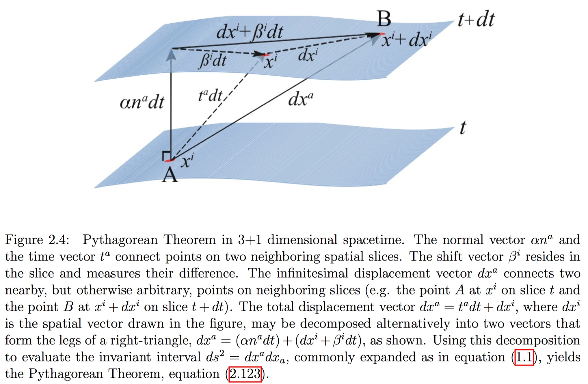
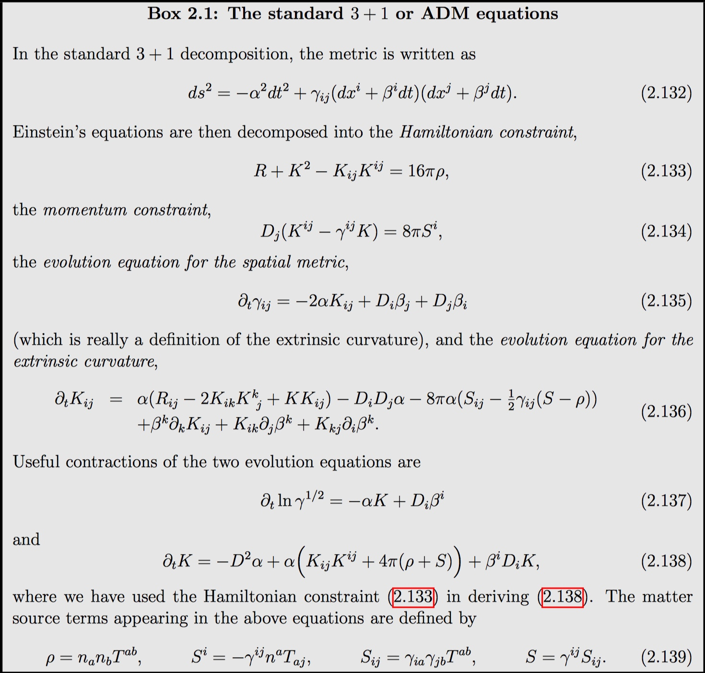

The metric $\gamma_{ab}$ and the extrinsic curvature $K_{ab}$ cannot be chosen arbitrarily. Instead, they have to satisfy **certain constraints**.

## The projections of the Riemann tensor

In order to find these relations, we have to ==relate the three-dimensional Riemann tensor $R^a_{\space bcd}$ of the the hypersurfaces Σ to the four-dimensional Riemann tensor $^{(4)} R^a_{\space bcd}$ of M.== 

!!! note "relate the three-dimensional Riemann tensor to the four-dimensional Riemann tensor"
    Let us consider the Ricci identity defining the (three-dimensional) Riemann tensor **Riem** as measuring the lack of commutation of two successive covariant derivatives with respect to the connection D associated with $\Sigma$'s metric $\gamma$.
    
    The four-dimensional version of this identity is
    
    $$
    D_{\alpha} D_{\beta} v^{\gamma}-D_{\beta} D_{\alpha} v^{\gamma}=R_{\mu \alpha \beta}^{\gamma} v^{\mu}
    $$
    
    where $v$ is a generic vector field tangent to $\Sigma$.
    
    The relation between the D-derivative and the $\nabla$-derivative
    
    $$
    D_{\rho} T_{\beta_{1} \ldots \beta_{q}}^{\alpha_{1} \ldots \alpha_{p}}=\gamma_{\mu_{1}}^{\alpha_{1}} \cdots \gamma^{\alpha_{p}}_{\mu_{p}} \gamma^{\nu_{1}}_{\beta_{1}} \cdots \gamma^{\nu_{q}}_{\beta_{q}} \gamma^{\sigma}_{\rho} \nabla_{\sigma} T_{\nu_{1} \ldots \nu_{q}}^{\mu_{1} \ldots \mu_{p}}
    $$

To do so, we first take a completely spatial projection of $^{(4)} R^a_{\space bcd}$, then a projection with one index projected in the normal direction, and finally a projection with two indices projected in the normal direction. All other projections vanish identically because of the symmetries of the Riemann tensor. A decomposition of $^{(4)} R^a_{\space bcd}$ into spatial and normal pieces therefore involves these **three different types of projections**.

<!--$$
\begin{align}
^{(4)} R_{abcd} &= \gamma_a^{\space p} \gamma_b^{\space q} \gamma_c^{\space r} \gamma_d^{\space s} {}^{(4)} R_{pqrs} - 2 \gamma_a^{\space p} \gamma_b^{\space q} \gamma_{[c}^{\space r} n_{d]}^{\space} n^s {}^{(4)} R_{pqrs} \\
&- 2 \gamma_c^{\space p} \gamma_d^{\space q} \gamma_{[a}^{\space r} n_{b]}^{\space} n^s {}^{(4)} R_{pqrs} + 2 \gamma_a^{\space p} \gamma_{[c}^{\space r} n_{d]}^{\space} n_b n^q n^s {}^{(4)} R_{pqrs} \\
&- 2 \gamma_b^{\space p} \gamma_{[c}^{\space r} n_{d]}^{\space} n_a n^q n^s {}^{(4)} R_{pqrs} 
\end{align}
$$-->

The above projections give rise to the equations of Gauss, Codazzi and Ricci[^1].

[^1]: Gourgoulhon, E. 3+1 Formalism and Bases of Numerical Relativity. arXiv:gr-qc/0703035 (2007).

- Gauss’ equation: a completely spatial projection.

$$
R_{abcd} + K_{ac} K_{bd} -K_{ad} K_{cb} = \gamma^p_{\space a} \gamma^q_{\space b} \gamma^r_{\space c} \gamma^s_{\space d} {}^{(4)} R_{pqrs}
$$

- Codazzi equation: the part projected three times onto $\Sigma_{t}$ and once along the normal n

$$
D_b K_{ac} - D_a K_{bc} = \gamma^p_{\space a} \gamma^q_{\space b} \gamma^r_{\space c} n^s_{\space d} {}^{(4)} R_{pqrs}
$$

- Ricci equation: the projection of the spacetime Riemann tensor twice onto $\Sigma_{t}$ and twice along n.

$$
\gamma_{\alpha \mu} n^{\rho} \gamma_{\beta}^{\nu} n^{\sigma} {}^{4} R_{\rho \nu \sigma}^{\mu}=\frac{1}{N} \mathcal{L}_{m} K_{\alpha \beta}+\frac{1}{N} D_{\alpha} D_{\beta} N+K_{\alpha \mu} K_{\beta}^{\mu}
$$

**We can rewrite Einstein’s field equations in a 3+1 form. Basically,** ==we just need to take the equations of Gauss, Codazzi and Ricci and eliminate the four-dimensional Rieman tensor using Einstein’s equations.==

$$
G_{ab} = {}^{(4)} R_{ab} - \frac{1}{2} {}^{(4)} R g_{ab} = 8 \pi T_{ab}
$$

## Constraint equations

We will first derive the constraint equations from Gauss’ equation and the Codazzi equation.

- Contracting Gauss’ equation:

$$
R + K^2 - K_{ab}K^{ab} = 16 \pi \rho
$$ 

!!! note
    We now define the energy density ρ to be the total energy density as measured by a normal observer $n^a$,

    $$
    \rho = n_a n_b T^{ab} \\
    2 n^p n^r G_{pr} = R + K^2 - K_{ab} K^{ab}
    $$
    
- Contracting the Codazzi equation:

$$
D_b K^b_{\space a} - D_a K = 8 \pi S_a
$$

!!! note
    We now define $S_a$ to be the momentum density as measured by a normal observer $n^a$,

    $$
    S_a = - \gamma^b_{\space a} n^c T_{bc} \\
    D_b K^b_{\space a} - D_a K = - \gamma^q_{\space a} n^s G_{qs}
    $$
    
They are **the conditions** that allow a three-dimensional slice Σ with data $(\gamma_{ab}, K_{ab})$ to be embedded in a four-dimensional manifold M with data $g_{ab}$. We will discuss strategies for **solving the constraint equations and finding initial data** that represent a snapshot of the gravitational fields at a certain instant of time.

**Constraint equations constrain the fields in space at one instant of time, independently of their past history.**

!!! note "Freedom"
    The four constraint equations cannot determine all of the gravitational fields $(\gamma_{ij}, K_{ij})$.

    Both $\gamma_{ij}$ and $K_{ij}$ are symmetric, three-dimensional tensors, they together have **twelve independent components**.

    - The **four constraint equations** can only determine four of these
    - Four undetermined functions are related to **coordinate choices**
    - Two independent sets of values for **the conjugate pair** $(\gamma_{ij}, K_{ij})$.
    - Two dynamical degrees of freedom correspond to **the two polarization modes of a gravitational wave**

    It is quite intuitive that the state of a dynamical field, like a **gravitational wave, cannot be determined from constraint equations**. Waves satisfy hyperbolic equations, and their state at any time depends on their past history. It is therefore natural that the constraint equations serve to constrain only the “longitudinal” parts of the fields, while the “transverse” parts, related to the dynamical degrees of freedom, remain freely specifiable.

    Ideally one would like to separate unambiguously the longitudinal from the transverse parts of the fields at some initial time, freely specifying the latter and then solving the constraints for the former. **Given the nonlinear nature of general relativity such a rigorous separation is not possible**; instead, all these fields are entangled in the spatial metric and the extrinsic curvature.

## Evolution Equations

The evolution equations evolve the data $(γ_{ab},K_{ab})$ forward in time. However, the Lie derivative along $n^a$, $\mathcal { L } _ { \mathbf { n } }$, is not a natural time derivative since $n^a$ is not dual to the surface 1-form $Ω_a$, i.e. their dot product is not unity

$$
n ^ { a } \Omega _ { a } = - \alpha g ^ { a b } \nabla _ { a } t \nabla _ { b } t = \alpha ^ { - 1 }
$$

Instead, consider the vector

$$
t ^ { a } = \alpha n ^ { a } + \beta ^ { a }
$$

which is dual to $Ω_a$ for any spatial shift vector $β^a$,

$$
t ^ { a } \Omega _ { a } = \alpha n ^ { a } \Omega _ { a } + \beta ^ { a } \Omega _ { a } = 1
$$

It will prove useful to choose $t^a$ to be the congruence along which we propagate the spatial coordinate grid from one time slice to the next slice. In other words, **$t^a$ will connect points with the same spatial coordinates on neighboring time slices.**

!!! note
    Observers who are “at rest” relative to the slices follow the normal congruence $n^a$ and are called either normal or Eulerian observers. while observers following the congruence $t^a$ are called coordinate observers. If matter is present it moves entirely independently of the coordinates with four-velocity $u^a$.

Ricci’s equation:

- The evolution equation for the extrinsic curvature:

$$
\begin{align}
\mathcal{L}_{t} K_{ab} = &- D_{a} D_{b} \alpha + \alpha (R_{ab} - 2 K_{ac} K^{c}_{\space b} + K K_{ab}) \\
 &- 8 \pi \alpha \left( S_{ab} - \frac{1}{2} \gamma_{ab} \left( S-\rho \right) \right) + \mathcal{L}_{\beta}K_{ab}
\end{align}
$$

!!! note
    a projection with two indices projected in the normal direction.

    $$
    \mathcal{L}_n K_{ab} = n^d n^c \gamma^q_{\space a} \gamma^r_{\space b} {}^{(4)} R_{drcq} - \frac{1}{\alpha} D_a D_b \alpha - K^c_{\space b} K_{ac} \\
    S_{ab} = \gamma^c_{\space a} \gamma^d_{\space b} T_{cd} \\
    S = S^a_{\space a}
    $$
    
- The evolution equation for the spatial metric $\gamma_{ab}$:

$$
\mathcal{L}_t \gamma_{ab} = - 2 \alpha K_{ab} + \mathcal{L}_{\beta} \gamma_{ab}
$$

!!! note
    $$
    K_{ab} = - \frac{1}{2} \mathcal{L}_n \gamma_{ab}
    $$
    
It is quite intuitive, though, that things will simplify if we adopt a coordinate system that reflects our 3 + 1 split of spacetime in a natural way. We will see that **the Lie derivative in the evolution equations then reduces to a partial derivative** with respect to coordinate time and, as an additional benefit, we will be able to ignore all timelike components of spatial tensors.

**The coupled evolution equations the extrinsic curvature and the spatial metric determine the evolution of the gravitational field data $(\gamma_{ab}, K_{ab})$. Together with the constraint equations they are completely equivalent to Einstein’s equations.**

Note we have succeeded in recasting Einstein’s equations, which are **second order in time** in their original form, as a coupled set of partial differential equations that are now **first order in time**.

So far, we have expressed our equations in a covariant, coordinate independent manner, i.e. the basis vectors $e_a$ have been completely arbitrary and have no particular relationship to the 1-form $Ω_a$ or to the congruence defined by $t^a$.

## ADM Equations

It is quite intuitive, though, that things will simplify if we adopt a coordinate system that effects our 3 + 1 split of spacetime in a natural way.

To do so, we first introduce a basis of three spatial vectors $e^a_{(i)}$, reside in a particular time slice Σ:

$$
\Omega_a e^a_{(i)} = 0
$$

We extend our spatial vectors to other slices Σ by Lie dragging along $t^a$

$$
\mathcal{L}_t e^a_{(i)} = 0
$$

As the fourth basis vector we pick $e^a_0 = t^a$. The duality condition then implies that $e^a_{(0)}$ has the components

$$
t ^ { a } = e _ { ( 0 ) } ^ { a } = ( 1,0,0,0 )
$$

**This means that the Lie derivative along $t^a$ reduces to a partial derivative with respect to t: $\mathcal{L}_t = \partial_t$.**

Since spatial tensors vanish when contracted with the normal vector, this also means that all components of spatial tensors with a contravariant index equal to zero must vanish.

For the shift vector,

$$
\beta ^ { a } = \left( 0 , \beta ^ { i } \right)
$$

Solving equation $t ^ { a } = \alpha n ^ { a } + \beta ^ { a }$ for $n^a$ then yields the contravariant components

$$
n ^ { a } = \left( \alpha ^ { - 1 } , - \alpha ^ { - 1 } \beta ^ { i } \right)
$$

and from the normalization condition $n_a n^a = −1$ we find

$$
n _ { a } = ( - \alpha , 0,0,0 )
$$

From the definition of the spatial metric we have $\gamma_{ij} = g_{ij}$ meaning that the metric on Σ is just the spatial part of the four-metric. Since zeroth components of spatial contravariant tensors have to vanish, we also have $\gamma^{a0} = 0$.

The inverse metric can therefore be expressed as:

$$
g^{ab} = \gamma^{ab} - n^{a} n^{b} = 
\begin{pmatrix} 
\alpha^{-2} & \alpha^{-2} \beta^{i} \\
\alpha^{-2} \beta^{j} & \gamma^{ij} - \alpha^{2} \beta^{i} \beta^{j}
\end{pmatrix}
$$

We can now invert it and find the components of the four-dimensional metric

$$
g_{ab} = 
\begin{pmatrix} 
\alpha^{-2} + \beta_l \beta^l & \beta_{i} \\
\beta_{j} & \gamma_{ij}
\end{pmatrix}
$$

Equivalently, the line element may be decomposed as:

$$
ds^{2} = - \alpha^{2} dt^{2} + \gamma_{ij} \left( dx^{i} + \beta^{i} dt \right) \left( dx^{j} + \beta^{j}dt \right) 
$$

which is often refered to as the metric in 3 + 1 form. We may interpret this line element as the Pythagorean Theorem for a 4-dimensional spacetime, 

$$
ds^2 = - (properTime)^2 + (properDistance)^2
$$
 
This equation thus determines the invariant interval between neighboring points A and B.

## Ill-posedness

**The ADM equations by themselves proved to be unstable for many strong-field problems, including black-hole mergers.** 

!!! note "Well-Posedness"
    Mathematical models of physical phenomena should have the properties that:
    
    1. **Existence:** a solution exists,
    2. **Uniqueness:** the solution is unique,
    3. **Stability:** the solution's behavior changes continuously with the initial conditions.

    If one of these conditions is not satisfied, the PDE problem is said to be **ill-posed**.
    
    A system of equations would be stable if the norm of the solution is bounded by the norm of the initial data in terms of constants independent of the initial data.
    
    $$
    \|u(\cdot, t)\| \leq a e^{b t}\|u(\cdot, 0)\|
    $$
    
    where a,b are the same constants for all initial data.

[^2]: Frittelli, S. & Gomez, R. Ill-posedness in the Einstein equations. Journal of Mathematical Physics 41, 5535–5549 (2000).

The system is first-order in time and second-order in space, being generically represented in the form

$$
\dot{u}=A^{i j}\left(x^{k}, t, u\right) u_{, i j}+B^{i}\left(x^{k}, t, u, u_{, k}\right) u_{, i}+C\left(x^{k}, t, u\right) \equiv P\left(x^{k}, t, u, u_{, k}, \partial / \partial x^{j}\right) u
$$

Any time that an evolution system can be represented in this form, we interpret the right-hand side as an evolution operator acting on a solution. In this case, the evolution operator is P, and contains all the terms in the right-hand side of equation. It is essential to point out that the properties of stability of a system are encoded in the principal terms of the operator P, namely, in $A^{i j}\left(x^{k}, t, u\right)$. This means that we can restrict our attention to a system of the

$$
\dot{u}=A^{i j}\left(x^{k}, t, u\right) u_{, i j}
$$

The principal terms of the evolution operator of the standard ADM form are

$$
\begin{aligned} \dot{\gamma}_{i j} &=0 \\ \dot{K}_{i j} &=\frac{\alpha}{2}\left(2 \gamma^{k l} \gamma_{l(i, j) k}-\gamma^{k l} \gamma_{i j, k l}-\gamma^{k l} \gamma_{k l, i j}\right) \end{aligned}
$$

Consider the following periodic solution to with $\alpha=1$ (geodesic slicing):

$$
\begin{aligned} \gamma_{i j} &=\left(1+\frac{1}{2} \cos (k \cdot x)\right) \delta_{i j} \\ K_{i j} &=t \frac{\cos (k \cdot x)}{\left(1+\frac{1}{2} \cos (k \cdot x)\right)}\left(k_{i} k_{j}+\delta_{i j} k \cdot k\right) \end{aligned}
$$

With the norm

$$
\|u(\cdot, t)\| \equiv \frac{1}{L^{3}} \int_{c u b e} d^{3} x\left(\sum_{i j}\left(\gamma_{i j}\right)^{2}+\sum_{i j}\left(K_{i j}\right)^{2}\right)
$$

we have

$$
\|u(\cdot, t)\|=\left(\frac{3}{2}\right)^{3}+6(k \cdot k)^{2} t^{2} \frac{1}{L^{3}} \int_{c u b e} d^{3} x \frac{\cos ^{2}(k \cdot x)}{\left(1+\frac{1}{2} \cos (k \cdot x)\right)^{2}}
$$

It is very simple to see that the following inequality holds:

$$
\|u(\cdot, t)\| \geq\|u(\cdot, 0)\|\left(1+\frac{2^{5}}{3^{4}}(k \cdot k)^{2} t^{2}\right)
$$

It is impossible to bound the terms in parenthesis in the right-hand-side by a factor of the form $a e^{b t}$ with a and b independent of $\omega \equiv \sqrt{k \cdot k}$. Because of the presence of $\omega$, we conclude that ==the norm is not bounded in terms of the initial data== and the standard ADM equations are ill-posed for $\alpha=1$.

Although this may create a difficulty in the stability analysis of these systems, we do not think that this necessarily implies an obstruction to numerical integration of any of them, in general. For particular applications, **it is possible that the bad behavior at high frequencies may be disregarded**.

One of the key improvements in numerical simulations prior to the breakthroughs of 2005 was the introduction of the so-called NOKBSSN formulation of the Einstein equations in 3+1. This system modifies the standard ADM equations in several crucial ways.

## initial-value problem

We first decide which field variables we want to determine by solving constraint equations. We then have to make choices for the remaining, freely specifiable variables. Lastly, we must solve these equations for the constrained field variables.

!!! note "Analogy Electric Field"
    Maxwell’s equations also split into constraint and evolution equations. The constraint equations have to be satisfied by any electric and magnetic field at each instant of time, but they are not sufficient to completely determine these fields. Consider the equation for the electric field  $\vec{E}$,
    
    $$
    \nabla \cdot \vec{E} = 4 \pi \rho
    $$
    
    Given an electrical charge density ρ, we can solve this equation for one of the components of $E^i$ , but not all three of them. For example, we could make certain choices for $E^x$ and $E^y$, and then solve for $E^z$, even though we might be **troubled by the asymmetry** in singling out one particular component in this approach.
    
    Alternatively, we may prefer to write $E^i$ as some “background” field $\bar { E } ^ { i }$ times some overall scaling factor, say $ψ^4$
    
    $$
    E ^ { i } = \psi ^ { 4 } \bar { E } ^ { i }
    $$
    
    **make certain choices for all three components of the background field** $\bar { E } ^ { i }$, and then solve for the scaling factor $ψ^4$. Though it might not be so useful for treating Maxwell’s equations, such an approach leads to a very convenient and tractable system for Einstein’s equations.

### Conformal Transformation

We begin by writing the spatial metric $\gamma_{ij}$ as a product of some power of a positive scaling factor ψ and a background metric $\bar{\gamma}_{ij}$,

$$
\gamma_{ij} = ψ^4 \bar{\gamma}_{ij}
$$

This identification is a **conformal transformation** of the spatial metric. We call ψ **the conformal factor**, and $\bar{\gamma}_{ij}$ **the conformally related metric**. Taking ψ to the fourth power turns out to be convenient, but is otherwise arbitrary. 

Loosely speaking, **the conformal factor absorbs the overall scale of the metric, which leaves five degrees of freedom in the conformally related metric**. Superficially, **the conformal transformation is just a mathematical trick**, namely, rewriting one unknown as a product of two unknowns in order to make solving some equations easier.

!!! note 
    **From now on we will denote all objects associated with the conformal metric $\bar{\gamma}_{i j}$ with a bar. In the above equations $\psi$ must be treated as a scalar function in covariant derivatives.**

    The inverse of $\bar{\gamma}_{ij}$:
    
    $$
    \gamma ^ { i j } = \psi ^ { - 4 } \bar { \gamma } ^ { i j }
    $$
    
    In three dimensions, the connection coefficients must transform according to
    
    $$
    \Gamma _ { j k } ^ { i } = \bar { \Gamma } _ { j k } ^ { i } + 2 \left( \delta _ { j } ^ { i } \bar { D } _ { k } \ln \psi + \delta _ { k } ^ { i } \bar { D } _ { j } \ln \psi - \bar { \gamma } _ { j k } \bar { \gamma } ^ { i l } \bar { D } _ { l } \ln \psi \right)
    $$
    
    For the Ricci tensor we similarly find
    
    $$
    \begin{aligned} R_{i j}=& \bar{R}_{i j}-2\left(\bar{D}_{i} \bar{D}_{j} \ln \psi+\bar{\gamma}_{i j} \bar{\gamma}^{l m} \bar{D}_{l} \bar{D}_{m} \ln \psi\right) \\ &+4\left(\left(\bar{D}_{i} \ln \psi\right)\left(\bar{D}_{j} \ln \psi\right)-\bar{\gamma}_{i j} \bar{\gamma}^{l m}\left(\bar{D}_{l} \ln \psi\right)\left(\bar{D}_{m} \ln \psi\right)\right) \end{aligned}
    $$
    
    For the scalar curvature
    
    $$
    R = \psi ^ { - 4 } \bar { R } - 8 \psi ^ { - 5 } \bar { D } ^ { 2 } \psi
    $$

Inserting the scalar curvature into the Hamiltonian constraint yields

$$
8 \bar { D } ^ { 2 } \psi - \psi \bar { R } - \psi ^ { 5 } K ^ { 2 } + \psi ^ { 5 } K _ { i j } K ^ { i j } = - 16 \pi \psi ^ { 5 } \rho
$$

which, for a given choice of the conformally related metric $\bar { \gamma } ^ { i j }$, we may interpret as an equation for the conformal factor ψ. The extrinsic curvature $K_{ij}$ has to satisfy the momentum constraint, and it will be useful to rescale $K_{ij}$ conformally as well.

It is convenient to split $K_{ij}$ into its trace $K$ and a traceless part $A_{i j}$ according to

$$
K_{i j}=A_{i j}+\frac{1}{3} \gamma_{i j} K
$$

and to conformally transform $K$ and $A_{i j}$ separately. A priori it is not clear how to transform $K$ and $A_{i j}$, and our only guidance for inventing rules is that the transformation should bring the constraint equations into a simple and solvable form. Consider the transformations

$$
\begin{aligned} A^{i j} &=\psi^{\alpha} \bar{A}^{i j} \\ K &=\psi^{\beta} \bar{K} \end{aligned}
$$

With the choices of $\alpha=-10$ and $\beta=0$, the momentum constraint is

$$
\bar{D}_{j} \bar{A}^{i j}-\frac{2}{3} \psi^{6} \bar{\gamma}^{i j} \bar{D}_{j} K=8 \pi \psi^{10} S^{i}
$$

In addition to the spatial metric and extrinsic curvature, **it may also be necessary to transform the matter sources $\rho$ and $S^{i}$ to insure uniqueness of solutions**.

