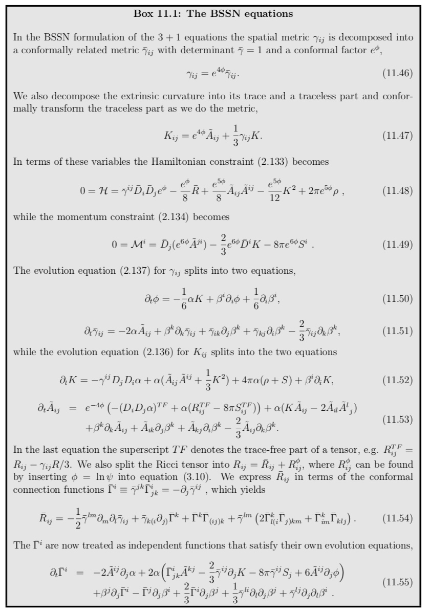

Firstly, the spatial metric $\gamma_{i j}$ is split into an overall conformal factor $e^{\phi}$ and a conformal metric $\tilde{\gamma}_{i j}$, where $e^{4 \phi} \tilde{\gamma}_{i j}=\gamma_{i j}$. and the determinant of $\tilde{\gamma}_{i j}$ is unity. This conformal metric has its corresponding Christoffel symbols $^{(3)} \widetilde{\Gamma}^{k}_{i j}$ and Ricci tensor $^{(3)} \tilde{R}_{i j}$. Second, the three combinations $\tilde{\gamma}^{i j} {}^{(3)} \tilde{\gamma}^k_{i j}={}^{(3)} \tilde{\Gamma}^{k}(k=1,2,3)$, as well as the $K=\gamma^{i j} K_{i j}$ are promoted to evolved variables. Third, the remaining evolved extrinsic curvature variables are trace-free conformal extrinsic curvature variables $\tilde{A}_{i j}=e^{-4 \phi}\left[K_{i j}-(1 / 3) K \gamma_{i j}\right]$. Finally, the momentum constraint equations are used to modify the evolution equations for ${}^{(3)} \tilde{\Gamma}^{k}$, which introduces a constraint damping quality to the system. These changes, in conjunction with a particular choice of gauge conditions, namely the use of certain Bona-Masso type lapse conditions (known as 1+log slicing) and Γ- driver shift conditions led to the first genuinely stable, fully nonlinear implementations of the Einstein equations for systems without symmetries, at least for non-black-hole spacetimes. The factoring out of the conformal factor $\phi$ proved to be particularly advantageous for collisions of black holes.

