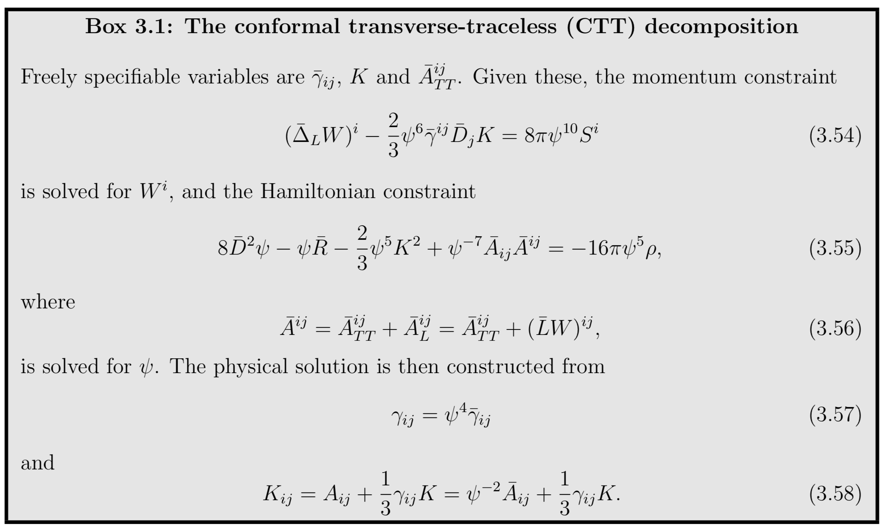
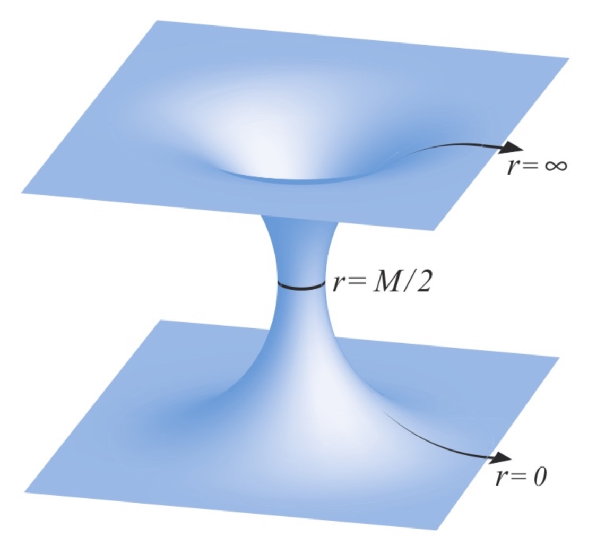
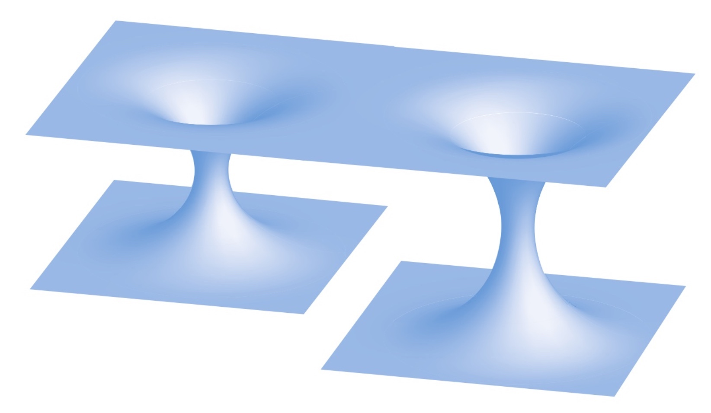
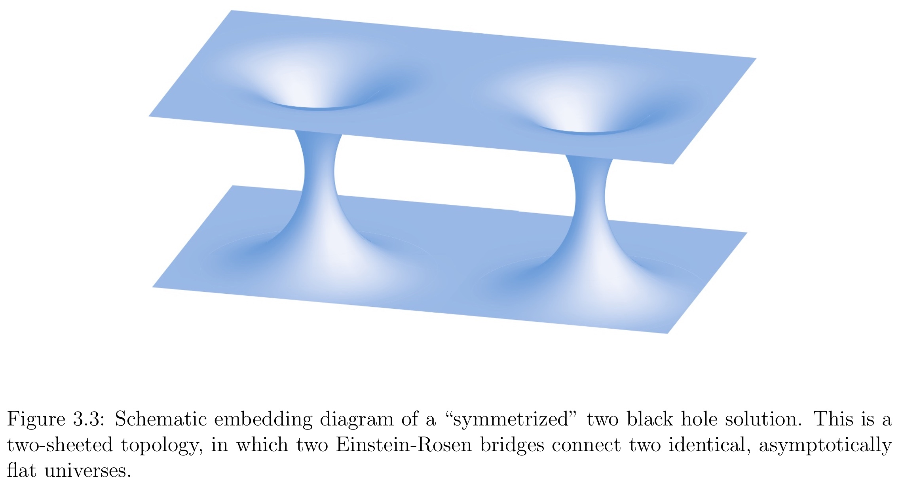
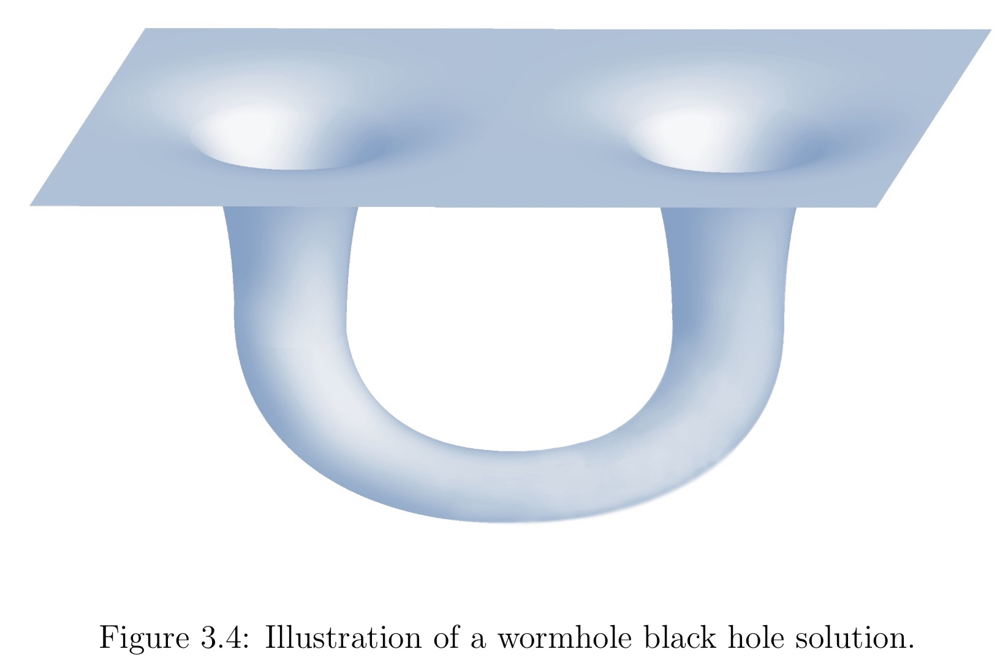

!!! note "Analogy Electric Field"
    Maxwell’s equations also split into constraint and evolution equations. The constraint equations have to be satisfied by any electric and magnetic field at each instant of time, but they are not sufficient to completely determine these fields. Consider the equation for the electric field  $\vec{E}$,
    
    $$
    \nabla \cdot \vec{E} = 4 \pi \rho
    $$
    
    Given an electrical charge density ρ, we can solve this equation for one of the components of $E^i$ , but not all three of them. For example, we could make certain choices for $E^x$ and $E^y$, and then solve for $E^z$, even though we might be **troubled by the asymmetry** in singling out one particular component in this approach.
    
    Alternatively, we may prefer to write $E^i$ as some “background” field $\bar { E } ^ { i }$ times some overall scaling factor, say $ψ^4$
    
    $$
    E ^ { i } = \psi ^ { 4 } \bar { E } ^ { i }
    $$
    
    **make certain choices for all three components of the background field** $\bar { E } ^ { i }$, and then solve for the scaling factor $ψ^4$. Though it might not be so useful for treating Maxwell’s equations, such an approach leads to a very convenient and tractable system for Einstein’s equations.

## Conformal Transformation of the Spatial Metric

We begin by writing the spatial metric $\gamma_{ij}$ as a product of some power of a positive scaling factor ψ and a background metric $\bar{\gamma}_{ij}$,

$$
\gamma_{ij} = ψ^4 \bar{\gamma}_{ij}
$$

This identification is a **conformal transformation** of the spatial metric. We call ψ **the conformal factor**, and $\bar{\gamma}_{ij}$ **the conformally related metric**. Taking ψ to the fourth power turns out to be convenient, but is otherwise arbitrary. Loosely speaking, **the conformal factor absorbs the overall scale of the metric, which leaves five degrees of freedom in the conformally related metric**.

Superficially, **the conformal transformation is just a mathematical trick**, namely, rewriting one unknown as a product of two unknowns in order to make solving some equations easier.

The inverse of $\bar{\gamma}_{ij}$:

$$
\gamma ^ { i j } = \psi ^ { - 4 } \bar { \gamma } ^ { i j }
$$

In three dimensions, the connection coefficients must transform according to

$$
\Gamma _ { j k } ^ { i } = \bar { \Gamma } _ { j k } ^ { i } + 2 \left( \delta _ { j } ^ { i } \bar { D } _ { k } \ln \psi + \delta _ { k } ^ { i } \bar { D } _ { j } \ln \psi - \bar { \gamma } _ { j k } \bar { \gamma } ^ { i l } \bar { D } _ { l } \ln \psi \right)
$$

For the scalar curvature

$$
R = \psi ^ { - 4 } \bar { R } - 8 \psi ^ { - 5 } \bar { D } ^ { 2 } \psi
$$

Inserting the scalar curvature into the Hamiltonian constraint yields

$$
8 \bar { D } ^ { 2 } \psi - \psi \bar { R } - \psi ^ { 5 } K ^ { 2 } + \psi ^ { 5 } K _ { i j } K ^ { i j } = - 16 \pi \psi ^ { 5 } \rho
$$

which, for a given choice of the conformally related metric $\bar { \gamma } ^ { i j }$, we may interpret as an equation for the conformal factor ψ. The extrinsic curvature $K_{ij}$ has to satisfy the momentum constraint, and it will be useful to rescale $K_{ij}$ conformally as well.

## Conformal transformation of the extrinsic curvature

We have conformally transformed the spatial metric, but before we proceed we also have to decompose the extrinsic curvature. It is convenient to split $K_{ij}$ into its trace K and a traceless part $A_{ij}$ according to

$$
K_{ij} = A_{ij} + \frac{1}{3} \gamma_{ij} K
$$

and to conformally transform K and $A_{ij}$ separately. A priori it is not clear how to transform K and $A_{ij}$, and our only guidance for inventing rules is that the transformation should bring the constraint equations into a simple and solvable form. Consider the transformations

$$
\begin{aligned} A ^ { i j } & = \psi ^ { \alpha } \bar { A } ^ { i j } \\ K & = \psi ^ { \beta } \bar { K } \end{aligned}
$$

where α and β are two so far undetermined exponents.

> Inserting the above expressions into the momentum constraint (the choice $α = −10$) yields
>
> $$
> \psi ^ { - 10 } \bar { D } _ { j } \bar { A } ^ { i j } - \frac { 2 } { 3 } \psi ^ { \beta - 4 } \bar { \gamma } ^ { i j } \bar { D } _ { j } \bar { K } - \frac { 2 } { 3 } \beta \psi ^ { \beta - 5 } \bar { K } \bar { \gamma } ^ { i j } \bar { D } _ { j } \psi = 8 \pi S ^ { i }
> $$
> 
> Our desire to simplify equations motivates the choice $β = 0$, so that we treat K as a conformal invariant, $K = \bar{K}$. With these choices, 
> 
> the Hamiltonian constraint now becomes
> 
> $$
> 8 \bar { D } ^ { 2 } \psi - \psi \bar { R } - \frac { 2 } { 3 } \psi ^ { 5 } K ^ { 2 } + \psi ^ { - 7 } \bar { A } _ { i j } \bar { A } ^ { i j } = - 16 \pi \psi ^ { 5 } \rho
> $$
> 
> and the momentum constraint is
> 
> $$
> \bar { D } _ { j } \bar { A } ^ { i j } - \frac { 2 } { 3 } \psi ^ { 6 } \bar { \gamma } ^ { i j } \bar { D } _ { j } K = 8 \pi \psi ^ { 10 } S ^ { i }
> $$

**In addition to the spatial metric and extrinsic curvature, it may also be necessary to transform the matter sources ρ and $S^i$ to insure uniqueness of solutions.**

> We start by considering the linear equation
> 
> $$
> \nabla ^ { 2 } u = f u
> $$
> 
> on some domain Ω. Here f is some given function, and we will assume $u = 0$ on the boundary $∂Ω$. If f is non-negative everywhere, we can apply the maximum principle to show that u = 0 everywhere. The point is that if u were non-zero somewhere in Ω, say positive, then it must have a maximum somewhere. At the maximum the left hand side of (3.40) must be negative, but the right hand side is non-negative if $f ≥ 0$, which is a contradiction. Clearly, the argument works the same way if u is negative somewhere, implying that $u = 0$ everywhere if $f ≥ 0$.
> 
> Now consider the non-linear equation
> 
> $$
> \nabla ^ { 2 } u = f u ^ { n }
> $$
> 
> and assume there exist two positive solutions $u_1$ and $u_2 ≥ u_1$ that are identical, $u_1 = u_2$, on the boundary $∂Ω$. The difference $∆u = u_2 − u_1$ must then satisfy an equation
> 
> $$
> \nabla ^ { 2 } \Delta u = n f \tilde { u } ^ { n - 1 } \Delta u
> $$
> 
> where $\tilde { u }$ is some positive function satisfying $u_1 ≤ \tilde{u} ≤ u_2$. Applying the above argument to $∆u$, we see that the maximum principle implies $∆u = 0$ and hence uniqueness of solutions if and only if $nf ≥ 0$, i.e. if the coefficient and exponent in the source term have the same sign.

Inspecting the Hamiltonian constraint we see that the matter term $−16 π ψ^5 ρ$ features the “wrong signs”: it has a negative coefficient (assuming a positive matter density ρ), but a positive exponent for ψ. Therefore the maximum principle cannot be applied, and the uniqueness of solutions cannot be established.

Uniqueness of solutions can be restored, however, by introducing a conformal rescaling of the density. With $\rho = \psi ^ { \delta } \bar { \rho }$, where $δ ≤ −5$ and where $\bar{ρ}$ is now considered a given function, the matter term carries the “right signs”, and the maximum principle can be applied to establish the uniqueness of solutions.

## Conformal Transverse-Traceless Decomposition

Any symmetric, traceless tensor can be split into a transverse-traceless part that is divergenceless and a longitudinal part that can be written as a symmetric, traceless gradient of a vector. We can therefore decompose $\bar{A}^{ij}$ as

$$
\bar { A } ^ { i j } = \bar { A } _ { T T } ^ { i j } + \bar { A } _ { L } ^ { i j }
$$

where the transverse part is divergenceless

$$
\bar { D } _ { j } \bar { A } _ { T T } ^ { i j } = 0
$$

and where the longitudinal part satisfies

$$
\bar { A } _ { L } ^ { i j } = \bar { D } ^ { i } W ^ { j } + \bar { D } ^ { j } W ^ { i } - \frac { 2 } { 3 } \bar { \gamma } ^ { i j } \bar { D } _ { k } W ^ { k } \equiv ( \bar { L } W ) ^ { i j }
$$

Here $W^i$ is a vector potential, and it is easy to see that the longitudinal operator or vector gradient $\bar{L}$ produces a symmetric, traceless tensor. We can now write the divergence of $\bar{A}^{ij}$ as

$$
\bar { D } _ { j } A ^ { i j } = \bar { D } _ { j } A _ { L } ^ { i j } = \bar { D } _ { j } ( \bar { L } W ) ^ { i j } = \bar { D } ^ { 2 } W ^ { i } + \frac { 1 } { 3 } \bar { D } ^ { i } \left( \bar { D } _ { j } W ^ { j } \right) + \bar { R } _ { j } ^ { i } W ^ { j } \equiv \left( \bar { \Delta } _ { L } W \right) ^ { i }
$$

where $\bar{∆}_L$ is the vector Laplacian.

Note that $\bar{A}^{ij}_{TT}$ and $\bar{A}^{ij}_{L}$ are transverse and longitudinal with respect to the conformal metric $\bar{γ}_{ij}$, which is why this decomposition is called the conformal transverse-traceless decomposition. Alternatively one can also adopt a physical transverse-traceless decomposition, where the corresponding tensors are transverse and longitudinal with respect to the physical metric $γ_{ij}$.

We started out with six independent variables in both the spatial metric $\gamma_{ij}$ and the extrinsic curvature $K_{ij}$. Splitting off the conformal factor ψ left five degrees of freedom in the conformally related metric $\bar{\gamma}_{ij}$ (once we have specified its determinant $\bar{\gamma}$). Of the six independent variables in $K_{ij}$ we moved one into its trace K, two into $\bar{A}^{ij}_{TT}$ (which is symmetric, traceless, and divergenceless), and three into $\bar{A}^{ij}_L$ (which is reflected in its representation by a vector). Of the twelve original degrees of freedom, the constraint equations determine only four, namely the conformal factor ψ (Hamiltonian constraint) and the longitudinal part of the traceless extrinsic curvature $\bar{A}^{ij}_L$ (momentum constraint). Four of the remaining eight degrees of freedom are associated with the coordinate freedom - three spatial coordinates hidden in the spatial metric and a time coordinate that is associated with K. This leaves four physical degrees of freedom undetermined - two in the conformally related metric $\bar{\gamma}_{ij}$, and two in the transverse part of traceless extrinsic curvature $\bar{A}^{ij}_{TT}$. These two freely specifiable degrees of freedom carry the dynamical degrees of freedom of the gravitational fields. All others are either fixed by the constraint equations or represent coordinate freedom. 

**We have reduced the Hamiltonian and momentum constraint to equations for the conformal factor ψ and the vector potential $W^i$, from which the longitudinal part of the extrinsic curvature is constructed.**

These quantities can be solved for only after choices have been made for the remaining quantities in the equations, namely the conformally related metric $\bar{γ}_{ij}$, the transverse-traceless part of the extrinsic curvature $\bar{A}^{ij}_{TT}$, the trace of the extrinsic curvature K, and, if present, any matter sources. The choice of these background data has to be made in accordance with the physical or astrophysical situation that one wants to represent. Physically, the choice affects the gravitational wave content present in the initial data, in the sense that a dynamical evolution of data constructed with different background data leads to different amounts of emitted gravitational radiation. It is often not clear how a suitable background can be constructed precisely, and we will return to this issue on several occasions. Given its loose association with the transverse parts of the gravitational fields, one often sets $\bar{A}^{ij}_{TT}$ equal to zero in an attempt to minimize the gravitational wave content in the initial data.

## Conformal Transformations of Black Hole Solutions

It is instructive to consider some simple, but physically interesting, solutions to the constraint equation.

Consider vacuum solutions for which the matter source terms vanish $(ρ = 0 = S^i)$ and focus on a “moment of time symmetry”. At a moment of time symmetry, all time derivatives of $γ_{ij}$ are zero and the 4−dimensional line interval has to be invariant under time reversal, $t → −t$. The latter condition implies that the shift must satisfy $β^i = 0$ and, hence, the extrinsic curvature also has to vanish everywhere on the slice, $K_{ij} = 0 = K$. On such a time slice the momentum constraints are satisfied trivially. The Hamiltonian constraint reduces to

$$
\bar { D } ^ { 2 } \psi = \frac { 1 } { 8 } \psi \bar { R }
$$

Let us further choose the conformally related metric to be flat,

$$
\bar { \gamma } _ { i j } = \eta _ { i j }
$$

Whenever this is the case, we call the physical spatial metric $γ_{ij}$ conformally flat.

“conformal flatness” refers, for our purposes, to the spatial metric and not the spacetime metric.

In four or any higher dimensions, we can evaluate the Weyl tensor to examine whether any given metric is conformally flat. This is a consequence of the fact that the Weyl tensor is invariant under conformal transformations of the spacetime metric – this explains why it is often called the conformal tensor.

Any spherically symmetric spatial metric is always conformally flat, meaning that we can always write such a metric as $\gamma _ { i j } = \psi ^ { 4 } \eta _ { i j }$. For any spherically symmetric space, we may hence assume conformal flatness without loss of generality.

Assuming conformal flatness dramatically simplifies all calculations, since $\bar{D}_i$ reduces to the flat covariant derivative (and in particular to partial derivatives in cartesian coordinates). Moreover, the Ricci tensor and scalar curvature associated with the conformally related metric must now vanish, $\bar{R}_{ij} = \bar{R} = 0$. Under this assumption, the Hamiltonian constraint becomes the remarkably simple Laplace equation

$$
\bar { D } ^ { 2 } \psi = 0
$$

Spherically symmetric solutions are

$$
\psi = 1 + \frac { \mathcal { M } } { 2 r }
$$

in this particular case, the constant M is in fact the black hole mass M. It shouldn’t come as a great surprise that this is just the Schwarzschild solution in isotropic coordinates.

$$
d l ^ { 2 } = \gamma _ { i j } d x ^ { i } d x ^ { j } = \left( 1 + \frac { M } { 2 r } \right) ^ { 4 } \eta _ { i j } d x ^ { i } d x ^ { j } = \left( 1 + \frac { M } { 2 r } \right) ^ { 4 } \left( d r ^ { 2 } + r ^ { 2 } \left( d \theta ^ { 2 } + \sin ^ { 2 } \theta d \phi ^ { 2 } \right) \right)
$$

This solution forms the basis of the so-called puncture methods for black holes.

The solution is singular at $r = 0$. However, we can show that this singularity is only a coordinate singularity by considering the coordinate transformation

$$
r = \left( \frac { \mathcal { M } } { 2 } \right) ^ { 2 } \frac { 1 } { \hat { r } }
$$

under which the isotropic Schwarzschild metric becomes

$$
d l ^ { 2 } = \left( 1 + \frac { \mathcal { M } } { 2 \hat { r } } \right) ^ { 4 } \left( d \hat { r } ^ { 2 } + \hat { r } ^ { 2 } \left( d \theta ^ { 2 } + \sin ^ { 2 } \theta d \phi ^ { 2 } \right) \right)
$$

The geometry described by metric evaluated at a radius $\hat{r} = a$ is identical to that of the above metric evaluated at $r = a$. The mapping therefore maps the metric into itself, and is hence an isometry. 

In particular, this demonstrates that the origin $r = 0$ is isomorphic to spatial infinity, which is perfectly regular.

This demonstrates that the isotropic radius r covers only the black hole exterior, and that each Schwarzschild R corresponds to two values of the isotropic radius r.

The isotropic radius r corresponding to the smallest areal (or circumferential) radius R is $r = M/2$, which we refer to as the black hole throat. For a single Schwarzschild black hole, the throat coincides with both the apparent and event horizons.

It is almost trivial to generalize our one black hole solution $\psi = 1 + \frac { \mathcal { M } } { 2 r }$ to an arbitrary number of black holes at a moment of time symmetry. Since $\bar { D } ^ { 2 } \psi = 0$ is linear, we obtain the solution simply by adding the individual contribution of each black hole according to

$$
\psi = 1 + \sum_{\alpha} \frac { \mathcal { M } _ { \alpha } } { 2 r _ { \alpha } }
$$

==Here $r_α = |x^i − C_α^i |$ is the (coordinate) separation from the center $C_α^i$ of the αth black hole. **The total mass of the spacetime is the sum of the coefficients $M_α$. However, since the total mass will also include contributions from the black hole interactions, $M_α$ can be identified with the mass of the α-th black hole only in the limit of large separations.**==

Particularly interesting astrophysically and for the generation of gravitational waves is the case of binary black holes

$$
\psi = 1 + \frac { \mathcal { M } _ { 1 } } { 2 r _ { 1 } } + \frac { \mathcal { M } _ { 2 } } { 2 r _ { 2 } }
$$

This simple solution to the constraint equations for two black holes instantaneously at rest at a moment of time symmetry can be used as initial data for head-on collisions of black holes.

In general, the existence of other black holes destroys the symmetry that we found for a single black hole.

Drawing an embedding diagram for such a geometry yields several different “sheets”, where each sheet corresponds to one universe. A geometry containing N black holes may contain up to N + 1 different asymptotically flat universes.

For each throat we can add terms inside that throat that correspond to images of the other black holes. Doing so, the solution becomes “symmetrized” so that the reflection through each throat is again an isometry. In other words, each Einstein-Rosen bridge connects to the same asymptotically flat universe, and the geometry consists of only two asymptotically flat universes, which are connected by several Einstein-Rosen bridges.

For two equal-mass black holes we may also interpret this solution as a wormhole black hole solution.

Cut off the bottom universe at the two throats, which leaves two “open-ended” throats hanging down from the top universe. We can now identify these two open ends with each other, effectively gluing them together. The two throats now form a “wormhole” that connects to a single, asymptotically flat (but multiply connected) universe. Given the original isometry conditions across the throats, and given that they have the same mass, the resulting metric is smooth across the throat and a valid solution to the Hamiltonian constraint.

In cylindrical coordinates the metric becomes

$$
d l ^ { 2 } = \psi ^ { 4 } \left( d \rho ^ { 2 } + d z ^ { 2 } + \rho ^ { 2 } d \phi ^ { 2 } \right)
$$

where the corresponding conformal factor is given by

$$
\psi = 1 + \sum _ { n = 1 } ^ { \infty } \frac { 1 } { \sinh ( n \mu ) } \left( \frac { 1 } { \sqrt { \rho ^ { 2 } + \left( z + z _ { n } \right) ^ { 2 } } } + \frac { 1 } { \sqrt { \rho ^ { 2 } + \left( z - z _ { n } \right) ^ { 2 } } } \right)
$$

Here $z _ { n } = \operatorname { coth } ( n \mu )$, and μ is a free parameter.

the total mass of this system, which we will identify with the “ADM mass” is

$$
M _ { \mathrm { ADM } } = 4 \sum _ { n = 1 } ^ { \infty } \frac { 1 } { \sinh ( n \mu ) }
$$

The proper distance L along the spacelike geodesic connecting the throats, or equivalently the proper length of a geodesic loop through the wormhole, is

$$
L = 2 \left( 1 + 2 \mu \sum _ { n = 1 } ^ { \infty } \frac { n } { \sinh ( n \mu ) } \right)
$$

The parameter μ is seen to parameterize both the mass and separation of the two holes. Since the solution can be rescaled to arbitrary physical mass, μ effectively determines the dimensionless ratio $L/M_{ADM}$, the parameter that, apart from mass, distinguishes one binary from another in this class of initial data.