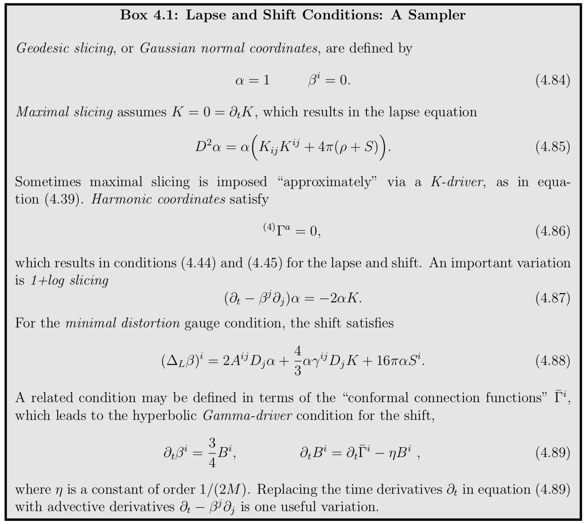
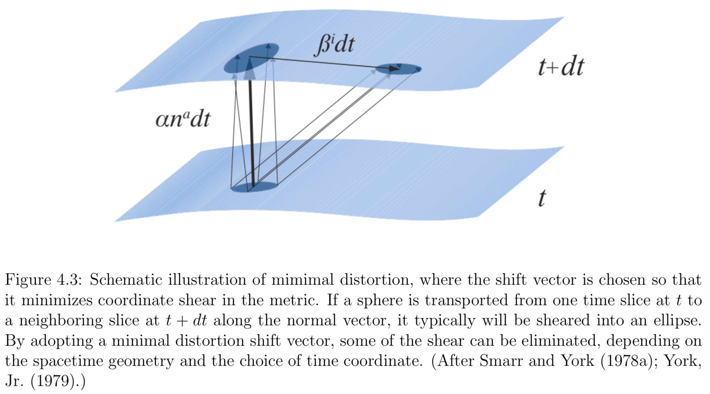

The 3+1 evolution equations for $\gamma_{ij}$ and for $K_{ij}$ are not quite ready for numerical integration. For one thing, we have yet to impose coordinate conditions by specifying the lapse function $α$ and the shift vector $β^i$ that appear in these equations. The lapse and shift are freely specifiable gauge variables that need to be chosen in order to advance the field data from one time slice to the next.

**What constitutes a “good” coordinate system?** Clearly, the adopted coordinates must not allow the appearance of any singularities, which could have dire consequences for a numerical simulation. Such a singularity, which is often associated with a black hole, could be either a coordinate singularity or a physical singularity.

To avoid coordinate singularities associated with horizons, like the one at $r_s = 2M$, black hole simulations have sometimes been carried out using “horizon penetrating” coordinates in which light cones do not pinch-off at the horizon.

The lapse α determines how the shape of the slices Σ changes in time, since it relates the advance of proper time to coordinate time along the normal vector na connecting one spatial slice to the next. The shift $β^i$, on the other hand, determines how spatial points at rest with respect to a normal observer $n^a$ are relabeled on neighboring slices. The spatial gauge or spatial coordinates is therefore imposed by a choice for the shift vector.

## Geodesic Slicing

Since the lapse $α$ and the shift $β^i$ can be chosen freely, let us first consider the simplest possible choice,

$$
\alpha = 1 , \quad \beta ^ { i } = 0
$$

In the context of numerical relativity this gauge choice is often called geodesic slicing; the resulting coordinates are also known as Gaussian-normal coordinates.

Recall that coordinate observers move with 4−velocities $u ^ { a } = t ^ { a } = e _ { ( 0 ) } ^ { a }$ (i.e. spatial velocities $u^i = 0$). Thus with $β^i = 0$, coordinate observers coincide with normal observers ($u^a = n^a$). With $α = 1$, the proper time intervals that they measure agree with coordinate time intervals. Their acceleration is given by equation

$$
a _ { b } = D _ { b } \ln \alpha = 0
$$

Evidently, since their acceleration vanishes, normal observers are freely-falling and therefore follow geodesics, hence the name of this slicing condition. 

Despite its simplicity, geodesic slicing tends to form coordinate singularities very quickly during an evolution. This result is not surprising, since geodesics tend to focus in the presence of gravitating sources. **Coordinate observers therefore approach each other, collide, and thereby form a coordinate singularity**.
 
As an example, consider a weak gravitational wave that is initially centered on the origin of an otherwise flat vacuum spacetime. After a brief interaction the wave disperses and leaves behind flat space. Also consider a set of coordinate observers that are at rest with respect to each other initially. **The gravitational wave packet carries energy and hence attracts the observers gravitationally, who, initially, start moving toward the origin of the spacetime**. **Once the gravitational wave has dispersed, the observers are no longer attracted gravitationally to the center, but they continue to coast toward each other until they form a coordinate singularity**. As the following exercise demonstrates, we can even estimate the time scale after which this singularity will form.

## Maximal Slicing

A common choice is the maximal slicing condition

$$
K = 0
$$

If we assume maximal slicing not only on one slice, but at all times, then the time derivative of K must vanish as well,

$$
K = 0 = \partial _ { t } K
$$

$$
D ^ { 2 } \alpha = \alpha \left( K _ { i j } K ^ { i j } + 4 \pi ( \rho + S ) \right)
$$

which we can solve for the lapse $α$ independently of the shift $β^i$.

By construction, maximal slicing prevents the focussing of normal observers that we have found for geodesic slicing. This means that maximal slices are “volume preserving” along the normal congruence $n^a$. **Normal observers in maximal slicing move like irrotational and incompressible fluid elements.** The incompressible property prevents the focussing of normal observers that occurs in geodesic slicing.

## Harmonic Coordinates

Consider a contraction of the four dimensional connection coefficients

$$
^ { ( 4 ) } \Gamma ^ { a } \equiv g ^ { b c ( 4 ) } \Gamma _ { b c } ^ { a } = - \frac { 1 } { | g | ^ { 1 / 2 } } \partial _ { b } \left( | g | ^ { 1 / 2 } g ^ { a b } \right)
$$

One way to impose a gauge condition is to set these quantities equal to some pre-determined gauge source functions $H^a$,

$$
^ { ( 4 ) } \Gamma ^ { a } = H ^ { a }
$$

In particular, we may choose these gauge source functions to vanish, which defines harmonic coordinates

$$
^ { ( 4 ) } \Gamma ^ { a } = 0
$$

More common in 3+1 calculations is harmonic slicing, in which only the time-component $^ { ( 4 ) } \Gamma ^ { 0 }$ is set to zero.

**The singularity avoidance properties of harmonic slicing are weaker than those, for example, of maximal slicing.**

## Quasi-isotropic and Radial Gauge

We now turn to gauge conditions for the spatial coordinates, i.e., conditions that specify the shift vector $β^i$.

As is the case when picking a lapse, an important goal when choosing a shift is to provide for a stable, long-term dynamical evolution. In addition, it is often desirable to **bring the spatial metric into a simple form**.

Loosely speaking, two different strategies can be employed when constructing a spatial gauge condition. One strategy is to define a geometric condition on the spatial metric from which a gauge condition can be derived. Alternatively, we can impose an algebraic condition on the spatial metric directly. For example, we can set some of its components to zero in order to simplify the Einstein equations.

In general the spatial metric $γ_{ij}$ has six independent components. Using our three degrees of spatial coordinate freedom we can impose three conditions on the metric, and thereby reduce the number of its independent variables to three.

!!! note
    In spherical polar coordinates, quasi-isotropic gauge is defined by the three conditions

    $$
    \gamma _ { r \theta } = \gamma _ { r \phi } = 0 \\
    \gamma _ { \theta \theta } \gamma _ { \phi \phi } - \left( \gamma _ { \theta \phi } \right) ^ { 2 } = \gamma _ { r r } \gamma _ { \phi \phi } r ^ { 2 }
    $$

    which reduces the metric to the form

    $$
    d l ^ { 2 } = A ^ { 2 } \left( d r ^ { 2 } + r ^ { 2 } d \theta ^ { 2 } \right) + B ^ { 2 } r ^ { 2 } ( \sin \theta d \phi + \xi d \theta ) ^ { 2 }
    $$

## Minimal Distortion

The conformally related metric $\bar{γ}_{ij}$ has five independent functions, two of which correspond to true dynamical degrees of freedom and three to coordinate freedom. For a stable and accurate numerical evolution it is desirable to eliminate purely coordinate-related fluctuations in $\bar{γ}_{ij}$. To accomplish this, one may want to construct a gauge condition that **minimizes the time rate of change of the conformally related metric. This gauge condition is called minimal distortion**.

An “approximate minimal distortion” condition may lead to a coordinate system with similar geometric properties.

In the fixed puncture approach, there are singularities of this type associated with each black hole and the gauge conditions are chosen so that these singularities do not move. Each of these singularities is called a “puncture”. Keeping the puncture fixed has several advantages. First, the singularity in the conformal factor can be handled analytically. Second, by keeping the black holes fixed in coordinate space, one can use the much simpler fixed excision techniques.