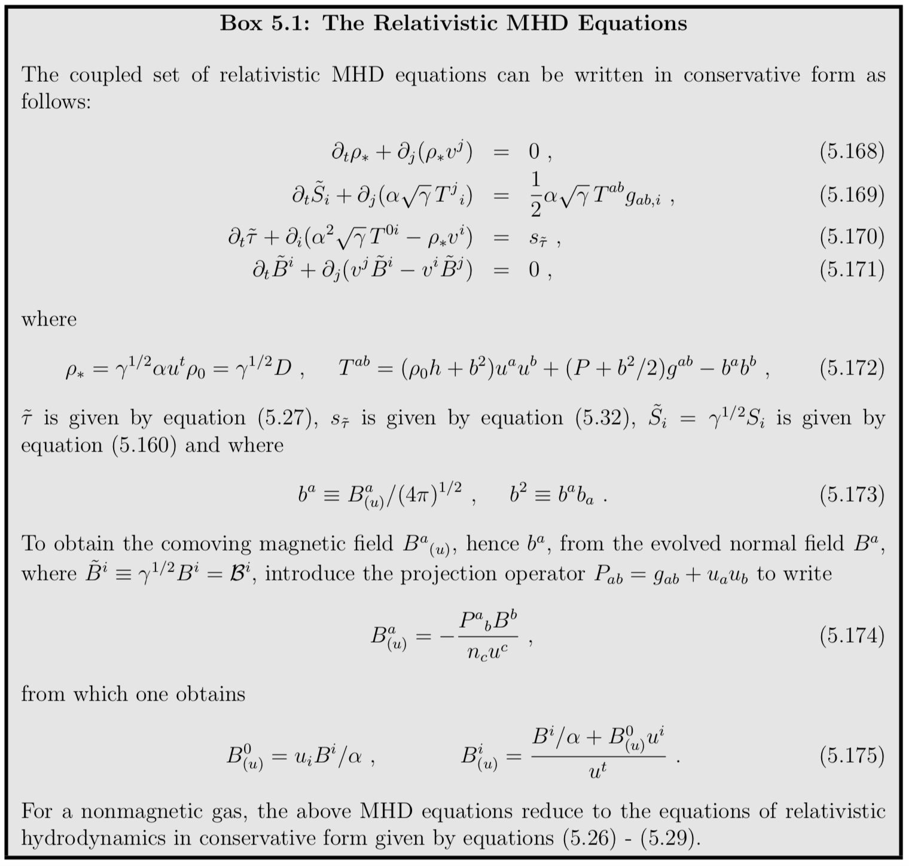

The stress-energy tensor accounts for all sources of energy-momentum in spacetime, excluding gravity. It thus arises from all forms of matter, electromagnetic fields, neutrinos, scalar fields, etc, in the universe.

For brevity, we shall sometimes refer to these sources collectively as the “matter sources” and the terms that they contribute in the 3 + 1 equations as the “matter source terms”. “Matter” source terms appear in the Hamiltonian constraint equation, the momentum constraint equation, and the 3 + 1 evolution equation.

The evolution equations for the “matter” sources are given by $\nabla _ { b } T ^ { a b } = 0$, which express the conservation of the total 4-momentum in spacetime. These conservation equations must be solved simultaneously with the 3 + 1 evolution equations for the gravitational field to determine the entire foliation of spacetime. Some of the quantities appearing in the stress-energy tensor require auxiliary equations. **These auxiliary equations include, for example, the continuity equation and an equation of state in the case of hydrodynamic matter, and Maxwell’s equations in the case of an electromagnetic field**, and so on.

The “matter” source terms ρ, $S_i$ and $S_{ij}$ appearing in the 3+1 equations for the gravitational field are projections of the stress-energy tensor into $n^a$ and Σ and are given by

$$
\rho = n_a n_b T^{ab}  \\
S_i = - \gamma_{ia} n_b T^{ab}  \\
S_{ij} = \gamma_{ia} \gamma_{jb} T^{ab}
$$

The quantity $\rho$ is the total mass-energy density as measured by a normal observer, $S_i$ is the momentum density and $S_{ij}$ is the stress. Finally, S is defined as the trace of $S_{ij}$,

$$
S = \gamma^{ij} S_{ij}
$$

In the following sections, we discuss some of the most important “matter” sources that arise in astrophysical applications. These sources include hydrodynamic fluids, magnetohydrodynamic plasmas threaded by magnetic fields, radiation gases (e.g., photon and neutrino), collisionless matter, and scalar fields.

## Vacuum

Vacuum spacetimes are characterized by the vacuum stress energy tensor

$$
T^{ab} = 0
$$

**Spacetimes containing black holes and (or) gravitational waves, and nothing else, are characterized by such a stress-energy tensor in Einstein’s field equations.** Vacuum spacetimes are simpler to deal with numerically since they require no additional energy-momentum conservation equations or auxiliary field equations to solve.

## Hydrodynamics

Relativistic hydrodynamic matter is an important source of stress-energy in many astrophysical applications. Loosely speaking, a hydrodynamic description of matter is appropriate whenever the mean free path of a particle due to collisions with neighboring particles is much shorter than the characteristic size or local scale length of the system.
 
## Perfect Gases

The stress-energy tensor of a perfect gas is given by

$$
T^{ab} = \rho_0 h u^a u^b + P g^{ab}
$$

h is the specific enthalpy

$$
h = 1 + \epsilon + P / \rho _ { 0 }
$$

where $\epsilon$ is the specific internal energy density. The total mass-energy density as measured by an observer comoving with the fluid is then given by $\rho ^ { * } = \rho _ { 0 } ( 1 + \epsilon )$.

The local conservation of energy-momentum

$$
\nabla_b T^{ab} = 0
$$

The conservation of rest mass

$$
\nabla_a (\rho_0 u^a) = 0
$$

## Imperfect Gases

There are many important astrophysical applications that involve imperfect gases characterized by viscosity, conductivity and (or) radiation. For example, viscosity can drive non-axisymmetric instabilities in rotating stars, while radiation can lead to the cooling and contraction of stars.

- Viscosity

The contribution of viscosity to the stress-energy tensor is

$$
T _ { \mathrm { visc } } ^ { a b } = - 2 \eta \sigma ^ { a b } - \zeta \theta P ^ { a b }
$$
    
where $η ≥ 0$ is the coefficient of dynamic, or shear, viscosity, $ζ ≥ 0$ is the coefficient of bulk viscosity.

- Heat and Radiation Diffusion

The contribution of heat flux (i.e. conduction) to the stress-energy tensor is
    
$$
T _ { \text { heat } } ^ { a b } = u ^ { a } q ^ { b } + u ^ { b } q ^ { a }
$$
    
where the heat-flux 4-vector $q^a$ is given by
    
$$
q ^ { a } = - \lambda _ { \mathrm { th } } P ^ { a b } \left( \nabla _ { b } T + T a _ { b } \right)
$$
    
T is the temperature, $a ^ { a } = u ^ { b } \nabla _ { b } u ^ { a }$ is the fluid 4-acceleration, and $λ_{th}$ is the coefficient of thermal conduction.

A useful application of the thermal conduction formalism is heat transport via thermal radiation.
    
- Radiation Hydrodynamics

In general, **a gas is neither optically thick nor optically thin** (i.e. transparent) everywhere, nor is the radiation always in thermal equilibrium with the matter. In such cases we cannot treat radiation transport in the diffusion approximation as discussed above. To handle the more general case, the radiation field can be described by a radiation stress-energy tensor,
    
$$
T _ { \mathrm { rad } } ^ { a b } = \iint d \nu d \Omega I _ { \nu } N ^ { a } N ^ { b }
$$
    
The radiation hydrodynamics problem is very difficult to solve in general, since the intensity is a function of six-dimensional phase space plus time, and the radiation transport equation with complicated radiation-fluid interaction terms (including scattering) has a nontrivial integrodifferential character.

## Magnetohydrodynamics

Magnetic fields play a crucial role in determining the evolution of many relativistic objects. In any highly conducting astrophysical plasma, a frozen-in magnetic field can be amplified appreciably by gas compression or shear. Even when an initial seed field is weak, the field can grow in the course of time to significantly influence the gas dynamical behavior of the system.

## Electromagnetic Field Equations

Along with the electromagnetic field, we shall assume the presence of a perfect fluid, so that the total stress-energy tensor is given by

$$
T ^ { a b } = \rho _ { 0 } h u ^ { a } u ^ { b } + P g ^ { a b } + T _ { \mathrm { em } } ^ { a b }
$$

The electromagnetic stress-energy tensor

$$
4 \pi T _ { \mathrm { em } } ^ { a b } = F ^ { a c } F _ { c } ^ { b } - \frac { 1 } { 4 } g ^ { a b } F _ { c d } F ^ { c d }
$$

## Equation of state

For many purposes it is useful to employ a simple “Γ-law” equation of state (EOS) of the form

$$
P = (\Gamma - 1) \rho_0 \varepsilon
$$

Realistic applications involving relativistic objects are **rarely described by EOSs obeying this simple form**. However, a Γ-law EOS provides a computationally practical, albeit crude, approximation that can be adapted to mimick the gross behavior of different states of matter in many applications.

For example, to model **a stiff nuclear EOS in a neutron star**, one can adopt a moderately high value of Γ in a Γ-law EOS, e.g. Γ ≈ 2. By contrast, to model a moderately soft, thermal radiation-dominated EOS governing a very massive or supermassive star, one can set Γ = 4/3. For isentropic flow, a Γ-law EOS is equivalent to the equation of state of a polytrope,

$$
P = K \rho _ { 0 } ^ { \Gamma } , \quad \Gamma = 1 + 1 / n
$$

where n is the polytropic index and K is the gas constant. However, for non-isentropic flow, which is always the case **when encountering a shock, K is no longer constant throughout the fluid**.

## Collisionless Matter

Several important astrophysical systems are made up of particles of collisionless matter. In such systems, the mean-free-path for particle-particle interactions is much longer than the scale of the system.

One example of a collisionless system is a star cluster, a large, self-gravitating, N-body system in which the individual particles – the stars – interact exclusively via gravitation.

## Scalar Fields

Scalar fields give rise to particles of spin 0, while vector fields (like the electromagnetic field) give rise to particles of spin 1 (like the photon, in the case of electromagnetism), and tensor fields of rank two or higher give rise to higher-spin particles. A complex scalar field has two degrees of freedom instead of just one, and it can be interpreted as a particle and an antiparticle. Real fields are their own antiparticles. A neutral π meson is an example of a real scalar field, while the charged $π^+$- and $π_−$-mesons are described by complex scalar fields.