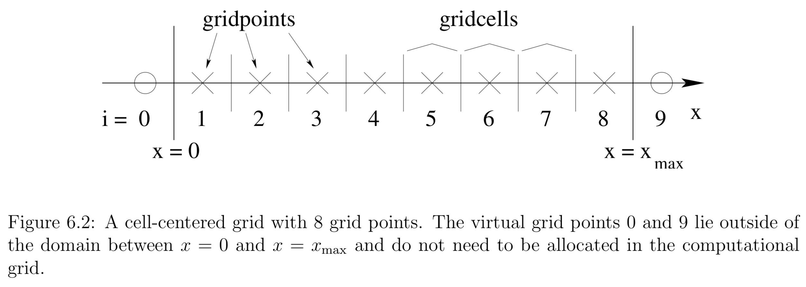

## Finite Difference Methods

**In a finite difference approximation a function $f(t,x)$ is represented by values at a discrete set of points.** At the core of finite difference approximation is therefore a discretization of the spacetime, or a numerical grid. Instead of evaluating f at all values of x, for example, we only consider discrete values $x_i$. The distance between the gridpoints $x_i$ is called the gridspacing $∆x$. For uniform grids, for which $∆x$ is constant, we have

$$
x _ { i } = x _ { 0 } + i \Delta x
$$

If the solution depends on time we also discretize the time coordinate, for example as

$$
t ^ { n } = t ^ { 0 } + n \Delta t
$$

The finite difference representation of the function $f(t,x)$, for example, is

$$
f _ { i } ^ { n } = f \left( t ^ { n } , x _ { i } \right) + \text { truncation error. }
$$

Differential equations involve derivatives, so we must next discuss how to represent derivatives in a finite difference representation.

Assuming that $f(x)$ can be differentiated to sufficiently high order and that it can be represented as a Taylor series, we have

$$
f _ { i + 1 } = f \left( x _ { i } + \Delta x \right) = f \left( x _ { i } \right) + \Delta x \left( \partial _ { x } f \right) _ { x _ { i } } + \frac { ( \Delta x ) ^ { 2 } } { 2 } \left( \partial _ { x } ^ { 2 } f \right) _ { x _ { i } } + \mathcal { O } \left( \Delta x ^ { 3 } \right)
$$

Solving for $\left( \partial _ { x } f \right) _ { x _ { i } } = \left( \partial _ { x } f \right) _ { i }$ we find

$$
\left( \partial _ { x } f \right) _ { i } = \frac { f _ { i + 1 } - f _ { i } } { \Delta x } + \mathcal { O } ( \Delta x )
$$

The truncation error of this expression is linear in $∆x$, and it turns out that we can do better. We call equation a **one-sided derivative**, since it uses only neighbors on one side of $x_i$.

Consider the Taylor expansion to the point $x_{ i − 1 }$,

$$
f _ { i - 1 } = f \left( x _ { i } - \Delta x \right) = f \left( x _ { i } \right) - \Delta x \left( \partial _ { x } f \right) _ { x _ { i } } + \frac { ( \Delta x ) ^ { 2 } } { 2 } \left( \partial _ { x } ^ { 2 } f \right) _ { x _ { i } } + \mathcal { O } \left( \Delta x ^ { 3 } \right)
$$

we now find

$$
\left( \partial _ { x } f \right) _ { i } = \frac { f _ { i + 1 } - f _ { i - 1 } } { 2 \Delta x } + \mathcal { O } \left( \Delta x ^ { 2 } \right)
$$

which is second order in $∆x$. In general, **centered derivatives** lead to higher order schemes than one-sided derivatives for the same number of gridpoints.

The key point is that we are able to combine the two Taylor expansions in such a way that the leading order error term cancels out, leaving us **with a higher order representation of the derivative**. This cancellation **only works out for uniform grids**, when $∆x$ is independent of x. This is one of the reasons why many current numerical relativity applications of finite difference schemes work with uniform grids.

Higher order derivatives can be constructed in a similar fashion. Adding the two Taylor expansions all terms odd in $∆x$ drop out and we find for the second derivative

$$
\left( \partial _ { x } ^ { 2 } f \right) _ { i } = \frac { f _ { i + 1 } - 2 f _ { i } + f _ { i - 1 } } { ( \Delta x ) ^ { 2 } } + \mathcal { O } \left( \Delta x ^ { 2 } \right)
$$

> $$
> \left( \partial _ { x } f \right) _ { i } = \frac { 1 } { 12 \Delta x } \left( f _ { i - 2 } - 8 f _ { i - 1 } + 8 f _ { i + 1 } - f _ { i + 2 } \right) \\
\left( \partial _ { x } ^ { 2 } f \right) _ { i } = \frac { 1 } { 12 ( \Delta x ) ^ { 2 } } \left( - f _ { i - 2 } + 16 f _ { i - 1 } - 30 f _ { i } + 16 f _ { i + 1 } - f _ { i + 2 } \right)
> $$
> 
> where we have omitted the truncation error, $\mathcal { O } \left( \Delta x ^ { 4 } \right)$

### Elliptic Equations

As an example of a simple, one-dimensional elliptic equation consider

$$
\partial_{x}^{2} f=s
$$

We first have to construct a numerical grid that covers an interval between $x_{min}$ and $x_{max}$. We then divide the interval $\left[x_{\min }, x_{\max }\right]$ into N gridcells, leading to a gridspacing of

$$
\Delta x=\frac{x_{\max }-x_{\min }}{N}
$$

We can choose our grid points to be located either at the center of these cells, which would be referred to as a cell-centered grid, or on the vertices, which would be referred to as a vertex-centered grid. For a cell-centered grid we have N grid points located at

$$
x_{i}=x_{\min }+(i-1 / 2) \Delta x, \quad i=1, \ldots, N
$$

whereas for a vertex centered grid we have N + 1 gridpoints located a

$$
x_{i}=x_{\min }+(i-1) \Delta x, \quad i=1, \ldots, N+1
$$

**The difference between cell-centered and vertex-centered grids only affects the implementation of boundary conditions, but not the finite difference representation of the differential equation itself.**

We are now ready to finite difference the differential equation. We define two arrays, $f_i$ and $s_i$, which represent the functions f and s at the gridpoints $x_i$ for $i = 1, . . . , N$. In the interior of our domain we can represent the differential equation as

$$
f_{i+1}-2 f_{i}+f_{i-1}=(\Delta x)^{2} s_{i} \quad i=2, \ldots, N-1
$$

At the lower boundary point $i = 1$ the neighbor $i − 1$ does not exist in our domain, and, similarly, at the upper boundary point $i = N$ the point $i + 1$ does not exist. At these points we have to implement the boundary conditions, which can be done in many different ways.

Let us assume that the solution f is a symmetric function about $x = 0$, in which case we can restrict the analysis to positive x and impose a Neuman condition at the origin,
    
$$
\partial_{x} f=0 \quad \text { at } x=0
$$
 
The two grid points $x_0$ and $x_1$ then bracket the boundary point $x_{min} = 0$ symmetrically. We can then write the boundary condition as
    
$$
f_{1}=f_{0}
$$
    
For i = 1 we yields

$$
f_{i+1}-f_{i}=(\Delta x)^{2} s_{i} \quad i=1
$$

We can use a similar strategy at the upper boundary. Let us also assume that f falls off with $1/x$ for large x, which results in the Robin boundary condition

$$
\partial_{x}(x f)=0 \quad \text { as } x \rightarrow \infty
$$

With the help of a virtual grid point $x_{N + 1}$ we can write the boundary condition in $\Delta x$ as

$$
f_{N+1}=\frac{x_{N}}{x_{N+1}} f_{N}=\frac{x_{N}}{x_{N}+\Delta x} f_{N}
$$

We can again insert this into for i = N and find

$$
\left(\frac{x_{i}}{x_{i}+\Delta x}-2\right) f_{i}+f_{i-1}=(\Delta x)^{2} s_{i} \quad i=N
$$

Elliptic Equations now form a coupled set of N linear equations for the N elements $f_i$ that we can write as

$$
\left( \begin{array}{ccccccc}{-1} & {1} & {0} & {0} & {0} & {0} & {0} \\ {1} & {-2} & {1} & {0} & {0} & {0} & {0} \\ {0} & {\ddots} & {\ddots} & {\ddots} & {0} & {0} & {0} \\ {0} & {0} & {1} & {-2} & {1} & {0} & {0} \\ {0} & {0} & {0} & {\ddots} & {\ddots} & {\ddots} & {0} \\ {0} & {0} & {0} & {0} & {1} & {-2} & {1} \\ {0} & {0} & {0} & {0} & {0} & {1} & {x_{N} /\left(x_{N}+\Delta x\right)-2}\end{array}\right) \cdot \left( \begin{array}{c}{f_{1}} \\ {f_{2}} \\ {\vdots} \\ {f_{i}} \\ {\vdots} \\ {f_{N-1}} \\ {f_{N}}\end{array}\right)=(\Delta x)^{2} \left( \begin{array}{c}{s_{1}} \\ {s_{2}} \\ {\vdots} \\ {s_{i}} \\ {\vdots} \\ {s_{N-1}} \\ {s_{N}}\end{array}\right)
$$

or, in a more compact form,

$$
\mathbf{A} \cdot \mathbf{f}=(\Delta x)^{2} \mathbf{S}
$$

The solution is given by

$$
\mathbf{f}=(\Delta x)^{2} \mathbf{A}^{-1} \cdot \mathbf{S}
$$

so that we have reduced the problem to inverting an N × N matrix.

### Hyperbolic Equations

For simplicity it does not contain any source terms, and the the wave speed v is constant.

$$
\partial _ { t } u + v \partial _ { x } u = 0
$$

The equation is satisfied exactly by any function of the form $u ( t , x ) = u ( x - v t )$. **The equation has a time derivative in addition to the space derivative, and thus requires initial data**.

Inserting both finite-difference representations

$$
\left( \partial _ { x } u \right) _ { j } ^ { n } = \frac { u _ { j + 1 } ^ { n } - u _ { j - 1 } ^ { n } } { 2 \Delta x } + \mathcal { O } \left( \Delta x ^ { 2 } \right) \\
\left( \partial _ { t } u \right) _ { j } ^ { n } = \frac { u _ { j } ^ { n + 1 } - u _ { j } ^ { n } } { \Delta t } + \mathcal { O } ( \Delta t )
$$

we can solve for $u^{n+1}_j$ and find

$$
u _ { j } ^ { n + 1 } = u _ { j } ^ { n } - \frac { v } { 2 } \frac { \Delta t } { \Delta x } \left( u _ { j + 1 } ^ { n } - u _ { j - 1 } ^ { n } \right)
$$

or reasons that are quite obivous this differencing scheme is called forward-time centered-space, or FTCS.

It is an example of an explicit scheme, meaning that we can solve for the grid function $u _ { j } ^ { n + 1 }$ at the new time level n + 1 directly in terms of function values on the old time level n.

#### Courant-Friedrichs-Lewy condition

Unfortunately, however, FTCS is fairly useless. The equation is satisfied exactly by any function of the form $u ( t , x ) = u ( x - v t )$. we can write the solution $u ( t , x )$ to our continuum hyperbolic differential equation as a superposition of eigenmodes $e^{i(\omega t+k x)}$. Here k is a spatial wave number.

A real $\omega$, for which $e^{i \omega t}$ has a magnitude of unity, yields sinusoidally oscillating modes, while the existence of a complex piece in $\omega$ leads to exponentially growing or damping modes. In the case of exponential growth, the magnitude of $e^{i \omega t}$ will exceed unity.

We can perform a similar spectral analysis of the finite difference equation. Write the eigenmode for $u_{j}^{n}$ as

$$
u_{j}^{n}=\xi^{n} e^{i k(j \Delta x)}
$$

Here the quantity $\xi$ plays the role of $e^{i \omega \Delta t}$ and is called the amplification factor:

$$
u_{j}^{n}=\xi u_{j}^{n-1} = \xi^{2} u_{j}^{n-2} \ldots=\xi^{n} u_{j}^{0}
$$

For the scheme to be stable, the magnitude $\xi$ must be smaller or equal to unity for all k,

$$
|\xi(k)| \leq 1
$$

To perform a von Neumann stability anaylsis of the FTCS scheme

$$
\xi(k)=1-i \frac{v \Delta t}{\Delta x} \sin k \Delta x
$$

**the magnitude of $\xi$ is greater than unity for all k, indicating that this scheme is unstable.** In fact, we have $|\xi|>1$ independently of our choice for $\Delta x$ and $\Delta t$, which makes this scheme unconditionally unstable. That is bad.

The good news is that there are several ways of fixing this problem.

For example

We could replace the term $u_{j}^{n}$ by the spatial average $\left(u_{j+1}^{n}+u_{j-1}^{n}\right) / 2$.

$$
u_{j}^{n+1}=\frac{1}{2}\left(u_{j+1}^{n}+u_{j-1}^{n}\right)-\frac{v}{2} \frac{\Delta t}{\Delta x}\left(u_{j+1}^{n}-u_{j-1}^{n}\right)
$$

a von Neumann analysis results in the amplification factor

$$
\xi=\cos k \Delta x-i \frac{v \Delta t}{\Delta x} \sin k \Delta x
$$

The von Neumann stability criterion then implies that we must have

$$
\frac { | v | \Delta t } { \Delta x } \leq 1
$$

The Courant condition states that the the grid point $u _ { j } ^ { n + 1 }$ at the new time level n+1 has to reside inside the domain of determinacy of the interval spanned by the finite difference stencil at the time level n. This makes intuitive sense: if $u _ { j } ^ { n + 1 }$ were outside this domain, its physical specification would require more information about the past than we are providing numerically, which may trigger an instability.

Recalling that v represents the speed of a characteristic, we may interpret the Courant condition in terms of the domain of determinacy.

## Mesh Refinement

### Fixed Mesh Refinement

A standard way of solving partial differential equations are finite differences on a regular grid. This is also called unigrid. Such an application discretises its problem space onto a single, rectangular grid which has everywhere the same grid spacing. Increasing the resolution in a unigrid application is somewhat expensive. For example, increasing the resolution by a factor of two requires a factor of eight more storage in three dimensions. Most applications need the high resolution only in a part of the simulation domain.

Instead of only one grid, there are several grids or grid patches with different resolutions. The coarsest grid usually encloses the whole simulation domain. Successively finer grids overlay the coarse grid at those locations where a higher resolutions is needed. The coarser grids provide boundary conditions to the finer grid through interpolation.

Instead of updating only one grid, the application has to update all grids. The usual approach is to first take a step on the coarsest grid, and then recursively take several smaller steps on the finer grids. The Courant criterion requires that the step sizes on the finer grids be smaller than on the coarse grid. The boundary values for the finer grids are found through interpolation in space and time from the coarser grid. In the end, the information on the finer grids is injected into the coarse grids.