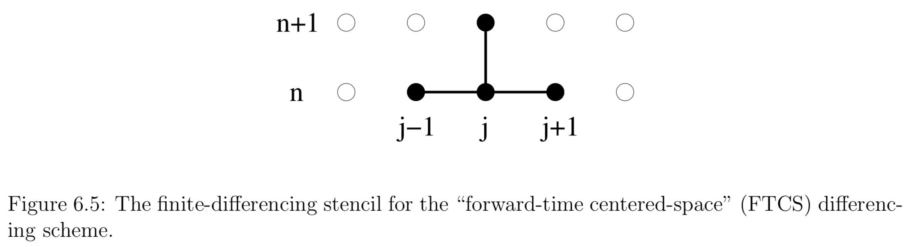

## Finite Difference Methods

**In a finite difference approximation a function $f(t,x)$ is represented by values at a discrete set of points.** At the core of finite difference approximation is therefore a discretization of the spacetime, or a numerical grid. Instead of evaluating f at all values of x, for example, we only consider discrete values $x_i$. The distance between the gridpoints $x_i$ is called the gridspacing $∆x$. For uniform grids, for which $∆x$ is constant, we have

$$
x _ { i } = x _ { 0 } + i \Delta x
$$

If the solution depends on time we also discretize the time coordinate, for example as

$$
t ^ { n } = t ^ { 0 } + n \Delta t
$$

The finite difference representation of the function $f(t,x)$, for example, is

$$
f _ { i } ^ { n } = f \left( t ^ { n } , x _ { i } \right) + \text { truncation error. }
$$

Differential equations involve derivatives, so we must next discuss how to represent derivatives in a finite difference representation.

Assuming that $f(x)$ can be differentiated to sufficiently high order and that it can be represented as a Taylor series, we have

$$
f _ { i + 1 } = f \left( x _ { i } + \Delta x \right) = f \left( x _ { i } \right) + \Delta x \left( \partial _ { x } f \right) _ { x _ { i } } + \frac { ( \Delta x ) ^ { 2 } } { 2 } \left( \partial _ { x } ^ { 2 } f \right) _ { x _ { i } } + \mathcal { O } \left( \Delta x ^ { 3 } \right)
$$

Solving for $\left( \partial _ { x } f \right) _ { x _ { i } } = \left( \partial _ { x } f \right) _ { i }$ we find

$$
\left( \partial _ { x } f \right) _ { i } = \frac { f _ { i + 1 } - f _ { i } } { \Delta x } + \mathcal { O } ( \Delta x )
$$

The truncation error of this expression is linear in $∆x$, and it turns out that we can do better. We call equation a **one-sided derivative**, since it uses only neighbors on one side of $x_i$.

Consider the Taylor expansion to the point $x_{ i − 1 }$,

$$
f _ { i - 1 } = f \left( x _ { i } - \Delta x \right) = f \left( x _ { i } \right) - \Delta x \left( \partial _ { x } f \right) _ { x _ { i } } + \frac { ( \Delta x ) ^ { 2 } } { 2 } \left( \partial _ { x } ^ { 2 } f \right) _ { x _ { i } } + \mathcal { O } \left( \Delta x ^ { 3 } \right)
$$

we now find

$$
\left( \partial _ { x } f \right) _ { i } = \frac { f _ { i + 1 } - f _ { i - 1 } } { 2 \Delta x } + \mathcal { O } \left( \Delta x ^ { 2 } \right)
$$

which is second order in $∆x$. In general, **centered derivatives** lead to higher order schemes than one-sided derivatives for the same number of gridpoints.

The key point is that we are able to combine the two Taylor expansions in such a way that the leading order error term cancels out, leaving us **with a higher order representation of the derivative**. This cancellation **only works out for uniform grids**, when $∆x$ is independent of x. This is one of the reasons why many current numerical relativity applications of finite difference schemes work with uniform grids.

Higher order derivatives can be constructed in a similar fashion. Adding the two Taylor expansions all terms odd in $∆x$ drop out and we find for the second derivative

$$
\left( \partial _ { x } ^ { 2 } f \right) _ { i } = \frac { f _ { i + 1 } - 2 f _ { i } + f _ { i - 1 } } { ( \Delta x ) ^ { 2 } } + \mathcal { O } \left( \Delta x ^ { 2 } \right)
$$

> $$
> \left( \partial _ { x } f \right) _ { i } = \frac { 1 } { 12 \Delta x } \left( f _ { i - 2 } - 8 f _ { i - 1 } + 8 f _ { i + 1 } - f _ { i + 2 } \right) \\
\left( \partial _ { x } ^ { 2 } f \right) _ { i } = \frac { 1 } { 12 ( \Delta x ) ^ { 2 } } \left( - f _ { i - 2 } + 16 f _ { i - 1 } - 30 f _ { i } + 16 f _ { i + 1 } - f _ { i + 2 } \right)
> $$
> 
> where we have omitted the truncation error, $\mathcal { O } \left( \Delta x ^ { 4 } \right)$

## Hyperbolic Equations

For simplicity it does not contain any source terms, and the the wave speed v is constant.

$$
\partial _ { t } u + v \partial _ { x } u = 0
$$

The equation is satisfied exactly by any function of the form $u ( t , x ) = u ( x - v t )$. **The equation has a time derivative in addition to the space derivative, and thus requires initial data**.

Inserting both finite-difference representations

$$
\left( \partial _ { x } u \right) _ { j } ^ { n } = \frac { u _ { j + 1 } ^ { n } - u _ { j - 1 } ^ { n } } { 2 \Delta x } + \mathcal { O } \left( \Delta x ^ { 2 } \right) \\
\left( \partial _ { t } u \right) _ { j } ^ { n } = \frac { u _ { j } ^ { n + 1 } - u _ { j } ^ { n } } { \Delta t } + \mathcal { O } ( \Delta t )
$$

we can solve for $u^{n+1}_j$ and find

$$
u _ { j } ^ { n + 1 } = u _ { j } ^ { n } - \frac { v } { 2 } \frac { \Delta t } { \Delta x } \left( u _ { j + 1 } ^ { n } - u _ { j - 1 } ^ { n } \right)
$$

or reasons that are quite obivous this differencing scheme is called forward-time centered-space, or FTCS.

It is an example of an explicit scheme, meaning that we can solve for the grid function $u _ { j } ^ { n + 1 }$ at the new time level n + 1 directly in terms of function values on the old time level n.

## Question

The Courant-Friedrichs-Lewy condition

$$
\frac { | v | \Delta t } { \Delta x } \leq 1
$$

The Courant condition states that the the grid point $u _ { j } ^ { n + 1 }$ at the new time level n+1 has to reside inside the domain of determinacy of the interval spanned by the finite difference stencil at the time level n. This makes intuitive sense: if $u _ { j } ^ { n + 1 }$ were outside this domain, its physical specification would require more information about the past than we are providing numerically, which may trigger an instability.

Recalling that v represents the speed of a characteristic, we may interpret the Courant condition in terms of the domain of determinacy.

## Courant-Friedrichs-Lewy condition

Unfortunately, however, FTCS is fairly useless. The equation is satisfied exactly by any function of the form $u ( t , x ) = u ( x - v t )$. we can write the solution $u ( t , x )$ to our continuum hyperbolic differential equation as a superposition of eigenmodes $e^{i(\omega t+k x)}$. Here k is a spatial wave number.

A real $\omega$, for which $e^{i \omega t}$ has a magnitude of unity, yields sinusoidally oscillating modes, while the existence of a complex piece in $\omega$ leads to exponentially growing or damping modes. In the case of exponential growth, the magnitude of $e^{i \omega t}$ will exceed unity.

We can perform a similar spectral analysis of the finite difference equation. Write the eigenmode for $u_{j}^{n}$ as

$$
u_{j}^{n}=\xi^{n} e^{i k(j \Delta x)}
$$

Here the quantity $\xi$ plays the role of $e^{i \omega \Delta t}$ and is called the amplification factor:

$$
u_{j}^{n}=\xi u_{j}^{n-1} = \xi^{2} u_{j}^{n-2} \ldots=\xi^{n} u_{j}^{0}
$$

For the scheme to be stable, the magnitude $\xi$ must be smaller or equal to unity for all k,

$$
|\xi(k)| \leq 1
$$

To perform a von Neumann stability anaylsis of the FTCS scheme

$$
\xi(k)=1-i \frac{v \Delta t}{\Delta x} \sin k \Delta x
$$

**the magnitude of $\xi$ is greater than unity for all k, indicating that this scheme is unstable.** In fact, we have $|\xi|>1$ independently of our choice for $\Delta x$ and $\Delta t$, which makes this scheme unconditionally unstable. That is bad.

The good news is that there are several ways of fixing this problem.

For example

We could replace the term $u_{j}^{n}$ by the spatial average $\left(u_{j+1}^{n}+u_{j-1}^{n}\right) / 2$.

$$
u_{j}^{n+1}=\frac{1}{2}\left(u_{j+1}^{n}+u_{j-1}^{n}\right)-\frac{v}{2} \frac{\Delta t}{\Delta x}\left(u_{j+1}^{n}-u_{j-1}^{n}\right)
$$

a von Neumann analysis results in the amplification factor

$$
\xi=\cos k \Delta x-i \frac{v \Delta t}{\Delta x} \sin k \Delta x
$$

The von Neumann stability criterion then implies that we must have

$$
\frac { | v | \Delta t } { \Delta x } \leq 1
$$