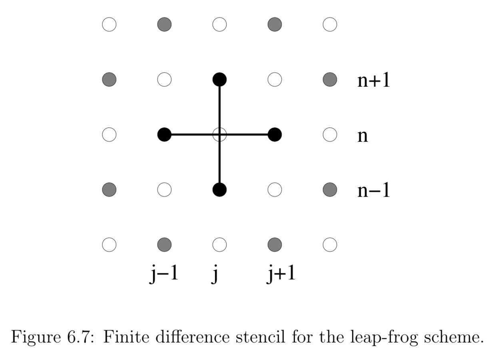

## Finite Difference Methods

**In a finite difference approximation a function $f(t,x)$ is represented by values at a discrete set of points.** At the core of finite difference approximation is therefore a discretization of the spacetime, or a numerical grid. Instead of evaluating f at all values of x, for example, we only consider discrete values $x_i$. The distance between the gridpoints $x_i$ is called the gridspacing $∆x$. For uniform grids, for which $∆x$ is constant, we have

$$
x _ { i } = x _ { 0 } + i \Delta x
$$

If the solution depends on time we also discretize the time coordinate, for example as

$$
t ^ { n } = t ^ { 0 } + n \Delta t
$$

The finite difference representation of the function $f(t,x)$, for example, is

$$
f _ { i } ^ { n } = f \left( t ^ { n } , x _ { i } \right) + \text { truncation error. }
$$

Differential equations involve derivatives, so we must next discuss how to represent derivatives in a finite difference representation.

Assuming that $f(x)$ can be differentiated to sufficiently high order and that it can be represented as a Taylor series, we have

$$
f _ { i + 1 } = f \left( x _ { i } + \Delta x \right) = f \left( x _ { i } \right) + \Delta x \left( \partial _ { x } f \right) _ { x _ { i } } + \frac { ( \Delta x ) ^ { 2 } } { 2 } \left( \partial _ { x } ^ { 2 } f \right) _ { x _ { i } } + \mathcal { O } \left( \Delta x ^ { 3 } \right)
$$

Solving for $\left( \partial _ { x } f \right) _ { x _ { i } } = \left( \partial _ { x } f \right) _ { i }$ we find

$$
\left( \partial _ { x } f \right) _ { i } = \frac { f _ { i + 1 } - f _ { i } } { \Delta x } + \mathcal { O } ( \Delta x )
$$

The truncation error of this expression is linear in $∆x$, and it turns out that we can do better. We call equation a **one-sided derivative**, since it uses only neighbors on one side of $x_i$.

Consider the Taylor expansion to the point $x_{ i − 1 }$,

$$
f _ { i - 1 } = f \left( x _ { i } - \Delta x \right) = f \left( x _ { i } \right) - \Delta x \left( \partial _ { x } f \right) _ { x _ { i } } + \frac { ( \Delta x ) ^ { 2 } } { 2 } \left( \partial _ { x } ^ { 2 } f \right) _ { x _ { i } } + \mathcal { O } \left( \Delta x ^ { 3 } \right)
$$

we now find

$$
\left( \partial _ { x } f \right) _ { i } = \frac { f _ { i + 1 } - f _ { i - 1 } } { 2 \Delta x } + \mathcal { O } \left( \Delta x ^ { 2 } \right)
$$

which is second order in $∆x$. In general, **centered derivatives** lead to higher order schemes than one-sided derivatives for the same number of gridpoints.

The key point is that we are able to combine the two Taylor expansions in such a way that the leading order error term cancels out, leaving us **with a higher order representation of the derivative**. This cancellation **only works out for uniform grids**, when $∆x$ is independent of x. This is one of the reasons why many current numerical relativity applications of finite difference schemes work with uniform grids.

Higher order derivatives can be constructed in a similar fashion. Adding the two Taylor expansions all terms odd in $∆x$ drop out and we find for the second derivative

$$
\left( \partial _ { x } ^ { 2 } f \right) _ { i } = \frac { f _ { i + 1 } - 2 f _ { i } + f _ { i - 1 } } { ( \Delta x ) ^ { 2 } } + \mathcal { O } \left( \Delta x ^ { 2 } \right)
$$

> $$
> \left( \partial _ { x } f \right) _ { i } = \frac { 1 } { 12 \Delta x } \left( f _ { i - 2 } - 8 f _ { i - 1 } + 8 f _ { i + 1 } - f _ { i + 2 } \right) \\
\left( \partial _ { x } ^ { 2 } f \right) _ { i } = \frac { 1 } { 12 ( \Delta x ) ^ { 2 } } \left( - f _ { i - 2 } + 16 f _ { i - 1 } - 30 f _ { i } + 16 f _ { i + 1 } - f _ { i + 2 } \right)
> $$
> 
> where we have omitted the truncation error, $\mathcal { O } \left( \Delta x ^ { 4 } \right)$

### Elliptic Equations

As an example of a simple, one-dimensional elliptic equation consider

$$
\partial_{x}^{2} f=s
$$

We first have to construct a numerical grid that covers an interval between $x_{min}$ and $x_{max}$. We then divide the interval $\left[x_{\min }, x_{\max }\right]$ into N gridcells, leading to a gridspacing of

$$
\Delta x=\frac{x_{\max }-x_{\min }}{N}
$$

We can choose our grid points to be located either at the center of these cells, which would be referred to as a cell-centered grid, or on the vertices, which would be referred to as a vertex-centered grid. For a cell-centered grid we have N grid points located at

$$
x_{i}=x_{\min }+(i-1 / 2) \Delta x, \quad i=1, \ldots, N
$$

whereas for a vertex centered grid we have N + 1 gridpoints located a

$$
x_{i}=x_{\min }+(i-1) \Delta x, \quad i=1, \ldots, N+1
$$

**The difference between cell-centered and vertex-centered grids only affects the implementation of boundary conditions, but not the finite difference representation of the differential equation itself.**

We are now ready to finite difference the differential equation. We define two arrays, $f_i$ and $s_i$, which represent the functions f and s at the gridpoints $x_i$ for $i = 1, . . . , N$. In the interior of our domain we can represent the differential equation as

$$
f_{i+1}-2 f_{i}+f_{i-1}=(\Delta x)^{2} s_{i} \quad i=2, \ldots, N-1
$$

At the lower boundary point $i = 1$ the neighbor $i − 1$ does not exist in our domain, and, similarly, at the upper boundary point $i = N$ the point $i + 1$ does not exist. At these points we have to implement the boundary conditions, which can be done in many different ways.

Let us assume that the solution f is a symmetric function about $x = 0$, in which case we can restrict the analysis to positive x and impose a Neuman condition at the origin,
    
$$
\partial_{x} f=0 \quad \text { at } x=0
$$
 
The two grid points $x_0$ and $x_1$ then bracket the boundary point $x_{min} = 0$ symmetrically. We can then write the boundary condition as
    
$$
f_{1}=f_{0}
$$
    
For i = 1 we yields

$$
f_{i+1}-f_{i}=(\Delta x)^{2} s_{i} \quad i=1
$$

We can use a similar strategy at the upper boundary. Let us also assume that f falls off with $1/x$ for large x, which results in the Robin boundary condition

$$
\partial_{x}(x f)=0 \quad \text { as } x \rightarrow \infty
$$

With the help of a virtual grid point $x_{N + 1}$ we can write the boundary condition in $\Delta x$ as

$$
f_{N+1}=\frac{x_{N}}{x_{N+1}} f_{N}=\frac{x_{N}}{x_{N}+\Delta x} f_{N}
$$

We can again insert this into for i = N and find

$$
\left(\frac{x_{i}}{x_{i}+\Delta x}-2\right) f_{i}+f_{i-1}=(\Delta x)^{2} s_{i} \quad i=N
$$

Elliptic Equations now form a coupled set of N linear equations for the N elements $f_i$ that we can write as

$$
\left( \begin{array}{ccccccc}{-1} & {1} & {0} & {0} & {0} & {0} & {0} \\ {1} & {-2} & {1} & {0} & {0} & {0} & {0} \\ {0} & {\ddots} & {\ddots} & {\ddots} & {0} & {0} & {0} \\ {0} & {0} & {1} & {-2} & {1} & {0} & {0} \\ {0} & {0} & {0} & {\ddots} & {\ddots} & {\ddots} & {0} \\ {0} & {0} & {0} & {0} & {1} & {-2} & {1} \\ {0} & {0} & {0} & {0} & {0} & {1} & {x_{N} /\left(x_{N}+\Delta x\right)-2}\end{array}\right) \cdot \left( \begin{array}{c}{f_{1}} \\ {f_{2}} \\ {\vdots} \\ {f_{i}} \\ {\vdots} \\ {f_{N-1}} \\ {f_{N}}\end{array}\right)=(\Delta x)^{2} \left( \begin{array}{c}{s_{1}} \\ {s_{2}} \\ {\vdots} \\ {s_{i}} \\ {\vdots} \\ {s_{N-1}} \\ {s_{N}}\end{array}\right)
$$

or, in a more compact form,

$$
\mathbf{A} \cdot \mathbf{f}=(\Delta x)^{2} \mathbf{S}
$$

The solution is given by

$$
\mathbf{f}=(\Delta x)^{2} \mathbf{A}^{-1} \cdot \mathbf{S}
$$

so that we have reduced the problem to inverting an N × N matrix.

### Hyperbolic Equations

For simplicity it does not contain any source terms, and the the wave speed v is constant.

$$
\partial _ { t } u + v \partial _ { x } u = 0
$$

The equation is satisfied exactly by any function of the form $u ( t , x ) = u ( x - v t )$. **The equation has a time derivative in addition to the space derivative, and thus requires initial data**.

Inserting both finite-difference representations

$$
\left( \partial _ { x } u \right) _ { j } ^ { n } = \frac { u _ { j + 1 } ^ { n } - u _ { j - 1 } ^ { n } } { 2 \Delta x } + \mathcal { O } \left( \Delta x ^ { 2 } \right) \\
\left( \partial _ { t } u \right) _ { j } ^ { n } = \frac { u _ { j } ^ { n + 1 } - u _ { j } ^ { n } } { \Delta t } + \mathcal { O } ( \Delta t )
$$

we can solve for $u^{n+1}_j$ and find

$$
u _ { j } ^ { n + 1 } = u _ { j } ^ { n } - \frac { v } { 2 } \frac { \Delta t } { \Delta x } \left( u _ { j + 1 } ^ { n } - u _ { j - 1 } ^ { n } \right)
$$

or reasons that are quite obivous this differencing scheme is called forward-time centered-space, or FTCS.

It is an example of an explicit scheme, meaning that we can solve for the grid function $u _ { j } ^ { n + 1 }$ at the new time level n + 1 directly in terms of function values on the old time level n.

#### Courant-Friedrichs-Lewy condition

Unfortunately, however, FTCS is fairly useless. The equation is satisfied exactly by any function of the form $u ( t , x ) = u ( x - v t )$. we can write the solution $u ( t , x )$ to our continuum hyperbolic differential equation as a superposition of eigenmodes $e^{i(\omega t+k x)}$. Here k is a spatial wave number.

A real $\omega$, for which $e^{i \omega t}$ has a magnitude of unity, yields sinusoidally oscillating modes, while the existence of a complex piece in $\omega$ leads to exponentially growing or damping modes. In the case of exponential growth, the magnitude of $e^{i \omega t}$ will exceed unity.

We can perform a similar spectral analysis of the finite difference equation. Write the eigenmode for $u_{j}^{n}$ as

$$
u_{j}^{n}=\xi^{n} e^{i k(j \Delta x)}
$$

Here the quantity $\xi$ plays the role of $e^{i \omega \Delta t}$ and is called the amplification factor:

$$
u_{j}^{n}=\xi u_{j}^{n-1} = \xi^{2} u_{j}^{n-2} \ldots=\xi^{n} u_{j}^{0}
$$

For the scheme to be stable, the magnitude $\xi$ must be smaller or equal to unity for all k,

$$
|\xi(k)| \leq 1
$$

To perform a von Neumann stability anaylsis of the FTCS scheme

$$
\xi(k)=1-i \frac{v \Delta t}{\Delta x} \sin k \Delta x
$$

**the magnitude of $\xi$ is greater than unity for all k, indicating that this scheme is unstable.** In fact, we have $|\xi|>1$ independently of our choice for $\Delta x$ and $\Delta t$, which makes this scheme unconditionally unstable. That is bad.

The good news is that there are several ways of fixing this problem.

For example

We could replace the term $u_{j}^{n}$ by the spatial average $\left(u_{j+1}^{n}+u_{j-1}^{n}\right) / 2$.

$$
u_{j}^{n+1}=\frac{1}{2}\left(u_{j+1}^{n}+u_{j-1}^{n}\right)-\frac{v}{2} \frac{\Delta t}{\Delta x}\left(u_{j+1}^{n}-u_{j-1}^{n}\right)
$$

a von Neumann analysis results in the amplification factor

$$
\xi=\cos k \Delta x-i \frac{v \Delta t}{\Delta x} \sin k \Delta x
$$

The von Neumann stability criterion then implies that we must have

$$
\frac { | v | \Delta t } { \Delta x } \leq 1
$$

The Courant condition states that the the grid point $u _ { j } ^ { n + 1 }$ at the new time level n+1 has to reside inside the domain of determinacy of the interval spanned by the finite difference stencil at the time level n. This makes intuitive sense: if $u _ { j } ^ { n + 1 }$ were outside this domain, its physical specification would require more information about the past than we are providing numerically, which may trigger an instability.

Recalling that v represents the speed of a characteristic, we may interpret the Courant condition in terms of the domain of determinacy.

**It seems somewhat like a miracle that simply replacing a grid function by a local average manages to change the numerical scheme from unconditionally unstable to conditionally stable.**

This change can be interpreted in very physical terms

$$
u_{j}^{n+1}=u_{j}^{n}+\frac{1}{2}\left(u_{j+1}^{n}-2 u_{j}^{n}+u_{j-1}^{n}\right)-\frac{v}{2} \frac{\Delta t}{\Delta x}\left(u_{j+1}^{n}-u_{j-1}^{n}\right)
$$

or

$$
\frac{u_{j}^{n+1}-u_{j}^{n}}{\Delta t}=-v \frac{u_{j+1}^{n}-u_{j-1}^{n}}{2 \Delta x}+\frac{(\Delta x)^{2}}{2 \Delta t} \frac{u_{j+1}^{n}-2 u_{j}^{n}+u_{j-1}^{n}}{(\Delta x)^{2}}
$$

But equation is a finite-difference representation of the differential equation

$$
\partial_{t} u+v \partial_{x} u=D \partial_{x}^{2} u
$$

where the term on the right-hand side is essentially a diffusion term, with parameter $D=(\Delta x)^{2} /(2 \Delta t)$ serving as a constant coefficient of diffusion.

This feature implies the amplitude of any wave will decrease spuriously with time as it propagates. A related effect is anomalous dispersion, an additional price we pay for stablity in the Lax scheme and many other finite-difference schemes for hyperbolic systems.

#### Other scheme

Lax scheme

___

There are a number of other ways of constructing stable finite difference schemes for the model equation. A popular alternative to the Lax scheme is upwind differencing

$$
\frac{u_{j}^{n+1}-u_{j}^{n}}{\Delta t}=-v \left\{\begin{array}{l}{\frac{u_{j}^{n}-u_{j-1}^{n}}{\Delta x},} & {v>0} \\ {\frac{u_{j+1}^{n}-u_{j}^{n}}{\Delta x},} & {v>0}\end{array}\right.
$$

This scheme borrows its name from the fact that for a wave with $v>0$, that travels “to the right”, say, the new grid-point $u_{j}^{n+1}$ is affected only by the “upwind” grid-points to its left, i.e. that lie in the region through which the wave travels before reaching $x_{j}$.

three-level scheme

___

It would be desirable, however, to have a scheme that is second order in both in space and time. One way to construct such a code is to abandon two-level schemes, and instead consider a three-level scheme. We can then construct centered derivatives both for the time-derivative,

$$
\left(\partial_{t} u\right)_{j}^{n}=\frac{u_{j}^{n+1}-u_{j}^{n-1}}{2 \Delta t}+\mathcal{O}\left(\Delta t^{2}\right)
$$

the leap-frog scheme,

$$
u_{j}^{n+1}=u_{j}^{n-1}-v \frac{\Delta t}{\Delta x}\left(u_{j+1}^{n}-u_{j-1}^{n}\right)
$$

Some researchers prefer two-level schemes over three-level schemes because three level schemes require initial data on two different time levels, which can be somewhat awkward.

The leap-frog scheme has the additional disadvantage that, it only connects fields of the same color. “Black” gridpoints can therefore evolve completely independently of “white” gridpoints, and the two sets of grid points may drift apart as numerical error accumulates differently for the two sets of points. If necessary, this problem can be solved by artificially adding a very small viscous term that links the two sets together. Once these potential issues are resolved, leap-frog is a very simple, accurate and powerful method.

implicit scheme

___

Yet another way of constructing a stable two-level scheme is to use backward time differencing instead of forward differencing. This approach then yields the “backward-time, centered-space” scheme,

$$
u_{j}^{n+1}=u_{j}^{n}-\frac{v}{2} \frac{\Delta t}{\Delta x}\left(u_{j+1}^{n+1}-u_{j-1}^{n+1}\right)
$$

Performing a von Neumann stability analysis we find the amplification factor

$$
|\xi(k)| \leq 1
$$

for all values of $\Delta t$. This finding means that this scheme is unconditionally stable. **The size of the stepsize ∆t is no longer restricted by stability, and instead is limited only by accuracy requirements.** this property is even more important for parabolic equations.

The disadvantage of the backward differencing scheme is that we can no longer solve for the new grid function $u_{j}^{n+1}$ at the new time $t^{n+1}$ explicitly in terms of old grid functions at $t^{n}$ alone. Instead, now couples $u_{j}^{n+1}$ with the its closest neighbors $u_{j+1}^{n+1}$ and $u_{j-1}^{n+1}$. This coupling provides an implicit linear relation between the new grid functions, and is therefore an example of an implicit finite-differencing scheme. We can no longer sweep through the grid and update one point at a time; instead **we now have to solve for all grid points simultaneously**. Writing equation at all interior grid points, and then taking into account the boundary conditions, leads to a system of equations quite similar to elliptic equations.

Crank-Nicholson scheme

___

A second-order scheme would be time-centered, meaning that we should estimate the the time derivative at the mid-point between the two time levels n and n + 1,

Implementing time-centering means that we also have to evaluate the space derivative at this same midpoint $n+1/2$  which we can do by averaging between the values at n and n+1.

$$
\left(\partial_{t} u\right)_{j}^{n+1 / 2}=\frac{u_{j}^{n+1}-u_{j}^{n}}{\Delta t}+\mathcal{O}\left(\Delta t^{2}\right)
$$

This approach yields the Crank-Nicholson scheme

$$
u_{j}^{n+1}=u_{j}^{n}-\frac{v}{4} \frac{\Delta t}{\Delta x}\left(\left(u_{j+1}^{n+1}-u_{j-1}^{n+1}\right)+\left(u_{j+1}^{n}-u_{j-1}^{n}\right)\right)
$$

Crank-Nicholson is second order in both space and time, and shows that it is unconditionally stable.

The iterative Crank-Nicholson scheme uses a predictor-corrector approach. In the predictor step we predict the new values $u_{j}^{n+1}$ by using the fully explicit FTCS scheme.

$$
^{(1)} u_{j}^{n+1}=u_{j}^{n}-\frac{v \Delta t}{2 \Delta x}\left(u_{j+1}^{n}-u_{j-1}^{n}\right)
$$

which, as we have seen above, would be unconditionally unstable by itself. In a subsequent corrector step we use these predicted values $^{(1)}{u_{j}}^{n+1}$ together with the $u_{j}^{n}$ to obtain a time-centered approximation for the spatial derivative on the right-hand side of equation. This step yields the corrected values of the grid function,

$$
^{(2)} u_{j}^{n+1}=u_{j}^{n} - \frac{v \Delta t}{4 \Delta x} \left(\left( ^{(1)} u_{j+1}^{n+1} - ^{(1)} u_{j-1}^{n+1}\right)\right)+\left(u_{j+1}^{n}-u_{j-1}^{n}\right) )
$$

The corrector step can be repeated an arbitrary number times N, always using the previous values $^{(N-1)} u_{j}^{n+1}$ on the right-hand side to find new corrected values $^{(N)} u_{j}^{n+1}$.

The iterative Crank-Nicholson scheme is an explicit two-level scheme that is second order in both space and time. Since this form is very similar to the 3 + 1 equations and related formulations, the iterative Crank-Nicholson scheme has often been used in numerical relativity simulations.

#### Method of Lines

A popular alternative to these complete finite difference schemes is therefore the method of lines (or MOL for short).

**The basic idea of the method of lines is to finite difference the space derivatives only.** Now we introduce a spatial grid only, at least for now, so that the function values at these gridpoint, $u_{j}(t)=u\left(t, x_{j}\right)$, remain functions of time. As a result, our partial differential equation for $u(t, x)$ becomes a set of ordinary differential equations for the grid values $u_{j}(t)$. The next question is how to integrate the ordinary differential equations. The appealing feature of the method of lines, however, is that we can use any method for the integration of the ordinary differential equations that we like. In fact, many such methods, including very efficient, high-order methods, are precoded and readily available. One such algorithm is the ever-popular Runge-Kutta method.

To implement, say, a fourth-order scheme for our model

$$
\partial_{t} u+v \partial_{x} u=0
$$

we could adopt the fourth-order differencing stencil to replace the spatial derivative, yielding

$$
\frac{d u_{j}}{d t}=-\frac{v}{12 \Delta x}\left(u_{i-2}-8 u_{j-1}+8 u_{j+1}-u_{i+2}\right)
$$

and then integrate this set of ordinary differential equations with a fourth-order Runge-Kutta method.

## Ghost Zones

Cactus is based upon a distributed computing paradigm. That is, the problem domain is split into blocks, each of which is assigned to a processor.

Consider the 1-D wave equation
 
$$
\frac{\partial^{2} \phi}{\partial t^{2}}=\frac{\partial^{2} \phi}{\partial x^{2}}
$$

To solve this by partial differences, one discretises the derivatives to get an equation relating the solution
at different times.

$$
\phi(t+\Delta t, x)-2 \phi(t, x)+\phi(t-\Delta t, x)=\frac{\Delta t^{2}}{\Delta x^{2}}\{\phi(t, x+\Delta x)-2 \phi(t, x)+\phi(t, x-\Delta x)\}
$$

On examination, you can see that to generate the data at the point $(t+\Delta t, x)$ we need data from the four points $(t, x)$, $(t -\Delta t, x)$, $(t, x + \Delta x)$ and $(t, x- \Delta x)$ only.

Now, if you evolve the above scheme, it becomes apparent that at each iteration the number of grid points you can evolve decreases by one at each edge.

At the outer boundary of the physical domain, the data for the boundary point can be generated by the boundary conditions, however, at internal boundaries, the data has to be copied from the adjacent processor.

It would be inefficient to copy each point individually, so instead, a number of ghostzones are created at the internal boundaries. A ghostzone consists of a copy of the whole plane (in 3D, line in 2D, point in 1D) of the data from the adjacent processor.

Once the data has been evolved one step, the data in the ghostzones can be exchanged (or synchronised) between processors in one fell swoop before the next evolution step.

## Mesh Refinement

Many current numerical relativity codes use a uniform grid spacing to cover the entire spatial domain. Given that computational resources are limited, so that we can afford only a finite number of gridpoints, such a “unigrid” implementation may pose a problem.

Imagine, for concreteness, a simulation of a strong-field gravitational wave source, like a compact binary containing neutron stars or black holes. On the one hand we have to resolve these sources well, so as to minimize truncation error in the strong-field region. On the other hand, the grid must extend into the weak-field region at large distances from the sources, so as to minimize error from the outer boundaries and to enable us to extract the emitted gravitational radiation accurately.

A very promising alternative is mesh refinement, which has been widely developed and used in the computational fluid dynamics community and is becoming increasingly popular in numerical relativity.

The basic idea underlying mesh refinement techniques is to perform the simulation not on one numerical grid, but on several, as in the multigrid methods.

In multigrid methods, the numerical solution is computed on a hierarchy of computational grids with increasing grid resolution. The finer grids may or may not cover all the physical space that is covered by the coarser grids. The numerical solution is then computed by completing sweeps through the grid hierarchy. 

The coarse grid is sufficiently small so that we can compute a solution with a direct solver. This provides the “global” features of the solution, albeit on a coarse grid and hence with a large local truncation error. We then interpolate this approximate solution to the next finer grid. This interpolation from a coarser grid to a finer grid is called a “prolongation”, and we point out that the details of this interpolation depend on whether the grid is cell-centered or vertex-centered. 

> In the mathematical field of numerical analysis, interpolation is a method of constructing new data points within the range of a discrete set of known data points.

On the finer grid we can then apply a relaxation method, for example a Gauss-Seidel sweep. While this method is too slow to solve the problem globally, as we have discussed above, it is very well suited to improve the solution locally. This step is often called a “smoothing sweep”. 

After this smoothing sweep the solution can be prolonged to the next finer grid, where the procedure is repeated. Once we have smoothed the solution on the finest grid, we start ascending back to coarser grids. The interpolation from a finer grid to a coarser grid is called a “restriction”. 

The coarser grids now “learn” from the finer grids by comparing their last solution with the one that comes back from a finer grid. This comparison provides an estimate for the local truncation error, which can be accounted for with the help of an artificial source term. On each grid we again perform smoothing sweeps, again improving the solution because we inherit the smaller truncation error from the finer grids. These sweeps through the grid hierarchy can be repeated until the solution has converged to a pre-determined accuracy.

Typically, the gridspacing on the finer grid is half that on the next coarser grid, but clearly other refinement factors can be chosen. The hierarchy can be extended, and typical mesh refinement applications employ multiple refinement levels.

Two versions of mesh refinement can be implemented. In the simpler version, called fixed mesh refinement or FMR, it is assumed that the refined grids will be needed only at known locations in space that remain fixed throughout the simulation.

The situation is more complicated for objects that are moving, as is the case for a coalescing binary star system. In this case we do not know a priori the trajectories of the companion stars, hence do not know which regions need refining. Moreover, these regions will be changing as the system evolves and the stars move. Clearly, we would like to move the refined grids with the stars. Such an approach, whereby the grid is relocated during the simulation to give optimal resolution at each time step, is called adaptive mesh refinement or AMR.

### Fixed Mesh Refinement

A standard way of solving partial differential equations are finite differences on a regular grid. This is also called unigrid. Such an application discretises its problem space onto a single, rectangular grid which has everywhere the same grid spacing. Increasing the resolution in a unigrid application is somewhat expensive. For example, increasing the resolution by a factor of two requires a factor of eight more storage in three dimensions. Most applications need the high resolution only in a part of the simulation domain.

Instead of only one grid, there are several grids or grid patches with different resolutions. The coarsest grid usually encloses the whole simulation domain. Successively finer grids overlay the coarse grid at those locations where a higher resolutions is needed. The coarser grids provide boundary conditions to the finer grid through interpolation.

Instead of updating only one grid, the application has to update all grids. The usual approach is to first take a step on the coarsest grid, and then recursively take several smaller steps on the finer grids. The Courant criterion requires that the step sizes on the finer grids be smaller than on the coarse grid. The boundary values for the finer grids are found through interpolation in space and time from the coarser grid. In the end, the information on the finer grids is injected into the coarse grids.

### Adaptive mesh refinement (AMR)

For well behaved problems a grid of uniform mesh spacing (in each of the coordinate directions) gives satisfactory results. However, there are classes of problems where the solution is more difficult to estimate in some regions (perhaps due to discontinuities, steep gradients, shocks, etc.) than in others. One could use a uniform grid having a **spacing fine enough so that the local errors estimated in these difficult regions are acceptable**. But this approach is computationally extremely costly.

In numerical analysis, **adaptive mesh refinement (AMR)** is a method of **adapting the accuracy of a solution within certain sensitive or turbulent regions** of simulation, dynamically and during the time the solution is being calculated. The use of AMR has since then proved of broad use and has been used in studying turbulence problems in hydrodynamics as well as in the study of large scale structures in astrophysics。

1. Start with a coarse grid
2. Identify regions that need finer resolution
3. Superimpose finer sub-grids only on those regions 
4. Finer and finer subgrids are added recursively until either a given maximum level of refinement is reached or the local truncation error has dropped below the desired level

The complete computational grid consists of a collection of blocks with different physical cell sizes, which are related to each other in a hierarchical fashion using a tree data structure. The blocks at the root of the tree have the largest cells, while their children have smaller cells and are said to be refined. 

Three rules govern the establishment of refined child blocks.

1. a refined child block must be one-half as large as its parent block in each spatial dimension. 
2. a block’s children must be nested; i.e., the child blocks must fit within their parent block and cannot overlap one another, and the complete set of children of a block must fill its volume. Thus, in d dimensions a given block has either zero or $2^d$ children.
3. blocks which share a common border may not differ from each other by more than one level of refinement.
